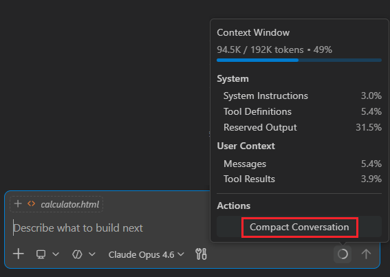

# Making agents practical for real-world development

March 5, 2026 by VS Code Team, [@code](https://x.com/code)

Agents are taking on more complex and longer-running development tasks.

With the [February 2026 release (1.110)](http://aka.ms/VSCode/110), we’re making those workflows more practical inside Visual Studio Code by giving you greater control over how agents behave, integrate into your tools, and retain project context across sessions.

From enforcing policies with hooks to guiding agents mid-response, validating UI features with integrated browser tools, and bringing structured skills directly into the editor, this release focuses on making agents reliable collaborators for real development work.

## Give agents the right context

Codebases often have a complex architecture and project structure, and can consist of thousands of files. Agents might struggle to stay focused and find the right pieces of information, especially as sessions get longer.

In this release, we're improving how agents handle large outputs efficiently, how they remember the most important parts of the task at hand, and giving your control over what information can be discarded.

### Handle large outputs

Large diffs, generated files, or extensive logs can overwhelm a session if treated as an inline context.

Agents and LLMs are great at working with files. VS Code now manages large outputs by streaming them to temporary files and prioritizing the most relevant information for the model. This keeps agents focused on the right details while optimizing context usage without additional work.

From a UI perspective, large tools outputs in a chat conversation can make it difficult to follow the overall flow of what's happening in a session. VS Code now puts terminal output in collapsible sections, giving you the details if you want them, while keeping the session uncluttered.

<video src="embedded-terminal-streaming.mp4" title="Video showing terminal output auto-expanding for long-running commands." autoplay muted controls></video>

### Share agent memory

Agents in Visual Studio Code use memory to retain relevant context. Agent memory now spans coding agents, CLI workflows, and code review interactions.

Rather than starting from scratch each session, agents recall your preferences, apply lessons from previous tasks, and build up knowledge about your codebase over time.

Architectural decisions, naming conventions, and prior refactors remain part of the conversation, so you spend less time restating intent and more time continuing the work.

### Compact long sessions

As conversations expand, VS Code automatically compacts older history. Earlier discussions are summarized, key decisions are preserved, and space is freed up for ongoing work.

Previously, you had no control over when context compaction was happening and what information was retained after compacting. Maybe you discussed several implementation variants, and only one specific one is important to remember and build upon.

Now you can manually run context compaction for a session by typing `/compact`. And in doing so, you can give the agent additional instructions on what information to keep or discard.

This keeps sessions focused without interrupting the workflow.

## Agent controls

As agents take on more responsibility, the way you interact with them matters just as much as what they generate. These updates make it easier to control the conversation and guide outcomes during active work.

### Guide the agent while it works

Agents sometimes head down the wrong path, and you can usually tell before they finish.

Previously, you had to wait for a response to complete it before redirecting it. Now, you can intervene while the agent is generating a response, guiding the direction of the work without restarting or losing context.

And if think of some extra tasks the agent should perform, you can now queue follow-on requests for the agent to perform once it has finished it's current task. If you queue up multiple requests, you can easily change the order in which they need to be performed.

For example, you might clarify:

- Only modify this component
- Reuse existing utilities
- Avoid changes to backend APIs

Fewer wasted edits, shorter feedback loops, and a conversation that stays on track.

In our app, when new styling guidance is introduced to enhance the hero card with a gold accent and shimmer effect, the agent revisits the existing CSS and continues the implementation [without restarting the session](https://code.visualstudio.com/docs/copilot/chat/chat-sessions#_send-messages-while-a-request-is-running).

### Explore alternatives without losing context

There are often different ways to solve a problem or multiple design options. You could create multiple chat sessions, one for each variant, but that would mean you need to copy over the existing context and conversation history.

To make this experience easier, you can now fork a chat session. This creates a new, independent session that inherits the conversation history from the original session. The forked session is fully separate from the original, so changes in one session do not affect the other.

You can either type `/fork` and it will copy over the full conversation, or you can use the fork button at a specific checkpoint to _fork_ the conversation up until that point.

In the demo below, [`/fork`](https://code.visualstudio.com/docs/copilot/chat/chat-sessions#_fork-a-chat-session) creates a parallel thread where a more minimal design direction is explored without affecting the original discussion.

<video src="fork-a-conversation.mp4" title="Video demonstrating forking a conversation into parallel threads in VS Code." autoplay muted controls></video>

### Automate with hooks

Teams frequently rely on conventions, validations, or automated checks to maintain consistency.

[Hooks](https://code.visualstudio.com/docs/copilot/customization/hooks) execute deterministically at key lifecycle events, allowing teams to enforce policies and set guardrails that keep agent-driven changes aligned with project standards, rather than relying on repeated prompts.

For example, a team might automatically lint code before edits are applied, block changes to protected configuration files, or trigger a test suite whenever an agent modifies application logic.

This keeps agent-driven changes aligned with your project’s standards without requiring constant supervision.

The following demo shows a stop hook executing on session exit, detecting uncommitted changes and automatically committing and pushing them.

<video src="automate-with-hooks.mp4" title="Video demonstrating a stop hook executing on session exit, detecting uncommitted changes and automatically committing and pushing them in VS Code." autoplay muted controls></video>

## Agent extensibility

Agents are most useful when they integrate naturally into the tools and workflows you already rely on. These updates introduce a richer agent experience that closes the development loop, while skills provide reusable building blocks you can invoke on demand.

### Run agent skills when you need them

Many development tasks repeat across sessions.

Writing tests, refactoring code, or reviewing changes often follows patterns you already understand.

Instead of rewriting instructions each time, you can invoke agent skills directly from chat using slash commands. [Skills](https://code.visualstudio.com/docs/copilot/customization/agent-skills) may come from built-in capabilities, extensions, or project-specific tooling.

Instead of prompting vaguely, you can intentionally invoke workflows.

For example:

- `/tests` generates validation tests
- `/explain` documents unfamiliar code
- `/fix` targets a specific error

By default, available skills appear in the `/` menu, making them discoverable and easy to reuse across sessions.

The following video demonstrates a frontend design skill driving the workflow end to end, implementing a new UI component, integrating live data, and validating the result without leaving VS Code.

<video src="use-skills-on-demand.mp4" title="Video demonstrating a frontend design skill implementing a UI component and validating the result." autoplay muted controls></video>

### Validate changes without leaving the editor

Agents are already effective at generating and running unit tests to validate non-UI code changes.

Verifying frontend behavior, however, has often relied on manual testing or manual screenshot comparisons.

With browser agent tools, agents can now open and interact with the application directly in the integrated browser inside VS Code.

This allows the agent to implement a UI change, load the running application, inspect the result, and adjust the code if something doesn’t behave as expected.

Implementation, inspection, and validation now happen within the same workflow, helping you iterate quickly without leaving the editor.

In the example below, the integrated browser opens and follows the page navigation, so you can validate changes as you interact with the application.

<video src="use-integrated-browser.mp4" title="Video demonstrating browser validation of UI changes in the integrated VS Code browser." autoplay muted controls></video>

## Workflow integration across tools

Development often moves between the terminal and the editor.

That’s why the Copilot CLI is now integrated in VS Code, with native support including diff tabs, trusted folder sync, and right-click to send code snippets. You can manage the connection by running `/ide`.

The CLI and editor stay aligned, sharing context as work progresses.

In practice:

- A CLI process generates changes
- VS Code surfaces them as diffs
- You review and approve modifications directly in the editor

## The next step for agents in VS Code

Agents are becoming a natural part of everyday development. You shouldn’t have to adapt your workflow around them. They should adapt to the way you build.

With the [February 2026 release (1.110)](http://aka.ms/VSCode/110), VS Code gives you more control over how agents behave. They fit into your tools more naturally and carry context across sessions.

We’re building this in the open. If you have feedback, ideas, or run into issues, open a discussion or file an issue in the [VS Code repo](https://github.com/microsoft/vscode/issues) or find us on social. We’d love to hear from you.

Happy coding!
