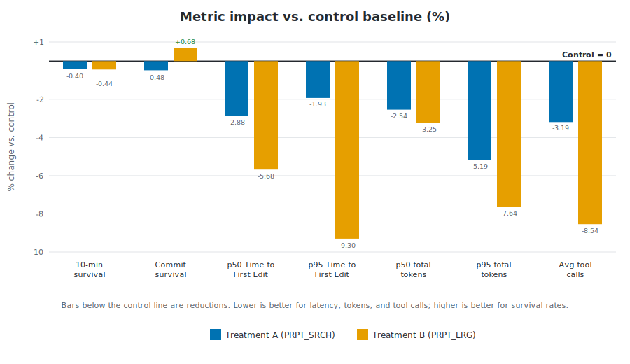

# How Prompt Tuning Improved GPT-5.5 in VS Code

July 6, 2026 by VS Code Team, [@code](https://x.com/code)

In our [previous post](https://code.visualstudio.com/blogs/2026/05/15/agent-harnesses-github-copilot-vscode), we introduced the VS Code coding harness, the layer that connects the model to tools, context, instructions, and validation loops, giving the model the ability to perform coding tasks.

Each model responds to tool calls and instructions differently, and the harness can adapt to improve results. In this post, we look at a recent collaboration with OpenAI on the `GPT-5.5` system prompt in VS Code. Based on their model research and our harness data, we tested small prompt changes to instruct the agent to explore less and validate sooner, resulting in using fewer tokens and responding faster.

## From prompt changes to experiment setup

Following the launch of `GPT-5.5`, we investigated the model's token efficiency inside the VS Code agent harness as part of our broader efforts described in [Improving token efficiency in GitHub Copilot](https://code.visualstudio.com/blogs/2026/06/17/improving-token-efficiency-in-github-copilot/). We examined the harness and found two areas worth improving: where the model was spending tokens, and where it was over-exploring before acting.

After testing different hypotheses and running offline evaluations, we narrowed this down to two system-prompt updates that looked promising, improving token efficiency without disrupting model quality. We introduced both as variants of the `GPT-5.5` system prompt to test with live traffic.

### Treatment A: economical search and edit

In the first treatment, we tested a small, targeted prompt update to remind the model to reduce unnecessary exploration. The problem we wanted to solve was simple: agents can spend too much time searching, rereading, or comparing nearby paths before making a useful edit.

The `<economical_search_and_edit>` section in the prompt instructs the agent to **start from a concrete anchor, gather only enough local context, avoid broad exploration, act once there is a cheap discriminating check, and avoid rereading unchanged context.**

You can find the complete implementation details in [`gpt55BasePrompt.tsx`](https://github.com/microsoft/vscode/blob/56d74126ee02bf1104e813bf4a41f10e90b2119c/extensions/copilot/src/extension/prompts/node/agent/openai/gpt55BasePrompt.tsx#L172-L178):

```tsx
{economicalSearchAndEditEnabled && <Tag name='economical_search_and_edit'>
    - Start from the most concrete available anchor: a file, symbol, failing behavior, failing command, or nearby implementation surface.<br />
    - Gather only enough nearby context to choose one plausible local hypothesis and one cheap check that could disconfirm it.<br />
    - Prefer one targeted search or nearby read over broad repo exploration.<br />
    - Once the cheapest discriminating check is known, act.<br />
    - Do not re-read unchanged context unless a new result makes it relevant.<br />
</Tag>}
```

### Treatment B: large prompt sections

Treatment B tested a broader version of the same idea of limiting exploration. Instead of adding a single, compact reminder about economical search, it reorganizes the agent workflow into explicit `<Before_the_first_edit>` and `<After_the_first_edit>` sections.

The goal was to solve the full loop and not only the search step: **form a local hypothesis before editing**, **avoid broad exploration**, **make a grounded first edit**, and **validate immediately after the first substantive edit**.

You can find the complete implementation details in [`gpt55BasePrompt.tsx`](https://github.com/microsoft/vscode/blob/56d74126ee02bf1104e813bf4a41f10e90b2119c/extensions/copilot/src/extension/prompts/node/agent/openai/gpt55BasePrompt.tsx#L33-L62):

```tsx
{largePromptSectionsEnabled && <>
    <Tag name='Before_the_first_edit'>
        - Start from the most concrete anchor available: a file, symbol, failing behavior, failing command, test, or nearby implementation surface. If the request does not name one explicitly, use the first targeted search or nearby read to identify that anchor, then continue locally from there.<br />
        - Before the first edit, gather only enough nearby evidence to state one falsifiable local hypothesis about how the requested behavior should work or why it is failing, and one cheap check that could disconfirm it.<br />
        [...]
        - Once you can state one falsifiable local hypothesis, the nearby code path it depends on, one cheap check that could disconfirm it, and one small edit that would test it, the next action must be a grounded edit.<br />
        - If confidence is incomplete, the first edit may be a small reversible probe that exposes missing types, behavior mismatches, control-flow gaps, or validation failures.<br />
        - If you find yourself still searching after that local-routing budget, treat that as drift. Recover by choosing the best current hypothesis and the best available nearby check, then make the smallest plausible edit that will let that check discriminate.<br />
    </Tag>
    <Tag name='After_the_first_edit'>
        - Prefer this order for that first validation action:<br />
        - the cheapest behavior-scoped or failing check that can falsify the current hypothesis<br />
        - a narrow test for the touched slice<br />
        - a narrow compile, lint, or typecheck command for the touched slice<br />
        [...]
        - Finish with at least one post-edit executable validation step whenever the environment provides one. Only fall back to diff-only validation when no focused command exists or commands are unavailable.<br />
    </Tag>
</>}
```

### Experiment setup

Both treatments came from the same idea: the model should spend less effort wandering and more effort moving through a deliberate loop of evidence, action, and validation.

We ran the experiment in VS Code over a two-week window and split `GPT-5.5` agent traffic across two treatment groups and one control group with a 25/25/25 split.

| Group | Variant name | Description | Traffic allocation |
| --- | --- | --- | ---: |
| Control | `PRPT_CTRL` | Current default prompt | 25% |
| Treatment A | `PRPT_SRCH` | EconomicalSearchAndEdit: more economical search and edit prompting | 25% |
| Treatment B | `PRPT_LRG` | LargePromptSections: larger, restructured prompt sections | 25% |

> **Note:** The allocations add up to 75% because the experiment scorecard compares evenly sized groups. The remaining `GPT-5.5` traffic continued to use the default prompt outside this scorecard slice, so we could compare the treatments and control across the same kind of user traffic.

## What the two-week scorecard showed

The two-week scorecard showed that treatment B was the stronger treatment. Although this approach made the system prompt larger, the more specific instructions helped the agent save more tokens elsewhere. This then improved latency, reduced upper-tail token usage, and reduced tool-call volume while quality, engagement, and reliability guardrails stayed healthy.

Signal legend: <span style="color: #107c10;">●</span> favorable and highly significant (p < 0.001), <span style="color: #107c10;">○</span> favorable and statistically significant (p < 0.05), <span style="color: #d13438;">●</span> unfavorable and highly significant, <span style="color: #d13438;">○</span> unfavorable and statistically significant, `-` not statistically significant.

| Metric | Treatment A (`PRPT_SRCH`) impact | P-value | Signal | Treatment B (`PRPT_LRG`) impact | P-value | Signal |
| --- | ---: | ---: | :---: | ---: | ---: | :---: |
| 10-minute survival rate (by user) | -0.40% (-0.37 pp) | 0.0707 | - | -0.44% (-0.41 pp) | 0.0493 | <span style="color: #d13438;">○</span> |
| Commit survival rate (by user) | -0.48% (-0.41 pp) | 0.3200 | - | +0.68% (+0.57 pp) | 0.1533 | - |
| p50 Time to First Edit (by turn) | -2.88% (2.0s faster) | 0.0271 | <span style="color: #107c10;">○</span> | -5.68% (3.9s faster) | 2e-5 | <span style="color: #107c10;">●</span> |
| p95 Time to First Edit (by turn) | -1.93% (8.0s faster) | 0.1928 | - | -9.30% (38.8s faster) | 1e-10 | <span style="color: #107c10;">●</span> |
| p50 total tokens (by user) | -2.54% (0.2M fewer tokens) | 0.3429 | - | -3.25% (0.3M fewer tokens) | 0.2094 | - |
| p95 total tokens (by turn) | -5.19% (0.3M fewer tokens) | 0.0157 | <span style="color: #107c10;">○</span> | -7.64% (0.5M fewer tokens) | 0.0003 | <span style="color: #107c10;">●</span> |
| Average tool calls (by turn) | -3.19% (0.77 fewer tool calls) | 0.0091 | <span style="color: #107c10;">○</span> | -8.54% (2.04 fewer tool calls) | 1e-12 | <span style="color: #107c10;">●</span> |




<details>
<summary>How to read these metrics</summary>

* **10-minute survival rate (by user):** Of the code the model wrote, how much is *still in the file 10 minutes later* (not deleted or rewritten). It's our proxy for "did the AI's code actually stick." Measured as surviving characters ÷ total characters written, as a %. *E.g. ~94% — roughly 9 of every 10 characters the model added are kept.*
* **Commit survival rate (by user):** Narrower and stricter: of the AI-written code, how much survives all the way into a *git commit*. This is "did it make it into real, saved work." Same character-ratio calculation, but only counting code present at commit time. *E.g. ~87%.*
* **p50 Time to First Edit (by turn):** For a typical request, how long from hitting enter until the *first actual change lands in your code* — not just the model talking, but real work appearing. Measured in seconds. *E.g. ~74s for the median turn.*
* **p95 Time to First Edit (by turn):** The same clock, but for the *worst 5% of requests* — the "why is this taking so long?" cases. A key tail-latency guardrail. *E.g. ~6.4 min (383K ms), where hard tasks or lots of exploration delay the first edit.*
* **p50 total tokens (by user):** How much the model reads + writes for a typical user across their day — a proxy for cost and context load per person. Sum of tokens per user, median across users. *E.g. ~12.9M tokens/user/day.*
* **p95 total tokens (by turn):** The token weight of the *heaviest 5% of individual turns* — the big, sprawling requests that drive cost spikes and hit context limits. *E.g. a single turn running into the millions of tokens, vs a ~500K–900K median.*
* **Average tool calls (by turn):** How many actions (read file, search, run terminal, edit…) the agent takes per request to get the job done. Lower can mean more efficient; too low can mean less thorough. Mean tool calls per turn. *E.g. ~24 per turn.*

</details>

In this table, each treatment is compared with the control group. For metric definitions, expand How to read these metrics.

* **Quality**: the guardrail metrics stayed mostly healthy. Commit survival rate moved slightly up for Treatment B (+0.68%) and slightly down for Treatment A (-0.48%), **neither statistically significant**. The 10-minute survival rate moved slightly down for both treatments: -0.44% for Treatment B and -0.40% for Treatment A. Only the Treatment B movement crossed the statistical significance threshold, and just barely (p=0.0493), unlike the highly significant efficiency wins. We treated that as a real tradeoff to weigh, but the movement was small and the other quality guardrail did not regress.

* **Latency**: Treatment B delivered the strongest edit-latency wins, and both were **highly statistically significant**: p50 Time to First Edit improved -5.68% (3.9s faster, p=2e-5), and p95 Time to First Edit improved -9.30% (38.8s faster, p=1e-10). Treatment A moved in the right direction, but the edit-latency effects were weaker: p50 Time to First Edit -2.88% (2.0s faster, p=0.0271), and p95 Time to First Edit -1.93% (not significant).

* **Token efficiency**: both treatments reduced median total tokens per user, but those p50 movements were **not statistically significant**: -3.25% for Treatment B and -2.54% for Treatment A. At the upper tail, Treatment B reduced p95 total tokens by -7.64%, **highly statistically significant** (p=0.0003). Treatment A also reduced p95 total tokens by -5.19%, **statistically significant** (p=0.0157). Both variants reduced average tool calls per turn: -8.54% (2.04 fewer tool calls) for Treatment B, **highly statistically significant** (p=1e-12), and -3.19% (0.77 fewer tool calls) for Treatment A, **statistically significant** (p=0.0091).

Treatment A moved several metrics in the right direction, but Treatment B gave us the more consistent result across the measures that matter most for VS Code.

Treatment B had the strongest overall profile: clear latency improvements, significant upper-tail token reductions, fewer tool calls, and mostly stable quality guardrails. The small drop in 10-minute survival was worth watching, but it was only lightly significant, while the latency, token, and tool-call gains were larger and more statistically robust. We expected the overall experience to remain strong while becoming faster and more token efficient.

Based on these findings, we chose Treatment B, `LargePromptSections`, as the update to the default `GPT-5.5` system prompt.

The important part is not only that the numbers moved. The movement was tied to a specific, testable harness hypothesis from provider feedback, validated offline first, and then confirmed online over a two-week production window. One change made the agent reason more economically about search and edit flow. The other gave it clearer structure for reasoning, editing, and validating. Both produced useful efficiency signals, and Treatment B held up as the most durable.

## Continuous optimization

This experiment is one example of how we work with model providers beyond launch day. A model release is not the end of the tuning loop. It is another chance to look at real VS Code behavior, test focused improvements, and find new ways to make the experience faster, more reliable, and more efficient.

That work matters even more with usage-based billing in place. Token efficiency is not only an infrastructure metric. It is part of the value customers feel when an agent responds faster, explores less unnecessarily, and spends more of its budget on the work that matters. We will keep looking for those improvements across models, prompts, tools, and the VS Code coding harness.

Try [agents in VS Code](/docs/getstarted/getting-started.md), switch between models, and compare how different models approach the same task. Share your feedback in [our GitHub repo](https://github.com/microsoft/vscode). It helps us keep improving the experience.

Happy coding! 💙
