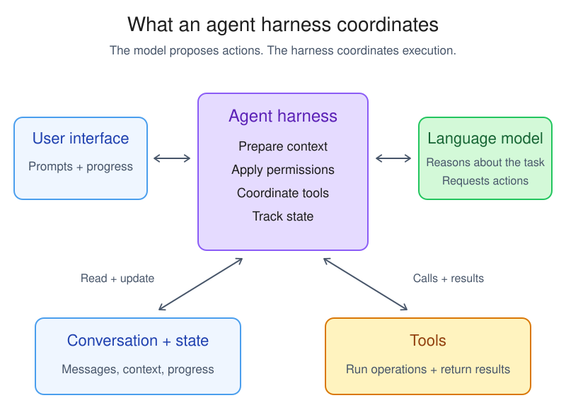
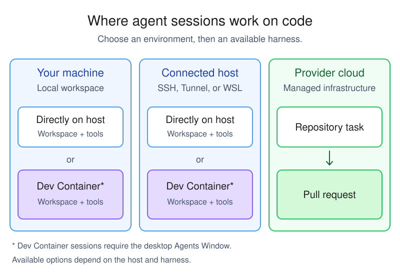

# Understand agent harnesses

An agent harness is the software layer that runs an agent session. It turns a language model into an agent by connecting the model to context and tools, coordinating the [agent loop](/docs/agents/concepts/agents.md#agent-loop), and maintaining session state as the work progresses.

 supports multiple agent harnesses, including , , and . The  harness is built on the , which helps provide more consistent harness behavior and core capabilities across , , and the .

The model provides the reasoning and decides what to say or which tool to request. The harness makes those decisions operate as a stateful workflow by preparing model requests, coordinating tool calls and approvals, returning results to the model, and tracking the conversation and changes.

This article explains what a harness does and how it differs from model access, a language model, an agent role, a session target, and an execution environment. To select and configure a harness, see [Choose and use an agent harness](/docs/agents/run/agent-harnesses.md).

The diagram shows responsibilities, not process or deployment boundaries. The model requests actions, and the harness applies the relevant permission rules and coordinates tool execution. The model and tools can run in different locations from the harness.

## Follow a turn through an agent harness

When you submit a prompt, the harness coordinates each step of the turn:

1. The harness receives your request and the current session state. It prepares the instructions, context, and available tool definitions for the language model.
1. The language model reasons over that information and returns either a response or a request to call a tool.
1. For a tool request, the harness applies the configured permission and approval rules, routes the call to the environment where the tool runs, and captures the result.
1. The harness returns the tool result to the model. The model decides whether to call another tool, ask for input, or finish the task.
1. The harness associates the messages, tool calls, results, and code changes with the session, and presents the current status in .

The model chooses the actions, while the harness coordinates the system that carries them out.

## How a harness differs from other agent concepts

Several choices determine how an agent works. They work together, but they are not interchangeable:

| Concept | What it determines | Relationship to the harness |
|---------|--------------------|-----------------------------|
| **Model access** | Which account, subscription, or credentials provide access to a model and how usage is billed. | Each harness supports particular models and access options. Changing the access source does not switch harnesses. |
| **Language model** | How the agent reasons and generates responses. | A harness can offer multiple models, and the same model might be available through more than one harness. The model can run in a different location from the harness. |
| **Agent role** | Which instructions, tools, and behavior apply to a task. Examples include Agent, Plan, Ask, and custom agents. | A role shapes the task behavior within a harness. Changing the role does not replace the harness. |
| **Execution environment** | Where workspace tools run and code changes are made, such as your machine, a connected host, a Dev Container, or cloud infrastructure. | The harness coordinates work in the selected environment. The environment is not the harness. |
| **Session target** | Which harness or cloud target  uses for a session. | The **Session Target** UI control lists harnesses and the Cloud target. In the , use the workspace picker to select a machine or Dev Container separately from the harness. |

### Model access

You can access models through , another account supported by the selected harness, or a configured model provider that uses your API key. Access might require a subscription or usage-based billing. The service that provides access is not necessarily the model developer. For example,  can provide access to Claude-family models developed by Anthropic.

Model access and harness choice are separate. A  subscription can provide access to models in multiple supported harnesses, but signing in does not make every harness available. Each harness determines which models and access options it supports. Selecting a Claude model in the  harness does not switch to the Claude harness. Your account and organization policies also affect availability. Learn how to [configure model access and choose a model](/docs/agent-customization/language-models.md).

### Harness and host

The harness determines agent behavior. The Agent Host is the process that runs supported harnesses and manages their sessions, while the  and  display and control them. For process boundaries and client dependencies, see the optional [Agent Host architecture reference](/docs/agents/concepts/agent-host.md).

## Understand what the harness choice changes

The selected harness defines the agent implementation. Depending on the harness and your configuration, this choice affects:

* **Tools and capabilities**: which built-in, extension-provided, [MCP](/docs/agent-customization/mcp-servers.md), or provider-specific tool integrations the agent supports, and how the harness routes tool calls.
* **Model options**: which language models the harness offers and how it configures requests to them.
* **Agent workflows**: which provider-specific commands, customizations, and session features are available.
* **Permissions**: which approval modes and tool permission settings the harness supports.

The harness choice does not by itself determine where the language model runs or whether code changes go into a folder or worktree. Those choices depend on the models, execution environments, and isolation options that the session target supports.

## Map session targets to harnesses

 provides common chat and session-management surfaces across session targets. Available controls and workflows depend on the selected target. The **Session Target** control includes both harnesses and the Cloud execution target:

| Session target choice | Harness | Execution environment |
|-----------------------|---------|-----------------------|
| **Copilot** | The  harness, built on the . | Your machine, a connected host, or a Dev Container. |
| **Claude or Codex** | The corresponding provider harness and its provider-specific capabilities. | Your machine, or a connected host or Dev Container where the integration supports it. Check the [harness setup and capabilities](/docs/agents/run/agent-harnesses.md#configure-an-agent-harness). |
| **Cloud** | The provider harness for the cloud agent that you select, such as Copilot, Claude, or Codex. | The provider's cloud infrastructure, working against a GitHub repository and returning the result through a pull request. |

> [!NOTE]
> **For Local sessions:** The Local harness works in the current workspace through the editor's extension host. **Local** is a session-target name, not the only way to run agents on your machine. See [Local setup and capabilities](/docs/agents/run/agent-harnesses.md#local).

Cloud is an execution target that groups available cloud agents, not a single provider harness. After you select Cloud, you choose an available cloud agent.

## Relate execution environments and code isolation

The execution environment determines where the harness runs workspace tools and changes code. A Dev Container can run on your machine or on a connected host:

* **Your machine**: the harness works with a local folder or Git worktree and can access local context, such as test results and terminal output.
* **A connected host**: the harness runs next to the source code on an SSH, Tunnel, or WSL host. Learn more about [remote agent sessions](/docs/agents/run/remote-agent-sessions.md).
* **A Dev Container**: the agent runs workspace tools inside the project's container and uses its configured tools and dependencies. The container can be on your machine or on a supported SSH, Tunnel, or WSL host.
* **Cloud infrastructure**: the harness works with a GitHub repository and creates a pull request. It uses the tools and models configured in the cloud service instead of your local  environment.

The diagram shows where sessions work on code, not where you connect from or where the language model runs. See [remote sessions and browser access](/docs/agents/run/remote-agent-sessions.md) for connection steps. Harness availability depends on the selected environment.

`feature(agent-host-dev-containers)`

Dev Container sessions require the desktop  and a host that supports Dev Container execution. Selecting a container in the workspace picker changes the execution environment, not the harness. Learn how to [run a session in a Dev Container](/docs/agents/run/agents-window.md#run-a-session-in-a-dev-container).

For sessions that offer folder and worktree options, code isolation controls which working directory receives changes. Folder isolation applies edits directly to your current workspace, including its uncommitted changes. Worktree isolation gives the session a separate [Git worktree](/docs/sourcecontrol/branches-worktrees.md#understanding-worktrees) based on committed Git state. Dev Container sessions work directly in the container workspace and don't support **New Worktree**.

A worktree is a Git code-isolation boundary, not a security boundary. It does not restrict commands, network access, or access to files outside the worktree. Use [agent sandboxing](/docs/agents/run/agent-sandboxing.md) for operating system-level file system and network restrictions.

For ongoing work, the available [handoff options](/docs/agents/concepts/sessions.md#hand-off-a-session) depend on the selected harness. Local sessions can change the session target and carry conversation history and context to the new target. Learn how to [choose a session target and code isolation](/docs/agents/run/agent-harnesses.md).

## Related resources

* [Choose and use an agent harness](/docs/agents/run/agent-harnesses.md)
* [Complete your first task with an agent](/docs/agents/quickstart.md)
* [Sessions and handoff](/docs/agents/concepts/sessions.md)
