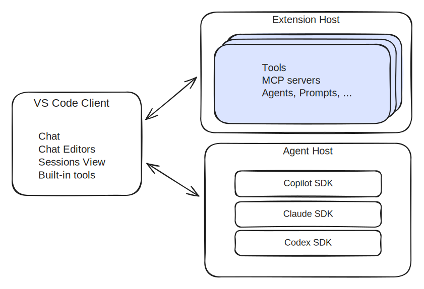
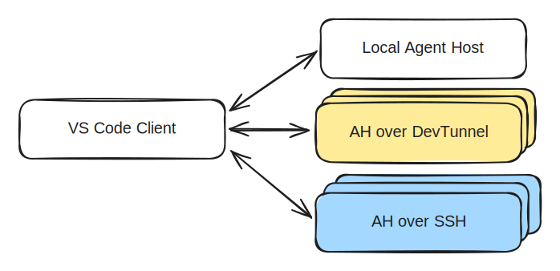

# VS Code Agent Host architecture

VS Code runs AI coding agents in a dedicated process called the Agent Host, which it communicates with through the Agent Host Protocol (AHP). The host owns agent sessions independently of the clients that display and control them.

> [!NOTE]
> The Agent Host and AHP are under active development, and are being enabled gradually for users.

## From extension host to Agent Host

The Copilot Chat extension has traditionally provided many of VS Code's AI experiences, with agent logic running in the extension host. The extension host remains important for extensibility, but is designed around the lifecycle and APIs of extensions. Long-running autonomous work has different needs.

VS Code is moving agent session orchestration into the Agent Host, which provides:

* **Shared sessions**: multiple clients can observe and control the same session, staying in sync.
* **Remote execution**: the host can run next to the workspace on another machine while clients connect from elsewhere.
* **Independent execution**: an agent session can continue when no editor or other client is connected.
* **Multiple agent implementations**: different agent runtimes plug into one host-facing interface and present common session concepts to clients.
* **Dedicated process**: agents run in their own process, where they won't be blocked by busy extensions.

VS Code extensions can still contribute chat customizations such as tools, MCP servers, and custom agents, but the agent runtime itself runs in the Agent Host process.

## Process architecture

The Agent Host can run as a local utility process or as a standalone server on a remote machine. VS Code uses a message port for local IPC and AHP JSON-RPC over WebSocket for remote connections.

The first-party agent adapters run inside the Agent Host process. An adapter translates between its agent runtime and the common AHP session model.

The Agent Host lives next to the workspace. When the host runs remotely, file edits and commands run on the remote machine.

## Agent Host Protocol

[Agent Host Protocol](https://microsoft.github.io/agent-host-protocol/) is an open, agent-agnostic protocol between a host and its clients. It uses JSON-RPC for communication and immutable state with pure reducers for synchronized session data.

The host is the source of truth. Each client subscribes to URI-addressed channels for resources such as sessions, chats, terminals, and changesets. The client receives an initial state snapshot followed by ordered actions. If the connection drops, the client reconnects and receives missed actions or a fresh snapshot.

## Self-contained, with optional client tools

The defining Agent Host principle is that the agent can run without a client. A client is a viewer and controller that can come and go. The host therefore includes the baseline capabilities needed to manage sessions and work with the workspace.

Connected clients can also contribute tools. For example, VS Code can advertise tools that are provided by the client (like the browser tools) or by installed extensions. The Agent Host adds those definitions to the active session and routes a tool call back to the client that contributed it.

## Local and remote hosts

For remote sessions, the Agent Host runs as a standalone process and exposes AHP over WebSocket. The Agents window reaches it through SSH or a secure tunnel.

Like [VS Code Remote Development](/docs/remote/remote-overview.md), the user interface stays on the client while workspace operations run close to the source code and development tools.

## Related resources

* [Agent Host Protocol documentation](https://microsoft.github.io/agent-host-protocol/)
* [Agent Host Protocol source repository](https://github.com/microsoft/agent-host-protocol)
* [Agents in VS Code](/docs/agents/concepts/agents.md)
* [Remote agent sessions](/docs/agents/remote-agent-sessions.md)
* [VS Code Remote Development architecture](/docs/remote/remote-overview.md)
