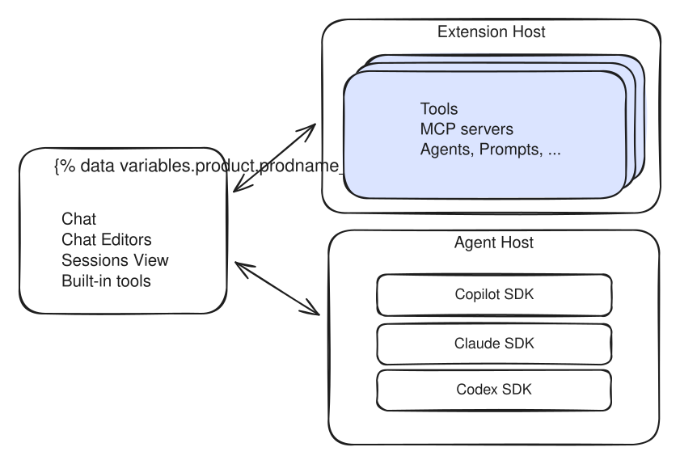
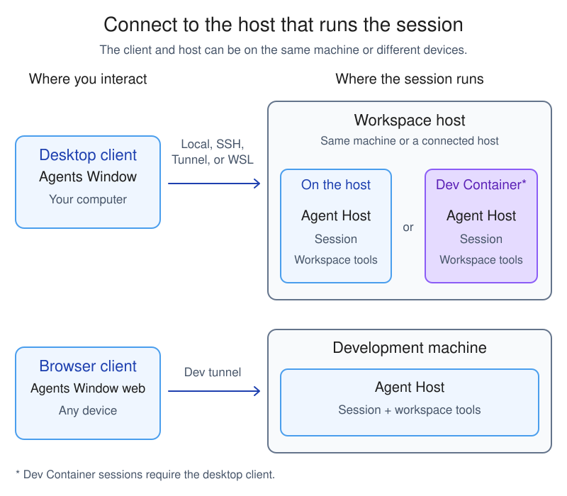

# VS Code Agent Host architecture

VS Code runs AI coding agents in a dedicated process called the Agent Host, which it communicates with through the Agent Host Protocol (AHP). The host owns agent sessions independently of the clients that display and control them.

> [!NOTE]
> The Agent Host and AHP are under active development, and new capabilities continue to roll out.

## Why a dedicated Agent Host

VS Code runs agent sessions in the Agent Host by default. A dedicated process for agents provides:

* **Shared sessions**: multiple clients can observe and control the same session, staying in sync.
* **Remote execution**: the host can run next to the workspace on another machine while clients connect from elsewhere.
* **Independent execution**: an agent session can continue when no editor or other client is connected.
* **Multiple agent implementations**: different agent runtimes plug into one host-facing interface and present common session concepts to clients.
* **Dedicated process**: agents run in their own process, where they won't be blocked by busy extensions.

Earlier versions ran agent logic in the extension host, alongside the Copilot Chat extension. The extension host remains important for extensibility, but it is designed around the lifecycle and APIs of extensions, and long-running autonomous work has different needs. Extensions can still contribute chat customizations such as tools, MCP servers, and custom agents, but the agent runtime itself runs in the Agent Host process. By default, tools from extensions are only available in chats in an editor window where the extension is running.

### Agents on the Agent Host

Different agents use the Agent Host by default:

* **Copilot**: runs on the Agent Host by default.
* **Claude**: runs on the Agent Host by default (subject to the Claude Agent SDK being reachable).
* **Codex**: runs through the OpenAI Codex extension by default. Running Codex on the Agent Host is experimental and requires enabling `setting(chat.agentHost.codexAgent.enabled)` and `setting(chat.editor.codex.preferAgentHost)`.

Learn more about the [Claude and Codex harnesses](/docs/agents/concepts/agent-harnesses.md).

## Process architecture

The Agent Host can run as a local utility process or as a standalone server on a remote machine. VS Code uses a message port for local IPC and AHP JSON-RPC over WebSocket for remote connections.

The first-party agent adapters run inside the Agent Host process. An adapter translates between its agent runtime and the common AHP session model.

The Agent Host lives next to the workspace. When the host runs remotely, file edits and commands run on the remote machine.

## Agent Host Protocol

[Agent Host Protocol](https://microsoft.github.io/agent-host-protocol/) is an open, agent-agnostic protocol between a host and its clients. It uses JSON-RPC for communication and immutable state with pure reducers for synchronized session data.

The host is the source of truth. Each client subscribes to URI-addressed channels for resources such as sessions, chats, terminals, and changesets. The client receives an initial state snapshot followed by ordered actions. If the connection drops, the client reconnects and receives missed actions or a fresh snapshot.

## Self-contained, with optional client tools

The defining Agent Host principle is that the agent can run without a client. A client is a viewer and controller that can come and go. The host therefore includes the baseline capabilities needed to manage sessions and work with the workspace.

Agent sessions are not tied to the lifetime of the window for their workspace. You can close the window and reopen the session later from another window. While the Agent Host remains running, an active turn can continue without a connected client.

Connected clients can also contribute tools. For example, VS Code can advertise tools that are provided by the client (like the browser tools) or by installed extensions. The Agent Host adds those definitions to the active session and routes a tool call back to the client that contributed it.

## Local and remote hosts

For remote sessions, the Agent Host runs as a standalone process and exposes AHP over WebSocket. The Agents window reaches it through SSH or a dev tunnel.

Like [VS Code Remote Development](/docs/remote/remote-overview.md), the user interface stays on the client while workspace operations run close to the source code and development tools.

To run your own standalone Agent Host, use `code agent host`. By default, the command starts a server on localhost and protects it with a connection token. Use the `--tunnel` option to expose it through a dev tunnel.

## Behavior on the extension host

The Agent Host is the default. Some behavior differs for agents that run on the extension host, such as sessions that were created before the Agent Host was enabled:

* **Session continuity**: sessions that were already created on the extension host continue to run there. New Copilot sessions use the Agent Host.
* **Customizations**: the Agent Host reads user-level customizations from harness-agnostic folders like `~/.copilot` and `~/.claude`. Customizations stored only in your VS Code profile user data are a legacy location that the Copilot agent doesn't read. Learn more about [customizing agent behavior](/docs/agent-customization/overview.md).
* **Autopilot**: on the Agent Host, [Autopilot](/docs/agents/approvals.md#how-autopilot-works) is an agent mode; on the extension host, it's a permission level.
* **Assisted permissions**: the experimental [Assisted permissions](/docs/agents/approvals.md#permission-levels) level is available only on the Agent Host.
* **Session capabilities**: shared multi-window sessions, multiple chats per session, quick chats, and remote hosting are available only on the Agent Host.
* **Extension-provided tools**: tools from extensions are only available in chats in an editor window where the extension is running.
* **MCP configuration**: the Agent Host reads harness-agnostic MCP config from `.mcp.json` (workspace) and `~/.copilot/mcp-config.json` (user). It doesn't read `.vscode/mcp.json` directly, but VS Code forwards servers you configure in VS Code to the Agent Host, except servers that require interactive input (for example, `${input:...}` variables). Learn more about [configuring MCP servers](/docs/agent-customization/mcp-servers.md).

## Related resources

* [Agent Host Protocol documentation](https://microsoft.github.io/agent-host-protocol/)
* [Agent Host Protocol source repository](https://github.com/microsoft/agent-host-protocol)
* [Agents in VS Code](/docs/agents/concepts/agents.md)
* [Remote agent sessions](/docs/agents/remote-agent-sessions.md)
* [VS Code Remote Development architecture](/docs/remote/remote-overview.md)
