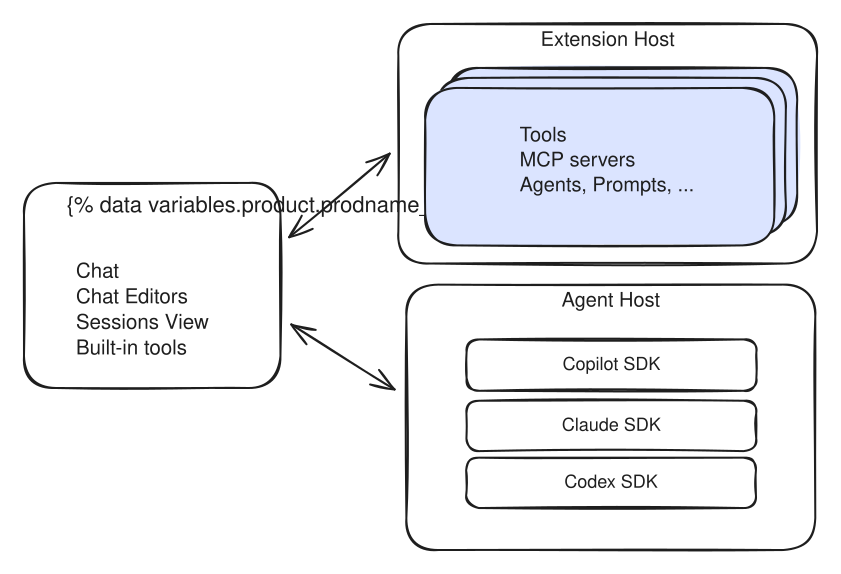
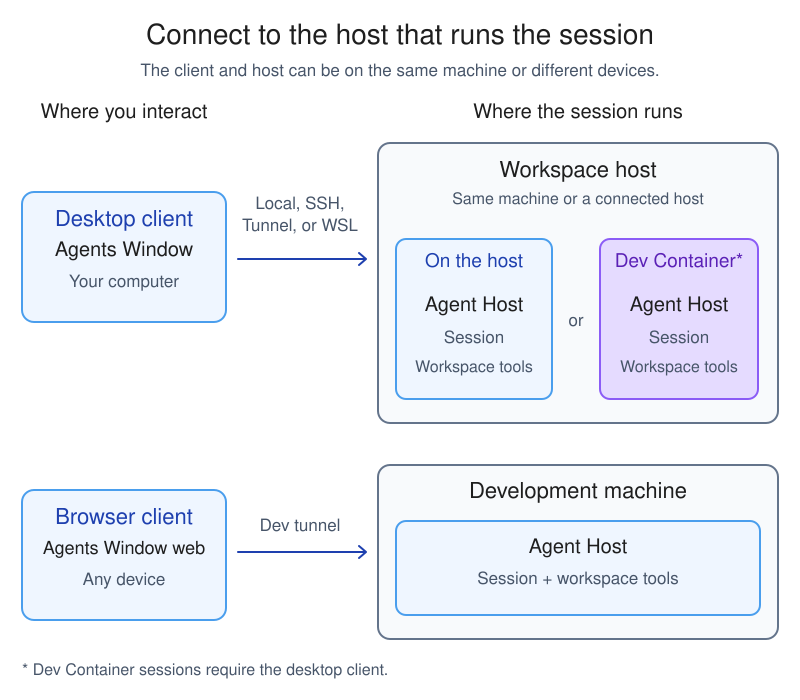

# Agent Host architecture

The Agent Host is a dedicated process that runs agent harnesses and manages their sessions. Separating session execution from an individual window lets you work with the same session across interfaces and run agents close to your code and development tools.

This article explains the process boundaries, execution environments, session lifetime, and client dependencies for integrations that use the Agent Host. You don't need this architecture background to use agents. For task-focused guidance, see [choose an agent harness](/docs/agents/run/agent-harnesses.md) and [manage sessions](/docs/agents/run/sessions/manage-sessions.md).

## What this architecture enables

Separating the agent from the window that displays it provides these capabilities:

* **Shared sessions**: multiple clients can observe and control the same session, staying in sync.
* **Remote execution**: the host can run next to the workspace on another machine while clients connect from elsewhere.
* **Independent execution**: an agent session can continue without a connected editor while the host and its execution environment remain running. Tools provided by a client still require that client.
* **Multiple agent implementations**: different agent runtimes plug into one host-facing interface and present common session concepts to clients.
* **Dedicated process**: agents run in their own process, where they won't be blocked by busy extensions.

## Process architecture

The components have different responsibilities:

* **Client**: the , , or browser interface that displays a session and sends your requests.
* **Agent harness**: the implementation that coordinates the model, tools, and agent workflow.
* **Agent Host**: the process that runs supported harnesses and owns their sessions, independently of the clients displaying them.

The extension host remains responsible for extensions. Extensions can contribute tools, MCP servers, and custom agents without running the agent harness itself. Tools from extensions are available only in chats in an editor window where the extension is running.

The Agent Host can run as a local utility process or as a standalone server on a remote machine.  uses a message port for local IPC and AHP JSON-RPC over WebSocket for remote connections.

Agent adapters run inside the Agent Host process. An adapter translates between its agent runtime and the common [Agent Host Protocol (AHP)](#agent-host-protocol) session model.

## Where sessions run

The Agent Host runs next to the workspace: on your machine, inside a Dev Container, or on a remote machine. Workspace file edits and commands use the environment that contains the host. This does not determine where the language model runs.

The desktop  can connect to an Agent Host on the same machine or on a connected SSH, Tunnel, or WSL host. The [browser-based ](/docs/agents/run/remote-agent-sessions.md#use-the-agents-window-in-the-browser) connects to your development machine through a dev tunnel. The browser is a client, not the host that runs the session.

Clients display and control sessions. The Agent Host owns them. Desktop and browser clients can connect to the same tunnel host.

`feature(agent-host-dev-containers)`

For a Dev Container session, the Agent Host runs inside the project's container. The container can run on your machine or on a supported SSH, Tunnel, or WSL host, while the desktop  remains on your machine. Workspace file edits and commands use the tools and dependencies inside the container, rather than those installed directly on the source host.

Dev Container execution is an environment choice, not a different harness. See the [session execution options diagram](/docs/agents/concepts/agent-harnesses.md#relate-execution-environments-and-code-isolation) for how local, connected-host, container, and cloud execution relate. For setup steps, see [Run an agent session in a Dev Container](/docs/agents/run/agents-window.md#run-a-session-in-a-dev-container).

Like [ Remote Development](/docs/remote/remote-overview.md), the user interface stays on the client while workspace operations run close to the source code and development tools.

The **Cloud** session target is a separate choice that uses provider-managed infrastructure. Connecting to an Agent Host on another machine does not turn the session into a cloud-agent session.

## Session lifetime and client dependencies

The Agent Host includes the baseline capabilities needed to manage sessions and work with the workspace without a connected client. A client can disconnect and reconnect to the same session.

An active turn can continue after its project window closes while the Agent Host remains running. For sessions managed by desktop  on your machine, keep the application running. Closing a project folder is different from quitting the application.

For remote sessions, keep the remote machine and the process serving the session running. Reconnecting to a session does not mean that active work continued while its host process was stopped or its machine was shut down.

Connected clients can contribute tools, such as browser tools or tools from installed extensions. The Agent Host adds those definitions to the session and routes each tool call back to the contributing client. These tools require that client to remain connected. Learn how to [manage tool availability](/docs/agents/run/tools.md#manage-tool-availability-for-copilot).

## Agent Host Protocol

[Agent Host Protocol](https://microsoft.github.io/agent-host-protocol/) is an open, agent-agnostic protocol between a host and its clients. It uses JSON-RPC for communication and immutable state with pure reducers for synchronized session data.

The host is the source of truth. Each client subscribes to URI-addressed channels for resources such as sessions, chats, terminals, and changesets. The client receives an initial state snapshot followed by ordered actions. If the connection drops, the client reconnects and receives missed actions or a fresh snapshot.

For protocol definitions and implementation details, see the [Agent Host Protocol source repository](https://github.com/microsoft/agent-host-protocol).

## Run a standalone host

To run your own standalone Agent Host, use `code agent host`. By default, the command starts a server on localhost and protects it with a connection token. Use the `--tunnel` option to expose it through a dev tunnel.

## Local and existing extension-host sessions

The **Local** harness and existing extension-host sessions run in the extension host rather than the Agent Host. Their behavior is documented as an exception in the relevant task guides:

| Task | Guidance |
|------|----------|
| Review saved edits | [Review Local session changes](/docs/agents/run/review-code-edits.md#review-local-session-changes). |
| Configure instructions and custom agents | [Choose customization scope and locations](/docs/agent-customization/overview.md#choose-a-customization-scope) or [move existing customizations](/docs/agent-customization/migrate-customizations.md). |
| Configure hooks | [Choose the hook implementation for your session](/docs/agent-customization/hooks.md#choose-the-hook-implementation-for-your-session). Sharing a host does not give harnesses a shared hook schema. |
| Set permissions and Autopilot behavior | [Manage approvals and permissions](/docs/agents/run/approvals.md#permission-levels). |
| Continue sessions across interfaces | [Sessions across surfaces](/docs/agents/concepts/sessions.md#sessions-across-surfaces). |
| Configure tools and MCP servers | [Manage available tools](/docs/agents/run/tools.md#manage-available-tools) and [configure MCP servers](/docs/agent-customization/mcp-servers.md#configure-the-mcpjson-file). |

## Related resources

* [Remote agent sessions](/docs/agents/run/remote-agent-sessions.md)
* [Agent harness concepts](/docs/agents/concepts/agent-harnesses.md)
* [ Remote Development architecture](/docs/remote/remote-overview.md)
