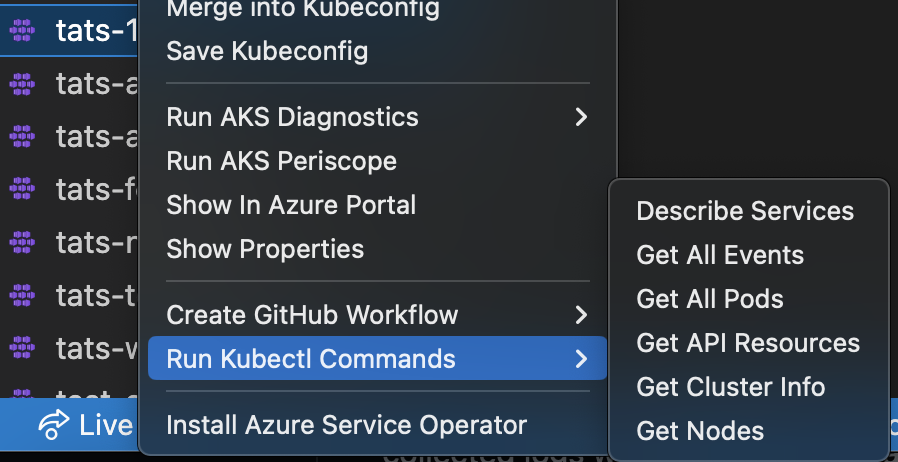
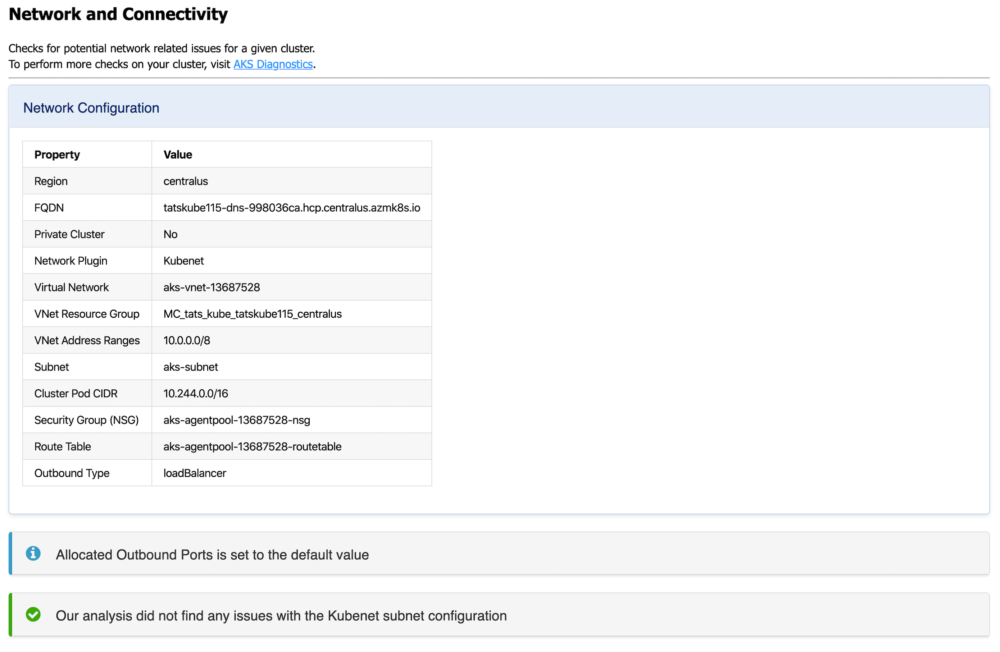
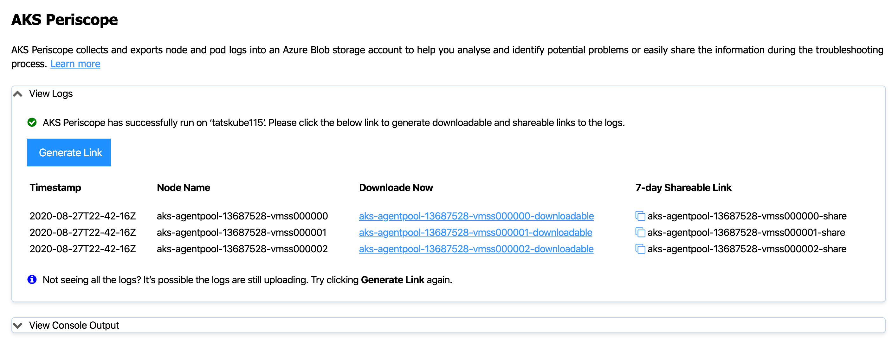
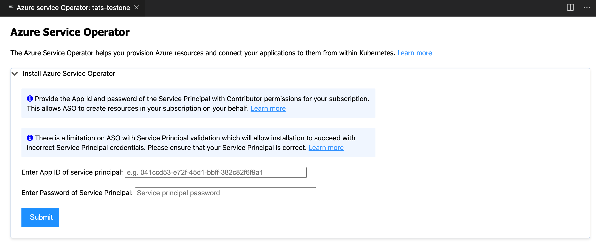

# AKS tools and diagnostics in VS Code

This document will walk you through some of the ways you can interact with your AKS clusters directly from Visual Studio Code. [Azure Kubernetes Services](https://azure.microsoft.com/services/kubernetes-service/#overview) is a fully managed [Kubernetes](https://azure.microsoft.com/topic/what-is-kubernetes/#overview) service. Azure Kubernetes Service (AKS) offers serverless Kubernetes, an integrated continuous integration and continuous delivery (CI/CD) experience and enterprise-grade security and governance, is an open-source system for automating deployment, scaling, and management of containerized applications. We will show you how to run [diagnostic health-checks](https://learn.microsoft.com/azure/aks/concepts-diagnostics) on your AKS cluster, launch [AKS Periscope](https://github.com/azure/aks-periscope) for more in-depth troubleshooting, deploy [Azure Service Operator](https://github.com/Azure/azure-service-operator), or generate [GitHub Actions Starter Workflows](https://github.com/actions/starter-workflows).

## Before you begin

The [AKS VS Code Extension](https://marketplace.visualstudio.com/items?itemName=ms-kubernetes-tools.vscode-aks-tools) has parent dependency on [Kubernetes VS Code extension](https://marketplace.visualstudio.com/items?itemName=ms-kubernetes-tools.vscode-kubernetes-tools). You will need to download the [Kubernetes VS Code extension](https://code.visualstudio.com/docs/azure/kubernetes). You can follow this guide on an existing AKS cluster or you can [create AKS cluster](https://learn.microsoft.com/azure/aks/learn/quick-kubernetes-deploy-portal).

## Install the Azure Kubernetes Services extension

For a fully integrated Azure Kubernetes diagnostics experience, you can install the [Azure Kubernetes Services Tools](https://marketplace.visualstudio.com/items?itemName=ms-kubernetes-tools.vscode-aks-tools) extension.

With the extension you can easily view and manage your AKS clusters from your VS Code environment.

To install the Azure Kubernetes Services VS Code extension, open the Extensions view (`kb(workbench.view.extensions)`) and search for "AKS". Select the Microsoft [Azure Kubernetes Services](https://marketplace.visualstudio.com/items?itemName=ms-kubernetes-tools.vscode-aks-tools) extension.

## Installation

1. Download and install the [Azure Kubernetes Service extension](https://marketplace.visualstudio.com/items?itemName=ms-kubernetes-tools.vscode-aks-tools) for VS Code.

2. Wait for the extension to finish installing then reload VS Code when prompted.

3. Once the installation is complete, you'll see a section named **Azure** under **Clouds**.

4. Sign in to your Azure Account by selecting **Sign in to Azure…**

## Features

Once you successfully sign in with your Azure Account, you can view all AKS clusters in your Azure subscriptions(s) under the section named **Azure**. You can right-click on your AKS cluster and select a menu item to perform the following actions.

Run AKS diagnostics on a cluster:

Start a GitHub workflow:

Run Kubectl Commands

### Merge into Kubeconfig

Right-click on your AKS cluster and select **Merge into Kubeconfig** to add the selected AKS cluster to your [active kubeconfig file](https://github.com/vscode-kubernetes-tools/vscode-kubernetes-tools#working-with-kubeconfigs).

### Save Kubeconfig

Right-click on your AKS cluster and select **Save Kubeconfig** to save the kubeconfig of the selected AKS cluster as a new file.

### AKS Diagnostics

Right-click on your AKS cluster and select **Run AKS Diagnostics** to display diagnostics information based on your AKS cluster's backend telemetry for:

* Best Practices
* Create, Upgrade, Delete and Scale issues
* Identity and Security
* Network and Connectivity issues
* Node Health

To perform further checks on your AKS cluster to troubleshoot and get recommended solutions, select the AKS Diagnostics link at the top of the page to open it for the selected cluster. For more information on AKS Diagnostics, visit [AKS Diagnostics Overview](https://learn.microsoft.com/azure/aks/concepts-diagnostics).

### Navigating to your cluster in the Azure Portal

Right-click on your AKS cluster and select **Show In Azure Portal** to open the Overview page for your cluster in the [Azure portal](https://portal.azure.com/).

### Show AKS cluster properties

Right click on your AKS cluster and select **Show Properties** to display the AKS cluster and agent pool properties like provisioning state, fqdn, k8s version, along with node properties like node version, vm type, vm size, o/s type, o/s disk size and nodes provisioning state.

### AKS Periscope

Right-click on your AKS cluster and select **Run AKS Periscope** to extract detailed diagnostic information from your AKS cluster and export it to an Azure storage account. When you select the option, a web view will load providing you the option to generate a downloadable link for the collected logs as well as a shareable link with 7-day expiry.

> If you are not seeing the logs for all the nodes, it is possible the logs were still uploading. Press the **Generate Link** button again to load more logs.

For more information, visit [AKS Periscope](https://github.com/Azure/aks-periscope).

**Configuring a Storage Account**

Running the AKS Periscope requires you to have a storage account associated with the Diagnostic settings of your AKS cluster. If you have only one storage account associated with the Diagnostic settings of your AKS cluster, the collected logs will be stored in the associated storage account by default. If you have more than one storage account associated with the Diagnostics settings of your AKS cluster, then the extension will prompt you to choose the storage account for saving collected logs. If you don't have a storage account configured in the Diagnostic settings, you can follow these instructions to enable it:

1. Right-click on your AKS cluster and select **Show In Azure Portal**.

2. Select **Diagnostic Settings** under **Monitoring** in the left navigation.

3. Select **Add diagnostic setting**.

4. Enter a name, such as myAKSClusterLogs, then select the option to **Archive to a storage account**.

5. Select a storage account of your choice.

6. In the list of available logs, select the logs you wish to enable.
    > Note: The incurred cost is subject to your storage account usage and Azure Storage Policy.

7. When ready, select **Save** to enable collection of the selected logs.

For more information on Diagnostics settings, visit [Create diagnostic settings to send platform logs and metrics to different destinations](https://learn.microsoft.com/azure/azure-monitor/essentials/diagnostic-settings).

### Install Azure Service Operator

Right-click on your AKS cluster and select **Install Azure Service Operator** to easily deploy the latest version of Azure Service Operator (ASO) on your AKS cluster and provision Azure resources within Kubernetes. When you select this option, you'll be prompted for a service principal for ASO to use when performing Azure resource operations. This service principal must have appropriate permissions (typically Contributor at suitable scope). Fill out the service principal details and select **Submit** to kick off the installation of Azure Service Operator.

> Install Azure Service Operator can only be performed on an AKS cluster that has never had ASO installed before. If you have already initiated the installation manually, follow the instructions on [Azure Service Operator](https://azure.github.io/azure-service-operator/#installation) to complete.

For more information on Azure Service Operator, visit [Azure Service Operator (for Kubernetes)](https://github.com/Azure/azure-service-operator). If you are experiencing issues with Azure Service Operator, visit [Azure Service Operator (ASO) troubleshooting](https://github.com/Azure/azure-service-operator/blob/master/docs/troubleshooting.md).

### Create GitHub Workflow

Right-click on your AKS cluster and select **Create GitHub Workflow** to easily open and create a workflow starter template. This helps in quick generation of the workflow templates with pre-populated resource group and cluster name for:

* [Starter Workflow](https://github.com/actions/starter-workflows/blob/main/deployments/azure-kubernetes-service.yml)
* [Helm Workflow](https://github.com/actions/starter-workflows/blob/main/deployments/azure-kubernetes-service-helm.yml)
* [Kompose Workflow](https://github.com/actions/starter-workflows/blob/main/deployments/azure-kubernetes-service-kompose.yml)
* [Kustomize Workflow](https://github.com/actions/starter-workflows/blob/main/deployments/azure-kubernetes-service-kustomize.yml)

### Create cluster from Azure Portal

Right-click on your AKS subscription and select **Create Cluster From Azure Portal** to easily navigate to the AKS create cluster page in the Azure Portal.

### Start or stop an AKS cluster

Right-click on your AKS cluster and select **Show Properties** to display the AKS cluster properties. On the page, there is a **Stop/Start Cluster** button to start or stop the cluster.

### Run Kubectl Commands from your AKS cluster

Right-click on your AKS cluster and select **Run KubectlCommands** to run Kubectl commands on your cluster. Currently, the following Kubectl commands are available:

* Describe Services
* Get All Pods
* API Resources
* Get Cluster Info
* Get Node
* Get All Events

Congratulations! You now know how to navigate through this VS Code extension.

## Next steps

* [Azure Extensions](/docs/azure/extensions.md) - The VS Code Marketplace has hundreds of extensions for Azure and the cloud.
* [Azure Kubernetes Service Diagnostics (preview) overview](https://learn.microsoft.com/azure/aks/concepts-diagnostics)
* [Azure Service Operator](https://azure.github.io/azure-service-operator/#azure-service-operator-v2) - Learn about Azure Service Operator.
* [AKS Periscope](https://github.com/azure/aks-periscope)
* [GitHub AKS Starter Workflow](https://github.com/actions/starter-workflows)
