# Working with Docker

[Docker](https://www.docker.com) is a very popular container platform that lets you easily package, deploy, and consume applications and services. Whether you are a seasoned Docker developer or just getting started, Visual Studio Code makes it easy to author `Dockerfile` and `docker-compose.yml` files in your workspace. Visual Studio Code even supports generating and [adding the appropriate Docker files](#generating-docker-files) based on your project type.

## Install the Docker extension

Docker support for VS Code is provided by an extension. To install the Docker extension, open the Extensions view by pressing `kb(workbench.view.extensions)` and search for `docker` to filter the results. Select the Microsoft [Docker](https://marketplace.visualstudio.com/items?itemName=ms-azuretools.vscode-docker) extension.

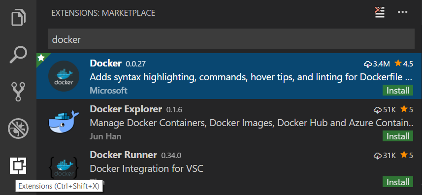

## Dockerfiles

With Docker, you can build images by specifying the step by step commands needed to build the image in a `Dockerfile`. A Dockerfile is just a text file that contains the build instructions.

VS Code understands the structure of Dockerfiles as well as the available set of instructions, so you get a great experience when authoring these files.

1. Create a new file in your workspace named `Dockerfile`
2. Press `kb(editor.action.triggerSuggest)` to bring up a list of snippets corresponding to valid `Dockerfile` commands. Pressing the 'i' **Read More** button on the right will show a fly-out with details and a link to the Docker Online documentation.

 

3. Press `kbstyle(Tab)` to move between fields within the snippet. For example, with the `COPY` snippet you can fill in the `source` and then press `kbstyle(Tab)` to move to the `dest` field.

 

In addition to snippets for authoring your `Dockerfile`, Visual Studio Code will provide you with a description of any Docker command you hover over with the mouse. For example, when hovering over `WORKDIR` you will see the following.

For more information on Dockerfiles, check out [Dockerfile best practices](
https://docs.docker.com/articles/dockerfile_best-practices/) on [docker.com](https://docker.com).

## Docker Compose

[Docker Compose](https://docs.docker.com/compose/) lets you define and run multi-container applications with Docker. You define what the shape of these containers look like with a file called `docker-compose.yml`.

Visual Studio Code's experience for authoring `docker-compose.yml` is also very rich, providing IntelliSense for valid Docker compose directives and it will query Docker Hub for metadata on public Docker images.

1. Create a new file in your workspace called `docker-compose.yml`
2. Define a new service called `web:`
3. On the second line, bring up IntelliSense by pressing `kb(editor.action.triggerSuggest)` to see a list of all valid compose directives.

 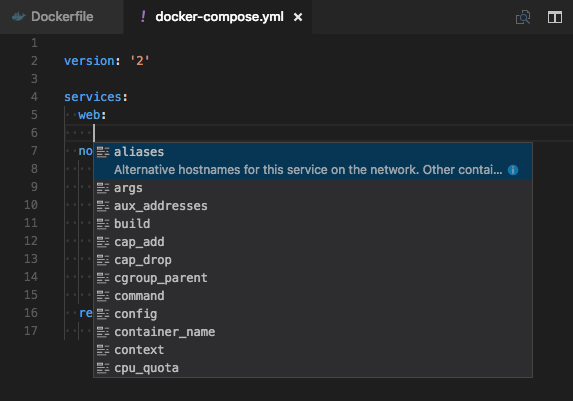

4. For the `image` directive, you can press `kb(editor.action.triggerSuggest)` again and VS Code will query the Docker Hub index for public images.

 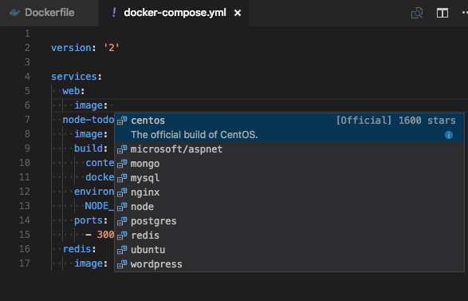

VS Code will first show a list of popular images along with metadata such as the number of stars and description. If you continue typing VS Code will query the Docker Hub index for matching images, including searching public profiles. For example, searching for `Microsoft` will show you all the public Microsoft images.

 

## Generating Docker files

Writing Docker and docker-compose files by hand can be tricky and time consuming. To help you, VS Code can generate the necessary Docker files for your project. From the **Command Palette** (`kb(workbench.action.showCommands)`), run the **Docker: Add Docker files to Workspace** command to generate `Dockerfile`, `docker-compose.yml`, and `docker-compose.debug.yml` files for your workspace type:

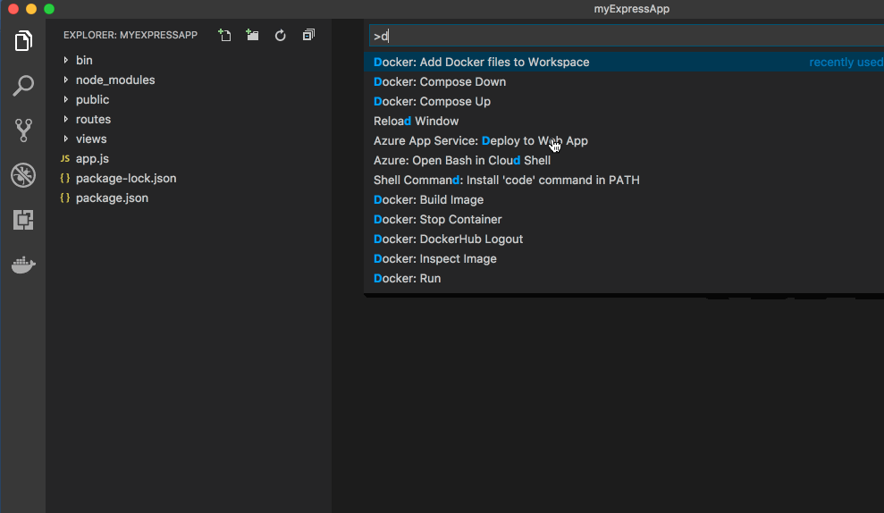

## Docker commands

Many of the most common Docker and docker-compose commands are built right into the **Command Palette** (`kb(workbench.action.showCommands)`).

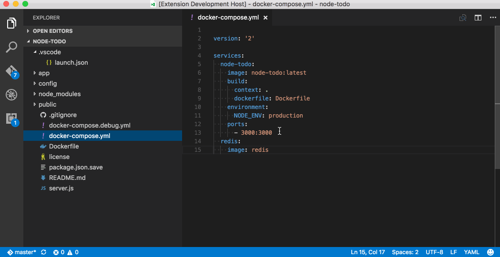

## Docker view

The Docker extension contributes a **Docker** view to VS Code. Within the view, the Explorer lets you view and manage your Images, Containers, and browse your Docker Hub registry. If the [Azure Account](https://marketplace.visualstudio.com/items?itemName=ms-vscode.azure-account) extension is installed, you can browse your [Azure Container Registries](https://docs.microsoft.com/azure/container-registry/) as well.

The right click context menu provides quick access to the same rich set of commands found in the **Command Palette** (`kb(workbench.action.showCommands)`).

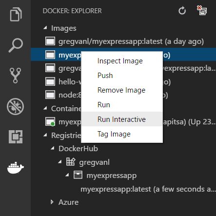

You can move the Docker view up or down by dragging the Docker icon and you can hide the view by right clicking on the icon and choosing **Hide**. To bring it back, right click on the Activity Bar area and check the **Docker** item.

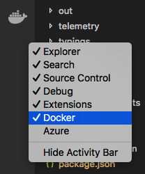

### Logging into Docker Hub

The first time you expand the Docker Hub node, you'll be prompted to log into your Docker Hub account.

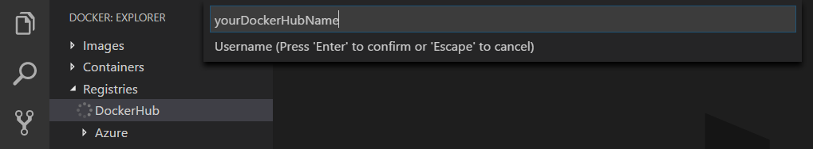

Your user name and password are stored in your operating system credentials vault (for example macOS keychain, Windows Credential Store) so that you don't need to log in every time. You can log out of Docker Hub by right clicking on the Docker Hub label and choosing **Docker Hub Logout**. This will delete the credentials from the OS store.

## Configuration settings

The Docker extension comes with a number of useful configuration [settings](/docs/getstarted/settings.md) allowing you to customize your workflow. You can control such things the default tag for an image (`docker.defaultRegistry`), the shell to use when attaching to a Docker container (`docker.attachShellCommand`), or various docker-compose settings.

Bring up the Settings editor (`kb(workbench.action.openSettings)`) and type 'docker' in the search box to filter on the docker extension settings.

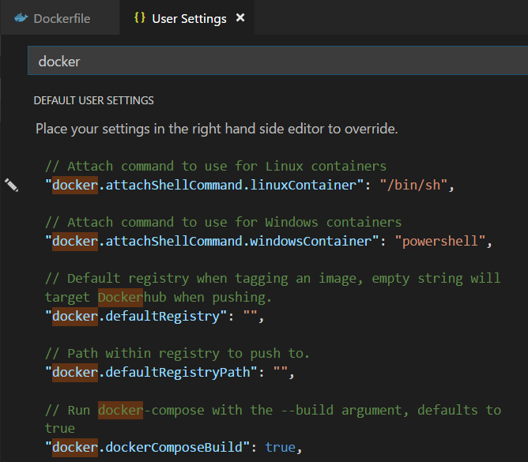

## Linting

The Docker extension language service analyzes your Docker files and provides you with errors and warnings.

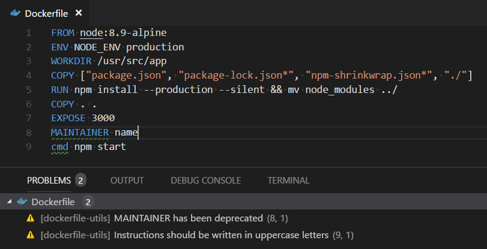

You can control specific linting rules to either be a warning, error, or ignored through the `docker.languageserver.diagnostics` [settings](/docs/getstarted/settings.md)

## Deploying images to Azure App Service

With the Docker Explorer, you can deploy images from Docker Hub or Azure Container Registries, directly to an Azure App Service instance. This functionality requires installing the [Azure Account](https://marketplace.visualstudio.com/items?itemName=ms-vscode.azure-account) extension and an Azure Subscription. If you do not have an Azure subscription, [sign up today](https://azure.microsoft.com/free/?b=16.48) for a free 30 day account and get $200 in Azure Credits to try out any combination of Azure services.

To log into Azure, use the **Azure: Sign In** command from the **Command Palette** (`kb(workbench.action.showCommands)`). You will then sign into your account using the Device Login flow. Click on **Copy & Open** to open your default browser.

Paste in the access code and continue the sign in process.

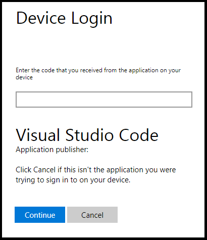

You can now right click on an image in Docker Hub or an Azure Container Registry and choose **Deploy Image to Azure App Service**.

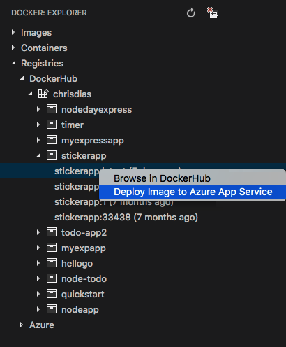

From here, you will be prompted for an Azure Resource Group, a location, an App Service Plan, and a globally unique website name.

To see the full workflow, there is a detailed [Deploy using Docker](/tutorials/docker-extension/getting-started.md) tutorial that creates a web application, puts it into a Docker container, pushes it to an Azure Container Registry, and then deploys to Azure.

## Connecting to `docker-machine`

The default connection of the extension is to connect to the local docker daemon. You can connect to a docker-machine instance if you launch VS Code and have the `DOCKER_HOST` environment variable set to a valid host.

## Running commands on Linux

By default, Docker runs as the root user on Linux, requiring other users to access it with `sudo`. This extension does not assume root access, so you will need to create a Unix group called "docker" and add users to it. Instructions can be found here: [Create a Docker group](https://docs.docker.com/install/linux/linux-postinstall/).

## Next steps

* [Azure Extensions](/docs/azure/extensions.md) - The VS Code Marketplace has hundreds of extensions for Azure and the cloud.
* [Deploying to Azure](/docs/azure/deployment.md) - Learn step-by-step how to deploy your application to Azure.
* [Working with MongoDB](/docs/azure/mongodb.md) - Create, manage and query MongoDB databases from within VS Code.
