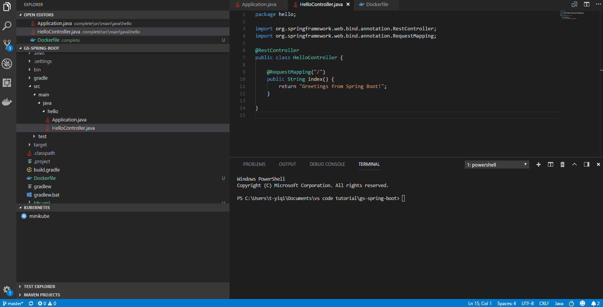
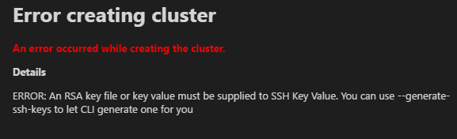
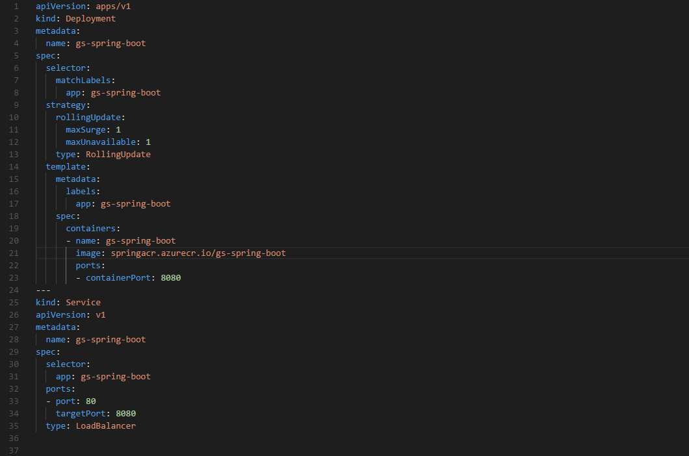
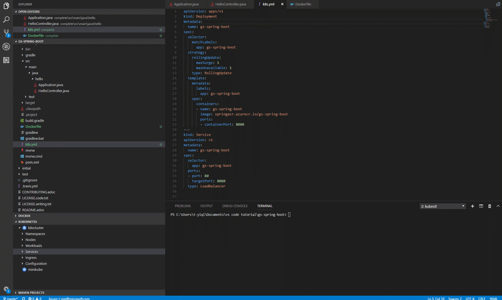

# Working with Kubernetes in VS Code

This document will walk you through the process of deploying an application to [Kubernetes](https://kubernetes.io/) with Visual Studio Code. [Kubernetes](https://kubernetes.io/) is an open-source system for automating deployment, scaling, and management of containerized applications. We will show you how to create a Kubernetes cluster, write a Kubernetes manifest file (usually written in YAML), which tells Kubernetes everything it needs to know about the application, and then finally deploy the application to the Kubernetes cluster.

## Before you begin

You will need to have tools for [Docker](https://docker.com/) and [kubectl](https://kubernetes.io/docs/reference/kubectl/overview/). See the [Install Docker](https://docs.docker.com/install/) documentation for details on setting up Docker on your machine and [Install kubectl](https://kubernetes.io/docs/tasks/tools/install-kubectl/). Before proceeding further, verify you can run Docker and kubectl commands from the shell.

You can create a local Kubernetes cluster with [minikube](https://kubernetes.io/docs/getting-started-guides/minikube/) or an Azure Kubernetes cluster in [Azure Kubernetes Service (AKS)](https://learn.microsoft.com/azure/aks/). In this tutorial, we will use [Azure Kubernetes Service (AKS)](https://learn.microsoft.com/azure/aks/) and you will need to have your [Azure](https://www.azure.com) account ready for the deployment steps.

In addition, if you want to iteratively run and debug containers directly in MiniKube, Azure Kubernetes Service (AKS), or another Kubernetes provider, you can install the [Bridge to Kubernetes](https://marketplace.visualstudio.com/items?itemName=mindaro.mindaro) extension. To get started, see [Use Bridge to Kubernetes](https://learn.microsoft.com/visualstudio/bridge/bridge-to-kubernetes-vs-code).

## Install the Kubernetes extension

For a fully integrated Kubernetes experience, you can install the [Kubernetes Tools](https://marketplace.visualstudio.com/items?itemName=ms-kubernetes-tools.vscode-kubernetes-tools) extension, which lets you quickly develop Kubernetes manifests and HELM charts. With the extension, you can also deploy containerized micro-service based applications to local or Azure Kubernetes clusters and debug your live applications running in containers on Kubernetes clusters. It also makes it easy to browse and manage your Kubernetes clusters in VS Code and provides seamless integration with [Draft](https://draft.sh/) to streamline Kubernetes development.

To install the Kubernetes extension, open the Extensions view (`kb(workbench.view.extensions)`) and search for "kubernetes". Select the Microsoft [Kubernetes](https://marketplace.visualstudio.com/items?itemName=ms-kubernetes-tools.vscode-kubernetes-tools) extension.

## Containerize and publish the application

You can follow the [Working with Docker](/docs/azure/docker.md) tutorial to build your project, generate a Docker image, and push it to a public or private container registry through the Microsoft [Docker Extension](https://marketplace.visualstudio.com/items?itemName=ms-azuretools.vscode-docker).

## Create and config a Kubernetes cluster

You can create a Kubernetes cluster running on Azure using the Kubernetes extension in VS Code. Once you have installed the Kubernetes extension, you will see **KUBERNETES** in the Explorer. Click on **More** and choose **Create Cluster**. Follow the instructions to choose the cluster type (here we choose **Azure Kubernetes Service**), select your subscription, and set up the Azure cluster and Azure agent settings. It will take a few minutes to complete the whole workflow.

**Important**: To create a Kubernetes cluster on Azure, you need to install the [Azure CLI](https://learn.microsoft.com/cli/azure/get-started-with-azure-cli) and sign in.

**Tip**: You will encounter an error if you don't have an available RSA key file. Follow [create SSH public-private key](https://learn.microsoft.com/azure/virtual-machines/linux/mac-create-ssh-keys) to create your key before creating an Azure Kubernetes cluster.

**Tip**: You might encounter an error indicating conflicting location and VM size when creating an Azure Kubernetes cluster. Pay attention to choose proper location and VM size.

## Deploy the application to Azure Kubernetes Service

The Kubernetes extension provides autocompletion, code snippets, and verification for the Kubernetes manifest file. For example, once you type 'Deployment' in an empty YAML file, a manifest file with fundamental structure is autogenerated for you. You only need to enter your app name, image, and port manually.

Below is an example manifest file:

Once your manifest file is ready, you only need one command to start a deployment. Open the **Command Palette** (`kb(workbench.action.showCommands)`) and run **Kubernetes: Create**. It will deploy the application to your Kubernetes cluster and create objects according to the configuration in the open Kubernetes manifest file.

### Checking on your deployment

After deployment, the Kubernetes extension can help you check the status of your application. From the Explorer, click on **Workloads**, right click on **Pods** and then choose **Get** to see whether the application has started. To view the status of your app, select **Services**, right click on your app, and then click **Get**. The status will be printed to the Integrated Terminal. Once your application has an `EXTERNAL_IP`, you can open a browser and see your web app running.

Congratulations! Now your app is successfully running in Azure Kubernetes Service!

## Next steps

* [Overview of Bridge to Kubernetes](https://learn.microsoft.com/visualstudio/bridge/overview-bridge-to-kubernetes) - Learn more about Bridge to Kubernetes, a rapid, iterative Kubernetes development experience for teams.
* [Azure Extensions](/docs/azure/extensions.md) - The VS Code Marketplace has hundreds of extensions for Azure and the cloud.
* [Deploying to Azure](/docs/azure/deployment.md) - Learn step-by-step how to deploy your application to Azure.
