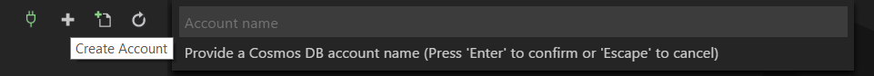
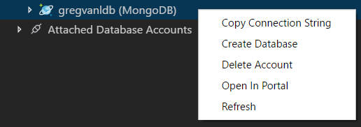

# Working with MongoDB

Visual Studio Code has great support for working with [MongoDB](https://www.mongodb.com/what-is-mongodb) databases. Through the [Azure CosmosDB](https://marketplace.visualstudio.com/items?itemName=ms-azuretools.vscode-cosmosdb) extension, you can create, manage and query MongoDB databases from within VS Code.

## Install the extension

MongoDB support for VS Code is provided by the [Azure Cosmos DB](https://marketplace.visualstudio.com/items?itemName=ms-azuretools.vscode-cosmosdb) extension. To install the Cosmos DB extension, open the Extensions view by pressing `kb(workbench.view.extensions)` and search for 'cosmos' to filter the results. Select the Microsoft **Azure Cosmos DB** extension.

## Connect to MongoDB

Once you've installed the Cosmos DB extension and reloaded VS Code, you'll notice there is a new **Azure** Activity Bar view. Click on the Azure view and you'll see the Cosmos DB Explorer.

To connect to a MongoDB database, expand the **Attached Database Accounts** and click **Attach Database Account**, and choose the **MongoDB** from the Database Account API drop-down list.

Enter a connection string to the database, the default is your local MongoDB server at `mongodb://127.0.0.1:27017`. You can enter any connection string, to local or remote MongoDB servers.

>**Note**: Make sure your MongoDB server (mongod.exe) is running if you are connecting to a local MongoDB server.

Once attached, you can work with the MongoDB server, managing MongoDB Databases, Collections and Documents.

You can **Open Collection** to see the raw JSON Collection or click on individual MongoDB Documents to see just their JSON.

Changes to the Document JSON in the editor will update the Document stored in the Collection. You will see a notification to **Upload** the entity update. To silence the notification, you can choose to **Always upload**, which modifies the `cosmosDB.showSavePrompt` [setting](/docs/getstarted/settings.md) value to false.

## MongoDB Commands

There are MongoDB specific commands available in the VS Code **Command Palette** (`kb(workbench.action.showCommands)`) as well as through Explorer context menus.

## Using Scrapbooks

One of the most powerful features of the VS Code MongoDB integration is **Mongo Scrapbooks**. Scrapbooks let you create, run, and save MongoDB commands from a VS Code editor. Create a new scrapbook from the Cosmos DB Explorer or with the **Cosmos DB: New Mongo Scrapbook** command.

In a scrapbook, you can reference MongoDB entities and commands and you get rich IntelliSense as you type. At the top of the editor and above each line, you will find commands to manage connections and execute your commands. Scrapbooks are extremely useful for saving database operations and queries for later reuse.

## MongoDB on Azure

You can easily host your MongoDB databases in the cloud on Azure with [Cosmos DB](https://docs.microsoft.com/azure/cosmos-db/introduction).

### Azure sign in

The Cosmos DB extension includes the [Azure Account](https://marketplace.visualstudio.com/items?itemName=ms-vscode.azure-account) extension which allows you to sign into Azure. If you don't have an Azure Subscription, you can [sign up today](https://azure.microsoft.com/en-us/free/?b=16.48) for a free 30 day account and get $200 in Azure Credits to try out any combination of Azure services.

To log into Azure, use the **Sign in to Azure** command in the Cosmos DB Explorer or **Azure: Sign In** from the **Command Palette** (`kb(workbench.action.showCommands)`). You will then sign into your account using the Device Login flow. Click on **Copy & Open** to open your default browser.

Paste in the access code and continue the sign in process.

In VS Code, you can sign out of Azure with **Azure: Sign Out** command.

### Create a Cosmos DB account

To create Cosmos DB assets on Azure, you need a Cosmos DB account. Create a Cosmos DB account with the **Create Account** '+' icon on the Explorer toolbar or with the **Cosmos DB: Create Account** command in the **Command Palette** (`kb(workbench.action.showCommands)`).

Follow the prompts to select an Azure Subscription, enter a Cosmos DB account name, choose the API to use (MongoDB), create or reuse an Azure Resource Group, and pick a geographical location. Once the Cosmos DB account is created (it may take several minutes), you will see the Cosmos DB asset in the Explorer. Right click to see the context menu where you can start creating MongoDB databases, open the Azure portal, or copy the connection string for later to use as an environment variable with your application.

To learn more about MongoDB databases on Azure, see [Introduction to Azure Cosmos DB: MongoDB API](https://docs.microsoft.com/azure/cosmos-db/mongodb-introduction). Azure Cosmos DB also lets you host other database types such as SQL, Graph (Gremlin), Apache Cassandra through it's full set of [database APIs](https://docs.microsoft.com/azure/cosmos-db/).

## Next steps

* [Azure Extensions](/docs/azure/extensions.md) - The VS Code Marketplace has hundreds of extensions for Azure and the cloud.
* [Deploying to Azure](/docs/azure/deployment.md) - Learn step-by-step how to deploy your application to Azure.
* [Working with Docker](/docs/azure/docker.md) - Put your application in a Docker container for easy reuse and deployment.
