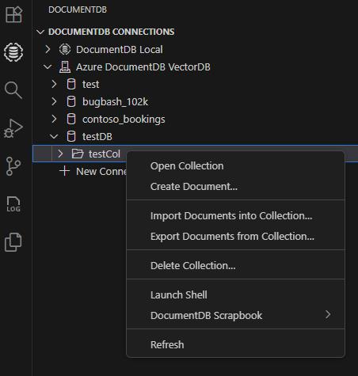

# Working with MongoDB

Visual Studio Code has great support for working with [MongoDB](https://www.mongodb.com/what-is-mongodb) databases, whether your own instance or with [Azure DocumentDB (with MongoDB compatibility)](https://learn.microsoft.com/azure/cosmos-db/mongodb/vcore/introduction). With the [DocumentDB for VS Code](https://marketplace.visualstudio.com/items?itemName=ms-azuretools.vscode-documentdb) extension, you can create, manage, and query MongoDB databases from within VS Code.

## Install the extension

MongoDB support for VS Code is provided by the [DocumentDB for VS Code](https://marketplace.visualstudio.com/items?itemName=ms-azuretools.vscode-documentdb) extension. To install the DocumentDB for VS Code extension, open the Extensions view by pressing `kb(workbench.view.extensions)` and search for 'DocumentDB' to filter the results. Select the **DocumentDB for VS Code** extension.

## Connect to MongoDB

Once you've installed the DocumentDB for VS Code extension, you'll notice there is a new **DocumentDB** logo in the Activity Bar view. Select the DocumentDB logo and you'll see the Explorer.

To connect to a MongoDB-compatible database:

1. Select **Add New Connection** in the DocumentDB Connection view

1. Next, choose to connect with a connection string or use Service Discovery options:

    * Select **Connection String**, and then enter the connection string in the connection string Quick Pick.

        

    * Select **Service Discovery**, choose your provider, and then select **Save & Connect**.

        

>**Note**: If you're not already signed in to Azure in VS Code, you'll be prompted to do so. This is required to use Service Discovery.

Once connected, you can work with the MongoDB server, managing MongoDB Databases, Collections, and Documents.

You can expand databases to view their collections in JSON/ Table/ Tree view with their schema and indexes.

You can also attach a MongoDB shell to the active connection, simply by right-clicking on the connection itself and selecting **Launch Shell**.

>**Note**: Make sure the MongoDB shell (`mongo` or `mongosh`) is [installed](https://docs.mongodb.com/mongodb-shell/install#mdb-shell-install) and is on your path. In the extension's settings, you can choose which shell you are using.

## Using Scrapbook

The **DocumentDB Scrapbook** is one of the most powerful features of this extension. It allows you to write, run, and save MongoDB commands directly within a VS Code editor, helping you prototype queries and scripts

### Create a New Scrapbook
1. In the DocumentDB Explorer, right-click the desired collection.

1. From the menu, click **DocumentDB Scrapbook** and select **New DocumentDB Scrapbook**.

In a scrapbook, you can reference MongoDB entities and commands and you get rich IntelliSense as you type. Scrapbooks are useful for prototyping database operations and queries. Execute selected lines in the scrapbook queries with **Run Command**.

## MongoDB on Azure DocumentDB

You can easily create a managed MongoDB cluster on Azure for **Free** with [Azure DocumentDB](https://aka.ms/documentdb).

## Next steps

* [Index Advisor](https://learn.microsoft.com/azure/documentdb/index-advisor) - Learn how to optimize your MongoDB performance with Index Advisor.
* [Azure Extensions](/docs/azure/extensions.md) - The Visual Studio Marketplace has hundreds of VS Code extensions for Azure and the cloud.
* [Deploying to Azure](/docs/azure/deployment.md) - Learn step-by-step how to deploy your application to Azure.
* [Working with Docker](/docs/azure/docker.md) - Put your application in a Docker container for easy reuse and deployment.
