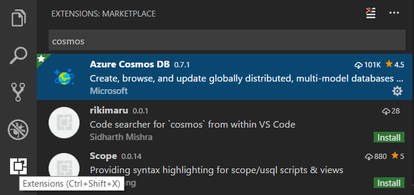
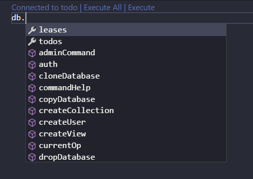

# Working with MongoDB

Visual Studio Code has great support for working with [MongoDB](https://www.mongodb.com/what-is-mongodb) databases, whether your own instance or in [Azure with MongoDB Atlas](https://www.mongodb.com/cloud/atlas/azure-mongodb?utm_campaign=marketplace&utm_source=&utm_medium=marketplace). With the [MongoDB for VS Code](https://marketplace.visualstudio.com/items?itemName=mongodb.mongodb-vscode) extension, you can create, manage, and query MongoDB databases from within VS Code.

## Install the extension

MongoDB support for VS Code is provided by the [MongoDB for VS Code](https://marketplace.visualstudio.com/items?itemName=mongodb.mongodb-vscode) extension. To install the MongoDB for VS Code extension, open the Extensions view by pressing `kb(workbench.view.extensions)` and search for 'MongoDB' to filter the results. Select the **MongoDB for VS Code** extension.

## Connect to MongoDB

Once you've installed the MongoDB for VS Code extension, you'll notice there is a new **MongoDB** Activity Bar view. Select the MongoDB view and you'll see the MongoDB Explorer.

To connect to a MongoDB database:

1. Select **Add Connection** in the MongoDB view

1. Next, choose to connect with a connection string or use advanced connection options:

    * Select **Connect with Connection String**, and then enter the connection string in the connection string Quick Pick.

        The default connetion string for a local MongoDB is `mongodb://127.0.0.1:27017`.

        

    * Select **Advanced Connection Settings**, enter the connection details, and then select **Save & Connect**.

        

>**Note**: Make sure your MongoDB server (mongod.exe) is running if you are connecting to a local MongoDB server.

Once attached, you can work with the MongoDB server, managing MongoDB Databases, Collections, and Documents.

You can expand databases to view their collections with their schema and indexes and you can select individual MongoDB Documents to view their JSON.

You can also attach a MongoDB shell to the active connection, simply by right-clicking on the connection itself.

>**Note**: Make sure the MongoDB shell (`mongo` or `mongosh`) [is installed](https://docs.mongodb.com/mongodb-shell/install#mdb-shell-install) and is on your path. In the extension's settings, you can choose which shell you are using.

## MongoDB Commands

There are MongoDB specific commands available in the VS Code **Command Palette** (`kb(workbench.action.showCommands)`) as well as through Explorer context menus.

## Using Playgrounds

One of the most powerful features of the VS Code MongoDB integration is **Mongo Playgrounds**. Playgrounds let you create, run, and save MongoDB commands from a VS Code editor. Create a new playground with the **MongoDB: Create MongoDB Playground** command.

In a playground, you can reference MongoDB entities and commands and you get rich IntelliSense as you type. Playgrounds are useful for prototyping database operations and queries. Execute selected lines in the playground queries with the **MongoDB: Run Selected Lines From Playground** command.

## MongoDB on Azure

You can easily create a MongoDB cluster on Azure for **Free** with [MongoDB Atlas](https://www.mongodb.com/cloud/atlas/signup?utm_campaign=marketplace&utm_source=signup&utm_medium=marketplace).

Choose **Create a New Cluster** from the dashboard and choose **Azure** as the Cloud Provider. Once the cluster is created, connect to using the connection string provided by **MongoDB Atlas**.

## Next steps

* [Azure Extensions](/docs/azure/extensions.md) - The Visual Studio Marketplace has hundreds of VS Code extensions for Azure and the cloud.
* [Deploying to Azure](/docs/azure/deployment.md) - Learn step-by-step how to deploy your application to Azure.
* [Working with Docker](/docs/azure/docker.md) - Put your application in a Docker container for easy reuse and deployment.
