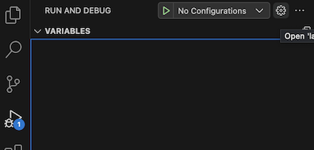

# Debug .NET within a container

## Prerequisites

1. Install the [.NET SDK](https://www.microsoft.com/net/download), which includes support for attaching to the .NET debugger. With .NET SDK 7 or later, you have the option of debugging without a Dockerfile.

1. Install the Visual Studio Code [C# extension](https://marketplace.visualstudio.com/items?itemName=ms-dotnettools.csharp), which includes support for attaching to the .NET debugger with VS Code.

1. macOS users only: Add `/usr/local/share/dotnet/sdk/NuGetFallbackFolder` as a shared folder in your Docker preferences.

    

## Walkthrough

- If needed, create a .NET project with `dotnet new`.
- Open the project folder in VS Code.
- Optionally, set a breakpoint.

## .NET SDK vs. Dockerfile Build

There are two ways to build and debug your app inside a container: using a Dockerfile or, for .NET 7 and later, without a Dockerfile.

### .NET SDK Container Build (Debug without `Dockerfile`)

This option is supported for web projects, and is available when Docker is set to use Linux containers.

1. Press `kb(workbench.action.debug.start)` or choose **Start Debugging** from the **Run** menu. (If you have any existing launch profiles in `launch.json`, you can comment them out with `kb(editor.action.commentLine)`)
1. You're prompted with a list of debuggers. Choose **Docker: Debug in Container**
1. When prompted with options to either build with a `Dockerfile` (**Use a Dockerfile**) or build using the .NET SDK (**Use .NET SDK**), select **Use .NET SDK**.
1. If you have multiple project files in your workspace, choose the project file associated with the project you want to debug. If the build is successful, your .NET app runs in a Docker container, and the web app opens in your browser.

>**Note**: Supported .NET SDK Versions: This feature is available for .NET SDK version 7.0.300 and above by default. For versions between 7.0.100 and 7.0.300, enable it with `dotnet add package Microsoft.NET.Build.Containers`. You can read more about .NET SDK Container build on [Microsoft Learn](https://learn.microsoft.com/en-us/dotnet/core/docker/publish-as-container).


### Debug with `Dockerfile`

1. Wait until a notification appears asking if you want to add required assets for debugging. Select **Yes**:

   

1. Open the Command Palette (`kb(workbench.action.showCommands)`) and enter **Docker: Add Docker Files to Workspace...**. If you have already dockerized your app, you can instead do **Docker: Initialize for Docker debugging**. Follow the prompts.
1. Switch to the **Run and Debug** view (`kb(workbench.view.debug)`).
1. Select the **Docker .NET Core Launch** launch configuration.
1. Start debugging! (`kb(workbench.action.debug.start)`)

## Running and debugging with SSL support

To enable SSL (using the HTTPS protocol), you will need to make a few changes to your configuration.

1. In the Dockerfile, add an `EXPOSE` line to the base section to define a separate port for HTTPS / SSL. Keep a separate `EXPOSE` line with a different port for HTTP requests.

   ```docker
   FROM mcr.microsoft.com/dotnet/aspnet:5.0 AS base
   WORKDIR /app
   EXPOSE 5000
   EXPOSE 5001
   ```

1. In the `.vscode/tasks.json` file, add `configureSsl: true` to the `netCore` section. Also, add an environment variable `ASPNETCORE_URLS` in the `dockerRun` section of the `docker-run: debug` task, with the same port numbers you defined in the Dockerfile:

   ```json
   dockerRun: {
       "env": {
          "ASPNETCORE_URLS": "https://+:5001;http://+:5000"
      }
    }
    netCore: {
        "appProject": "${workspacefolder}/MyProject.csproj",
        "enableDebugging": true,
        "configureSsl": true
    }
   ```

For additional customization options, see the documentation on [Tasks](/docs/containers/reference.md) and [Debug containerized apps](/docs/containers/debug-common.md).

## Saving Project File Preference for .NET SDK Container Build

If you have a workspace folder with multiple .NET project files and you want to exclusively debug one specific project (without being prompted to choose from a list of project files every time you `kb(workbench.action.debug.start)`), you can save your launch profile by following these steps:

1. Follow the steps in [.NET SDK Container Build](#net-sdk-container-build-debug-without-dockerfile) and keep the debug session live.
1. Click on the `gear` icon in your debugger view.

   

1. Select **Docker: Debug in Container**
1. Choose the project file associated with the project you want to debug

Your project preference is saved, and you no longer need to choose a project file on `kb(workbench.action.debug.start)`