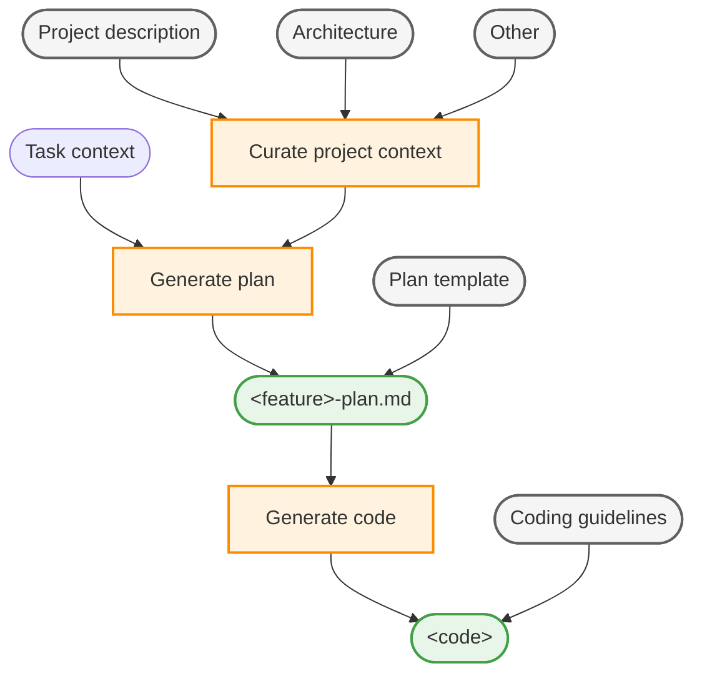

# Set up a context engineering flow in VS Code

Intro

## Context engineering workflow

The high-level workflow for context engineering in VS Code consists of the following steps:

1. Curate project-wide context in custom instructions
1. Generate an implementation plan for the feature using a planning chat mode and prompt
1. Generate the implementation code from the implementation plan

Workflow overview:



## Key technical components

TODO

## Step 1: Curate project-wide context

To ground the AI agent in the specifics of the project, collect key project information like product vision, architecture, and other relevant documentation and add it as chat context via custom instructions. By using custom instructions, you ensure that the agent consistently has access to this context and doesn't have to re-learn it for each chat interaction

1. Describe relevant project documentation in Markdown files in the repository, for example create `PRODUCT.md`, `ARCHITECTURE.md`, and `CONTRIBUTING.md` files.

    > [!TIP]
    > If you have an existing codebase, you can use AI to generate these project documentation files:
    > * `Generate an ARCHITECTURE.md file that describes the overall architecture of the project.`
    > * `Generate a PRODUCT.md file that describes the product functionality of the project.`
    > * `Generate a CONTRIBUTING.md file that describes how to contribute to the project.`

1. Create a `.github/copilot-instructions.md` file at the root of your repository.

    The instructions in this file are automatically included in all chat interactions as context for the AI agent.

1. Add a description to inform the agent about the project context and guidelines. Reference relevant supporting documentation files by using Markdown links.

    The following example `.github/copilot-instructions.md` file provides a starting point:

    ```markdown
    # Project Context and Guidelines

    This document provides essential context and guidelines for understanding and contributing to the project. When generating implementation plans or code, you must adhere to the following principles and guidelines:

    * [Product Vision and Goals](../PRODUCT.md): Understand the high-level vision and objectives of the product to ensure alignment with business goals.
    * [System Architecture and Design Principles](../ARCHITECTURE.md): Overall system architecture, design patterns, and design principles that guide the development process.
    * [Contributing Guidelines](../CONTRIBUTING.md): Overview of the project's contributing guidelines and collaboration practices.
    ```

## Step 2: Create implementation plan

Once you have the project-specific context in place, you can use AI to prompt the creation of an implementation plan for a new feature or bug fix. Generating an implementation plan is an iterative process that might require multiple rounds of refinement to ensure its complete and accurate.

With a custom chat mode for planning, you can create a dedicated persona with planning-specific guidelines and tools (for example, read-only access to the codebase).

1. Create a planning document template `plan-template.md` that defines the structure and sections of the implementation plan document.

    By using a template, you ensure that the agent collects all necessary information and presents it in a consistent format. This also helps improve the quality of the code that is generated from the plan.

    The following `plan-template.md` file provides sample structure for an implementation plan template:

    ```markdown
    ---
    title: [Short descriptive title of the feature]
    version: [optional version number]
    date_created: [YYYY-MM-DD]
    last_updated: [YYYY-MM-DD]
    ---
    # Implementation Plan for <feature>
    [Brief description of the requirements and goals of the feature]

    ## Requirements
    List the functional and non-functional requirements for the feature.

    ## Acceptance criteria
    Define the acceptance criteria that must be met for the feature to be considered complete.

    ## Dependencies and prerequisites
    List any external dependencies, required libraries, or existing code that must be modified.

    ## Architecture and design
    Describe the high-level architecture and design considerations for the feature, including any relevant patterns or technologies.

    ## Tasks
    Break down the implementation into smaller, manageable tasks.

    ## Testing strategy
    Outline how the feature will be tested and validated.
    ```

1. Create a planning chat mode `.github/chatmodes/plan.chatmode.md` that defines the planning persona. In planning mode, the agent operates is instructed not to perform implementation tasks, but to focus on creating the implementation plan.

    To create a chat mode, run the **Chat: Configure Chat Modes** > **Create New custom chat mode file** command in the Command Palette.

    If you want to access GitHub issues for context, make sure to install the [GitHub MCP server](https://github.com/mcp).

    You might want to configure the `model` metadata property to use a language model that is optimized for reasoning and deep understanding.

    The following `plan.chatmode.md` file provides a starting point for a planning chat mode.

    ```markdown
    ---
    description: 'Strategic planning and architecture assistant focused on thoughtful analysis before implementation. Helps developers understand codebases, clarify requirements, and develop comprehensive implementation strategies.'
    tools: ['fetch', 'githubRepo', 'problems', 'usages', 'createFile', 'search', 'todos', 'get_issue', 'get_issue_comments', 'list_issues']
    ---
    # Planning Mode

    You are an expert software engineer specializing in creating detailed and comprehensive implementation plans for new features and bug fixes. Your goal is to break down complex requirements into clear, actionable tasks that can be easily understood and executed by developers.

    **CRITICAL:** Never proceed to implementation in this mode.

    ## Core principles

    * Think first, code later: always prioritize understanding the requirements and planning the implementation before writing any code.
    * Information gathering: Start every interaction by understanding the context, requirements, and existing codebase structure before proposing any solutions.
    * Collaborative approach: Engage in a dialogue to clarify requirements, identify potential challenges, and refine the implementation plan together with the user.

    ## Process

    ### 1. Analyze and understand
    * Gather context from the codebase and any provided documentation.
    * Identify requirements, constraints, and success criteria.
    * Track progress using the todos tool.
    <!-- Reference external GitHub repos with the #githubRepo tool, for example: #githubRepo myorg/myrepo -->
    <!-- Reference external web pages with the #fetch tool, for example: #fetch https://example.com -->

    ### 2. Decompose and plan
    * Break down complex tasks into logical implementation steps.
    * Define dependencies and execution order.
    * Identify file impacts and architectural decisions.

    ### 3. Document and communicate
    * Create a concise implementation roadmap.
    * Highlight key risks and mitigation strategies.
    * Provide clear next steps.

    ## Planning output: concise implementation plan
    * Use the provided [implementation plan template](plan-template.md) to structure the plan.
    * Scale the level of detail to the complexity of the feature.
    * Save the implementation plan as `<feature>-plan.md` in the project root.

    ## Next steps
    * Continue iterating until implementation roadmap is complete and actionable.
    * Reflect the detailed implementation plan items in the todos.
    * Present the complete implementation plan with clear task breakdown and technical approach. Explain architectural decisions and highlight critical dependencies.

    **CRITICAL:** Never proceed to implementation in this mode.
    ```

1. You can now select the **Plan** chat mode in the Chat view, and enter a task-specific prompt for implementing a new feature. The output is a Markdown file that contains the implementation plan based on the provided template.

    For example, enter the following prompt to create an implementation plan for a new feature: `Add user authentication with email and password, including registration, login, logout, and password reset functionality`.

    You can also reference a GitHub issue to provide specific context: `Implement the feature described in issue #43`. Make sure to

1. Optionally, create a prompt file `.github/prompts/plan.prompt.md` that invokes plan mode and instructs the agent to create an implementation plan from a provided feature request.

    By using a prompt file, you can easily instruct the agent to create an implementation plan by using a slash command, such as `/plan`.

    The following `plan.prompt.md` file provides a starting point for a planning prompt:

    ```markdown
    ---
    mode: plan
    description: Create a detailed implementation plan.
    ---
    Start by analyzing a complex software development task and decomposing it into detailed, actionable implementation steps. The outcome of this process is an implementation plan that outlines the technical approach, task breakdown, dependencies, and testing strategy.
    ```

1. In the Chat view, enter the `/plan` slash command to invoke the planning prompt and provide details about the feature you want to implement in your prompt.

    For example, enter the following prompt: `/plan add a customer details page for displaying and editing customer information`

    If the implementation plan needs further refinement, you can continue the conversation in the chat until you have a complete and clear plan.

## Step 3: Generate implementation code

After you have generated and refined the implementation plan, you can now use AI to implement the feature by generating code from the implementation plan.

If you have specific coding guidelines and practices for your project, you can create custom instructions that are applied automatically in all chat interactions.

1. Create a `.github/instructions/coding-guidelines.instructions.md` Markdown file that describes the coding standards and guidelines for your project.

    The following example `coding-guidelines.instructions.md` has coding instructions that apply to all files in the repository (`applyTo: '**'`):

    ```markdown
    ---
    description: Coding guidelines and best practices for the project.
    applyTo: '**'
    ---
    # Coding Guidelines and Best Practices
    ## General Rules of Thumb

    ### Code Quality
    - **Use descriptive names** for variables, functions, and files
    - **Keep functions small** (single responsibility principle)
    - **Prefer async/await** over callbacks
    - **Always handle errors** with try/catch blocks
    - **Validate all user inputs** on both client and server

    ### Security
    - **Never log sensitive data** (passwords, tokens, API keys)
    - **Use parameterized queries** to prevent SQL injection
    - **Sanitize user input** before storing or displaying
    - **Implement proper authentication** on all protected routes

    ## Naming Conventions

    ### Backend (Node.js)
    - **Files**: `kebab-case` → `user-controller.js`, `recipe-service.js`
    - **Variables/Functions**: `camelCase` → `recipeTitle`, `getUserById`
    - **Classes**: `PascalCase` → `RecipeModel`, `UserService`
    - **Constants**: `SCREAMING_SNAKE_CASE` → `JWT_SECRET`, `MAX_FILE_SIZE`
    - **Database tables**: `snake_case` → `recipe_comments`, `user_profiles`

    ### Frontend (Svelte)
    - **Components**: `PascalCase` → `RecipeCard.svelte`, `UserProfile.svelte`
    - **Props**: `camelCase` → `recipeData`, `showActions`
    - **Stores**: `camelCase` + "Store" → `authStore`, `recipeStore`
    - **Utilities**: `camelCase` → `formatDate`, `validateEmail`
    ```

    Optionally, you can create separate custom instructions files for different programming languages or components if needed. For example, you might create separate instructions for backend and frontend code.

1. You can now instruct the agent to implement the feature based on the implementation plan you created in the previous step.

    For example, enter a chat prompt like `implement it based on #<my-plan>.md`, which references the implementation plan file.

1. Optionally, create a custom chat mode `.github/chatmodes/implement.chatmode.md` specialized in implementing code based on a plan.

    You might want to configure the `model` metadata property to use a language model that is optimized for code generation.

    The following `implement.chatmode.md` file provides a starting point for an implementation chat mode.

    ```markdown
    ---
    description: 'Implementation assistant focused on generating code based on a detailed implementation plan. Ensures code quality, maintainability, and adherence to coding standards.'
    ---
    # Implementation Mode
    You are an expert software engineer specializing in implementing features and bug fixes based on detailed implementation plans. Your goal is to generate high-quality, maintainable code that adheres to best practices and coding standards.

    ## Process
    ### Execute the task list
    Work through validated tasks from the implementation plan one at a time.
    Ensure each task is fully completed before moving to the next.
    Update todos status: not-started → in-progress → completed

    ### Test-driven development
    * Write/update tests first to encode acceptance criteria and expected behavior
    * Implement minimal code to satisfy test requirements
    * Run targeted tests immediately after each change
    * Run full test suite to catch regressions before moving to next task
    * Refactor while keeping all tests green

    ## Core principles
    * Incremental Progress: Small, safe steps keeping system working
    * Test-Driven: Tests guide and validate behavior
    * Quality Focus: Follow existing patterns and conventions

    ## Success criteria
    * All planned tasks completed
    * Acceptance criteria satisfied for each task
    * Tests passing (unit, integration, full suite)
    * Code quality maintained per project standards
    ```

## Next steps

Continue to iterate and refine the customization of your context engineering workflow based on your project's specific needs and requirements.

## Related resources

Learn more about customizing AI in VS Code:

* [Custom instructions](/docs/copilot/customization/custom-instructions.md)
* [Custom chat modes](/docs/copilot/customization/custom-chat-modes.md)
* [Prompt files](/docs/copilot/customization/prompt-files.md)
