# Set up a test-driven development flow in VS Code

Test-driven development (TDD) is a software development approach where you write tests before implementing functionality. This creates a tight feedback loop that improves code quality, catches bugs early, and ensures that the code meets your requirements. Visual Studio Code's AI capabilities can enhance your TDD workflow by guiding you through the different phases of writing tests, implementing code, running tests, and optimizing the code.

This guide shows you how to set up an AI-assisted test-driven development workflow in VS Code by using custom agents, handoffs, and custom instructions.

## Test-driven development workflow

The core tenet of test-driven development is to write tests before implementation. The tests define the desired outcomes for the functionality you want to build. By writing tests first, you clarify requirements and identify edge cases to ensure that your code behaves as expected.

TDD follows a three-phase cycle known as [red-green-refactor](https://martinfowler.com/bliki/TestDrivenDevelopment.html) and repeats for each small increment of functionality.

The three phases are:

* **Red phase**: Write a failing test for the functionality you want to develop.

* **Green phase**: Write the minimal application code needed to make the test pass. Focus on making it work, not making it perfect.

* **Refactor phase**: Improve the code quality while keeping all tests passing. Clean up duplication, improve naming, and enhance structure.

```mermaid
graph LR
    Red[🔴 Red<br/>Write failing test] --> Green[🟢 Green<br/>Make test pass]
    Green --> Refactor[🔵 Refactor<br/>Improve code]
    Refactor --> Red

    style Red fill:#ffcccc
    style Green fill:#ccffcc
    style Refactor fill:#cce5ff
```



## TDD implementation overview

You can implement an AI-assisted TDD workflow in VS Code by using custom agents. Each phase of the TDD process (red, green, refactor) has a specific goal and requires different AI behavior. You create a custom agent for each phase that defines the specific role and guidelines for that phase. In this guide, we create a separate _TDD test runner_ agent to execute tests and report results.

With custom agent handoffs, you can then transition from one phase to the next once the AI completes its task. For example, the custom agent for the red phase presents a hand-off action for the green phase agent after writing the failing test.

In addition to custom agents for each phase, you can also set up a _TDD supervisor_ agent that orchestrates the entire TDD workflow. This agent describes the overall TDD process and invokes each phase in sequence through subagents. The supervisor agent can manage the flow of the TDD cycle, ensuring that each phase is completed before moving to the next.

If you have established test conventions, you can use [custom instructions](/docs/copilot/customization/custom-instructions.md) to set up a testing context that guides the AI in generating tests that align with your project's standards.

TODO: add diagram

> [!TIP]
> You can further enhance the TDD workflow by adding a planning phase before starting the cycle. You can use the built-in plan agent or create a custom planning agent that helps clarify requirements and identify edge cases to cover with tests.

<!--

 -->

## Step 1: Set up testing guidelines

If you have established test conventions and practices, create a custom instructions file (`testing.instructions.md`) to help the AI generate tests that align with your project's standards.

**Why this helps**: Without explicit test conventions, AI might generate tests that don't match your project's style, use inconsistent patterns, or miss important test scenarios.

To set up testing guidelines:

1. Run the **Chat: Create Instructions File** command in the Command Palette to create a new instructions file in your workspace.

    * Select `.github/instructions` to create the instructions file in your workspace.
    * Enter "testing" as the name for the instructions file.

    > [!NOTE]
    > By using a `*.instructions.md` file instead of the `copilot.instructions.md` file, you can selectively apply these testing guidelines only to test files in your project instead of including them in all AI interactions.

1. Update the instructions `applyTo` metadata to automatically apply them to test files. Also set the `description` metadata to indicate that these instructions provide testing context.

    The following example updates the `applyTo` field to target all files in the `tests/` directory:

    ```markdown
    ---
    description: 'Testing guidelines and context for generating tests.'
    applyTo: tests/**
    ---
    ```

1. Add your project's testing guidelines to the body of the instructions file.

    The following example provides a starting point for test conventions:

    ```markdown
    ---
    description: 'Testing guidelines and context for generating tests.'
    applyTo: tests/**
    ---
    # [Project Name] Testing Guidelines

    ## Test conventions
    * Write clear, focused tests that verify one behavior at a time
    * Use descriptive test names that explain what is being tested and the expected outcome
    * Follow Arrange-Act-Assert (AAA) pattern: set up test data, execute the code under test, verify results
    * Keep tests independent - each test should run in isolation without depending on other tests
    * Start with the simplest test case, then add edge cases and error conditions
    * Tests should fail for the right reason - verify they catch the bugs they're meant to catch
    * Mock external dependencies to keep tests fast and reliable
    ```

    > [!TIP]
    > You can create an optional test structure template that defines sections and patterns for different test types (for example, `test-template.md`). Reference this template in your instructions file so the AI uses it when generating tests.

## Step 2: Create supervisor custom agent

Create a "TDD-supervisor" custom agent that orchestrates the entire TDD workflow. This agent describes the overall TDD process and invokes each phase in sequence through subagents.

To create the `.github/agents/TDD-supervisor.agent.md` supervisor [custom agent](/docs/copilot/customization/custom-agents.md):

1. Run the **Chat: New Custom Agent** command in the Command Palette.

    * Select `.github/agents` to create the custom agent definition in your workspace.
    * Enter "TDD-supervisor" as the name for the custom agent.

1. Update the custom agent definition to describe the TDD workflow and run each phase through subagents.

    The following `TDD-supervisor.agent.md` file provides a starting point for the supervisor agent.

    ```markdown
    ---
    name: TDD Supervisor
    description: Orchestrate full TDD cycle from request to implementation
    tools: ['agent']
    ---

    Your goal is take high-level user instructions (feature, spec, bug fix) to orchestrate the TDD cycle:

    1. Invoke "TDD Red" agent to write failing tests
    2. Invoke "TDD Green" agent to write minimal implementation
    3. Invoke "TDD Test Runner" agent to verify tests pass
    4. If tests fail, ask user to decide whether to revise or abort
    5. If tests pass, optionally invoke "TDD Refactor" agent to improve code quality
    6. Output a summary of changes ready for review/commit

    Use the #tool:agent/runSubagent tool with the exact agent names above.
    ```

## Step 3: Create red phase custom agent

Next, create a "TDD-red" custom agent that focuses on the red phase of TDD. This custom agent is only responsible for writing failing tests based on the provided requirements and should not implement any application code. When completed, this agent hands off to the green phase custom agent.

**Why this helps**: Without a focused mode, the AI might mix implementation suggestions with test creation, and miss the core TDD principle of writing tests first.

To create the `.github/agents/TDD-red.agent.md` red phase [custom agent](/docs/copilot/customization/custom-agents.md):

1. Run the **Chat: New Custom Agent** command in the Command Palette.

    * Select `.github/agents` to create the custom agent definition in your workspace.
    * Enter "TDD-red" as the name for the custom agent.

1. Update the custom agent definition to describe the guidelines and rules for the red phase, and to specify a handoff to the green phase custom agent.

    The following `TDD-red.agent.md` file provides a starting point for the red phase.

    ```markdown
    ---
    name: TDD Red
    description: TDD phase for writing FAILING tests
    infer: true
    tools: ['read', 'edit', 'search']
    handoffs:
    - label: TDD Green
        agent: TDD Green
        prompt: Implement minimal implementation
    ---
    You are a test-writer: when given a function name, spec, or requirements, output a complete test file (or test function) that asserts the expected behavior, which must fail when run against the current codebase. Use the project’s style/conventions. Do not write implementation, only tests. Output exactly the test code.
    ```

## Step 4: Create green phase custom agent

Now, create a "TDD-green" custom agent that focuses on the green phase of TDD. This custom agent is only responsible for writing the minimal implementation code to make the tests pass, without modifying the test code. To run the tests, this agent invokes the "TDD Test Runner" custom agent. When completed, this agent hands off to the refactor phase custom agent.

To create the `.github/agents/TDD-green.agent.md` green phase [custom agent](/docs/copilot/customization/custom-agents.md):

1. Run the **Chat: New Custom Agent** command in the Command Palette.

    * Select `.github/agents` to create the custom agent definition in your workspace.
    * Enter "TDD-green" as the name for the custom agent.

1. Update the custom agent definition to describe the guidelines and rules for the green phase, and to specify a handoff to the test runner custom agent.

    The following `TDD-green.agent.md` file provides a starting point:

    ```markdown
    ---
    name: TDD Green
    description: TDD phase for writing MINIMAL implementation to pass tests
    infer: true
    tools: ['search', 'edit', 'execute/runTests', 'agent']
    handoffs:
    - label: TDD Refactor
        agent: TDD Refactor
        prompt: Refactor the implementation
    ---

    You are a code-implementer. Given a failing test case and context (existing codebase or module), write the minimal code change needed so that the test passes - no extra features. Output a code diff or new file content accordingly. Do not write tests, only implementation.

    After implementing changes, invoke "TDD Test Runner" agent using #tool:agent/runSubagent to verify the tests pass.
    ```

## Step 5: Create test runner custom agent

Create a "TDD Test Runner" custom agent that executes the test suite and reports the results. This agent is invoked by the green phase agent to verify that the implementation code makes the tests pass.

To create the `.github/agents/TDD-Test-Runner.agent.md` test runner [custom agent](/docs/copilot/customization/custom-agents.md):

1. Run the **Chat: New Custom Agent** command in the Command Palette.

    * Select `.github/agents` to create the custom agent definition in your workspace.
    * Enter "TDD-Test-Runner" as the name for the custom agent.

1. Update the custom agent definition to describe the guidelines and rules for running tests.

    The following `TDD-Test-Runner.agent.md` file provides a starting point:

    ```markdown
    ---
    name: TDD Test Runner
    description: Run tests and report pass/fail results
    infer: true
    tools: ['execute/runTests', 'search']
    ---
    You are test-runner. Given the codebase (after changes) and test suite, run via available test harness and output a summary: which tests passed/failed, error messages or tracebacks if failing. Use standard format (e.g. JSON, or markdown table).
    ```

## Step 6: Create refactor phase chat mode

Finally, create a "TDD-refactor" custom agent that focuses on the refactor phase of TDD to improve code quality while keeping all tests passing. This agent is responsible for cleaning up code, removing duplication, improving naming, and enhancing structure without changing functionality. To run the tests, this agent invokes the "TDD Test Runner" custom agent.

To create the `.github/agents/TDD-refactor.agent.md` refactor phase [custom chat agent](/docs/copilot/customization/custom-agents.md):

1. Run the **Chat: New Custom Agent** command in the Command Palette.

    * Select `.github/agents` to create the custom agent definition in your workspace.
    * Enter "TDD-refactor" as the name for the custom agent.

1. Update the custom agent definition to describe the guidelines and rules for the refactor phase.

    The following `TDD-refactor.agent.md` file provides a starting point:

    ```markdown
    ---
    name: TDD Refactor
    description: Refactor code while maintaining passing tests
    tools: ['search', 'edit', 'read', 'execute/runTests', 'agent']
    infer: true
    ---
    You are refactor-assistant. Given code that passes all tests, examine it and suggest or apply refactoring to improve readability/structure/DRYness, without changing behavior. Output a code diff (or list of refactoring suggestions), no new functionality, no breaking changes.

    After refactoring, invoke "TDD Test Runner" agent using #tool:agent/runSubagent to ensure all tests still pass and behavior is preserved.
    ```

## Use the TDD workflow to implement features

Now that the TDD custom agents are set up, you can use them to implement features in your project using the TDD workflow.

1. Open the Chat view and select the **TDD Supervisor** agent from the agents dropdown.

1. Provide a prompt that describes the feature or behavior you want to implement.

    For example:

    ```text
    Implement user registration with email validation and password requirements.
    ```

1. Follow as the TDD supervisor agent orchestrates the workflow through the different phases of the TDD cycle.

## Troubleshooting and best practices

### Common TDD pitfalls with AI

**Skipping the red phase**: AI might suggest implementing code before writing tests.

**Over-implementation**: AI might generate more code than needed to pass the current test. Review implementations critically and remove unnecessary complexity.

**Testing implementation details**: Tests should verify behavior, not implementation. If refactoring requires changing tests, they might be too tightly coupled to implementation details.

**Incomplete test coverage**: AI might miss edge cases or error conditions. Review generated tests critically and ask for additional tests covering boundary conditions, error scenarios, and edge cases.

### Best practices for TDD with AI

**Validate test quality**: After AI generates a test, review it to ensure it fails for the right reason. Run the test before implementing to verify it catches the missing functionality.

**Maintain incremental progress**: Take small steps through the TDD cycle. Write one test, implement minimal code, refactor, then repeat. Small iterations prevent large mistakes and keep the codebase working.

**Run tests frequently**: Execute tests immediately after changes. Don't accumulate multiple changes before testing. Frequent test runs provide rapid feedback and catch issues early.

**Use test coverage as a guide**: High coverage doesn't guarantee quality, but low coverage indicates untested behavior. Ask AI to suggest tests for uncovered code paths.

**Maintain test independence**: Tests should run in any order without affecting each other. If tests depend on execution order or shared state, refactor to make them independent.

**Update test context as needed**: As your project evolves, update the testing guidelines in your instructions file to reflect new conventions, frameworks, or practices.

## Related resources

Learn more about testing and AI customization in VS Code:

* [Testing with AI](/docs/copilot/guides/test-with-copilot.md)
* [Custom agents](/docs/copilot/customization/custom-agents.md)
* [Custom instructions](/docs/copilot/customization/custom-instructions.md)
* [Running tests with VS Code](/docs/debugtest/testing.md)
