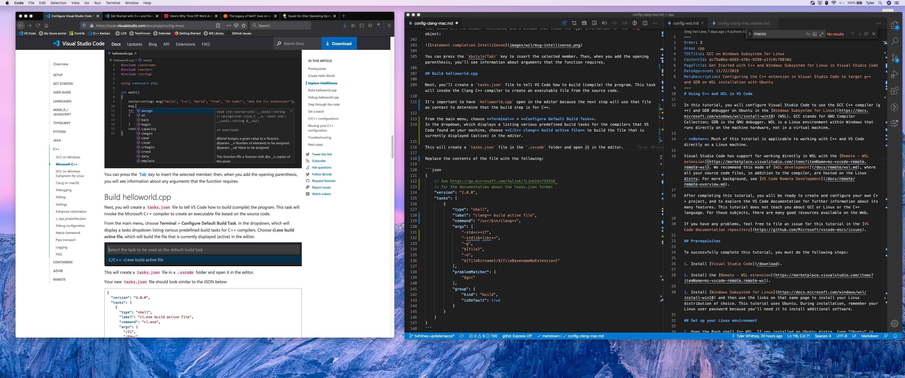

# Using Clang in Visual Studio Code

In this tutorial, you configure Visual Studio Code on macOS to use the Clang/LLVM compiler and debugger.

After configuring VS Code, you will compile and debug a simple C++ program in VS Code. This tutorial does not teach you about Clang or the C++ language. For those subjects, there are many good resources available on the Web.

If you have any trouble, feel free to file an issue for this tutorial in the [VS Code documentation repository](https://github.com/microsoft/vscode-docs/issues).

## Prerequisites

To successfully complete this tutorial, you must do the following:

1. Install [Visual Studio Code on macOS](/docs/setup/mac.md).

1. Install the [C++ extension for VS Code](https://marketplace.visualstudio.com/items?itemName=ms-vscode.cpptools). You can install the C/C++ extension by searching for 'c++' in the Extensions view (`kb(workbench.view.extensions)`).

    

### Ensure Clang is installed

Clang may already be installed on your Mac. To verify that it is, open a macOS Terminal window and enter the following command:

```bash
clang --version
```

1. If Clang isn't installed, enter the following command to install the command line developer tools:

```bash
xcode-select --install
```

## Create Hello World

From the macOS Terminal, create an empty folder called `projects` where you can store all your VS Code projects, then create a subfolder called `helloworld`, navigate into it, and open VS Code in that folder by entering the following commands:

```cmd
mkdir projects
cd projects
mkdir helloworld
cd helloworld
code .
```

The `code .` command opens VS Code in the current working folder, which becomes your "workspace". As you go through the tutorial, you will create three files in a `.vscode` folder in the workspace:

- `tasks.json` (compiler build settings)
- `launch.json` (debugger settings)
- `c_cpp_properties.json` (compiler path and IntelliSense settings)

### Add hello world source code file

In the File Explorer title bar, select **New File** and name the file `helloworld.cpp`.


Paste in the following source code:

```cpp
#include <iostream>
#include <vector>
#include <string>

using namespace std;

int main()
{
    vector<string> msg {"Hello", "C++", "World", "from", "VS Code", "and the C++ extension!"};

    for (const string& word : msg)
    {
        cout << word << " ";
    }
    cout << endl;
}
```

Now press `kb(workbench.action.files.save)` to save the file. Notice that your files are listed in the **File Explorer** view (`kb(workbench.view.explorer)`) in the side bar of VS Code:


You can also enable [Auto Save](/docs/editor/codebasics.md#saveauto-save) to automatically save your file changes, by checking **Auto Save** in the main **File** menu.

The Activity Bar on the edge of Visual Studio Code lets you open different views such as **Search**, **Source Control**, and **Run**. You'll look at the **Run** view later in this tutorial. You can find out more about the other views in the VS Code [User Interface documentation](/docs/getstarted/userinterface.md).

>**Note**: When you save or open a C++ file, you may see a notification from the C/C++ extension about the availability of an Insiders version, which lets you test new features and fixes. You can ignore this notification by selecting the `X` (**Clear Notification**).

## Explore IntelliSense

In the `helloworld.cpp` file, hover over `vector` or `string` to see type information. After the declaration of the `msg` variable, start typing `msg.` as you would when calling a member function. You should immediately see a completion list that shows all the member functions, and a window that shows the type information for the `msg` object:


You can press the `kbstyle(Tab)` key to insert the selected member. Then, when you add the opening parenthesis, you'll see information about arguments that the function requires.

## Build helloworld.cpp

Next, you'll create a `tasks.json` file to tell VS Code how to build (compile) the program. This task will invoke the Clang C++ compiler to create an executable file from the source code.

It's important to have `helloworld.cpp` open in the editor because the next step uses the active file in the editor as context to create the build task in the next step.

From the main menu, choose **Terminal** > **Configure Default Build Task**.
A dropdown will appear listing various predefined build tasks for the compilers that VS Code found on your machine. Choose **C/C++ clang++ build active file** to build the file that is currently displayed (active) in the editor.



This will create a `tasks.json` file in the `.vscode` folder and open it in the editor.

Replace the contents of that file with the following:

```json
{
    // See https://go.microsoft.com/fwlink/?LinkId=733558
    // for the documentation about the tasks.json format
    "version": "2.0.0",
    "tasks": [
        {
            "type": "shell",
            "label": "clang++ build active file",
            "command": "/usr/bin/clang++",
            "args": [
                "-std=c++17",
                "-stdlib=libc++",
                "-g",
                "${file}",
                "-o",
                "${fileDirname}/${fileBasenameNoExtension}"
            ],
            "options": {
                "cwd": "${workspaceFolder}"
            },
            "problemMatcher": [
                "$gcc"
            ],
            "group": {
                "kind": "build",
                "isDefault": true
            }
        }
    ]
}
```

The JSON above differs from the default template JSON in the following ways:

- `"args"` is updated to compile with C++17 because our `helloworld.cpp` uses C++17 language features.
- Changes the current working directory directive (`"cwd"`) to the folder where `helloworld.cpp` is.

The `command` setting specifies the program to run. In this case, `"clang++"` is the driver that causes the Clang compiler to expect C++ code and link against the C++ standard library.

The `args` array specifies the command-line arguments that will be passed to clang++. These arguments must be specified in the order expected by the compiler.

This task tells the C++ compiler to compile the active file (`${file}`), and create an output file (`-o` switch) in the current directory (`${fileDirname}`) with the same name as the active file (`${fileBasenameNoExtension}`), resulting in `helloworld` for our example.

The `label` value is what you will see in the tasks list. Name this whatever you like.

The `problemMatcher` value selects the output parser to use for finding errors and warnings in the compiler output. For clang++, you'll get the best results if you use the `$gcc` problem matcher.

The `"isDefault": true` value in the `group` object specifies that this task will be run when you press `kb(workbench.action.tasks.build)`. This property is for convenience only; if you set it to `false`, you can still build from the Terminal menu with **Terminal > Run Build Task**.

>**Note**: You can learn more about `tasks.json` variables in the [variables reference](/docs/editor/variables-reference.md).

### Running the build

1. Go back to `helloworld.cpp`. Because we want to build `helloworld.cpp` it is important that this file be the one that is active in the editor for the next step.
1. To run the build task that you defined in tasks.json, press `kb(workbench.action.tasks.build)` or from the **Terminal** main menu choose **Run Build Task**.
1. When the task starts, you should see the Integrated Terminal window appear below the code editor. After the task completes, the terminal shows output from the compiler that indicates whether the build succeeded or failed. For a successful Clang build, the output looks something like this:

   

1. Create a new terminal using the **+** button and you'll have a new terminal with the `helloworld` folder as the working directory. Run `ls` and you should now see the executable `helloworld` along with the debugging file (`helloworld.dSYM`).

    

1. You can run `helloworld` in the terminal by typing `./helloworld`.

### Modifying tasks.json

You can modify your `tasks.json` to build multiple C++ files by using an argument like `"${workspaceFolder}/*.cpp"` instead of `${file}`. This will build all `.cpp` files in your current folder. You can also modify the output filename by replacing `"${fileDirname}/${fileBasenameNoExtension}"` with a hard-coded filename (for example `"${workspaceFolder}/myProgram.out"`).

## Debug helloworld.cpp

Next, you'll create a `launch.json` file to configure VS Code to launch the LLDB debugger when you press `kb(workbench.action.debug.start)` to debug the program.

From the main menu, choose **Run** > **Add Configuration...** and then choose **C++ (GDB/LLDB)**.

You'll then see a dropdown for predefined debugging configurations. Choose **clang++ build and debug active file**.


VS Code creates a `launch.json` file, opens it in the editor, and builds and runs 'helloworld'. Your `launch.json` file will look something like this:

```json
{
    // Use IntelliSense to learn about possible attributes.
    // Hover to view descriptions of existing attributes.
    // For more information, visit: https://go.microsoft.com/fwlink/?linkid=830387
    "version": "0.2.0",
    "configurations": [
        {
            "name": "clang++ - Build and debug active file",
            "type": "cppdbg",
            "request": "launch",
            "program": "${fileDirname}/${fileBasenameNoExtension}",
            "args": [],
            "stopAtEntry": true,
            "cwd": "${workspaceFolder}",
            "environment": [],
            "externalConsole": false,
            "MIMode": "lldb",
            "preLaunchTask": "clang++ build active file"
        }
    ]
}
```

The `program` setting specifies the program you want to debug. Here it is set to the active file folder `${fileDirname}` and active filename `${fileBasenameNoExtension}`, which if `helloworld.cpp` is the active file will be `helloworld`.

By default, the C++ extension won't add any breakpoints to your source code and the `stopAtEntry` value is set to `false`.

Change the `stopAtEntry` value to `true` to cause the debugger to stop on the `main` method when you start debugging.

Ensure that the `preLaunchTask` value matches the `label` of the build task in the `tasks.json` file.

### Start a debugging session

1. Go back to `helloworld.cpp` so that it is the active file in the editor. This is important because VS Code uses the active file to determine what you want to debug.
2. Press `kb(workbench.action.debug.start)` or from the main menu choose **Run > Start Debugging**. Before you start stepping through the source code, let's take a moment to notice several changes in the user interface:

- The Integrated Terminal appears at the bottom of the source code editor. In the **Debug Output** tab, you see output that indicates the debugger is up and running.
- The editor highlights the first statement in the `main` method. This is a breakpoint that the C++ extension automatically sets for you:

   

- The Run view on the left shows debugging information. You'll see an example later in the tutorial.

- At the top of the code editor, a debugging control panel appears. You can move this around the screen by grabbing the dots on the left side.

## Step through the code

Now you're ready to start stepping through the code.

1. Click or press the **Step over** icon in the debugging control panel so that the `for (const string& word : msg)` statement is highlighted.

    

    The **Step Over** command skips over all the internal function calls within the `vector` and `string` classes that are invoked when the `msg` variable is created and initialized. Notice the change in the **Variables** window. The contents of `msg` are visible because that statement has completed.

1. Press **Step over** again to advance to the next statement (skipping over all the internal code that is executed to initialize the loop). Now, the **Variables** window shows information about the loop variable.

1. Press **Step over** again to execute the `cout` statement. **Note** As of the March 2019 version of the extension, no output will appear in the DEBUG CONSOLE until the last `cout` completes.

## Set a watch

You might want to keep track of the value of a variable as your program executes. You can do this by setting a **watch** on the variable.

1. Place the insertion point inside the loop. In the **Watch** window, click the plus sign and in the text box, type `word`, which is the name of the loop variable. Now view the **Watch** window as you step through the loop.

   

1. To quickly view the value of any variable while execution is paused, you can hover over it with the mouse pointer.

   

## C/C++ configuration

For more control over the C/C++ extension, create a `c_cpp_properties.json` file, which allows you to change settings such as the path to the compiler, include paths, which C++ standard to compile against (such as C++17), and more.

View the C/C++ configuration UI by running the command **C/C++: Edit Configurations (UI)** from the Command Palette (`kb(workbench.action.showCommands)`).


This opens the **C/C++ Configurations** page.


Visual Studio Code places these settings in `.vscode/c_cpp_properties.json`. If you open that file directly, it should look something like this:

```json
{
    "configurations": [
        {
            "name": "Mac",
            "includePath": [
                "${workspaceFolder}/**"
            ],
            "defines": [],
            "macFrameworkPath": [
                "/Library/Developer/CommandLineTools/SDKs/MacOSX.sdk/System/Library/Frameworks"
            ],
            "compilerPath": "/usr/bin/clang",
            "cStandard": "c11",
            "cppStandard": "c++17",
            "intelliSenseMode": "clang-x64"
        }
    ],
    "version": 4
}
```

You only need to modify the **Include path** setting if your program includes header files that are not in your workspace or the standard library path.

### Compiler path

`compilerPath` is an important configuration setting. The extension uses it to infer the path to the C++ standard library header files. When the extension knows where to find those files, it can provide useful features like smart completions and **Go to Definition** navigation.

The C/C++ extension attempts to populate `compilerPath` with the default compiler location based on what it finds on your system. The `compilerPath` search order is:

* Your PATH for the names of known compilers. The order the compilers appear in the list depends on your PATH.
* Then hard-coded XCode paths are searched, such as `/Applications/Xcode.app/Contents/Developer/Toolchains/XcodeDefault.xctoolchain/usr/bin/`

### Mac framework path

On the C/C++ Configuration screen, scroll down and expand **Advanced Settings** and ensure that **Mac framework path** points to the system header files. For example: `/Library/Developer/CommandLineTools/SDKs/MacOSX.sdk/System/Library/Frameworks`

## Reusing your C++ configuration

VS Code is now configured to use Clang on macOS. The configuration applies to the current workspace. To reuse the configuration, just copy the JSON files to a `.vscode` folder in a new project folder (workspace) and change the names of the source file(s) and executable as needed.

## Troubleshooting

### Compiler and linking errors

The most common cause of errors (such as `undefined _main`, or `attempting to link with file built for unknown-unsupported file format`, and so on) occurs when `helloworld.cpp` is not the active file when you start a build or start debugging. This is because the compiler is trying to compile something that isn't source code, like your `launch.json`, `tasks.json`, or `c_cpp_properties.json` file.

If you see build errors mentioning "C++11 extensions", you may not have updated your `tasks.json` build task to use the clang++ argument `--std=c++17`. By default, clang++ uses the C++98 standard, which doesn't support the initialization used in `helloworld.cpp`. Make sure to replace the entire contents of your `tasks.json` file with the code block provided in the [Build helloworld.cpp](#build-helloworldcpp) section.

### Terminal won't launch For input

On macOS Catalina and onwards, you might have a issue where you are unable to enter input, even after setting `"externalConsole": true`. A terminal window opens, but it does not actually allow you type any input.

The issue is currently tracked [#5079](https://github.com/microsoft/vscode-cpptools/issues/5079).

The workaround is to have VS Code launch the terminal once. You can do this by adding and running this task in your `tasks.json`:

```json
{
    "label": "Open Terminal",
    "type": "shell",
    "command": "osascript -e 'tell application \"Terminal\"\ndo script \"echo hello\"\nend tell'",
    "problemMatcher": []
}
```

You can run this specific task using **Terminal** > **Run Task...** and select **Open Terminal**.

Once you accept the permission request, then the external console should appear when you debug.

## Next steps

- Explore the [VS Code User Guide](/docs/editor/codebasics.md).
- Review the [Overview of the C++ extension](/docs/languages/cpp.md)
- Create a new workspace, copy your .json files to it, adjust the necessary settings for the new workspace path, program name, and so on, and start coding!
