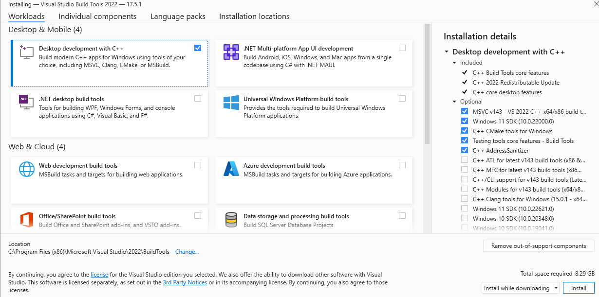

# Configure VS Code for Microsoft C++

In this tutorial, you configure Visual Studio Code to use the Microsoft Visual C++ compiler and debugger on Windows.

After configuring VS Code, you will compile and debug a simple Hello World program in VS Code. This tutorial does not teach you details about the Microsoft C++ toolset or the C++ language. For those subjects, there are many good resources available on the Web.

If you have any problems, feel free to file an issue for this tutorial in the [VS Code documentation repository](https://github.com/microsoft/vscode-docs/issues).

## Prerequisites

To successfully complete this tutorial, you must do the following:

1. Install [Visual Studio Code](/download).

1. Install the [C/C++ extension for VS Code](https://marketplace.visualstudio.com/items?itemName=ms-vscode.cpptools). You can install the C/C++ extension by searching for 'c++' in the Extensions view (`kb(workbench.view.extensions)`).

    

1. Install the Microsoft Visual C++ (MSVC) compiler toolset.

   If you have a recent version of Visual Studio, open the Visual Studio Installer from the Windows Start menu and verify that the C++ workload is checked. If it's not installed, then check the box and select the **Modify** button in the installer.

   You can also install the **Desktop development with C++** workload without a full Visual Studio IDE installation. From the Visual Studio [Downloads](https://visualstudio.microsoft.com/downloads/#remote-tools-for-visual-studio-2022) page, scroll down until you see **Tools for Visual Studio** under the **All Downloads** section and select the download for **Build Tools for Visual Studio 2022**.

   

   This will launch the Visual Studio Installer, which will bring up a dialog showing the available Visual Studio Build Tools workloads. Check the **Desktop development with C++** workload and select **Install**.

   

>**Note**: You can use the C++ toolset from Visual Studio Build Tools along with Visual Studio Code to compile, build, and verify any C++ codebase as long as you also have a valid Visual Studio license (either Community, Pro, or Enterprise) that you are actively using to develop that C++ codebase.

### Check your Microsoft Visual C++ installation

To use MSVC from a command line or VS Code, you must run from a **Developer Command Prompt for Visual Studio**. An ordinary shell such as PowerShell, Bash, or the Windows command prompt does not have the necessary path environment variables set.

To open the Developer Command Prompt for VS, start typing 'developer' in the Windows Start menu, and you should see it appear in the list of suggestions. The exact name depends on which version of Visual Studio or the Visual Studio Build Tools you have installed. Select the item to open the prompt.


You can test that you have the C++ compiler, `cl.exe`, installed correctly by typing 'cl' and you should see a copyright message with the version and basic usage description.


If the Developer Command Prompt is using the BuildTools location as the starting directory (you wouldn't want to put projects there), navigate to your user folder (`C:\users\{your username}\`) before you start creating new projects.

>**Note**: If for some reason you can't run VS Code from a **Developer Command Prompt**, you can find a workaround for building C++ projects with VS Code in [Run VS Code outside a Developer Command Prompt](#run-vs-code-outside-the-developer-command-prompt).

## Create Hello World

From the Developer Command Prompt, create an empty folder called "projects" where you can store all your VS Code projects, then create a subfolder called "helloworld", navigate into it, and open VS Code (`code`) in that folder (`.`) by entering the following commands:

```bat
mkdir projects
cd projects
mkdir helloworld
cd helloworld
code .
```

The "code ." command opens VS Code in the current working folder, which becomes your "workspace". As you go through the tutorial, you will see three files created in a `.vscode` folder in the workspace:

- `tasks.json` (build instructions)
- `launch.json` (debugger settings)
- `c_cpp_properties.json` (compiler path and IntelliSense settings)

### Add a source code file

In the File Explorer title bar, select the **New File** button and name the file `helloworld.cpp`.


### Add hello world source code

Now paste in this source code:

```cpp
#include <iostream>
#include <vector>
#include <string>

using namespace std;

int main()
{
    vector<string> msg {"Hello", "C++", "World", "from", "VS Code", "and the C++ extension!"};

    for (const string& word : msg)
    {
        cout << word << " ";
    }
    cout << endl;
}
```

Now press `kb(workbench.action.files.save)` to save the file. Notice how the file you just added appears in the **File Explorer** view (`kb(workbench.view.explorer)`) in the side bar of VS Code:


You can also enable [Auto Save](/docs/editor/codebasics.md#save-auto-save) to automatically save your file changes, by checking **Auto Save** in the main **File** menu.

The Activity Bar on the far left lets you open different views such as **Search**, **Source Control**, and **Run**. You'll look at the **Run** view later in this tutorial. You can find out more about the other views in the VS Code [User Interface documentation](/docs/getstarted/userinterface.md).

>**Note**: When you save or open a C++ file, you may see a notification from the C/C++ extension about the availability of an Insiders version, which lets you test new features and fixes. You can ignore this notification by selecting the `X` (**Clear Notification**).

## Explore IntelliSense

In your new `helloworld.cpp` file, hover over `vector` or `string` to see type information. After the declaration of the `msg` variable, start typing `msg.` as you would when calling a member function. You should immediately see a completion list that shows all the member functions, and a window that shows the type information for the `msg` object:


You can press the `kbstyle(Tab)` key to insert the selected member; then, when you add the opening parenthesis, you will see information about any arguments that the function requires.

## Run helloworld.cpp

Remember, the C++ extension uses the C++ compiler you have installed on your machine to build your program. Make sure you have a C++ compiler installed before attempting to run and debug `helloworld.cpp` in VS Code.

1. Open `helloworld.cpp` so that it is the active file.
2. Press the play button in the top right corner of the editor.

   

3. Choose **C/C++: cl.exe build and debug active file** from the list of detected compilers on your system.

   

You'll only be asked to choose a compiler the first time you run `helloworld.cpp`. This compiler will be set as the "default" compiler in `tasks.json` file.

4. After the build succeeds, your program's output will appear in the integrated **Terminal**.

    

If you get an error trying to build and debug with cl.exe, make sure you have [started VS Code from the Developer Command Prompt for Visual Studio](#check-your-microsoft-visual-c-installation) using the `code .` shortcut.


The first time you run your program, the C++ extension creates `tasks.json`, which you'll find in your project's `.vscode` folder. `tasks.json` stores build configurations.

Your new `tasks.json` file should look similar to the JSON below:

```json
{
"version": "2.0.0",
"tasks": [
    {
        "type": "shell",
        "label": "C/C++: cl.exe build active file",
        "command": "cl.exe",
        "args": [
            "/Zi",
            "/EHsc",
            "/Fe:",
            "${fileDirname}\\${fileBasenameNoExtension}.exe",
            "${file}"
        ],
        "problemMatcher": [
            "$msCompile"
        ],
        "group": {
            "kind": "build",
            "isDefault": true
        },
        "detail": "Task generated by Debugger."
    }
]
}
```

>**Note**: You can learn more about `tasks.json` variables in the [variables reference](/docs/editor/variables-reference.md).

The `command` setting specifies the program to run; in this case that is "cl.exe". The `args` array specifies the command-line arguments that will be passed to cl.exe. These arguments must be specified in the order expected by the compiler.

This task tells the C++ compiler to take the active file (`${file}`), compile it, and create an executable file (`/Fe:` switch) in the current directory (`${fileDirname}`) with the same name as the active file but with the `.exe` extension (`${fileBasenameNoExtension}.exe`), resulting in `helloworld.exe` for our example.

The `label` value is what you will see in the tasks list; you can name this whatever you like.

The `detail` value is what you will as the description of the task in the tasks list. It's highly recommended to rename this value to differentiate it from similar tasks.

The `problemMatcher` value selects the output parser to use for finding errors and warnings in the compiler output. For cl.exe, you'll get the best results if you use the `$msCompile` problem matcher.

From now on, the play button will read from `tasks.json` to figure out how to build and run your program. You can define multiple build tasks in `tasks.json`, and whichever task is marked as the default will be used by the play button. In case you need to change the default compiler, you can run **Tasks: Configure default build task**. Alternatively you can modify the `tasks.json` file and remove the default by replacing this segment:

```json
    "group": {
        "kind": "build",
        "isDefault": true
    },
```

with this:

```json
    "group": "build",
```

### Modifying tasks.json

You can modify your `tasks.json` to build multiple C++ files by using an argument like `"${workspaceFolder}/*.cpp"` instead of `"${file}"`.This will build all `.cpp` files in your current folder. You can also modify the output filename by replacing `"${fileDirname}\\${fileBasenameNoExtension}.exe"` with a hard-coded filename (for example `"${workspaceFolder}\\myProgram.exe"`).

## Debug helloworld.cpp

To debug your code,

1. Go back to `helloworld.cpp` so that it is the active file.
1. Set a breakpoint by clicking on the editor margin or using F9 on the current line.
   
1. From the drop-down next to the play button, select **Debug C/C++ File**.
   
1. Choose **C/C++: cl.exe build and debug active file** from the list of detected compilers on your system (you'll only be asked to choose a compiler the first time you run or debug `helloworld.cpp`).
   

The play button has two modes: **Run C/C++ File** and **Debug C/C++ File**. It will default to the last-used mode. If you see the debug icon in the play button, you can select the play button to debug, instead of selecting the drop-down menu item.

If you get an error trying to build and debug with cl.exe, make sure you have [started VS Code from the Developer Command Prompt for Visual Studio](#check-your-microsoft-visual-c-installation) using the `code .` shortcut.


## Explore the debugger

Before you start stepping through the code, let's take a moment to notice several changes in the user interface:

- The Integrated Terminal appears at the bottom of the source code editor. In the **Debug Output** tab, you see output that indicates the debugger is up and running.
- The editor highlights the line where you set a breakpoint before starting the debugger:

   

- The **Run and Debug** view on the left shows debugging information. You'll see an example later in the tutorial.

- At the top of the code editor, a debugging control panel appears. You can move this around the screen by grabbing the dots on the left side.

   

## Step through the code

Now you're ready to start stepping through the code.

1. Click or press the **Step over** icon in the debugging control panel.

   

   This will advance program execution to the first line of the for loop, and skip over all the internal function calls within the `vector` and `string` classes that are invoked when the `msg` variable is created and initialized. Notice the change in the **Variables** window on the left.

   

   In this case, the errors are expected because, although the variable names for the loop are now visible to the debugger, the statement has not executed yet, so there is nothing to read at this point. The contents of `msg` are visible, however, because that statement has completed.

1. Press **Step over** again to advance to the next statement in this program (skipping over all the internal code that is executed to initialize the loop). Now, the **Variables** window shows information about the loop variables.
1. Press **Step over** again to execute the `cout` statement. (Note that the C++ extension does not print any output to the **Debug Console** until the loop exits.)
1. If you like, you can keep pressing **Step over** until all the words in the vector have been printed to the console. But if you are curious, try pressing the **Step Into** button to step through source code in the C++ standard library!

   

   To return to your own code, one way is to keep pressing **Step over**. Another way is to set a breakpoint in your code by switching to the `helloworld.cpp` tab in the code editor, putting the insertion point somewhere on the `cout` statement inside the loop, and pressing `kb(editor.debug.action.toggleBreakpoint)`. A red dot appears in the gutter on the left to indicate that a breakpoint has been set on this line.

   

   Then press `kb(workbench.action.debug.start)` to start execution from the current line in the standard library header. Execution will break on `cout`. If you like, you can press `kb(editor.debug.action.toggleBreakpoint)` again to toggle off the breakpoint.

## Set a watch

Sometimes you might want to keep track of the value of a variable as your program executes. You can do this by setting a **watch** on the variable.

1. Place the insertion point inside the loop. In the **Watch** window, select the plus sign and in the text box, type `word`, which is the name of the loop variable. Now view the Watch window as you step through the loop.

   

1. Add another watch by adding this statement before the loop: `int i = 0;`. Then, inside the loop, add this statement: `++i;`. Now add a watch for `i` as you did in the previous step.

1. To quickly view the value of any variable while execution is paused on a breakpoint, you can hover over it with the mouse pointer.

   

## Customize debugging with launch.json

When you debug with the play button or `kb(workbench.action.debug.start)`, the C++ extension creates a dynamic debug configuration on the fly.

There are cases where you'd want to customize your debug configuration, such as specifying arguments to pass to the program at runtime. You can define custom debug configurations in a `launch.json` file.

To create `launch.json`, choose **Add Debug Configuration** from the play button drop-down menu.


You'll then see a dropdown for various predefined debugging configurations. Choose **C/C++: cl.exe build and debug active file**.


VS Code creates a `launch.json` file, which looks something like this:

```json
{
"version": "0.2.0",
"configurations": [
    {
        "name": "C/C++: cl.exe build and debug active file",
        "type": "cppvsdbg",
        "request": "launch",
        "program": "${fileDirname}\\${fileBasenameNoExtension}.exe",
        "args": [],
        "stopAtEntry": false,
        "cwd": "${workspaceFolder}",
        "environment": [],
        "externalConsole": false,
        "preLaunchTask": "C/C++: cl.exe build active file"
    }
]
}
```

In the JSON above, `program` specifies the program you want to debug. Here it is set to the active file folder (`${fileDirname}`) and active filename with the `.exe` extension (`${fileBasenameNoExtension}.exe`), which if `helloworld.cpp` is the active file will be `helloworld.exe`. The `args` property is an array of arguments to pass to the program at runtime.

By default, the C++ extension won't add any breakpoints to your source code and the `stopAtEntry` value is set to `false`.

Change the `stopAtEntry` value to `true` to cause the debugger to stop on the `main` method when you start debugging.

> From now on, the play button and `kb(workbench.action.debug.start)` will read from your `launch.json` file when launching your program for debugging.

## C/C++ configurations

If you want more control over the C/C++ extension, you can create a `c_cpp_properties.json` file, which will allow you to change settings such as the path to the compiler, include paths, C++ standard (default is C++17), and more.

You can view the C/C++ configuration UI by running the command **C/C++: Edit Configurations (UI)** from the Command Palette (`kb(workbench.action.showCommands)`).


This opens the **C/C++ Configurations** page. When you make changes here, VS Code writes them to a file called `c_cpp_properties.json` in the `.vscode` folder.


Visual Studio Code places these settings in `.vscode\c_cpp_properties.json`. If you open that file directly, it should look something like this:

```json
{
"configurations": [
    {
        "name": "Win32",
        "includePath": [
            "${workspaceFolder}/**"
        ],
        "defines": [
            "_DEBUG",
            "UNICODE",
            "_UNICODE"
        ],
        "windowsSdkVersion": "10.0.18362.0",
        "compilerPath": "C:/Program Files (x86)/Microsoft Visual Studio/2019/BuildTools/VC/Tools/MSVC/14.24.28314/bin/Hostx64/x64/cl.exe",
        "cStandard": "c11",
        "cppStandard": "c++17",
        "intelliSenseMode": "msvc-x64"
    }
],
"version": 4
}
```

You only need to add to the **Include path** array setting if your program includes header files that are not in your workspace or in the standard library path.

### Compiler path

The `compilerPath` setting is an important setting in your configuration. The extension uses it to infer the path to the C++ standard library header files. When the extension knows where to find those files, it can provide useful features like smart completions and **Go to Definition** navigation.

The C/C++ extension attempts to populate `compilerPath` with the default compiler location based on what it finds on your system. The extension looks in several common compiler locations.

The `compilerPath` search order is:

- First check for the Microsoft Visual C++ compilerOpe
- Then look for g++ on Windows Subsystem for Linux (WSL)
- Then g++ for Mingw-w64.

If you have g++ or WSL installed, you might need to change `compilerPath` to match the preferred compiler for your project. For Microsoft C++, the path should look something like this, depending on which specific version you have installed: "C:/Program Files (x86)/Microsoft Visual Studio/2017/BuildTools/VC/Tools/MSVC/14.16.27023/bin/Hostx64/x64/cl.exe".

## Reusing your C++ configuration

VS Code is now configured to use the Microsoft C++ compiler. The configuration applies to the current workspace. To reuse the configuration, just copy the JSON files to a `.vscode` folder in a new project folder (workspace) and change the names of the source file(s) and executable as needed.

## Run VS Code outside the Developer Command Prompt

In certain circumstances, it isn't possible to run VS Code from **Developer Command Prompt for Visual Studio** (for example, in Remote Development through SSH scenarios). In that case, you can automate initialization of **Developer Command Prompt for Visual Studio** during the build using the following `tasks.json` configuration:

```json
{
    "version": "2.0.0",
    "windows": {
        "options": {
            "shell": {
                "executable": "cmd.exe",
                "args": [
                    "/C",
                    // The path to VsDevCmd.bat depends on the version of Visual Studio you have installed.
                    "\"C:/Program Files (x86)/Microsoft Visual Studio/2019/Community/Common7/Tools/VsDevCmd.bat\"",
                    "&&"
                ]
            }
        }
    },
    "tasks": [
        {
            "type": "shell",
            "label": "cl.exe build active file",
            "command": "cl.exe",
            "args": [
                "/Zi",
                "/EHsc",
                "/Fe:",
                "${fileDirname}\\${fileBasenameNoExtension}.exe",
                "${file}"
            ],
            "problemMatcher": [
                "$msCompile"
            ],
            "group": {
                "kind": "build",
                "isDefault": true
            }
        }
    ]
}
```

>**Note**: The path to `VsDevCmd.bat` might be different depending on the Visual Studio version or installation path. You can find the path to `VsDevCmd.bat` by opening a Command Prompt and running `dir "\VsDevCmd*" /s`.

## Troubleshooting

### The term 'cl.exe' is not recognized

If you see the error "The term 'cl.exe' is not recognized as the name of a cmdlet, function, script file, or operable program.", this usually means you are running VS Code outside of a **Developer Command Prompt for Visual Studio** and VS Code doesn't know the path to the `cl.exe` compiler.

VS Code must either be started from the Developer Command Prompt for Visual Studio, or the task must be configured to [run outside a Developer Command Prompt](#run-vs-code-outside-the-developer-command-prompt).

You can always check that you are running VS Code in the context of the Developer Command Prompt by opening a new Terminal (`kb(workbench.action.terminal.new)`) and typing 'cl' to verify `cl.exe` is available to VS Code.

### fatal error C1034: assert.h: no include path set

In this case, `cl.exe` is available to VS Code through the `PATH` environment variable, but VS Code still needs to either be started from the **Developer Command Prompt for Visual Studio**, or be configured to [run outside the Developer Command Prompt](#run-vs-code-outside-the-developer-command-prompt). Otherwise, `cl.exe` does not have access to important environment variables such as `INCLUDE`.

## Next steps

- Explore the [VS Code User Guide](/docs/editor/codebasics.md).
- Review the [Overview of the C++ extension](/docs/languages/cpp.md).
- Create a new workspace, copy your `.vscode` JSON files to it, adjust the necessary settings for the new workspace path, program name, and so on, and start coding!
