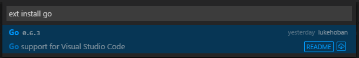
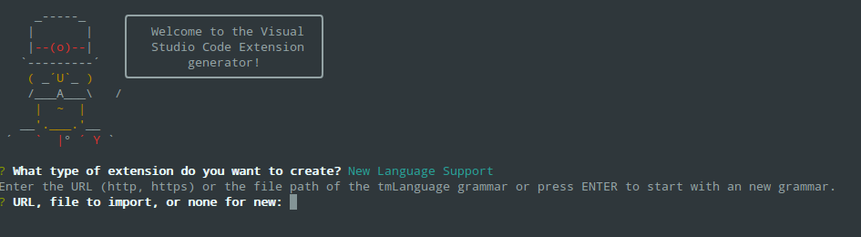

# Adding Language Colorization

VS Code includes support for [many languages](/docs/languages/overview.md) in the box giving great syntax highlighting (colorization), bracket matching and more. You and the community can also add new languages to VS Code.  This topic explains how to install new languages from the Extension Marketplace as well as create your own.

## Adding Colorizers from the Marketplace

Many language colorizers have been uploaded to the VS Code [Extension Marketplace](/docs/editor/extension-gallery.md) by the community.  If you find one you want to use, simply install it and restart VS Code and the new language will be available.

> **Tip:** To search for language support for a specific language, type the language name in the `Extension: Install Extension` dropdown to filter the available extensions.



You can also browse the [VS Code Marketplace](https://marketplace.visualstudio.com/vscode/Languages) site directly to find available colorizers and language support.

## Adding a New Language

Using the ['code' Yeoman generator](/docs/tools/yocode.md), you can add TextMate language specification files (.tmLanguage) to your VS Code installation to get syntax highlighting and bracket matching.

A good place to look for existing TextMate .tmLanguage files is on GitHub.  Search for a TextMate bundle for the language you are interested in and then navigate to the `Syntaxes` folder.  The 'code' Yeoman generator can handle either .tmLanguage or .plist files.  When prompted for the URL or file location, pass the raw path to the .tmLanguage file e.g. http://raw.githubusercontent.com/textmate/ant.tmbundle/master/Syntaxes/Ant.tmLanguage.



The generator will prompt you for other information such a unique name (this should be unique to avoid clashing with other extensions) and the language name, aliases and file extensions.

When the generator is finished, open the created folder in Visual Studio Code. Have a look at the generated `<languageid>.configuration.json` file: It contains more language settings such as the tokens used for comments and brackets.  Make sure the configurations are accurate. The generated `vsc-extension-quickstart.md` file also contains more information on how to run and debug your extension.

To use your extension in your stable VS Code installation, copy the complete output folder to a new folder under [your `.vscode/extensions` folder](/docs/extensions/install-extension.md#your-extensions-folder) and restart VS Code.  When you restart VS Code, your new language will be visible in the language specifier dropdown and you'll get full colorization and bracket/tag matching for files matching the language's file extension.


## Publishing Language Support to the Extension Marketplace

If you'd like to share your new language with the community, you can publish it to the [Extension Marketplace](/docs/editor/extension-gallery.md). Use the [vsce publishing tool](/docs/tools/vscecli.md) to package your extension and publish it to the VS Code Marketplace.

> **Tip:** To make it easy for users to find your language support, include the language name and words "language" or "language support" in the extension description and set the `Category` to `Languages` in your `package.json`.

We also have recommendations on how to make your extension look great on the VS Code Marketplace, see [Marketplace Presentation Tips](/docs/extensionAPI/extension-manifest.md#marketplace-presentation-tips).

## Add to your Language Support Extension

When you're adding a new language to VS Code, it is also great to add language [snippets](/docs/customization/userdefinedsnippets.md) to support common editing actions. It is easy to [combine multiple extensions](/docs/extensionAPI/extension-manifest.md#combining-extension-contributions) like snippets and colorizers into the same extension. You can modify the colorizer extension manifest `package.json` to include a `snippets` contribution and the snippets.json.  

```json
{
    "name": "language-latex",
    "description": "LaTeX Language Support",
    "version": "0.0.1",
    "publisher": "someone",
    "engines": {
        "vscode": "0.10.x"
    },
    "categories": [
        "Languages",
        "Snippets"
    ],
    "contributes": {
        "languages": [{
            "id": "latex",
            "aliases": ["LaTeX", "latex"],
            "extensions": [".tex"]
        }],
        "grammars": [{
            "language": "latex",
            "scopeName": "text.tex.latex",
            "path": "./syntaxes/latex.tmLanguage"
        }],
        "snippets": [
            {
                "language": "latex",
                "path": "./snippets/snippets.json"
            }
        ]
    }
}
```

## Next Steps

Colorizers are just one way to customize VS Code, If you'd like to learn more about VS Code extensibility, try these topics:

* [Snippets](/docs/customization/userdefinedsnippets) - Learn how to also include snippets in your language extension.
* [Custom themes](/docs/customization/themes.md) - Learn how to import existing TextMate themes.
* [Extending Visual Studio Code](/docs/extensions/overview.md) - Learn about other ways to extend VS Code

## Common Questions

**Q: Can I add more file extensions to my colorizer?**

**A:** Yes, the `yo code` generator provides the default file extensions from the .tmLanguage file but you can easily add more file extensions to a `languages` contribution `extensions` array.  In the example below, the `.asp` file extension has been added to the default `.asa` file extension. 

```json
{
    "name": "asp",
    "version": "0.0.1",
    "engines": {
        "vscode": "0.10.x"
    },
    "publisher": "none",
    "contributes": {
        "languages": [{
            "id": "asp",
            "aliases": ["ASP", "asp"],
            "extensions": [".asa", ".asp"]
        }],
        "grammars": [{
            "language": "asp",
            "scopeName": "source.asp",
            "path": "./syntaxes/asp.tmLanguage"
        }]
    }
}
```

**Q: Can I add more file extensions to an existing colorizer?**

**A:** Yes. To extend an existing colorizer, you would create a simple `package.json` in a new folder under `.vscode/extensions` and provide the `extensionDependencies` attribute specifying the customization you want to add to.  In the example below, an extension `.mmd` is added to the `markdown` colorizer. Note that not only must the `extensionDependency` name match the customization but also the `language` `id` must match the language id of the colorizer you are extending.

```json
{
    "name": "MyMarkdown",
    "version": "0.0.1",
    "engines": {
        "vscode": "0.10.x"
    },
    "publisher": "none",
    "extensionDependencies": [
        "markdown"
    ],
    "contributes": {
        "languages": [{
            "id": "markdown",
            "aliases": ["mmd"],
            "extensions": [".mmd"]
        }]
    }
}
```

**Q: What if I want to completely override an existing colorizer?**

**A:** Yes and no.  If the colorizer is implemented as a customization then yes but some of VS Code's built-in colorizers (e.g. Markdown) are integrated differently and cannot be overridden.  You override the colorizer by using the `extensionDependencies` attribute as above and providing a new `grammars` element.

```json
{
    "name": "override-xml",
    "version": "0.0.1",
    "engines": {
        "vscode": "0.10.x"
    },
    "publisher": "none",
    "extensionDependencies": [
        "xml"
    ],
    "contributes": {
        "grammars": [{
            "language": "xml",
            "scopeName": "text.xml.ant",
            "path": "./syntaxes/ant.tmLanguage"
        }]
    }
}
```
