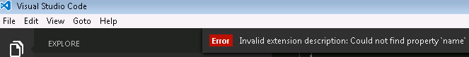

# Customize Visual Studio Code

You can customize VS Code to work the way you like to work.  Here is a quick primer on some of the most common ways to configure VS Code.  Navigate to the relevant sections to learn more.

>**Tip:** Several categories of customizations (Themes, Snippets, Language Support) can be shared in the VS Code [Extension Marketplace](/docs/editor/extension-gallery.md).  It's always a good idea to look there first.

## Customization Topics

**Category**|**Scenario**|**Marketplace**
------------|------------|-----------
[User and Workspace settings](/docs/customization/userandworkspace.md)|Configure settings for an individual workspace or all workspaces.  Word-wrapping, linting options and much more.|No
[Key Bindings](/docs/customization/keybindings.md)| Review all key bindings and change them to suit your needs.|No
[Tasks](/docs/editor/tasks.md)|Tasks are a great way to connect VS Code with your broader development workflow.|No
[Themes](/docs/customization/themes.md)| Add additional color themes to VS Code.|Yes 
[Basic Language Support](/docs/customization/colorizer.md)| Add additional basic language support (colorization and bracket matching) to VS Code via a TextMate bundle.  You can also associate more file extensions with an existing language.|Yes
[Snippets](/docs/customization/userdefinedsnippets.md)|Add additional snippets to your favorite language|Yes
[Language](/docs/customization/locales.md)|Configure the display language|No

## Next Steps

Here are a few pointers to help you on your way...

* [Extension Marketplace](/docs/editor/extension-gallery.md) - browse the extensions others have shared
* [Yo Code](/docs/tools/yocode.md) -  to generate a customization, then install it locally
* [Publishing Tool](/docs/tools/vscecli.md) - use the vsce publishing tool to share your customization with others

## Common Questions

**Q: How can I make my customization get loaded into VS Code on start-up?**

**A:** If you move a copy of your customization into your `.vscode/extensions` folder it will be loaded up as VS Code is started.

**Q: What are the valid fields in the `project.json` (extension Manifest) file?**

**A:** We have extended the `package.json` to include the required fields for customisation and extension loading/distribution.  We have an overview of the optional and mandatory sections of the [extension manifest](/docs/extensionAPI/extension-manifest.md) available.

**Q: Can a `package.json` contribute more than one customization?**

**A:** Yes, the `contributes` attribute can take a comma delimited list of contribution types and, as you'll notice from the json above, each contribution type takes an array (e.g. `"themes": [ ]`).

**Q: I created a new customization but I don't see it displayed in VS Code?**

**A:** Make sure you have copied all of the generator's output files to a new folder under [your `.vscode/extensions` folder](/docs/extensions/install-extension.md#your-extensions-folder) (e.g. ".vscode/extensions/cooltheme") and that you have restarted VS Code after installing the customization.

On startup, if VS Code detects an issue with a customization, you will see an error message which can aid in debugging your customization.

