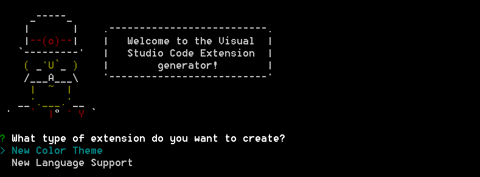

# Customize Visual Studio Code
You can configure VS Code to work the way you like to work.  Here is a quick primer on some of the most common ways to configure VS Code.
* Configuring [User and Workspace settings](/docs/customization/userandworkspace.md)
* Customize [Key Bindings](/docs/customization/keybindings.md)
* [User Defined Snippets](/docs/customization/userdefinedsnippets.md)

You can also import pre-made customizations to VS Code:
* Adding additional [Themes](/docs/customization/themes.md)
* Adding additional language [Colorizers and Bracket Matchers](/docs/customization/colorizer.md)
 
In addition to the customization described here, you can integrate VS Code into your workflow with [tasks](/docs/editor/tasks.md).

## Yo Code - Adding Customizations for VS Code
To make customizing VS Code easier, we created a dedicated Yeoman generator.  

In this release of the generator, we have the ability to create two common customizations:

1. Additional color themes 
2. Syntax highlighters/bracket matchers

In the future, we'll add other options for rich customization of VS Code.

If you have a TextMate color theme (.tmTheme) or a TextMate language specification (.tmLanguage), you can bring them into VS Code using the 'code' Yeoman generator.

Install and run the code Yeoman generator as follows:
1. `npm install -g yo`
2. `npm install -g generator-code`
3. `yo code`

The Yeoman generator will walk you through creating your customization prompting for the required information.  Once the generator is finished, copy the generator's output folder to a new folder under the `.vscode/extensions` folder and restart VS Code. 

In the future you will be able to publish your custom themes and colorizers to an external gallery to share them with the community.

>**Tip:** If you want to share your customization with others in the meantime, you can simply send them a copy of the output from the generator and ask them to add it under their `.vscode/extensions` folder.