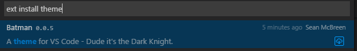
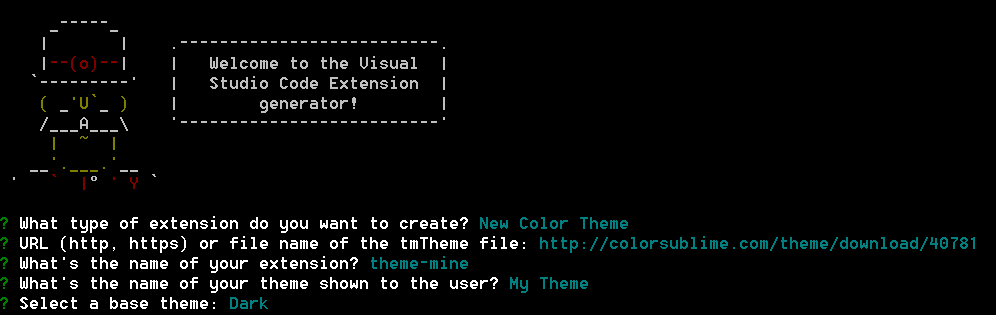

# Changing the Color Theme

Color themes let you modify VS Code's background, text and language syntax colorization to suit your preferences and work environment. VS Code supports light, dark and high contrast themes.

## Selecting the Color Theme

There are several out-of-the-box color themes in VS Code for you to try.

1. Open the Color Theme picker with **File** > **Preferences** > **Color Theme**.
2. Use the cursor keys to preview the colors of the theme.
3. Select the theme you want and hit `kbstyle(Enter)`.

## Adding Themes from the Extension Marketplace

Many themes have been uploaded to the VS Code [Extension Marketplace](/docs/editor/extension-gallery.md) by the community.  If you find one you want to use, simply install it and restart VS Code and the new theme will be available.

> **Tip:** To search for themes, type 'theme' in the `Extension: Install Extension` dropdown to filter on extensions with 'theme' in their name.

You can also browse the [VS Code Marketplace](https://marketplace.visualstudio.com/vscode/Themes) site directly to find available themes.

## Adding a new Theme

You can also add new TextMate theme files (.tmTheme) to your VS Code installation using the [yo code](/docs/tools/yocode.md) extension generator.

[ColorSublime](http://colorsublime.com) has hundreds of existing TextMate themes to choose from.  Pick a theme you like and copy the Download link to use in the Yeoman generator.  It will be in a format like `"http://colorsublime.com/theme/download/(number)"`.  The 'code' generator will prompt you for the URL or file location of the .tmTheme file, the theme name as well as other information for the theme.

Copy the generated theme folder to a new folder under [your `.vscode/extensions` folder](/docs/extensions/install-extension.md#your-extensions-folder) and restart VS Code.

Open the Color Theme picker theme with **File** > **Preferences** > **Color Theme** and you can see your theme in the dropdown.  Arrow up and down to see a live preview of your theme.

## Publishing a Theme to the Extension Marketplace

If you'd like to share your new theme with the community, you can publish it to the [Extension Marketplace](/docs/editor/extension-gallery.md). Use the [vsce publishing tool](/docs/tools/vscecli.md) to package your theme and publish it to the VS Code Marketplace.

> **Tip:** To make it easy for users to find your theme, include the word "theme" in the extension description and set the `Category` to `Theme` in your `package.json`.

We also have recommendations on how to make your extension look great on the VS Code Marketplace, see [Marketplace Presentation Tips](/docs/extensionAPI/extension-manifest.md#marketplace-presentation-tips).

## Next Steps

Themes are just one way to customize VS Code. If you'd like to learn more about VS Code extensibility, try these topics:

* [Colorizers and Bracket Matchers](/docs/customization/colorizer.md) - Learn how to import TextMate colorizers
* [Snippets](/docs/customization/userdefinedsnippets.md) - Add additional snippets to your favorite language
* [Extending Visual Studio Code](/docs/extensions/overview.md) - Learn about other ways to extend VS Code

## Common Questions

  Nothing yet

