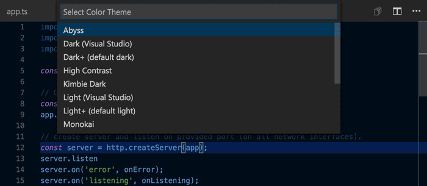

# Color Themes

Color themes let you modify VS Code's background, text, and language syntax colorization to suit your preferences and work environment. VS Code supports light, dark and high contrast themes.



## Selecting the Color Theme

There are several out-of-the-box color themes in VS Code for you to try.

1. Open the Color Theme picker with **File** > **Preferences** > **Color Theme**. (**Code** > **Preferences** > **Color Theme** on Mac)
2. Use the cursor keys to preview the colors of the theme.
3. Select the theme you want and hit `kbstyle(Enter)`.


## Adding Themes from the Extension Marketplace

Many themes have been uploaded to the VS Code [Extension Marketplace](/docs/editor/extension-gallery.md) by the community.  If you find one you want to use, simply install it and restart VS Code and the new theme will be available.

> **Tip:** To search for themes, type 'theme' in the Extensions view (`kb(workbench.view.extensions)`) search box.

<div class="marketplace-extensions-themes"></div>

You can also browse the [VS Code Marketplace](https://marketplace.visualstudio.com/vscode/Themes) site directly to find available themes.

## Adding a new Theme

You can also add new TextMate theme files (.tmTheme) to your VS Code installation using VS Code's [Yeoman](http://yeoman.io) extension generator, [yo code](/docs/tools/yocode.md). The extension generator takes an existing TextMate theme file and packages it for use in VS Code.

[ColorSublime](http://colorsublime.com) has hundreds of existing TextMate themes to choose from.  Pick a theme you like and copy the Download link to use in the Yeoman generator.  It will be in a format like `"http://colorsublime.com/theme/download/(number)"`.  The 'code' generator will prompt you for the URL or file location of the .tmTheme file, the theme name, and other information related to the theme.


Copy the generated theme folder to a new folder under [your `.vscode/extensions` folder](/docs/extensions/install-extension.md#your-extensions-folder) and restart VS Code.

Open the Color Theme picker theme with **File** > **Preferences** > **Color Theme** and you can see your theme in the dropdown.  Arrow up and down to see a live preview of your theme.


## Publishing a Theme to the Extension Marketplace

If you'd like to share your new theme with the community, you can publish it to the [Extension Marketplace](/docs/editor/extension-gallery.md). Use the [vsce publishing tool](/docs/tools/vscecli.md) to package your theme and publish it to the VS Code Marketplace.

> **Tip:** To make it easy for users to find your theme, include the word "theme" in the extension description and set the `Category` to `Theme` in your `package.json`.

We also have recommendations on how to make your extension look great on the VS Code Marketplace, see [Marketplace Presentation Tips](/docs/extensionAPI/extension-manifest.md#marketplace-presentation-tips).

## Creating a Custom Theme

You can also author your own TextMate themes from scratch. Consult the TextMate [theme](http://manual.macromates.com/en/themes) and language grammar [naming conventions](http://manual.macromates.com/en/language_grammars#naming_conventions) documentation for details.

Besides the TextMate language grammar standard scopes, VS Code also has custom theme settings which you can use to tune your own theme:

- `rangeHighlight`: Background color of range highlighted, like by Quick open and Find features.
- `selectionHighlight`: Background color of regions highlighted while selecting.
- `inactiveSelection`: Background color of selections when not in focus.
- `wordHighlight`: Background color of a symbol during read-access, like reading a variable.
- `wordHighlightStrong`: Background color of a symbol during write-access, like writing to a variable.
- `findMatchHighlight`: Background color of regions matching the search.
- `currentFindMatchHighlight`: Background color of the current region matching the search.
- `findRangeHighlight`: Background color of regions selected for search.
- `activeLinkForeground`: Color of active links.
- `hoverHighlight`: Background color when hovered.
- `referenceHighlight`: Background color of a reference when finding all references.
- `guide`: Color of the guides displayed to indicate nesting levels.

You can find an example VS Code theme [here](https://github.com/Microsoft/vscode-extension-samples/tree/master/theme-sample) which includes the custom settings.

Authoring a theme is fairly tricky as the grammars all behave a bit differently. Try to follow the TextMate conventions and avoid language specific rules in your theme as grammars can also be replaced by extensions.

# Icon Themes

File icon themes can be contributed by extensions and selected by users as their favorite set of file icons. File icons are shown in the File Explorer.

## Select an Icon Theme

1. Open the Icon Theme picker with **File** > **Preferences** > **File Icon Theme**. (**Code** > **Preferences** > **File Icon Theme** on Mac)
2. Use the cursor keys to preview the icons of the theme.
3. Select the theme you want and hit `kbstyle(Enter)`.

By default, no file icon set is configured, therefore the File Explorer shows no icons. Once an icon theme is selected, the selected theme will be remembered and set again when VS Code is started the next time .

VS code ships with two icon themes; **Minimal** and **Seti**. To install more icon themes, select the **Find more in the Marketplace...** item in the icon theme picker.

You can also browse the [VS Code Marketplace](https://marketplace.visualstudio.com/vscode/Themes) site directly to find available themes.

## Adding a new Icon Theme

You can create your own icon theme from icons (preferrably SVG) and from icon fonts. As example, check out the two built-in themes: [Minimal](https://github.com/Microsoft/vscode/tree/master/extensions/theme-defaults) and [Seti](https://github.com/Microsoft/vscode/tree/master/extensions/theme-seti).


To begin, create a VS Code extension and add the `iconTheme` contribution point.

```json
"contributes": {
    "iconThemes": [
        {
            "id": "turtles",
            "label": "Turtles",
            "path": "./fileicons/turtles-icon-theme.json"
        }
    ]
}
```

The `id` is the identifier for the icon theme. It is currently only used internally. In the future, it might be used in the settings, so make it unique but also readable. `label` is shown in the icon theme picker dropdown. The `path` points to a file in the extension that defines the icon set. If your icon set name follows the `*icon-theme.json` name scheme, you will get completion support and hovers in VS Code.

### Icon Set File

The icon set file is a JSON file consisting file icon associations and icon definitions.

An icon association maps a file type ('file', 'folder', 'json-file'...) to an icon definition. Icon definitions define where the icon is located: That can be an image file or also glyph in a font.

### Icon definitions

The `iconDefinitions` section contains all definitions. Each definition has an id, which will be used to reference the definition. A definition can be referenced also by more than one file association.

```json
    "iconDefinitions": {
        "_folder_dark": {
            "iconPath": "./images/Folder_16x_inverse.svg"
        }
    }
```

This icon definition above contains a definition with the identifier `_folder_dark`.

The following properties are supported:

- `iconPath`: When using a svg/png: the path to the image.
- `fontCharacter`: When using a glyph font: The character in the font to use.
- `fontColor`: When using a glyph font: The color to use for the glyph.
- `fontSize`: When using a font: The font size. By default, the size specified in the font specification is used. Should be a relative size (e.g. 150%) to the parent font size.
- `fontId`: When using a font: The id of the font. If not specified, the first font specified in font specification section will be picked.

### File association

Icons can be associated to folders, folder names, files, file extensions, file names and [language ids](/docs/extensionAPI/extension-points#_contributeslanguages).

Additionally each of these associations can be refined for 'light' and 'highContrast' color themes.

Each file association points to an icon definition.

```json
"file": "_file_dark",
"folder": "_folder_dark",
"folderExpanded": "_folder_open_dark",
"folderNames": {
    ".vscode": "_vscode_folder",
},
"fileExtensions": {
    "ini": "_ini_file",
},
"fileNames": {
    "win.ini": "_win_ini_file",
},
"languageIds": {
    "ini": "_ini_file"
},
"light": {
    "folderExpanded": "_folder_open_light",
    "folder": "_folder_light",
    "file": "_file_light",
    "fileExtensions": {
        "ini": "_ini_file_light",
    }
},
"highContrast": {
}
```

- `file` is the default file icon, shown for all files that don't match any extension, filename or language id. Currently all properties defined by the definition of the file icon will be inherited (only relevant for font glyphs, useful for the fontSize)
- `folder` is the folder icon for collapsed folders, and if `folderExpanded` is not set, also for expanded folders. Icons for specific folder names can be associated using the `folderNames` property .
The folder icon is optional. If not set, no icon will be shown for folder.
- `folderExpanded` is the folder icon for expanded folders. The expanded folder icon is optional. If not set, the icon defined for `folder` will be shown.
- `folderNames` associates folder names to icons. The key of the set is the folder name, not including any path segments. Patterns or wildcards are not supported. Folder name matching is case insensitive.
- `folderNamesExpanded` associates folder names to icons for expanded folder. The key of the set is the folder name, not including any path segments. Patterns or wildcards are not supported. Folder name matching is case insensitive.
- `languageIds` associates languages to icons. The key in the set is the language id as defined in the [language contribution point](/docs/extensionAPI/extension-points#_contributeslanguages). The language of a file is evaluated based on the file extensions and file names as defined in the language contribution. Note that the 'first line match' of the language contribution is not considered.
- `fileExtensions` associates file extensions to icons. The key in the set is the file extension name. The extension name is a file name segment after a dot (not including the dot). File names with multiple dots such as `lib.d.ts` can match multiple extensions; 'd.ts' and 'ts'. Extensions are compared case insensitive.
- `fileNames` associates file names to icons. The key in the set is the full file name, not including any path segments. Patterns or wildcards are not supported. File name matching is case insensitive. A 'fileName' match is the strongest match, and the icon associated to the file name will be preferred over an icon of a matching fileExtension and also of a matching language Id.

A file extension match is preferred over a language match, but is weaker than a file name match.

The `light` and the `highContrast` section have the same file association properties as just listed. They allow to override icons for the corresponding themes.

### Font definitions

The 'fonts' section lets you declare any number of glyph fonts that you want to use. 
You can later reference these font in the icon definitions. The font declared first will be used as by default if an icon definition does not specify a font id.

Copy the font file into your extension and set the path accordingly.
It is recommended to use [WOFF](https://developer.mozilla.org/en-US/docs/Web/Guide/WOFF) fonts.
* Set 'woff' as the format.
* the weight property values are defined [here](https://developer.mozilla.org/en-US/docs/Web/CSS/font-weight#Values)
* the style property values are defined [here](https://developer.mozilla.org/en-US/docs/Web/CSS/@font-face/font-style#Values)
* the size should be relative to the font size where the icon is used. Therefore always use percentage. 

```json
    "fonts": [
        {
            "id": "turtles-font",
            "src": [
                {
                    "path": "./turtles.woff",
                    "format": "woff"
                }
            ],
            "weight": "normal",
            "style": "normal",
            "size": "150%"
        }
    ],
    "iconDefinitions": {
        "_file": {
            "fontCharacter": "\\E002",
            "fontColor": "#5f8b3b",
            "fontId": "turtles-font"
        }
    }
```

## Next Steps

Themes are just one way to customize VS Code. If you'd like to learn more about VS Code extensibility, try these topics:

* [Colorizers and Bracket Matchers](/docs/customization/colorizer.md) - Learn how to import TextMate colorizers
* [Snippets](/docs/customization/userdefinedsnippets.md) - Add additional snippets to your favorite language
* [Extending Visual Studio Code](/docs/extensions/overview.md) - Learn about other ways to extend VS Code

## Common Questions

**Q: What parts of VS code can I theme with a custom color theme?**

The VS Code color themes affect the editor input area (text foreground, background, selection, lineHighlight, caret, and the syntax tokens) as well as some of the custom UI (see the list in [Creating a Theme](/docs/customization/themes.md#creating-a-custom-theme)). When contributing a theme, you also specify a base theme: light (`vs`), dark (`vs-dark`) and high contrast (`hc-black`). The base theme is used for all other areas in the workbench such as the File Explorer. Base themes are not customizable or contributable by extensions.

**Q: Is there a list of scopes that I can use in my custom color theme?**

VS Code themes are standard TextMate themes and the tokenizers used in VS code are well established TextMate tokenizers, mostly maintained by the community and in use in other products.

To learn about what scopes are used where, check out the [TextMate documentation](https://manual.macromates.com/en/themes) and this useful [blog post](http://www.apeth.com/nonblog/stories/textmatebundle.html).  A great place to examine themes is [here](https://tmtheme-editor.herokuapp.com/).
