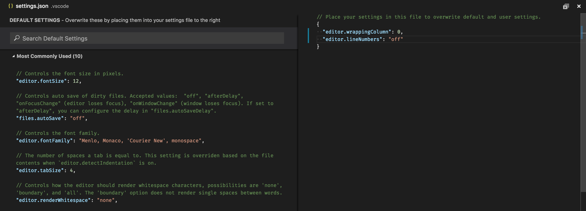
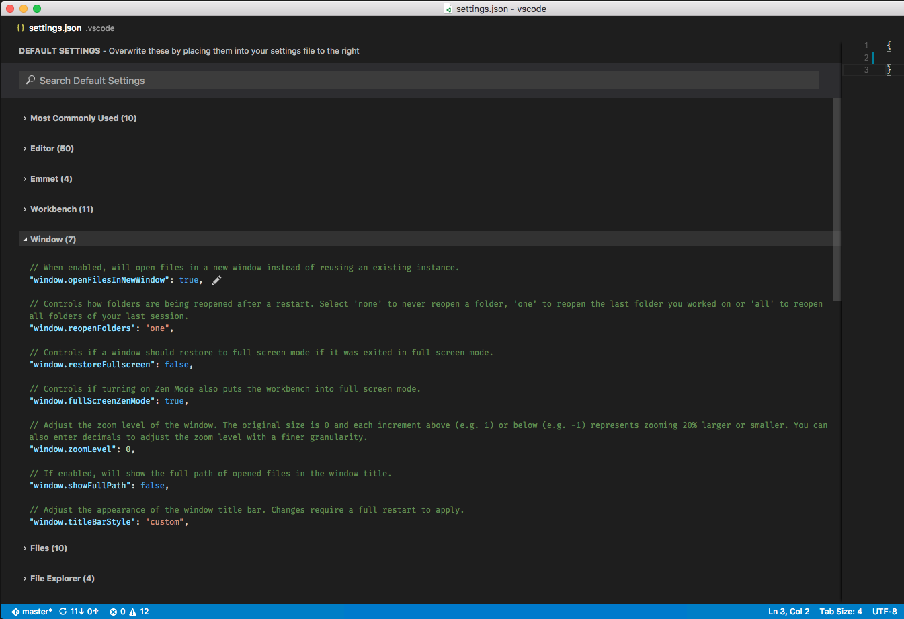
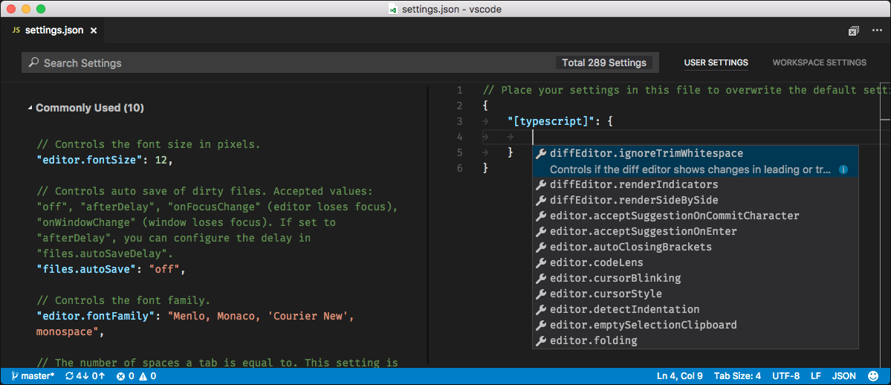

# User and Workspace Settings

It's easy to configure VS Code the way you want by editing the various setting files where you will find a great number of settings to play with.

VS Code provides two different scopes for settings:

* **User** these settings apply globally to any instance of VS Code you open
* **Workspace** these settings are stored inside your workspace in a `.vscode` folder and only apply when the workspace is opened. Settings defined on this scope override the user scope.

## Creating User and Workspace Settings

The menu under **File** > **Preferences** (**Code** > **Preferences** on Mac) provides entry to configure user and workspace settings. You are provided with a list of Default Settings. Copy any setting that you want to change to the related `settings.json` file.

In the example below, we disabled line numbers in the editor and configured line wrapping to wrap automatically based on the size of the editor.



Changes to settings are reloaded by VS Code after the modified `settings.json` file is saved.

>**Note:** Workspace settings are useful for sharing project specific settings across a team.

## Settings File Locations

Depending on your platform, the user settings file is located here:

* **Windows** `%APPDATA%\Code\User\settings.json`
* **Mac** `$HOME/Library/Application Support/Code/User/settings.json`
* **Linux** `$HOME/.config/Code/User/settings.json`

The workspace setting file is located under the `.vscode` folder in your project.

## Default Settings

When you open settings, we show **Default Settings** to search and discover settings you are looking for. When you search using the big Search bar, it will not only show and highlight the settings matching your criteria, but also filter out those which are not matching. This makes finding settings quick and easy. There are actions available inside **Default Settings** and `settings.json` editors which will help you quickly copy or update a setting.


### Settings groups

Default settings are represented in groups so that you can navigate them easily. It has **Most Commonly Used** group on the top to see the most common customizations done by VS Code users.



Here is the [copy of default settings](/docs/customization/userandworkspace.md#copy-of-default-settings) that comes with VS Code.

## Language specific editor settings

To customize your editor by language, run the global command **Preferences: Configure language specific settings...** (command id: `workbench.action.configureLanguageBasedSettings`) from the **Command Palette** (`kb(workbench.action.showCommands)`) which opens the language picker. Selecting the language you want, opens the Settings editor with the language entry where you can add applicable settings.




If you have a file open and you want to customize the editor for this file type, click on the Language Mode in the Status Bar to the bottom-right of the VS Code window. This opens the Language Mode picker with an option **Configure 'language_name' language based settings...**. Selecting this opens the Settings editor with the language entry where you can add applicable settings.

You can also configure language based settings by directly opening `settings.json`. You can scope them to the workspace by placing them in the Workspace settings just like other settings. If you have settings defined for a language in both user and workspace scopes, then they are merged by giving precedence to the ones defined in the workspace.

The following examples customize editor settings for language modes `typescript` and `markdown`.

```json
{
  "[typescript]": {
    "editor.formatOnSave": true,
    "editor.formatOnPaste": true
  },
  "[markdown]": {
    "editor.formatOnSave": true,
    "editor.wrappingColumn": 0,
    "editor.renderWhitespace": "all",
    "editor.acceptSuggestionOnEnter": false
  }
}
```

You can use IntelliSense in Settings editor to help you find allowed language based settings. All editor settings and some non-editor settings are supported.

**Note**: The following settings are not currently supported but will be in the next release. Please refer to [#19511](https://github.com/Microsoft/vscode/issues/19511) for more information.

```json
editor.tabSize
editor.insertSpaces
editor.detectIndentation
editor.trimAutoWhitespace
```

## Settings and security

In settings, we allow you to specify some of the executables that VS Code will run to do its work. For example, you can choose which shell the Integrated Terminal should use. For enhanced security, such settings can only be defined in user settings and not at workspace scope.

Here is the list of settings we don't support for workspaces:

- git.path
- terminal.integrated.shell.linux
- terminal.integrated.shellArgs.linux
- terminal.integrated.shell.osx
- terminal.integrated.shellArgs.osx
- terminal.integrated.shell.windows
- terminal.integrated.shellArgs.windows
- terminal.external.windowsExec
- terminal.external.osxExec
- terminal.external.linuxExec

The first time you open a workspace which defines any of these settings, VS Code will warn you and subsequently always ignore the values after that.

### Copy of default settings

```json
{
// Most Commonly Used

  // Controls the font size in pixels.
  "editor.fontSize": 14,

  // Controls auto save of dirty files. Accepted values:  'off', 'afterDelay', 'onFocusChange' (editor loses focus), 'onWindowChange' (window loses focus). If set to 'afterDelay', you can configure the delay in 'files.autoSaveDelay'.
  "files.autoSave": "off",

  // Controls the font family.
  "editor.fontFamily": "Consolas, 'Courier New', monospace",

  // The number of spaces a tab is equal to. This setting is overriden based on the file contents when `editor.detectIndentation` is on.
  "editor.tabSize": 4,

  // Controls how the editor should render whitespace characters, possibilities are 'none', 'boundary', and 'all'. The 'boundary' option does not render single spaces between words.
  "editor.renderWhitespace": "none",

  // Configure glob patterns for excluding files and folders.
  "files.exclude": {
    "**/.git": true,
    "**/.svn": true,
    "**/.hg": true,
    "**/.DS_Store": true
  },

  // Controls the cursor style, accepted values are 'block', 'block-outline', 'line', 'line-thin', 'underline' and 'underline-thin'
  "editor.cursorStyle": "line",

  // Insert spaces when pressing Tab. This setting is overriden based on the file contents when `editor.detectIndentation` is on.
  "editor.insertSpaces": true,

  // Controls how lines should wrap. Can be:
  //  - 'off' (disable wrapping),
  //  - 'on' (viewport wrapping),
  //  - 'wordWrapColumn' (wrap at `editor.wordWrapColumn`) or
  //  - 'bounded' (wrap at minimum of viewport and `editor.wordWrapColumn`).
  "editor.wordWrap": "off",

  // Configure file associations to languages (e.g. '*.extension': 'html'). These have precedence over the default associations of the languages installed.
  "files.associations": {}

// Editor

  // Insert snippets when their prefix matches. Works best when 'quickSuggestions' aren't enabled.
  "editor.tabCompletion": false,

  // Controls the font family.
  "editor.fontFamily": "Consolas, 'Courier New', monospace",

  // Controls the font weight.
  "editor.fontWeight": "normal",

  // Controls the font size in pixels.
  "editor.fontSize": 14,

  // Controls the line height. Use 0 to compute the lineHeight from the fontSize.
  "editor.lineHeight": 0,

  // Controls the display of line numbers. Possible values are 'on', 'off', and 'relative'. 'relative' shows the line count from the current cursor position.
  "editor.lineNumbers": "on",

  // Columns at which to show vertical rulers
  "editor.rulers": [],

  // Characters that will be used as word separators when doing word related navigations or operations
  "editor.wordSeparators": "`~!@#$%^&*()-=+[{]}\\|;:'\",.<>/?",

  // The number of spaces a tab is equal to. This setting is overriden based on the file contents when `editor.detectIndentation` is on.
  "editor.tabSize": 4,

  // Insert spaces when pressing Tab. This setting is overriden based on the file contents when `editor.detectIndentation` is on.
  "editor.insertSpaces": true,

  // When opening a file, `editor.tabSize` and `editor.insertSpaces` will be detected based on the file contents.
  "editor.detectIndentation": true,

  // Controls if selections have rounded corners
  "editor.roundedSelection": true,

  // Controls if the editor will scroll beyond the last line
  "editor.scrollBeyondLastLine": true,

  // Controls if the minimap is shown
  "editor.minimap.enabled": false,

  // Render the actual characters on a line (as opposed to color blocks)
  "editor.minimap.renderCharacters": true,

  // Limit the width of the minimap to render at most a certain number of columns
  "editor.minimap.maxColumn": 120,

  // Controls how lines should wrap. Can be:
  //  - 'off' (disable wrapping),
  //  - 'on' (viewport wrapping),
  //  - 'wordWrapColumn' (wrap at `editor.wordWrapColumn`) or
  //  - 'bounded' (wrap at minimum of viewport and `editor.wordWrapColumn`).
  "editor.wordWrap": "off",

  // Controls the wrapping column of the editor when `editor.wordWrap` is 'wordWrapColumn' or 'bounded'.
  "editor.wordWrapColumn": 80,

  // Controls the indentation of wrapped lines. Can be one of 'none', 'same' or 'indent'.
  "editor.wrappingIndent": "same",

  // A multiplier to be used on the `deltaX` and `deltaY` of mouse wheel scroll events
  "editor.mouseWheelScrollSensitivity": 1,

  // Controls if quick suggestions should show up or not while typing
  "editor.quickSuggestions": true,

  // Controls the delay in ms after which quick suggestions will show up
  "editor.quickSuggestionsDelay": 10,

  // Enables parameter hints
  "editor.parameterHints": true,

  // Controls if the editor should automatically close brackets after opening them
  "editor.autoClosingBrackets": true,

  // Controls if the editor should automatically format the line after typing
  "editor.formatOnType": false,

  // Controls if the editor should automatically format the pasted content. A formatter must be available and the formatter should be able to format a range in a document.
  "editor.formatOnPaste": false,

  // Controls if suggestions should automatically show up when typing trigger characters
  "editor.suggestOnTriggerCharacters": true,

  // Controls if suggestions should be accepted on 'Enter' - in addition to 'Tab'. Helps to avoid ambiguity between inserting new lines or accepting suggestions.
  "editor.acceptSuggestionOnEnter": true,

  // Controls if suggestions should be accepted on commit characters. For instance in JavaScript the semi-colon (';') can be a commit character that accepts a suggestion and types that character.
  "editor.acceptSuggestionOnCommitCharacter": true,

  // Controls whether snippets are shown with other suggestions and how they are sorted.
  "editor.snippetSuggestions": "bottom",

  // Controls whether copying without a selection copies the current line.
  "editor.emptySelectionClipboard": true,

  // Enable word based suggestions.
  "editor.wordBasedSuggestions": true,

  // Font size for the suggest widget
  "editor.suggestFontSize": 0,

  // Line height for the suggest widget
  "editor.suggestLineHeight": 0,

  // Controls whether the editor should highlight similar matches to the selection
  "editor.selectionHighlight": true,

  // Controls the number of decorations that can show up at the same position in the overview ruler
  "editor.overviewRulerLanes": 3,

  // Control the cursor animation style, possible values are 'blink', 'smooth', 'phase', 'expand' and 'solid'
  "editor.cursorBlinking": "blink",

  // Zoom the font of the editor when using mouse wheel and holding Ctrl
  "editor.mouseWheelZoom": false,

  // Controls the cursor style, accepted values are 'block', 'block-outline', 'line', 'line-thin', 'underline' and 'underline-thin'
  "editor.cursorStyle": "line",

  // Enables font ligatures
  "editor.fontLigatures": false,

  // Controls if the cursor should be hidden in the overview ruler.
  "editor.hideCursorInOverviewRuler": false,

  // Controls how the editor should render whitespace characters, possibilities are 'none', 'boundary', and 'all'. The 'boundary' option does not render single spaces between words.
  "editor.renderWhitespace": "none",

  // Controls whether the editor should render control characters
  "editor.renderControlCharacters": false,

  // Controls whether the editor should render indent guides
  "editor.renderIndentGuides": false,

  // Controls how the editor should render the current line highlight, possibilities are 'none', 'gutter', 'line', and 'all'.
  "editor.renderLineHighlight": "line",

  // Controls if the editor shows code lenses
  "editor.codeLens": true,

  // Controls whether the editor has code folding enabled
  "editor.folding": true,

  // Highlight matching brackets when one of them is selected.
  "editor.matchBrackets": true,

  // Controls whether the editor should render the vertical glyph margin. Glyph margin is mostly used for debugging.
  "editor.glyphMargin": true,

  // Inserting and deleting whitespace follows tab stops
  "editor.useTabStops": true,

  // Remove trailing auto inserted whitespace
  "editor.trimAutoWhitespace": true,

  // Keep peek editors open even when double clicking their content or when hitting Escape.
  "editor.stablePeek": false,

  // Controls if the editor should allow to move selections via drag and drop.
  "editor.dragAndDrop": false,

  // Controls if the diff editor shows the diff side by side or inline
  "diffEditor.renderSideBySide": true,

  // Controls if the diff editor shows changes in leading or trailing whitespace as diffs
  "diffEditor.ignoreTrimWhitespace": true,

  // Controls if the diff editor shows +/- indicators for added/removed changes
  "diffEditor.renderIndicators": true,

  // Format a file on save. A formatter must be available, the file must not be auto-saved, and editor must not be shutting down.
  "editor.formatOnSave": false,

// Emmet

  // When enabled, emmet abbreviations are expanded when pressing TAB.
  "emmet.triggerExpansionOnTab": true,

  // Preferences used to modify behavior of some actions and resolvers of Emmet.
  "emmet.preferences": {},

  // Define profile for specified syntax or use your own profile with specific rules.
  "emmet.syntaxProfiles": {},

  // An array of languages where emmet abbreviations should not be expanded.
  "emmet.excludeLanguages": [
    "markdown"
  ],

  // Path to a folder containing emmet profiles, snippets and preferences
  "emmet.extensionsPath": null,

// Workbench

  // When enabled, will show the Welcome page on startup.
  "workbench.welcome.enabled": false,

  // Controls if opened editors should show in tabs or not.
  "workbench.editor.showTabs": true,

  // Controls the position of the editor's tabs close buttons or disables them when set to 'off'.
  "workbench.editor.tabCloseButton": "right",

  // Controls if opened editors should show with an icon or not. This requires an icon theme to be enabled as well.
  "workbench.editor.showIcons": true,

  // Controls if opened editors show as preview. Preview editors are reused until they are kept (e.g. via double click or editing).
  "workbench.editor.enablePreview": true,

  // Controls if opened editors from Quick Open show as preview. Preview editors are reused until they are kept (e.g. via double click or editing).
  "workbench.editor.enablePreviewFromQuickOpen": true,

  // Controls where editors open. Select 'left' or 'right' to open editors to the left or right of the current active one. Select 'first' or 'last' to open editors independently from the currently active one.
  "workbench.editor.openPositioning": "right",

  // Controls if Quick Open should close automatically once it loses focus.
  "workbench.quickOpen.closeOnFocusLost": true,

  // Controls if opening settings also opens an editor showing all default settings.
  "workbench.settings.openDefaultSettings": true,

  // Controls the location of the sidebar. It can either show on the left or right of the workbench.
  "workbench.sideBar.location": "left",

  // Controls the visibility of the status bar at the bottom of the workbench.
  "workbench.statusBar.visible": true,

  // Controls the visibility of the activity bar in the workbench.
  "workbench.activityBar.visible": true,

  // Specifies the color theme used in the workbench.
  "workbench.colorTheme": "Default Dark+",

  // Specifies the icon theme used in the workbench.
  "workbench.iconTheme": null,

// Window

  // Controls if files should open in a new window.
  // - default: files will open in the window with the files' folder open or the last active window unless opened via the dock or from finder (macOS only)
  // - on: files will open in a new window
  // - off: files will open in the window with the files' folder open or the last active window
  // Note that there can still be cases where this setting is ignored (e.g. when using the -new-window or -reuse-window command line option).
  "window.openFilesInNewWindow": "default",

  // Controls if folders should open in a new window or replace the last active window.
  // - default: folders will open in a new window unless a folder is picked from within the application (e.g. via the File menu)
  // - on: folders will open in a new window
  // - off: folders will replace the last active window
  // Note that there can still be cases where this setting is ignored (e.g. when using the -new-window or -reuse-window command line option).
  "window.openFoldersInNewWindow": "default",

  // Controls how folders are being reopened after a restart. Select 'none' to never reopen a folder, 'one' to reopen the last folder you worked on or 'all' to reopen all folders of your last session.
  "window.reopenFolders": "one",

  // Controls if a window should restore to full screen mode if it was exited in full screen mode.
  "window.restoreFullscreen": false,

  // Adjust the zoom level of the window. The original size is 0 and each increment above (e.g. 1) or below (e.g. -1) represents zooming 20% larger or smaller. You can also enter decimals to adjust the zoom level with a finer granularity.
  "window.zoomLevel": 0,

  // Controls the window title based on the active editor. Variables are substituted based on the context:
  // ${activeEditorShort}: e.g. myFile.txt
  // ${activeEditorMedium}: e.g. myFolder/myFile.txt
  // ${activeEditorLong}: e.g. /Users/Development/myProject/myFolder/myFile.txt
  // ${rootName}: e.g. myProject
  // ${rootPath}: e.g. /Users/Development/myProject
  // ${appName}: e.g. VS Code
  // ${dirty}: a dirty indicator if the active editor is dirty
  // ${separator}: a conditional separator (" - ") that only shows when surrounded by variables with values
  "window.title": "${dirty}${activeEditorShort}${separator}${rootName}${separator}${appName}",

  // Controls the dimensions of opening a new window. By default, a new window will open in the center of the screen with small dimensions. When set to  'inherit', the window will get the same dimensions as the last active one. When set to 'maximized', the window will open maximized and fullscreen if configured to 'fullscreen'.
  "window.newWindowDimensions": "default",

  // Control the visibility of the menu bar. A setting of 'toggle' means that the menu bar is hidden and a single press of the Alt key will show it. By default, the menu bar will be visible, unless the window is full screen.
  "window.menuBarVisibility": "default",

  // If enabled, will automatically change to high contrast theme if Windows is using a high contrast theme, and to dark theme when switching away from a Windows high contrast theme.
  "window.autoDetectHighContrast": true,

// Files

  // Configure glob patterns for excluding files and folders.
  "files.exclude": {
    "**/.git": true,
    "**/.svn": true,
    "**/.hg": true,
    "**/.DS_Store": true
  },

  // Configure file associations to languages (e.g. '*.extension': 'html'). These have precedence over the default associations of the languages installed.
  "files.associations": {},

  // The default character set encoding to use when reading and writing files.
  "files.encoding": "utf8",

  // The default end of line character.
  "files.eol": "\r\n",

  // When enabled, will trim trailing whitespace when saving a file.
  "files.trimTrailingWhitespace": false,

  // When enabled, insert a final new line at the end of the file when saving it.
  "files.insertFinalNewline": false,

  // Controls auto save of dirty files. Accepted values:  'off', 'afterDelay', 'onFocusChange' (editor loses focus), 'onWindowChange' (window loses focus). If set to 'afterDelay', you can configure the delay in 'files.autoSaveDelay'.
  "files.autoSave": "off",

  // Controls the delay in ms after which a dirty file is saved automatically. Only applies when 'files.autoSave' is set to 'afterDelay'
  "files.autoSaveDelay": 1000,

  // Configure glob patterns of file paths to exclude from file watching. Changing this setting requires a restart. When you experience Code consuming lots of cpu time on startup, you can exclude large folders to reduce the initial load.
  "files.watcherExclude": {
    "**/.git/objects/**": true,
    "**/node_modules/**": true
  },

  // Controls whether unsaved files are remembered between sessions, allowing the save prompt when exiting the editor to be skipped.
  "files.hotExit": "onExit",

// Zen Mode

  // Controls if turning on Zen Mode also puts the workbench into full screen mode.
  "zenMode.fullScreen": true,

  // Controls if turning on Zen Mode also hides workbench tabs.
  "zenMode.hideTabs": true,

  // Controls if turning on Zen Mode also hides the status bar at the bottom of the workbench.
  "zenMode.hideStatusBar": true,

  // Controls if a window should restore to zen mode if it was exited in zen mode.
  "zenMode.restore": false,

// File Explorer

  // Number of editors shown in the Open Editors pane. Set it to 0 to hide the pane.
  "explorer.openEditors.visible": 9,

  // Controls if the height of the open editors section should adapt dynamically to the number of elements or not.
  "explorer.openEditors.dynamicHeight": true,

  // Controls if the explorer should automatically reveal and select files when opening them.
  "explorer.autoReveal": true,

  // Controls if the explorer should allow to move files and folders via drag and drop.
  "explorer.enableDragAndDrop": true,

// Search

  // Configure glob patterns for excluding files and folders in searches. Inherits all glob patterns from the files.exclude setting.
  "search.exclude": {
    "**/node_modules": true,
    "**/bower_components": true
  },

  // Configure to include results from a global symbol search in the file results for Quick Open.
  "search.quickOpen.includeSymbols": false,

// Git

  // Is git enabled
  "git.enabled": true,

  // Path to the git executable
  "git.path": null,

  // Whether auto refreshing is enabled
  "git.autorefresh": true,

  // Whether auto fetching is enabled.
  "git.autofetch": true,

  // Whether long commit messages should be warned about.
  "git.enableLongCommitWarning": true,

  // Always allow large repositories to be managed by Code.
  "git.allowLargeRepositories": false,

  // Confirm before synchronizing git repositories.
  "git.confirmSync": true,

  // Controls the git badge counter.
  "git.countBadge": "all",

  // Controls what type of branches are listed.
  "git.checkoutType": "all",

// HTTP

  // The proxy setting to use. If not set will be taken from the http_proxy and https_proxy environment variables
  "http.proxy": "",

  // Whether the proxy server certificate should be verified against the list of supplied CAs.
  "http.proxyStrictSSL": true,

  // The value to send as the 'Proxy-Authorization' header for every network request.
  "http.proxyAuthorization": null,

// Update

  // Configure whether you receive automatic updates from an update channel. Requires a restart after change.
  "update.channel": "default",

// CSS

  // Controls CSS validation and problem severities.

  // Enables or disables all validations
  "css.validate": true,

  // Enables or disables color decorators
  "css.colorDecorators.enable": true,

  // When using a vendor-specific prefix make sure to also include all other vendor-specific properties
  "css.lint.compatibleVendorPrefixes": "ignore",

  // When using a vendor-specific prefix also include the standard property
  "css.lint.vendorPrefix": "warning",

  // Do not use duplicate style definitions
  "css.lint.duplicateProperties": "ignore",

  // Do not use empty rulesets
  "css.lint.emptyRules": "warning",

  // Import statements do not load in parallel
  "css.lint.importStatement": "ignore",

  // Do not use width or height when using padding or border
  "css.lint.boxModel": "ignore",

  // The universal selector (*) is known to be slow
  "css.lint.universalSelector": "ignore",

  // No unit for zero needed
  "css.lint.zeroUnits": "ignore",

  // @font-face rule must define 'src' and 'font-family' properties
  "css.lint.fontFaceProperties": "warning",

  // Hex colors must consist of three or six hex numbers
  "css.lint.hexColorLength": "error",

  // Invalid number of parameters
  "css.lint.argumentsInColorFunction": "error",

  // Unknown property.
  "css.lint.unknownProperties": "warning",

  // IE hacks are only necessary when supporting IE7 and older
  "css.lint.ieHack": "ignore",

  // Unknown vendor specific property.
  "css.lint.unknownVendorSpecificProperties": "ignore",

  // Property is ignored due to the display. E.g. with 'display: inline', the width, height, margin-top, margin-bottom, and float properties have no effect
  "css.lint.propertyIgnoredDueToDisplay": "warning",

  // Avoid using !important. It is an indication that the specificity of the entire CSS has gotten out of control and needs to be refactored.
  "css.lint.important": "ignore",

  // Avoid using 'float'. Floats lead to fragile CSS that is easy to break if one aspect of the layout changes.
  "css.lint.float": "ignore",

  // Selectors should not contain IDs because these rules are too tightly coupled with the HTML.
  "css.lint.idSelector": "ignore",

  // Traces the communication between VS Code and the CSS language server.
  "css.trace.server": "off",

// SCSS (Sass)

  // Controls SCSS validation and problem severities.

  // Enables or disables all validations
  "scss.validate": true,

  // Enables or disables color decorators
  "scss.colorDecorators.enable": true,

  // When using a vendor-specific prefix make sure to also include all other vendor-specific properties
  "scss.lint.compatibleVendorPrefixes": "ignore",

  // When using a vendor-specific prefix also include the standard property
  "scss.lint.vendorPrefix": "warning",

  // Do not use duplicate style definitions
  "scss.lint.duplicateProperties": "ignore",

  // Do not use empty rulesets
  "scss.lint.emptyRules": "warning",

  // Import statements do not load in parallel
  "scss.lint.importStatement": "ignore",

  // Do not use width or height when using padding or border
  "scss.lint.boxModel": "ignore",

  // The universal selector (*) is known to be slow
  "scss.lint.universalSelector": "ignore",

  // No unit for zero needed
  "scss.lint.zeroUnits": "ignore",

  // @font-face rule must define 'src' and 'font-family' properties
  "scss.lint.fontFaceProperties": "warning",

  // Hex colors must consist of three or six hex numbers
  "scss.lint.hexColorLength": "error",

  // Invalid number of parameters
  "scss.lint.argumentsInColorFunction": "error",

  // Unknown property.
  "scss.lint.unknownProperties": "warning",

  // IE hacks are only necessary when supporting IE7 and older
  "scss.lint.ieHack": "ignore",

  // Unknown vendor specific property.
  "scss.lint.unknownVendorSpecificProperties": "ignore",

  // Property is ignored due to the display. E.g. with 'display: inline', the width, height, margin-top, margin-bottom, and float properties have no effect
  "scss.lint.propertyIgnoredDueToDisplay": "warning",

  // Avoid using !important. It is an indication that the specificity of the entire CSS has gotten out of control and needs to be refactored.
  "scss.lint.important": "ignore",

  // Avoid using 'float'. Floats lead to fragile CSS that is easy to break if one aspect of the layout changes.
  "scss.lint.float": "ignore",

  // Selectors should not contain IDs because these rules are too tightly coupled with the HTML.
  "scss.lint.idSelector": "ignore",

// LESS

  // Controls LESS validation and problem severities.

  // Enables or disables all validations
  "less.validate": true,

  // Enables or disables color decorators
  "less.colorDecorators.enable": true,

  // When using a vendor-specific prefix make sure to also include all other vendor-specific properties
  "less.lint.compatibleVendorPrefixes": "ignore",

  // When using a vendor-specific prefix also include the standard property
  "less.lint.vendorPrefix": "warning",

  // Do not use duplicate style definitions
  "less.lint.duplicateProperties": "ignore",

  // Do not use empty rulesets
  "less.lint.emptyRules": "warning",

  // Import statements do not load in parallel
  "less.lint.importStatement": "ignore",

  // Do not use width or height when using padding or border
  "less.lint.boxModel": "ignore",

  // The universal selector (*) is known to be slow
  "less.lint.universalSelector": "ignore",

  // No unit for zero needed
  "less.lint.zeroUnits": "ignore",

  // @font-face rule must define 'src' and 'font-family' properties
  "less.lint.fontFaceProperties": "warning",

  // Hex colors must consist of three or six hex numbers
  "less.lint.hexColorLength": "error",

  // Invalid number of parameters
  "less.lint.argumentsInColorFunction": "error",

  // Unknown property.
  "less.lint.unknownProperties": "warning",

  // IE hacks are only necessary when supporting IE7 and older
  "less.lint.ieHack": "ignore",

  // Unknown vendor specific property.
  "less.lint.unknownVendorSpecificProperties": "ignore",

  // Property is ignored due to the display. E.g. with 'display: inline', the width, height, margin-top, margin-bottom, and float properties have no effect
  "less.lint.propertyIgnoredDueToDisplay": "warning",

  // Avoid using !important. It is an indication that the specificity of the entire CSS has gotten out of control and needs to be refactored.
  "less.lint.important": "ignore",

  // Avoid using 'float'. Floats lead to fragile CSS that is easy to break if one aspect of the layout changes.
  "less.lint.float": "ignore",

  // Selectors should not contain IDs because these rules are too tightly coupled with the HTML.
  "less.lint.idSelector": "ignore",

// Debug

  // Allows setting breakpoint in any file
  "debug.allowBreakpointsEverywhere": false,

  // Automatically open explorer view on the end of a debug session
  "debug.openExplorerOnEnd": false,

  // Show variable values inline in editor while debugging
  "debug.inlineValues": false,

// HTML

  // Enable/disable default HTML formatter (requires restart)
  "html.format.enable": true,

  // Maximum amount of characters per line (0 = disable).
  "html.format.wrapLineLength": 120,

  // List of tags, comma separated, that shouldn't be reformatted. 'null' defaults to all tags listed at https://www.w3.org/TR/html5/dom.html#phrasing-content.
  "html.format.unformatted": "a, abbr, acronym, b, bdo, big, br, button, cite, code, dfn, em, i, img, input, kbd, label, map, object, q, samp, select, small, span, strong, sub, sup, textarea, tt, var",

  // List of tags, comma separated, where the content shouldn't be reformatted. 'null' defaults to the 'pre' tag.
  "html.format.contentUnformatted": "pre",

  // Indent <head> and <body> sections.
  "html.format.indentInnerHtml": false,

  // Whether existing line breaks before elements should be preserved. Only works before elements, not inside tags or for text.
  "html.format.preserveNewLines": true,

  // Maximum number of line breaks to be preserved in one chunk. Use 'null' for unlimited.
  "html.format.maxPreserveNewLines": null,

  // Format and indent {{#foo}} and {{/foo}}.
  "html.format.indentHandlebars": false,

  // End with a newline.
  "html.format.endWithNewline": false,

  // List of tags, comma separated, that should have an extra newline before them. 'null' defaults to "head, body, /html".
  "html.format.extraLiners": "head, body, /html",

  // Wrap attributes.
  "html.format.wrapAttributes": "auto",

  // Configures if the built-in HTML language support suggests Angular V1 tags and properties.
  "html.suggest.angular1": true,

  // Configures if the built-in HTML language support suggests Ionic tags, properties and values.
  "html.suggest.ionic": true,

  // Configures if the built-in HTML language support suggests HTML5 tags, properties and values.
  "html.suggest.html5": true,

  // Configures if the built-in HTML language support validates embedded scripts.
  "html.validate.scripts": true,

  // Configures if the built-in HTML language support validates embedded styles.
  "html.validate.styles": true,

  // Traces the communication between VS Code and the HTML language server.
  "html.trace.server": "off",

// JSON

  // Associate schemas to JSON files in the current project
  "json.schemas": [],

  // Enable/disable default JSON formatter (requires restart)
  "json.format.enable": true,

  // Traces the communication between VS Code and the JSON language server.
  "json.trace.server": "off",

// Markdown

  // A list of URLs or local paths to CSS style sheets to use from the markdown preview. Relative paths are interpreted relative to the folder open in the explorer. If there is no open folder, they are interpreted relative to the location of the markdown file. All '\' need to be written as '\\'.
  "markdown.styles": [],

  // Sets how YAML front matter should be rendered in the markdown preview. 'hide' removes the front matter. Otherwise, the front matter is treated as markdown content.
  "markdown.previewFrontMatter": "hide",

  // Controls the font family used in the markdown preview.
  "markdown.preview.fontFamily": "'Segoe WPC', 'Segoe UI', 'SFUIText-Light', 'HelveticaNeue-Light', sans-serif",

  // Controls the font size in pixels used in the markdown preview.
  "markdown.preview.fontSize": 14,

  // Controls the line height used in the markdown preview. This number is relative to the font size.
  "markdown.preview.lineHeight": 1.6,

  // Scrolls the markdown preview to reveal the currently selected line from the editor.
  "markdown.preview.scrollPreviewWithEditorSelection": true,

  // Mark the current editor selection in the markdown preview.
  "markdown.preview.markEditorSelection": true,

  // When the markdown preview is scrolled, update the view of the editor.
  "markdown.preview.scrollEditorWithPreview": true,

  // Double click in the markdown preview to switch to the editor.
  "markdown.preview.doubleClickToSwitchToEditor": true,

// PHP

  // Configures if the built-in PHP language suggestions are enabled. The support suggests PHP globals and variables.
  "php.suggest.basic": true,

  // Enable/disable built-in PHP validation.
  "php.validate.enable": true,

  // Points to the PHP executable.
  "php.validate.executablePath": null,

  // Whether the linter is run on save or on type.
  "php.validate.run": "onSave",

// TypeScript

  // Specifies the folder path containing the tsserver and lib*.d.ts files to use.
  "typescript.tsdk": null,

  // Disables automatic type acquisition. Requires TypeScript >= 2.0.6 and a restart after changing it.
  "typescript.disableAutomaticTypeAcquisition": false,

  // Check if a global install TypeScript compiler (e.g. tsc) differs from the used TypeScript language service.
  "typescript.check.tscVersion": true,

  // Enable/disable references CodeLens.
  "typescript.referencesCodeLens.enabled": false,

  // Enables tracing of messages sent to the TS server.
  "typescript.tsserver.trace": "off",

  // Complete functions with their parameter signature.
  "typescript.useCodeSnippetsOnMethodSuggest": false,

  // Enable/disable TypeScript validation.
  "typescript.validate.enable": true,

  // Enable/disable default TypeScript formatter.
  "typescript.format.enable": true,

  // Defines space handling after a comma delimiter.
  "typescript.format.insertSpaceAfterCommaDelimiter": true,

  //  Defines space handling after a semicolon in a for statement.
  "typescript.format.insertSpaceAfterSemicolonInForStatements": true,

  // Defines space handling after a binary operator.
  "typescript.format.insertSpaceBeforeAndAfterBinaryOperators": true,

  // Defines space handling after keywords in a control flow statement.
  "typescript.format.insertSpaceAfterKeywordsInControlFlowStatements": true,

  // Defines space handling after function keyword for anonymous functions.
  "typescript.format.insertSpaceAfterFunctionKeywordForAnonymousFunctions": true,

  // Defines space handling after opening and before closing non empty parenthesis.
  "typescript.format.insertSpaceAfterOpeningAndBeforeClosingNonemptyParenthesis": false,

  // Defines space handling after opening and before closing non empty brackets.
  "typescript.format.insertSpaceAfterOpeningAndBeforeClosingNonemptyBrackets": false,

  // Defines space handling after opening and before closing template string braces. Requires TypeScript >= 2.0.6.
  "typescript.format.insertSpaceAfterOpeningAndBeforeClosingTemplateStringBraces": false,

  // Defines space handling after opening and before closing JSX expression braces. Requires TypeScript >= 2.0.6.
  "typescript.format.insertSpaceAfterOpeningAndBeforeClosingJsxExpressionBraces": false,

  // Defines whether an open brace is put onto a new line for functions or not.
  "typescript.format.placeOpenBraceOnNewLineForFunctions": false,

  // Defines whether an open brace is put onto a new line for control blocks or not.
  "typescript.format.placeOpenBraceOnNewLineForControlBlocks": false,

  // Enable/disable JavaScript validation.
  "javascript.validate.enable": true,

  // Enable/disable default JavaScript formatter.
  "javascript.format.enable": true,

  // Defines space handling after a comma delimiter.
  "javascript.format.insertSpaceAfterCommaDelimiter": true,

  //  Defines space handling after a semicolon in a for statement.
  "javascript.format.insertSpaceAfterSemicolonInForStatements": true,

  // Defines space handling after a binary operator.
  "javascript.format.insertSpaceBeforeAndAfterBinaryOperators": true,

  // Defines space handling after keywords in a control flow statement.
  "javascript.format.insertSpaceAfterKeywordsInControlFlowStatements": true,

  // Defines space handling after function keyword for anonymous functions.
  "javascript.format.insertSpaceAfterFunctionKeywordForAnonymousFunctions": true,

  // Defines space handling after opening and before closing non empty parenthesis.
  "javascript.format.insertSpaceAfterOpeningAndBeforeClosingNonemptyParenthesis": false,

  // Defines space handling after opening and before closing non empty brackets.
  "javascript.format.insertSpaceAfterOpeningAndBeforeClosingNonemptyBrackets": false,

  // Defines space handling after opening and before closing template string braces. Requires TypeScript >= 2.0.6.
  "javascript.format.insertSpaceAfterOpeningAndBeforeClosingTemplateStringBraces": false,

  // Defines space handling after opening and before closing JSX expression braces. Requires TypeScript >= 2.0.6.
  "javascript.format.insertSpaceAfterOpeningAndBeforeClosingJsxExpressionBraces": false,

  // Defines whether an open brace is put onto a new line for functions or not.
  "javascript.format.placeOpenBraceOnNewLineForFunctions": false,

  // Defines whether an open brace is put onto a new line for control blocks or not.
  "javascript.format.placeOpenBraceOnNewLineForControlBlocks": false,

// Extensions

  // Automatically update extensions
  "extensions.autoUpdate": false,

// External Terminal

  // Customizes which terminal to run on Windows.
  "terminal.external.windowsExec": "%COMSPEC%",

  // Customizes which terminal application to run on OS X.
  "terminal.external.osxExec": "Terminal.app",

  // Customizes which terminal to run on Linux.
  "terminal.external.linuxExec": "xterm",

// Integrated Terminal

  // The path of the shell that the terminal uses on Linux.
  "terminal.integrated.shell.linux": "sh",

  // The command line arguments to use when on the Linux terminal.
  "terminal.integrated.shellArgs.linux": [],

  // The path of the shell that the terminal uses on OS X.
  "terminal.integrated.shell.osx": "sh",

  // The command line arguments to use when on the OS X terminal.
  "terminal.integrated.shellArgs.osx": [],

  // The path of the shell that the terminal uses on Windows. When using shells shipped with Windows (cmd, PowerShell or Bash on Ubuntu), prefer C:\Windows\sysnative over C:\Windows\System32 to use the 64-bit versions.
  "terminal.integrated.shell.windows": "C:\\WINDOWS\\Sysnative\\WindowsPowerShell\\v1.0\\powershell.exe",

  // The command line arguments to use when on the Windows terminal.
  "terminal.integrated.shellArgs.windows": [],

  // When set, this will prevent the context menu from appearing when right clicking within the terminal, instead it will copy when there is a selection and paste when there is no selection.
  "terminal.integrated.rightClickCopyPaste": true,

  // Controls the font family of the terminal, this defaults to editor.fontFamily's value.
  "terminal.integrated.fontFamily": "",

  // Controls whether font ligatures are enabled in the terminal.
  "terminal.integrated.fontLigatures": false,

  // Controls the font size in pixels of the terminal.
  "terminal.integrated.fontSize": 14,

  // Controls the line height of the terminal, this number is multipled by the terminal font size to get the actual line-height in pixels.
  "terminal.integrated.lineHeight": 1.2,

  // Controls whether the terminal cursor blinks.
  "terminal.integrated.cursorBlinking": false,

  // Controls the style of terminal cursor.
  "terminal.integrated.cursorStyle": "block",

  // Controls the maximum amount of lines the terminal keeps in its buffer.
  "terminal.integrated.scrollback": 1000,

  // Controls whether locale variables are set at startup of the terminal, this defaults to true on OS X, false on other platforms.
  "terminal.integrated.setLocaleVariables": false,

  // An explicit start path where the terminal will be launched, this is used as the current working directory (cwd) for the shell process. This may be particularly useful in workspace settings if the root directory is not a convenient cwd.
  "terminal.integrated.cwd": "",

  // A set of command IDs whose keybindings will not be sent to the shell and instead always be handled by Code. This allows the use of keybindings that would normally be consumed by the shell to act the same as when the terminal is not focused, for example ctrl+p to launch Quick Open.
  "terminal.integrated.commandsToSkipShell": [
    "editor.action.toggleTabFocusMode",
    "workbench.action.debug.continue",
    "workbench.action.debug.restart",
    "workbench.action.debug.run",
    "workbench.action.debug.start",
    "workbench.action.debug.stop",
    "workbench.action.openNextRecentlyUsedEditorInGroup",
    "workbench.action.openPreviousRecentlyUsedEditorInGroup",
    "workbench.action.quickOpen",
    "workbench.action.showCommands",
    "workbench.action.terminal.clear",
    "workbench.action.terminal.copySelection",
    "workbench.action.terminal.focus",
    "workbench.action.terminal.focusAtIndex1",
    "workbench.action.terminal.focusAtIndex2",
    "workbench.action.terminal.focusAtIndex3",
    "workbench.action.terminal.focusAtIndex4",
    "workbench.action.terminal.focusAtIndex5",
    "workbench.action.terminal.focusAtIndex6",
    "workbench.action.terminal.focusAtIndex7",
    "workbench.action.terminal.focusAtIndex8",
    "workbench.action.terminal.focusAtIndex9",
    "workbench.action.terminal.focusNext",
    "workbench.action.terminal.focusPrevious",
    "workbench.action.terminal.kill",
    "workbench.action.terminal.new",
    "workbench.action.terminal.paste",
    "workbench.action.terminal.runActiveFile",
    "workbench.action.terminal.runSelectedText",
    "workbench.action.terminal.scrollDown",
    "workbench.action.terminal.scrollDownPage",
    "workbench.action.terminal.scrollToBottom",
    "workbench.action.terminal.scrollToTop",
    "workbench.action.terminal.scrollUp",
    "workbench.action.terminal.scrollUpPage",
    "workbench.action.terminal.toggleTerminal"
  ],

// Problems Panel

  // Controls if Problems view should automatically reveal files when opening them
  "problems.autoReveal": true,

// Telemetry

  // Enable crash reports to be sent to Microsoft.
  // This option requires restart to take effect.
  "telemetry.enableCrashReporter": true,

  // Enable usage data and errors to be sent to Microsoft.
  "telemetry.enableTelemetry": true
}
```


## Common Questions

**Q: When does it make sense to use workspace settings?**

**A:** If you're using a workspace that needs custom settings but you don't want to apply them to your other VS Code projects. A good example is language-specific linting rules.


