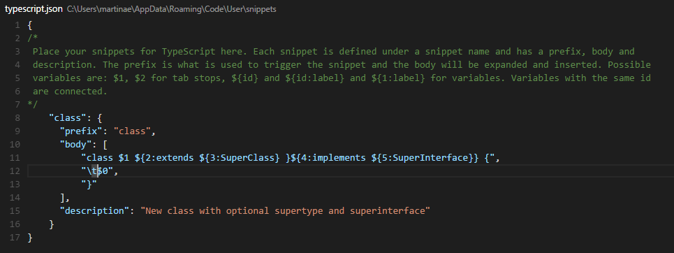

## User Defined Snippets
You can define your own snippets for specific languages: Open `User Snippets` under `File`, `Preferences` and select the language for which the snippets should appear.

Each snippet defines a prefix under which it will appear in IntelliSense via (`kb(editor.action.triggerSuggest)`) as well as a body inserted when the snippet is selected. The snippet syntax follows the [TextMate snippet syntax](https://manual.macromates.com/en/snippets) with the exception of 'regular expression replacements', 'interpolated shell code' and 'transformations', which are not supported.

Once you have added a new snippet you can try it out right away, no restart needed.