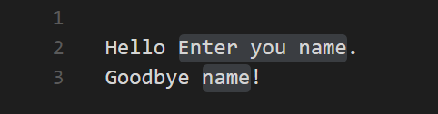

# Adding Snippets to Visual Studio Code

Code snippets are ready-made snippets of code you can quickly insert into your source code. For example, a `for` code snippet creates an empty `for` loop. 

Each snippet defines a prefix under which it will appear in IntelliSense via (`kb(editor.action.triggerSuggest)`) as well as a body inserted when the snippet is selected. The snippet syntax follows the [TextMate snippet syntax](https://manual.macromates.com/en/snippets) with the exception of 'regular expression replacements', 'interpolated shell code' and 'transformations', which are not supported.

<video id="snippets-showcase" src="https://az754404.vo.msecnd.net/public/snippets_showcase.mp4" placeholder="/images/userdefinedsnippets_snippets_placeholder.png" autoplay loop controls muted>
    Sorry you're browser doesn't support HTML 5 video. 
</video>

## Add Snippets from the Marketplace

Many [extensions](/docs/editor/extension-gallery.md) on the VS Code [Marketplace](https://marketplace.visualstudio.com/vscode) include snippets.  If you find one you want to use, simply install it and restart VS Code and the new snippet will be available (see [here](/docs/editor/extension-gallery#_browse-and-install-extensions-in-vs-code) for more instructions on installing an extension).

Below are some popular extensions which include snippets in their language support:

<div class="marketplace-extensions-snippets"></div>

> Tip: The extensions shown above are dynamically queried. Click on an extension tile above to read the description and reviews to decide which extension is best for you. See more in the [Marketplace](https://marketplace.visualstudio.com/vscode).

## Creating your Own Snippets

You can define your own snippets for specific languages.  To open up a snippet file for editing, open **User Snippets** under **File** > **Preferences** (**Code** > **Preferences** on Mac OS X) and select the language for which the snippets should appear.

Snippets are defined in a JSON format and stored in a per user `(languageId).json` file. For example, Markdown snippets go in a `markdown.json` file.

The example below is a `For Loop` snippet for `JavaScript`.

```json
    "For Loop": {
        "prefix": "for",
        "body": [
            "for (var ${index} = 0; ${index} < ${array}.length; ${index}++) {",
            "\tvar ${element} = ${array}[${index}];",
            "\t$0",
            "}"
        ],
        "description": "For Loop"
    },
```

In the example above:

* `For Loop` is the snippet name
* `prefix` defines a prefix used in the IntelliSense drop down.  In this case `for`.
* `body` is the snippet content.

    Possible variables are:
    
    * $1, $2 for tab stops
    * ${id} and ${id:label} and ${1:label} for variables
    * Variables with the same id are connected.

* `description` is the description used in the IntelliSense drop down

The example above has three variables with the `ids` 'index', 'array', and 'element'. You can quickly fill in and tab to each. 

An optional variable `label` lets you add a short description as a prompt to the user.

Here a `label` 'Enter your name' is added to the variable with the `id` 'name':

```json
    "body": [
        "Hello ${name:Enter your name}.",
        "Goodbye ${name}!"
    ],
```

which will display as:



> In case your snippet should contain `{` or `}`, it is possible to escape them, in JSON as `\\{` and `\\}`

Once you have added a new snippet, you can try it out right away, no restart needed.

## Using TextMate Snippets

You can also add TextMate snippets (.tmSnippets) to your VS Code installation using the [yo code](/docs/tools/yocode.md) extension generator. The generator has an option `New Code Snippets` which lets you point to a folder containing multiple .tmSnippets files and they will be packaged into a VS Code snippet extension.  The generator also supports Sublime snippets (.sublime-snippets). 

The final generator output has two files: an extension manifest `package.json` which has metadata to integrate the snippets into VS Code and a `snippets.json` file which includes the snippets converted to the VS Code snippet format.

```bash
.
├── snippets                    // VS Code integration
│   └── snippets.json           // The JSON file w/ the snippets
└── package.json                // extension's manifest
```

Copy the generated snippets folder to a new folder under [your `.vscode/extensions` folder](/docs/extensions/install-extension.md#your-extensions-folder) and restart VS Code.

## Sharing Your Snippets in the Marketplace

Once you have created your snippets and tested them out, you can share them with the community.

To do this, you need to create a snippet extension.  If you've used the `yo code` extension generator, your snippet extension is ready to be published.

If you want to share user snippets, you'll need to package your snippet json file along with an extension manifest which has the necessary metadata to integrate the snippets into VS Code.

Depending on your platform, your user snippets file is located here:

* **Windows** `%APPDATA%\Code\User\snippets\(language).json`
* **Mac** `$HOME/Library/Application Support/Code/User/snippets/(language).json`
* **Linux** `$HOME/.config/Code/User/snippets/(language).json`

where `(language).json` depends on the targeted language of the snippets (e.g. `markdown.json` for Markdown snippets).  Create a new folder for your extension and copy your snippet file to a `snippets` subdirectory.

Now add an extension manifest package.json file to the extension folder.  The snippet extension manifest follows the structure defined in the [Extension Manifest](/docs/extensionAPI/extension-manifest.md) reference and provides a [`snippets` contribution](/docs/extensionAPI/extension-points.md#contributessnippets).

Below is an example manifest for Markdown snippets:

```json
{
    "name": "DM-Markdown",
    "publisher": "mscott",
    "description": "Dunder Mifflin Markdown snippets",
    "version": "0.1.0",
    "engines": { "vscode": "0.10.x" },
    "categories": ["Snippets"], 
    "contributes": {
        "snippets": [
            {
                "language": "markdown",
                "path": "./snippets/markdown.json"
            }
        ]
    }
}
```

Note that snippets need to be associated with a `language` identifier.  This can be a [language supported](/docs/languages/overview.md) directly by VS Code or a language provided by an extension.  Make sure the `language` identifier is correct.

You then use the [vsce publishing tool](/docs/tools/vscecli.md) to publish the snippet extension to the [VS Code Extension Marketplace](/docs/editor/extension-gallery.md).

> **Tip:** To make it easy for users to find your snippet, include the word "snippet" in the extension description and set the `Category` to `Snippets` in your `package.json`.

We also have recommendations on how to make your extension look great on the VS Code Marketplace, see [Marketplace Presentation Tips](/docs/extensionAPI/extension-manifest.md#marketplace-presentation-tips).

## Next Steps

Snippets are just one way to extend VS Code. If you'd like to learn more about VS Code extensibility, try these topics:

* [Colorizers and Bracket Matchers](/docs/customization/colorizer.md) - Learn how to import TextMate colorizers
* [Custom themes](/docs/customization/themes.md) - Learn how to import existing TextMate themes.
* [Extending Visual Studio Code](/docs/extensions/overview.md) - Learn about other ways to extend VS Code
* [Editing Evolved](/docs/editor/editingevolved.md) - Learn more about the VS Code editor's capabilities

## Common Questions

**Q: I created a snippets extension but they aren't showing up in the VS Code editor?**

**A:** Be sure you have correctly specified the `language` identifier for your snippet (e.g. `markdown` for Markdown .md files, `plaintext` for Plain Text .txt files).  Also verify that the relative path to the snippets json file is correct.

