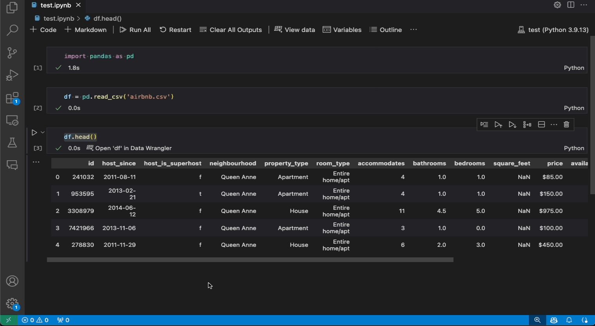
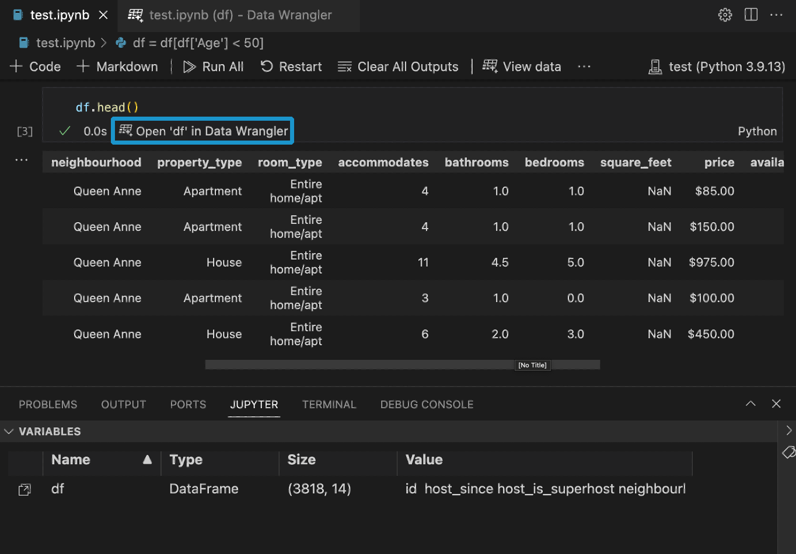
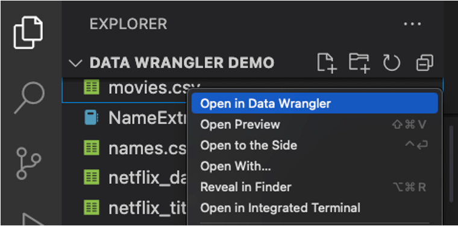
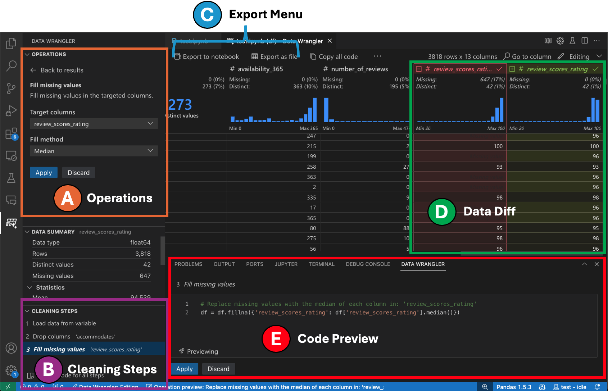
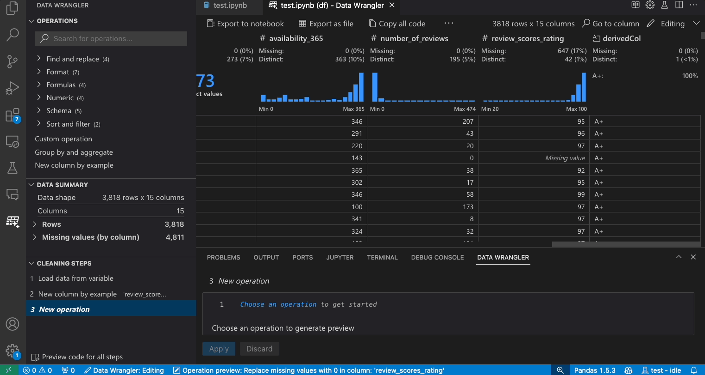

# Quick Start Guide for Data Wrangler in VS Code

[Data Wrangler](https://marketplace.visualstudio.com/items?itemName=ms-toolsai.datawrangler) is a code-centric data viewing and cleaning tool that is integrated into VS Code and VS Code Jupyter Notebooks. It provides a rich user interface to view and analyze your data, show insightful column statistics and visualizations, and automatically generate Pandas code as you clean and transform the data.

The following is an example of opening Data Wrangler from the notebook to analyze and clean the data with the built-in operations. Then the automatically generated code is exported back into the notebook.

The goal of this page is to help you quickly get up and running with Data Wrangler.

## Set up your environment

1. If you have not already done so, install [Python](https://www.python.org/downloads/)
   (**Note:** Data Wrangler only supports Python version 3.8 or higher).
2. <a class="install-extension-btn" href="vscode:extension/ms-toolsai.datawrangler">Install the Data Wrangler extension</a>

When you launch Data Wrangler for the first time, it asks you which Python kernel you would like to connect to. It also checks your machine and environment to see if the required Python packages are installed, such as Pandas.

## Open Data Wrangler

Anytime you are in Data Wrangler, you are in a *sandboxed* environment, meaning you are able to safely explore and transform the data. The original dataset is not modified until you explicitly export your changes.

### Launch Data Wrangler from a Jupyter Notebook

If you have a Pandas data frame in your notebook, you’ll now see an **Open 'df' in Data Wrangler** button (where `df` is the variable name of your data frame) appear in bottom of the cell after running any of `df.head()`, `df.tail()`, `display(df)`, `print(df)`, and `df`.

### Launch Data Wrangler directly from a file

You can also launch Data Wrangler directly from a local file (such as a `.csv`). To do so, open any folder in VS Code that contains the file you’d like to open. In the File Explorer view, right click the file and click **Open in Data Wrangler**.

## UI tour

Data Wrangler has two modes when working with your data. The details for each mode are explained in the subsequent sections below.

1. **Viewing mode:** The viewing mode optimizes the interface for you to quickly view, filter and sort your data. This mode is great for doing initial exploration on the dataset.
2. **Editing mode:** The Editing mode optimizes the interface for you to apply transformations, cleaning, or modifications to your dataset. As you apply these transformations in the interface, Data Wrangler automatically generates the relevant Pandas code, and this can be exported back into your notebook for reuse.

Note: By default, Data Wrangler opens in the Viewing mode. You can change this behavior in the Settings editor `kb(workbench.settings.dataWrangler.startInEditModeForNotebookEntrypoints)`.

### Viewing mode interface

1. The **Data Summary** panel shows detailed summary statistics for your overall dataset or a specific column, if one is selected.

2. You can apply any **Data Filters/Sorts** on the column from the header menu of the column.

3. Toggle between the **Viewing** or **Editing** mode of Data Wrangler to access the built-in data operations.

4. The **Quick Insights** header is where you can quickly see valuable information about each column. Depending on the datatype of the column, quick insights shows the distribution of the data or the frequency of datapoints, as well as missing and distinct values.

5. The **Data Grid** gives you a scrollable pane where you can view your entire dataset.

---

### Editing mode interface

Switching to Editing mode enables additional functionality and user interface elements in Data Wrangler. In the following screenshot, we use Data Wrangler to replace the missing values in the last column with the median of that column.

1. The **Operations** panel is where you can search through all of Data Wrangler’s built-in data operations. The operations are organized by category.

2. The **Cleaning Steps** panel shows a list of all the operations that have been previously applied. It enables the user to undo specific operations or edit the _most recent_ operation. Selecting a step will highlight the changes in the data grid and will show the generated code associated with that operation.

3. The **Export Menu** lets you export the code back into a Jupyter Notebook or export the data into a new file.

4. When you have an operation selected and are previewing its effects on the data, the grid is overlayed with a **data diff** view of the changes you made to the data.

5. The **Code Preview** section shows the Python and Pandas code that Data Wrangler has generated when an operation is selected. It remains empty when no operation is selected. You can edit the generated code, which results in the data grid highlighting the effects on the data.

## Example: Replace missing values in your dataset

Given a dataset, one of the common data cleaning tasks is to handle any missing values that lie within the data. The example below shows how Data Wrangler can be used to replace the missing values in a column with the median value of that column. While the transformation is done through the interface, Data Wrangler also automatically generates the Python and Pandas code required for the replacement of missing values.

1. In the **Operations Panel**, search for the **Fill Missing Values** operation.
2. Specify in the parameters what you would like to replace the missing values with. In this case, we will be replacing the missing values with the median value for the column.
3. Validate that the data grid is showing you the correct changes in the data diff.
4. Validate that the code generated by Data Wrangler is what you intended.
5. Apply the operation and it will be added to your cleaning steps history.

## Next steps

This page covered how to quickly get started with Data Wrangler. For the full documentation and tutorial of Data Wrangler, including all the built-in operations that Data Wrangler currently supports, please see the following page.

[Working with Data Wrangler](/docs/datascience/data-wrangler.md)