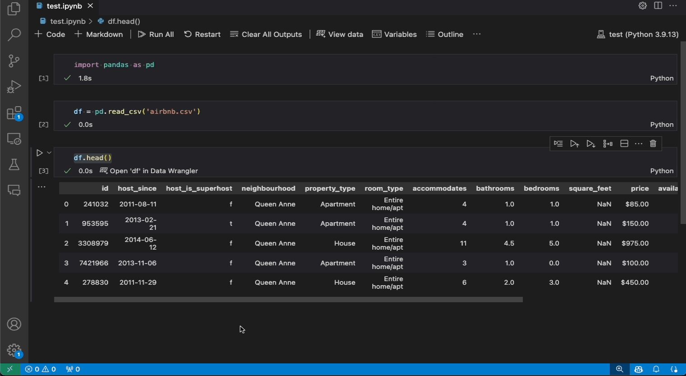
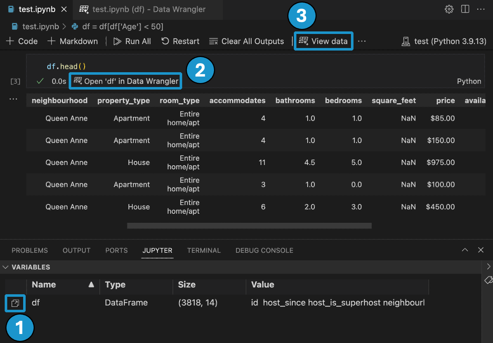
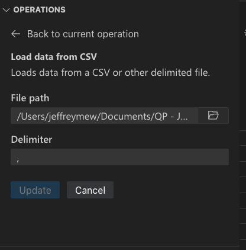
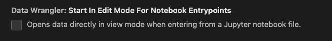
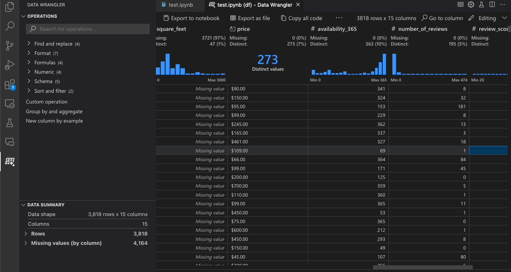
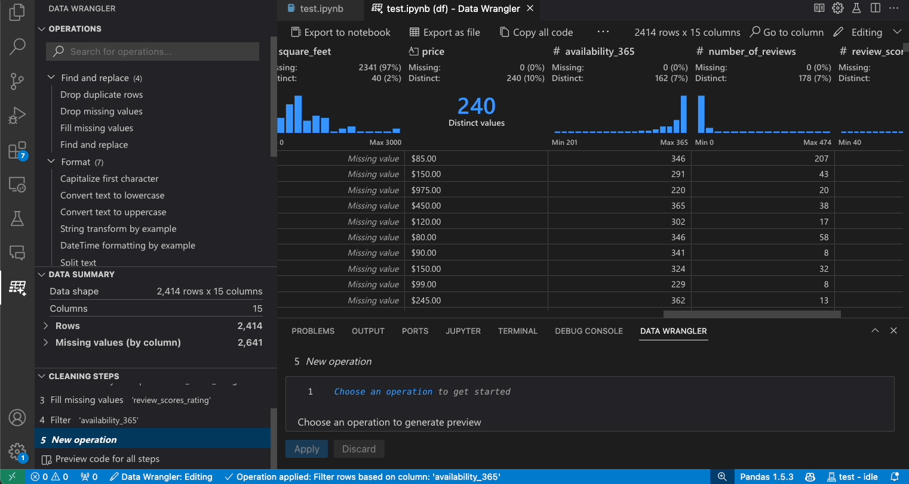
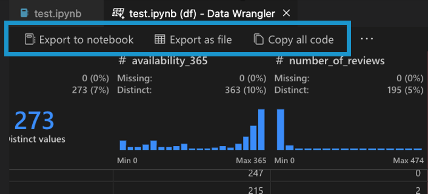
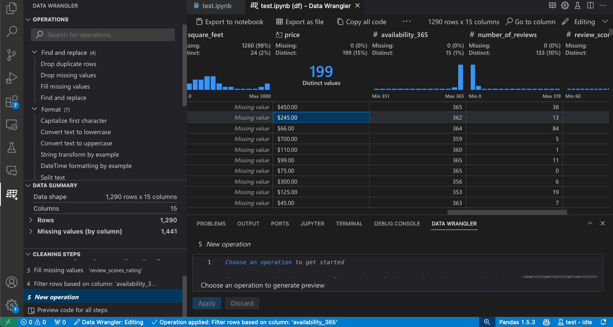

# Getting Started with Data Wrangler in VS Code

[Data Wrangler](https://marketplace.visualstudio.com/items?itemName=ms-toolsai.datawrangler) is a code-centric data viewing and cleaning tool that is integrated into VS Code and VS Code Jupyter Notebooks. It provides a rich user interface to view and analyze your data, show insightful column statistics and visualizations, and automatically generate Pandas code as you clean and transform the data.

The following is an example of opening Data Wrangler from the notebook to analyze and clean the data with the built-in operations. Then the automatically generated code is exported back into the notebook.

This document covers how to:

-   Install and setup Data Wrangler
-   Launch Data Wrangler from a notebook
-   Launch Data Wrangler from a data file
-   Use Data Wrangler to explore your data
-   Use Data Wrangler to perform operations and cleaning on your data
-   Edit and export the data wrangling code to a notebook
-   Troubleshooting and providing feedback

## Set up your environment

1. If you have not already done so, install [Python](https://www.python.org/downloads/).
   **IMPORTANT:** Data Wrangler only supports Python version 3.8 or higher.
2. Install [Visual Studio Code](https://code.visualstudio.com/download).
3. <a class="install-extension-btn" href="vscode:extension/ms-toolsai.datawrangler">Install the Data Wrangler extension</a>

When you launch Data Wrangler for the first time, it asks you which Python kernel you would like to connect to. It also checks your machine and environment to see if the required Python packages are installed, such as Pandas.

Here is a list of the required versions for Python and Python packages, along with whether they are automatically installed by Data Wrangler:

| Name   | Minimum required version | Automatically installed |
| ------ | ------------------------ | ----------------------- |
| Python | 3.8                      | No                      |
| pandas | 0.25.2                   | Yes                     |

If these dependencies are not found in your environment, Data Wrangler will attempt to install them for you with `pip`. If Data Wrangler is unable to install the dependencies, the easiest workaround is to manually run `pip install`, and then launch Data Wrangler again. These dependencies are required for Data Wrangler, such that it can generate Python and Pandas code.

## Open Data Wrangler
Anytime you are in Data Wrangler, you are in a *sandboxed* environment, meaning you are able to safely explore and transform the data. The original dataset is not modified until you explicitly export your changes.

### Launch Data Wrangler from a Jupyter Notebook

There are three ways to launch Data Wrangler from your Jupyter Notebook

1. In the **Jupyter** > **Variables** panel, beside any supported data object, you can see a button to launch Data Wrangler.
2. If you have a Pandas data frame in your notebook, you can now see an **Open 'df' in Data Wrangler** button (where 'df' is the variable name of your data frame) appear in bottom of the cell after running code that outputs the data frame. This includes 1) `df.head()`, 2) `df.tail()`, 3) `display(df)`, 4) `print(df)`, 5) `df`.
3. In the notebook toolbar, selecting **View data** brings up a list of every supported data object in your notebook. You can then choose which variable in that list you want to open in Data Wrangler.

### Launch Data Wrangler directly from a file

You can also launch Data Wrangler directly from a local file (such as a `.csv`). To do so, open any folder in VS Code that contains the file you’d like to open. In the File Explorer view, right click the file and click **Open in Data Wrangler**.

Data Wrangler currently supports the following filetypes
- `.csv`/`.tsv`
- `.xls`/`.xlsx`
- `.parquet`

Depending on the file type, you are able to specify the delimiter and/or sheet of the file.

You can also set these file types to open with Data Wrangler by default.

## UI tour

Data Wrangler has two modes when working with your data. The details for each mode are explained in the subsequent sections below.

1. **Viewing mode:** The Viewing mode optimizes the interface for you to quickly view, filter and sort your data. This mode is great for doing initial exploration on the dataset.
2. **Editing mode:** The Editing mode optimizes the interface for you to apply transformations, cleaning, or modifications to your dataset. As you apply these transformations in the interface, Data Wrangler automatically generates the relevant Pandas code, and this can be exported back into your notebook for reuse.

Note: By default, Data Wrangler opens in the Viewing mode. You can change this behavior in the Settings editor `kb(workbench.settings.dataWrangler.startInEditModeForNotebookEntrypoints)`.

### Viewing mode interface

1. The **Data Summary** panel shows detailed summary statistics for your overall dataset or a specific column, if one is selected.

2. You can apply any **Data Filters/Sorts** on the column from the header menu of the column.

3. Toggle between the **Viewing** or **Editing** mode of Data Wrangler to access the built-in data operations.

4.  The **Quick Insights** header is where you can quickly see valuable information about each column. Depending on the datatype of the column, quick insights shows the distribution of the data or the frequency of datapoints, as well as missing and distinct values.

5. The **Data Grid** gives you a scrollable pane where you can view your entire dataset.

---

### Editing mode interface

Switching to Editing mode enables additional functionality and user interface elements in Data Wrangler. In the following screenshot, we use Data Wrangler to replace the missing values in the last column with the median of that column.

1. The **Operations** panel is where you can search through all of Data Wrangler’s built-in data operations. The operations are organized by category.

2. The **Cleaning Steps** panel shows a list of all the operations that have been previously applied. It enables the user to undo specific operations or edit the *most recent* operation. Selecting a step will highlight the changes in the data diff view and will show the generated code associated with that operation.

3. The **Export Menu** lets you export the code back into a Jupyter Notebook or export the data into a new file.

4. When you have an operation selected and are previewing its effects on the data, the grid is overlayed with a **data diff** view of the changes you made to the data.

5. The **Code Preview** section shows the Python and Pandas code that Data Wrangler has generated when an operation is selected. It remains empty when no operation is selected. You can edit the generated code, which results in the data grid highlighting the effects on the data.

## Data Wrangler operations

The built-in Data Wrangler operations can be selected from the **Operation** panel.

The following table lists the Data Wrangler operations that are currently supported in the initial release of Data Wrangler. We plan to add more operations in the near future.

| Operation                      | Description                                                                                           |
| ------------------------------ | ----------------------------------------------------------------------------------------------------- |
| Sort                           | Sort column(s) ascending or descending                                                                |
| Filter                         | Filter rows based on one or more conditions                                                           |
| Calculate text length          | Create new column with values equal to the length of each string value in a text column               |
| One-hot encode                 | Split categorical data into a new column for each category                                            |
| Multi-label binarizer          | Split categorical data into a new column for each category using a delimiter                          |
| Create column from formula     | Create a column using a custom Python formula                                                         |
| Change column type             | Change the data type of a column                                                                      |
| Drop column                    | Delete one or more columns                                                                            |
| Select column                  | Choose one or more columns to keep and delete the rest                                                |
| Rename column                  | Rename one or more columns                                                                            |
| Clone column                  | Create a copy of one or more columns                                                                            |
| Drop missing values            | Remove rows with missing values                                                                       |
| Drop duplicate rows            | Drops all rows that have duplicate values in one or more columns                                      |
| Fill missing values            | Replace cells with missing values with a new value                                                    |
| Find and replace               | Replace cells with a matching pattern                                                             |
| Group by column and aggregate  | Group by columns and aggregate results                                                                |
| Strip whitespace               | Remove whitespace from the beginning and end of text                                                  |
| Split text                     | Split a column into several columns based on a user defined delimiter                                 |
| Capitalize first character     | Converts first character to uppercase and remaining to lowercase                                      |
| Convert text to lowercase      | Convert text to lowercase                                                                             |
| Convert text to uppercase      | Convert text to UPPERCASE                                                                             |
| String transform by example    | Automatically perform string transformations when a pattern is detected from the examples you provide |
| DateTime formatting by example | Automatically perform DateTime formatting when a pattern is detected from the examples you provide    |
| New column by example          | Automatically create a column when a pattern is detected from the examples you provide.               |
| Scale min/max values           | Scale a numerical column between a minimum and maximum value                                          |
| Round                          | Rounds numbers to the specified number of decimal places |
| Round down (floor)             | Rounds numbers down to the nearest integer |
| Round up (ceiling)             | Rounds numbers up to the nearest integer |
| Custom operation               | Automatically create a new column based on examples and the derivation of existing column(s)          |

If there is an operation that is missing and that you'd like to see supported in Data Wrangler, please file a feature request in our [Data Wrangler GitHub repo](https://github.com/microsoft/vscode-data-wrangler/issues).

## Modify previous steps

Each step of the generated code can be modified through the **Cleaning Steps** panel. First, select the step you want to modify. Then, as you make changes to the operation (either via code or the operation panel), the effects of your changes on the data are highlighted in the grid view.

## Edit and export code

Once you’re done with your data cleaning steps in Data Wrangler, there are three ways for exporting your cleaned dataset from Data Wrangler.

1. **Export code back to Notebook and exit:** This creates a new cell in your Jupyter Notebook with all the data cleaning code you generated, packaged up into a Python function.
2. **Export data to a file:** This saves the cleaned dataset as a new CSV or Parquet file onto your machine.
3. **Copy code to clipboard:** This copies all the code that was generated by Data Wrangler for the data cleaning operations.

## Search for columns

To find a specific column in your dataset, select **Go to column** from the Data Wrangler toolbar and search for the respective column.

## Troubleshooting

### General kernel connectivity issues

For general connectivity issues, please see the "Connecting to a Python kernel" section above on alternative methods to connect. To debug issues related to the local Python interpreter option, one way to potentially fix the issue is to install different versions of the Jupyter and Python extensions. For example, if stable versions of the extensions are installed, you might install the pre-release version (or vice versa).

To clear an already cached kernel, you can run the `Data Wrangler: Clear cached runtime` command from the command palette `kb(workbench.action.showCommands)`.

### Opening a data file gives `UnicodeDecodeError`

If you run into a `UnicodeDecodeError` when opening a data file directly from Data Wrangler, then this could be caused by two possible issues:

1. The file you're trying to open has an encoding other than `UTF-8`
2. The file is corrupted.

To work around this error, you need to open Data Wrangler from a Jupyter Notebook instead of directly from a data file. Use a Jupyter Notebook to read the file using Pandas, for example using the [read_csv](https://pandas.pydata.org/docs/reference/api/pandas.read_csv.html) method. Within the `read` method, use the `encoding` and/or `encoding_errors` parameters to define the encoding to use or how to handle encoding errors. If you don’t know which encoding might work for this file, you can try a library such as [chardet](https://github.com/chardet/chardet) to try to infer an encoding that works.

## Questions and feedback

If you have problems, have feature requests, or any other feedback, please submit an Issue on our GitHub repository: [https://github.com/microsoft/vscode-data-wrangler/issues/new/choose](https://github.com/microsoft/vscode-data-wrangler/issues/new/choose)

## Data and telemetry

The Microsoft Data Wrangler extension for Visual Studio Code collects usage data and sends it to Microsoft to help improve our products and services. Read our [privacy statement](https://go.microsoft.com/fwlink/?LinkId=521839) to learn more. This extension respects the `telemetry.telemetryLevel` setting which you can learn more about at https://code.visualstudio.com/docs/getstarted/telemetry.