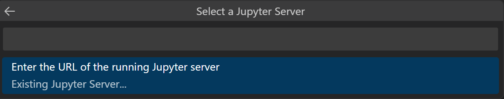

# Jupyter Notebooks in VS Code

[Jupyter](https://jupyter-notebook.readthedocs.io/en/latest/) (formerly IPython Notebook) is an open-source project that lets you easily combine Markdown text and executable Python source code on one canvas called a **notebook**. Visual Studio Code supports working with Jupyter Notebooks natively, and through [Python code files](/docs/python/jupyter-support-py.md). This topic covers the native support available for Jupyter Notebooks and demonstrates how to:

- Create, open, and save Jupyter Notebooks
- Work with Jupyter code cells
- View, inspect, and filter variables using the Variable Explorer and Data Viewer
- Connect to a remote Jupyter server
- Debug a Jupyter Notebook

## Setting up your environment

To work with Python in Jupyter Notebooks, you must activate an Anaconda environment in VS Code, or another Python environment in which you've installed the [Jupyter package](https://pypi.org/project/jupyter/). To select an environment, use the **Python: Select Interpreter** command from the Command Palette (`kb(workbench.action.showCommands)`).

Once the appropriate environment is activated, you can create and open a Jupyter Notebook, connect to a remote Jupyter server for running code cells, and export a Jupyter Notebook as a Python file.

## Workspace Trust

When getting started with Notebooks, you'll want to make sure that you are working in a trusted workspace. Harmful code can be embedded in notebooks and the [Workspace Trust](/docs/editor/workspace-trust.md) feature allows you to indicate which folders and their contents should allow or restrict automatic code execution.

If you attempt to open a notebook when VS Code is in an untrusted workspace running [Restricted Mode](/docs/editor/workspace-trust.md#restricted-mode), you will not be able to execute cells and rich outputs will be hidden.

## Create or open a Jupyter Notebook

You can create a Jupyter Notebook by running the **Create: New Jupyter Notebook** command from the Command Palette (`kb(workbench.action.showCommands)`) or by creating a new `.ipynb` file in your workspace.


Next, select a kernel using the kernel picker in the top right.


After selecting a kernel, the language picker located in the bottom right of each code cell will automatically update to the language supported by the kernel.


If you have an existing Jupyter Notebook, you can open it by right-clicking on the file and opening with VS Code, or through the VS Code File Explorer.

## Running cells

Once you have a Notebook, you can run a code cell using the **Run** icon to the left of the cell and the output will appear directly below the code cell.

You can also use keyboard shortcuts to run code. When in command or edit mode, use `kbstyle(Ctrl+Enter)` to run the current cell or `kbstyle(Shift+Enter)` to run the current cell and advance to the next.


You can run multiple cells by selecting **Run All**, **Run All Above**, or **Run All Below**.


## Save your Jupyter Notebook

You can save your Jupyter Notebook using the keyboard shortcut `kbstyle(Ctrl+S)` or **File** > **Save**.

## Export your Jupyter Notebook

You can export a Jupyter Notebook as a Python file (`.py`), a PDF, or an HTML file. To export, select the **Export** action on the main toolbar. You'll then be presented with a dropdown of file format options.

 

> **Note:** For PDF export, you must have [TeX installed](https://nbconvert.readthedocs.io/en/latest/install.html#installing-tex). If you don't, you will be notified that you need to install it when you select the PDF option. Also, be aware that if you have SVG-only output in your Notebook, they will not be displayed in the PDF. To have SVG graphics in a PDF, either ensure that your output includes a non-SVG image format or else you can first export to HTML and then save as PDF using your browser.

## Work with code cells in the Notebook Editor

The Notebook Editor makes it easy to create, edit, and run code cells within your Jupyter Notebook.

### Create a code cell

By default, a blank Notebook will have an empty code cell for you to start with and an existing Notebook will place one at the bottom. Add your code to the empty code cell to get started.

```python
msg = "Hello world"
print(msg)
```


### Code cell modes

While working with code cells, a cell can be in three states: unselected, command mode, and edit mode. The current state of a cell is indicated by a vertical bar to the left of a code cell and editor border. When no bar is visible, the cell is unselected.


When a cell is selected, it can be in two different modes. It can be in command mode or in edit mode. When the cell is in command mode, it can be operated on and accept keyboard commands. When the cell is in edit mode, the cell's contents (code or Markdown) can be modified.

When a cell is in command mode, a solid vertical bar will appear to the left of the cell.


 When you're in edit mode, the solid vertical bar is joined by a border around the cell editor.


To move from edit mode to command mode, press the `kbstyle(Esc)` key. To move from command mode to edit mode, press the `kbstyle(Enter)` key. You can also use the mouse to **change the mode** by clicking the vertical bar to the left of the cell or out of the code/Markdown region in the code cell.

### Add additional code cells

Code cells can be added to a Notebook using the main toolbar, a cell's add cell toolbar (visible with hover), and through keyboard commands.


 Using the plus icons in the main toolbar and a cell's hover toolbar will add a new cell directly below the currently selected cell.

When a code cell is in command mode, the `kbstyle(A)` key can be used to add a cell above and the `kbstyle(B)` can be used to add a cell below the selected cell.

### Select a code cell

The selected code cell can be changed using the mouse, the up/down arrow keys on the keyboard, and the `kbstyle(J)` (down) and `kbstyle(K)` (up) keys. To use the keyboard, the cell must be in command mode.

### Select multiple code cells

To select multiple cells, start with one cell in selected mode. If you want to select consecutive cells, hold down `kbstyle(Shift)` and click the last cell you want to select. If you want to select any group of cells, hold down `kbstyle(Ctrl)` and click the cells you'd like to add to your selection.

Selected cells will be indicated by the filled background.


### Run a single code cell

Once your code is added, you can run a cell using the **Run** icon to the left of the cell and the output will be displayed below the code cell.


You can also use keyboard shortcuts to run a selected code cell. `kbstyle(Ctrl+Enter)` runs the currently selected cell, `kbstyle(Shift+Enter)` runs the currently selected cell and inserts a new cell immediately below (focus moves to new cell), and `kbstyle(Alt+Enter)` runs the currently selected cell and inserts a new cell immediately below (focus remains on current cell). These keyboard shortcuts can be used in both command and edit modes.

### Run multiple code cells

Running multiple code cells can be accomplished in many ways. You can use the double arrow in the main toolbar of the Notebook Editor to run all cells within the Notebook or the **Run** icons with directional arrows in the cell toolbar to run all cells above or below the current code cell.


### Move a code cell

Moving cells up or down within a notebook can be accomplished via dragging and dropping. For code cells, the drag and drop area is to the left of the cell editor as indicated below. For rendered Markdown cells, you may click anywhere to drag and drop cells.


To move multiple cells, you can use the same drag and drop areas in any cell included in the selection.

You can also use the keyboard shortcuts `kbstyle(Alt+Arrow)` to move one or multiple selected cells.

### Delete a code cell

Deleting a code cell can be accomplished by using the **Delete** icon in the code cell toolbar or through the keyboard shortcut `kbstyle(dd)` when the selected code cell is in command mode.


### Undo your last change

You can use the `kbstyle(z)` key to undo your previous change, for example, if you've made an accidental edit, you can undo it to the previous correct state, or if you've deleted a cell accidentally, you can recover it.

### Switch between code and Markdown

The Notebook Editor allows you to easily change code cells between Markdown and code. Selecting the language picker in the bottom right of a cell will allow you to switch between Markdown and, if applicable, any other language supported by the selected kernel.


You can also use the keyboard to change the cell type. When a cell is selected and in command mode, the `kbstyle(M)` key switches the cell type to Markdown and the `kbstyle(Y)` key switches the cell type to code.

Once Markdown is set, you can enter Markdown formatted content to the code cell.


To render Markdown cells, you can select the check mark in the cell toolbar, or use the `kbstyle(Ctrl+Enter)` and `kbstyle(Shift+Enter)` keyboard shortcuts.


### Clear output or restart/interrupt the kernel

If you'd like to clear all code cell outputs or restart/interrupt the kernel, you can accomplish that using the main Notebook Editor toolbar.


### Enable/disable line numbers

When you are in command mode, you can enable or disable line numbering within a single code cell by using the `kbstyle(L)` key.


To toggle line numbering for the entire notebook, use `kbstyle(Shift+L)` when in command mode on any cell.


## Table of Contents

To navigate through your notebook, open the File Explorer in the Activity bar. Then open the **Outline** tab in the Side bar.


> **Note:** By default, the outline will only show Markdown. To show code cells, enable the following setting:  **Notebook > Outline: Show Code Cells**.

## IntelliSense support in the Jupyter Notebook Editor

The Python Jupyter Notebook Editor window has full IntelliSense – code completions, member lists, quick info for methods, and parameter hints. You can be just as productive typing in the Notebook Editor window as you are in the code editor.


## Variable Explorer and Data Viewer

Within a Python Notebook, it's possible to view, inspect, sort, and filter the variables within your current Jupyter session. By selecting the **Variables** icon in the main toolbar after running code and cells, you'll see a list of the current variables, which will automatically update as variables are used in code. The variables pane will open at the bottom of the notebook.


### Data Viewer

For additional information about your variables, you can also double-click on a row or use the **Show variable in data viewer** button next to the variable for a more detailed view of a variable in the Data Viewer.


### Filtering rows

Filtering rows in the data viewer can be done by typing in the textbox at the top of each column. Type a string you want to search for and any row that has that string in the column will be found:


If you want to find an exact match, prefix your filter with '=':


More complex filtering can be done by typing a [regular expression](https://developer.mozilla.org/en-US/docs/Web/JavaScript/Guide/Regular_Expressions):


## Saving plots

To save a plot from your notebook, simply hover over the output and select the **Save** icon in the top right.


> **Note:** There is support for rendering plots created with [matplotlib](https://matplotlib.org/) and [Altair](https://altair-viz.github.io/index.html).

## Custom notebook diffing

Under the hood, Jupyter Notebooks are JSON files. The segments in a JSON file are rendered as cells that are comprised of three components: input, output, and metadata. Comparing changes made in a notebook using lined-based diffing is difficult and hard to parse. The rich diffing editor for notebooks allows you to easily see changes for each component of a cell.

You can even customize what types of changes you want displayed within your diffing view. In the top right, select the overflow menu item in the toolbar to customize what cell components you want included. Input differences will always be shown.


To learn more about Git integration within VS Code, visit [Source Control in VS Code](/docs/sourcecontrol/overview.md).

## Debug a Jupyter Notebook

There are two different ways to debug a Jupyter notebook: a simpler mode called "Run by Line", and full debugging mode.

> **Note:** Both of these features require ipykernel 6+. See [this wiki page](https://github.com/microsoft/vscode-jupyter/wiki/Setting-Up-Run-by-Line-and-Debugging-for-Notebooks) for details about installing or upgrading ipykernel.

### Run by Line

Run by Line lets you execute a cell one line at a time, without being distracted by other VS Code debug features. To start, select the **Run by Line** button in the cell toolbar:


Use the same button to advance by one statement. You can select the cell **Stop** button to stop early, or the **Continue** button in the toolbar to continue running to the end of the cell.

### Debug Cell

If you want to use the full set of debugging features supported in VS Code, such as breakpoints and the ability to step in to other cells and modules, you can use the full VS Code debugger.

1. Start by setting any breakpoints you need by clicking in the left margin of a notebook cell.
2. Then select the **Debug Cell** button in the menu next to the **Run** button. This will run the cell in a debug session, and will pause on your breakpoints in any code that runs, even if it is in a different cell or a `.py` file.
3. You can use the Debug view, Debug Console, and all the buttons in the Debug Toolbar as you normally would in VS Code.


### Search through notebook

You can search kbstyle(Ctrl/Cmd + F) through an entire notebook or you can search parts of your notebook by filtering your search options. When searching through your notebook, click on the Filter option (funnel icon) to search across:
- Markdown cell input (**Markdown Source**)
- Markdown cell output (**Rendered Markdown**)
- Code cell input (**Code Cell Source**)
- Code cell output (**Cell Output**)

Notebook searches are filtered cell inputs only by default.


## Connect to a remote Jupyter server

You can offload intensive computation in a Jupyter Notebook to other computers by connecting to a remote Jupyter server. Once connected, code cells run on the remote server rather than the local computer.

To connect to a remote Jupyter server:

1. Open the Kernel Picker button on the top right-hand side of the notebook (or run the **Notebook: Select Notebook Kernel** command from the Command Palette).

   

2. Select the **Existing Jupyter Server** option to connect to an existing Jupyter server.

   

3. To connect to an existing server for the first time, select **Enter the URL of the running Jupyter server**.

   

4. When prompted to **Enter the URL of the running Jupyter server**, provide the server's URI (hostname) with the authentication token included with a `?token=` URL parameter. (If you start the server in the VS Code terminal with an authentication token enabled, the URL with the token typically appears in the terminal output from where you can copy it.) Alternatively, you can specify a username and password after providing the URI.

   

> **Note:** For added security, Microsoft recommends configuring your Jupyter server with security precautions such as SSL and token support. This helps ensure that requests sent to the Jupyter server are authenticated and connections to the remote server are encrypted. For guidance about securing a notebook server, refer to the [Jupyter documentation](https://jupyter-notebook.readthedocs.io/en/stable/public_server.html#securing-a-notebook-server).
