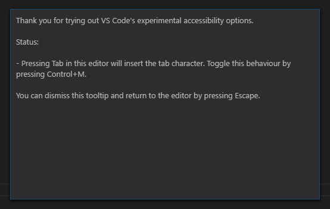
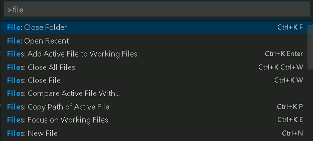
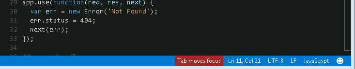
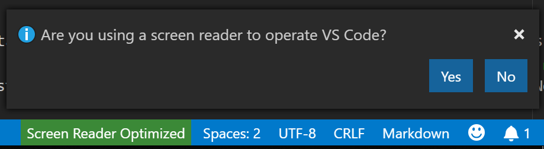

# Accessibility

Visual Studio Code has many features to help make the editor accessible to all users. Zoom levels and High Contrast colors improve editor visibility, keyboard-only navigation supports use without a mouse, and the editor is optimized for screen readers.

## Zoom

You can adjust the zoom level in VS Code with the **View** > **Appearance** > **Zoom** commands.  Each **Zoom** command  increases or decreases the zoom level by 20 percent.

* **View** > **Appearance** > **Zoom In** (`kb(workbench.action.zoomIn)`) - increase the zoom level.
* **View** > **Appearance** > **Zoom Out** (`kb(workbench.action.zoomOut)`) - decrease the zoom level.
* **View** > **Appearance** > **Reset Zoom** (`kb(workbench.action.zoomReset)`) - reset the zoom level to 0.

>**Note**: If you are using a magnifier, hold down the `kbstyle(Alt)` key while viewing the hover to move the cursor over the hover.


### Persisted zoom level

When you adjust the zoom level with the **View** > **Appearance** > **Zoom In / Out** commands, the zoom level is persisted in the `window.zoomLevel` [setting](/docs/getstarted/settings.md). The default value is 0 and each increment/decrement changes the zoom level by 20 percent.

## Accessibility help

The command **Open Accessibility Help** `kb(editor.action.accessibilityHelp)` opens a help menu based on the current context. It currently applies to the editor, terminal, notebook, chat view, and inline chat features.

You can dismiss the accessibility help menu or open additional documentation from within the help menu.



## High Contrast theme

VS Code supports a High Contrast color theme on all platforms.  Use **File** > **Preferences** > **Theme** > **Color Theme** (`kb(workbench.action.selectTheme)`) to display the **Select Color Theme** dropdown and select the **High Contrast** theme.


## Color vision accessibility

You can search for extensions in **Visual Studio Marketplace** that are compatible with color vision deficiency. Use the Extensions view `kb(workbench.view.extensions)` and search for "color blind" to populate relevant options.


Once you have installed a color theme from the Marketplace, you can change the [color theme](/docs/getstarted/themes.md) with **File** > **Preferences** > **Theme** > **Color Theme** `kb(workbench.action.selectTheme)`.


### Recommended themes for color vision accessibility

* [GitHub](https://marketplace.visualstudio.com/items?itemName=GitHub.github-vscode-theme) - Accessible to most forms of color blindness and matches the themes in GitHub's settings.
* [Gotthard](https://marketplace.visualstudio.com/items?itemName=janbiasi.gotthard-theme) - Optimized for approximately 20 programming languages.
* [Blinds](https://marketplace.visualstudio.com/items?itemName=tankashing.blinds-theme) - Created for people with deuteranopia, featuring a high contrast color ratio.
* [Greative](https://marketplace.visualstudio.com/items?itemName=Greative.greative) - Considers both color blindness and light sensitivity.
* [Pitaya Smoothie](https://marketplace.visualstudio.com/items?itemName=trallard.pitaya-smoothie) - Accessible to most forms of color blindness and compliant with [WCAG 2.1 criteria for color contrast](https://www.w3.org/TR/UNDERSTANDING-WCAG20/visual-audio-contrast-contrast.html).

## Customizing warning colors

The default Color Theme for VS Code is **Dark+**. However, you can customize both the theme and property colors in the user interface.

>**Note**: Go to [Customizing a Color Theme](/docs/getstarted/themes.md#customizing-a-color-theme) for more information about overriding the colors in your current theme.

To customize the error and warning squiggles, go to **File** > **Preferences** > **Settings** for user settings. Search for "color customizations" to find the **Workbench: Color Customizations** setting, and open your user `settings.json` file by selecting **Edit in settings.json**.


In your `settings.json` file, nest the following code inside the outermost curly braces. You can assign a color to each object by entering a hex code.

```json
"workbench.colorCustomizations": {
    "editorError.foreground": "#ffef0f",
    "editorWarning.foreground": "#3777ff"
}
```

In the following example, the warning color is applied when a comma is missing after a JSON item.


* `editorError.foreground` - Overrides the wavy line beneath an error.
* `editorWarning.foreground` - Overrides the wavy line beneath a warning.
* `editorError.background` - Overrides the highlight color of an error.
* `editorWarning.background` - Overrides the highlight color of a warning.

Assigning a color to the background of `editorError` and `editorWarning` also helps to identify potential issues. The color that you choose will highlight the respective error or warning. The colors shown in the preceding example, `#ffef0f` (yellow) and `#37777ff` (blue), are more accessible to individuals with common forms of color vision deficiencies.

### Selecting accessible colors

The accessibility of colors is subjective to the type of anomalous trichromacy (color blindness). The level of severity ranges per person and can be divided into four condition types:

|   Condition      |   Type    |
|       ---        |    ---    |
|   Deuteranopia   |   Reduced sensitivity to green light. It is the most common form of color blindness.
|   Protanopia     |   Reduced sensitivity to red light.
|   Tritanopia     |   Reduced sensitivity to blue light. This condition is considered rare.
|   Monochromia    |   The inability to see all colors, also referred to as achromatopsia. More information about the rarest form of color blindness: [Foundation for Fighting Blindness](https://www.fightingblindness.org/diseases/achromatopsia).

One of the best approaches to selecting the best colors for a specific condition is to apply complementary colors. These are colors located opposite of one another on a color wheel.


>**Note**: For more information on finding complementary colors, access the color blind simulator and interactive color wheel at [Adobe Color](https://color.adobe.com/create/color-accessibility).

## Dim unfocused editors and terminals

Unfocused views can be dimmed to make it clearer where typed input will go. This is especially useful when working with multiple editor groups or terminals. Turn on this feature by setting `"accessibility.dimUnfocused.enabled": true`. You can control the dimness level with `accessibility.dimUnfocused.opacity`, which takes the opacity fraction from 0.2 to 1 (default 0.75).

## Keyboard navigation

VS Code provides an exhaustive list of commands in the **Command Palette** (`kb(workbench.action.showCommands)`) so that you can use VS Code without a mouse. Press `kb(workbench.action.showCommands)`, then type a command name (for example 'git') to filter the list of commands.

VS Code also has many preset keyboard shortcuts for commands.



You can also set your own keyboard shortcuts. **File** > **Preferences** > **Keyboard Shortcuts** (`kb(workbench.action.openGlobalKeybindings)`) opens the Keyboard Shortcuts editor, where you can discover and modify key bindings for VS Code actions. See [Key Bindings](/docs/getstarted/keybindings.md) for more details on customizing or adding your own keyboard shortcuts.

For quick navigation across the workbench, we recommend using **Focus Next Part** (`kb(workbench.action.focusNextPart)`) and **Focus Previous Part** (`kb(workbench.action.focusPreviousPart)`) commands.

### Anchor selection

To make it easier to start and end selections with the keyboard, there are four commands: **Set Selection Anchor** (`kb(editor.action.setSelectionAnchor)`), **Select From Anchor to Cursor** (`kb(editor.action.selectFromAnchorToCursor)`), **Cancel Selection Anchor** (`kb(editor.action.cancelSelectionAnchor)`) and **Go to Selection Anchor**.

## Tab navigation

You can use the `kbstyle(Tab)` key to navigate between UI controls in VS Code. Use `kbstyle(Shift+Tab)` to tab in reverse order. As you tab through the UI controls, an indicator will appear around each UI element when it has focus.

All elements in the workbench support tab navigation. To avoid having too many tab stops, workbench toolbars and tab lists each have only one. Once a toolbar or a tab list has focus, you can use the arrow keys to navigate within them.

> **Note**: Tab navigation goes in the visually natural order, with the exception of WebViews (like Markdown preview). For WebViews, we recommend using the `kb(workbench.action.focusNextPart)` and `kb(workbench.action.focusPreviousPart)` commands to navigate between the WebViews and the rest of the workbench. Alternatively, you can use one of many Focus Editor commands.

## Tab trapping

By default, pressing `kbstyle(Tab)` within a source code file inserts the Tab character (or spaces depending on your indentation setting) and does not leave the open file. You can toggle `kbstyle(Tab)` trapping with `kb(editor.action.toggleTabFocusMode)`, and subsequent `kbstyle(Tab)` keys will move focus out of the file.  When default `kbstyle(Tab)` trapping is off, you will see a **Tab moves focus** indicator in the Status Bar.

Tab trapping also exists in the integrated terminal. The default behavior for the feature can be configured with `editor.tabFocusMode`.



You can also toggle `kbstyle(Tab)` trapping on and off from the **Command Palette** (`kb(workbench.action.showCommands)`) with the **Toggle Tab Key Moves Focus** action.

Read-only files never trap the `kbstyle(Tab)` key. The **Integrated Terminal** panel respects the `kbstyle(Tab)` trapping mode and can be toggled with `kb(editor.action.toggleTabFocusMode)`.

## Screen readers

VS Code supports screen readers in the editor using a strategy based on text pagination. The following screen readers have been tested:

* Windows: [NVDA](https://www.nvaccess.org) and [JAWS](https://www.freedomscientific.com/products/software/jaws)
* macOS: [VoiceOver](https://support.apple.com/guide/voiceover/welcome/mac)
* Linux: [Orca](https://help.gnome.org/users/orca/stable/introduction.html)

> For NVDA, we recommend that you stay in focus mode and use the hotkeys to navigate, instead of using browse mode.

The **Go to Next/Previous Error or Warning** actions (`kb(editor.action.marker.nextInFiles)` and `kb(editor.action.marker.prevInFiles)`) allow screen readers to announce the error and warning messages.

When suggestions pop up, they are announced to screen readers. Navigate the suggestions using `kbstyle(Ctrl+Up)` and `kbstyle(Ctrl+Down)` and dismiss them with `kbstyle(Shift+Escape)`. If suggestions get in your way, you can turn them off with the `editor.quickSuggestions` setting.

In the diff view pane, the **Go to Next/Previous Difference** actions (`kb(editor.action.accessibleDiffViewer.next)` and `kb(editor.action.accessibleDiffViewer.prev)`) will show the Accessible Diff Viewer with diffs presented in a unified patch format. Navigate through the unchanged, inserted, or deleted lines with `kbstyle(Up)` and `kbstyle(Down)`. Press `kbstyle(Enter)` to return focus to the modified pane of the diff editor at the selected line number (or the closest line number that still exists, if a deleted line is selected). Use `kbstyle(Escape)` or `kbstyle(Shift+Escape)` to dismiss the Accessible Diff Viewer.

## Accessible View

Run the command **Open Accessible View** `kb(editor.action.accessibleView)` to display an Accessible View and inspect content character by character, line by line. The Accessible View is currently available for hovers, notifications, comments, notebook output, terminal output, chat responses, debug console output, and more.

## Screen reader mode

When VS Code detects that a screen reader is being used, it goes into an optimized screen reader mode for UI such as the editor and Integrated Terminal. The Status bar will display **Screen Reader Optimized** in the lower right. You can exit screen reader mode by clicking on the display text or using the **Toggle Screen Reader Accessibility Mode** command.



Some features, such as folding and minimap (code overview), are disabled when in screen reader mode. You can control whether VS Code uses screen reader mode with the **Editor: Accessibility Support** setting (`editor.accessibilitySupport`) and the values are `on`, `off`, or the default `auto` that automatically detects a screen reader through querying the platform.

## Input control and result navigation

Navigating between an input control (for example, search or filter input) and its results is consistent across the Extensions view, the Keyboard Shortcuts editor, and the Comments, Problems, and Debug Console panels using (`kb(widgetNavigation.focusNext)`) and (`kb(widgetNavigation.focusPrevious)`).

## Terminal accessibility

You can display terminal accessibility help via `kb(editor.action.accessibilityHelp)`, which describes useful tips when using a screen reader. One tip is to use `kb(workbench.action.terminal.focusAccessibleBuffer)` to access the buffer in the terminal. This will automatically enter the screen reader's browse mode, depending on your screen reader, for an accessible view of the entire terminal buffer.

Use `editor.tabFocusMode` to control whether the terminal receives the `kbstyle(Tab)` key instead of the workbench, similar to the editor.

### Shell integration

The terminal has a feature called [shell integration](/docs/terminal/shell-integration.md) that enables many additional features that are not found in other terminals. When using a screen reader, the [Run Recent Command](/docs/terminal/shell-integration.md#run-recent-command) and [Go to Recent Directory](/docs/terminal/shell-integration.md#go-to-recent-directory) features are particularly useful.

Another shell integration powered command, **Go to Symbol in Accessible View** (`kb(editor.action.accessibleViewGoToSymbol)`), lets you navigate between terminal commands similar to **Go to Symbol in Editor...** navigation in the editor.

### Minimum contrast ratio

Set `terminal.integrated.minimumContrastRatio` to a number between 1 and 21 to adjust text color luminance until the desired contrast ratio is met or pure white (`#FFFFFF`) black (`#000000`) is hit.

Note that the `terminal.integrated.minimumContrastRatio` setting will not apply to `powerline` characters.

## Status bar accessibility

Once focus is in the Status bar via **Focus Next Part** (`kb(workbench.action.focusNextPart)`), you can use arrow navigation to move focus between Status bar entries.

### Diff editor accessibility

There is an Accessible Diff Viewer in the Diff editor that presents changes in a unified patch format. You can navigate between changes with **Go to Next Difference** (`kb(editor.action.accessibleDiffViewer.next)`) and **Go to Previous Difference** (`kb(editor.action.accessibleDiffViewer.prev)`). Navigate lines with the arrow keys and press `kbstyle(Enter)` to jump back in the Diff editor and the selected line.

## Debugger accessibility

The VS Code debugger UI is user accessible and has the following features:

* Debug state changes are read out (for example, 'started', 'breakpoint hit', 'terminated', ...).
* All debug actions are keyboard accessible.
* Both the Run and Debug view and Debug Console support Tab navigation.
* Debug hover is keyboard accessible (`kb(editor.action.showHover)`).
* Keyboard shortcuts can be created to set focus to each debugger area.

## Accessibility Signals

Accessibility signals indicate if the current line has certain markers such as: errors, warnings, breakpoints, folded text regions or inline suggestions.

They are played when the primary cursor changes its line or the first time a marker is added to the current line. Accessibility Signal sounds and announcements may be enabled automatically when a screen reader is attached and can be controlled by the settings `accessibility.signals.*`.

The command **Help: List Signal Sounds** lists all available sounds, lets you hear each as you move through the list, and allows for configuring their enabled/disabled status.

Aria announcements also inform screen reader and braille users that certain markers have been hit. The command **Help: List Signal Announcements** informs the user of which are available and allows for configuring their enabled/disabled status.

## Hover accessibility

Some hovers cannot be hovered normally, which makes them hard to use with screen magnifiers. To work around this, hold the `kbstyle(Alt)` or `kbstyle(Option)` key while a hover is active to "lock" it in place so that it won't hide when hovered. Release the key to unlock the hover.

## Current known issues

VS Code has some known accessibility issues, depending on the platform. For the full list, go to [VS Code accessibility issues](https://github.com/microsoft/vscode/issues?q=is%3Aopen+is%3Aissue+label%3Aaccessibility).

### macOS

The editor includes screen reader support for VoiceOver.

### Linux

VS Code works well with the Orca screen reader. If Orca in your Linux distribution does not read the editor content:

* Make sure to have the setting `"editor.accessibilitySupport": "on"` in VS Code. You can do this using settings, or by running the **Show Accessibility Help** command and pressing `kbstyle(Ctrl+E)` to turn on accessibilitySupport.
* If Orca is still silent, try setting `ACCESSIBILITY_ENABLED=1` as an environment variable.

After you enable that setting, VS Code should work with the Orca screen reader.

## Next steps

Read on to find out about:

* [Visual Studio Code User Interface](/docs/getstarted/userinterface.md) - A quick orientation to VS Code.
* [Basic Editing](/docs/editor/codebasics.md) - Learn about the powerful VS Code editor.
* [Code Navigation](/docs/editor/editingevolved.md) - Move quickly through your source code.
