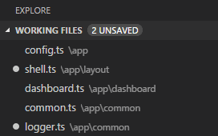

# The Basics of Visual Studio Code
At its heart, Visual Studio Code is a code editor. Like many other code editors, VS Code adopts a common UI and layout of an explorer on the left, showing all of the files and folders you have access to, and an editor on the right, showing the content of the files you have opened.

In addition, there are a number of unique features in the VS Code user interface. This topic describes these features.


## Files, Folders & Projects
VS Code is file and folder based - you can get started immediately by opening a file or folder in VS Code.

On top of this, VS Code can read and take advantage of a variety of project files defined by different frameworks and platforms. For example, if the folder you opened in VS Code contains one or more `package.json`, `project.json`, `tsconfig.json`, or ASP.NET 5 Visual Studio solution and project files, VS Code will read these files and use them to provide additional functionality, such as rich IntelliSense in the editor.


## Basic Layout
VS Code comes with a simple and intuitive layout that maximizes the space provided for the editor while leaving ample room to browse and access the full context of your folder or project. The UI is divided into four areas:
* **Editor** the main area to edit your files. You can open up to three editors side by side
* **Side Bar** contains different views like the Explorer to assist you while working on your project
* **Status Bar** indicates information about the opened project and the files you edit
* **View Bar** on the far left-hand side, lets you switch between views and gives you additional context-specific indicators, like the number of outgoing changes when Git is enabled

Each time you start VS Code, it opens up in the same state it was in when you last closed it. The folder, layout, and opened files are preserved.


Instead of placing files in separate tabs, VS Code allows up to three visible editors at any one time, allowing you place up to three files together side by side.

This helps to reduce the overhead of managing tabs but does not restrict the number of files you can work with. The Explorer view maintains a list of working files allowing you quick access to the files you need.


>**Tip:** You can move the Side Bar to the right hand side (`View, Move Sidebar`) or toggle its visibility (`kb(workbench.action.toggleSidebarVisibility)`).


## Side by Side Editing
You can have up to three editors open side by side.

If you already have one editor open, there are multiple ways of opening another editor to the side of the existing one:
* `kbstyle(Ctrl)` (Mac: `kbstyle(Cmd)`) click on a file in the Explorer
* `kb(workbench.action.splitEditor)` to split the active editor into two
* `Open to the Side` from the Explorer context menu on a file


Whenever you open another file, the editor that is active will display the content of that file. So if you have two editors side by side and you want to open file 'foo.cs' into the right hand editor, make sure that editor is active (by clicking inside it) before opening file 'foo.cs'.

When you have more than one editor open you can switch between them quickly by holding the `kbstyle(Ctrl)` (Mac: `kbstyle(Cmd)`) key and pressing `1`, `2`, or `3`.

>**Tip:** You can resize editors and reorder them. Drag and drop the editor title area to reposition or resize the editor.


## Explorer
The Explorer is used to browse, open, and manage all of the files and folders in your project.

After opening a folder in VS Code, the contents of the folder are shown in the Explorer. You can do many things from here:

* create, delete, and rename files and folders
* move files and folders with drag and drop
* use the context menu to explore all options

>**Tip:** You can drag and drop files into the Explorer from outside VS Code to copy them


VS Code works very well with other tools that you might use, especially command line tools. If you want to run a command line tool in the context of the folder you currently have open in VS Code, right-click the folder and select `Open in Console`.

You can also navigate to the location of a file or folder in the native Explorer by right-clicking on a file or folder and selecting `Reveal in Explorer` (or `Reveal in Finder` on the Mac).

>**Tip:** Type `kb(workbench.action.quickOpen)` to quickly search and open a file by its name.

By default, VS Code excludes some folders from the explorer (for example. `.git`). Use the `files.exclude` setting to configure rules for hiding files and folders from the explorer.

**Tip:** This is really useful to hide derived resources files, like `\*.meta` in Unity, or `\*.js` in a TypeScript project. For Unity to exclude the `\*.cs.meta` files, the pattern to choose would be: `"**/*.cs.meta": true`


## Working Files
At the top of the Explorer is a section labeled `Working Files`. This is a list of active files. These are files you previously opened in VS Code that you're working on. For example, a file will be listed in the working files section if you:

* make a change to a file
* double-click a file in the Explorer
* open a file that is not part of the current folder



Think of the working files section as similar to Tabs that you may be familiar with in other code editors or IDEs. Just click a file in the working files section, and it becomes active in VS Code.

Once you are done with your task, you can individually remove files from the working files section, or you can remove all files from the working files section by using the `Close All Files` action.

>**Tip:** You can configure the appearance of working files in your settings. For example, you can set the maximum number of visible files before a scroll bar appears via `explorer.workingFiles.maxVisible` and whether the working files section should dynamically set its height via `explorer.workingFiles.dynamicHeight`.


## Save/Auto Save
By default, VS Code requires an explicit action to save your changes to disk, `kb(workbench.action.files.save)`.

However, it's easy to turn on `Auto Save`, which will save your changes on idle. With this option turned on, there is no need to explicitly save the file. This can be a great feature, but if you are using file watchers to automate tasks, you may want to turn this behavior off so that you have greater control when tasks run in the background.

To turn on Auto Save (or turn it off), simply open the Command Palette, `kb(workbench.action.showCommands)`, and type `auto` to filter the list and hit `kbstyle(Enter)`.

You can also find this setting as an option on the `File` menu.


## Search Across Files
VS Code allows you to quickly search over all files in the currently-opened folder.  Simply type `kb(workbench.view.search)` and type in your search. Search results are grouped into files containing the search term, with an indication of the hits in each file and its location. Expand a file to see a preview of all of the hits within that file. Then single-click on one of the hits to view it in the editor.


>**Tip:** We support regular expression searching in the search box, too.

You can configure advanced search options by typing `kb(workbench.action.search.toggleQueryDetails)`. This will show additional fields to configure the search.


In the two input boxes below the search box, you can include and exclude files. Click on the toggle to the right to enable the glob pattern syntax:

* `*` to match one or more characters in a path segment
* `?` to match on one character in a path segment
* `**` to match any number of path segments, including none
* `{}` to group conditions (e.g. `{**/*.html,**/*.txt}` matches all HTML and text files)
* `[]` to declare a range of characters to match (e.g., `example.[0-9]` to match on `example.0`, `example.1`, …)

VS Code excludes some folders by default to reduce the number of search results that you are not interested in (for example: `node_modules`). Open settings to change these rules under the `files.exclude` and `search.exclude` section.

>**Tip:** From the Explorer you can right-click on a folder and select `Find in Folder` to search inside a folder only.


## Command Palette
VS Code is equally accessible from the keyboard. The most important key combination to know is `kb(workbench.action.showCommands)`, which brings up the Command Palette. From here, you have access to all of the functionality of VS Code, including keyboard shortcuts for the most common operations.


The Command Palette UI provides access to many commands. You can execute editor commands, open files, search for symbols, and see a quick outline of a file, all using the same interactive window. Here are a few tips:

* `kb(workbench.action.quickOpen)` will let you navigate to any file or symbol by simply typing its name
* `kb(workbench.action.openPreviousEditor)` will cycle you through the last set of files opened
* `kb(workbench.action.showCommands)` will bring you directly to the editor commands
* `kb(workbench.action.gotoSymbol)` will let you navigate to a specific symbol in a file
* `kb(workbench.action.gotoLine)` will let you navigate to a specific line in a file

Type `?` into the input field to get a list of available commands you can execute from here:


## Quick File Navigation
The Explorer is great for navigating between files when you are exploring a project. However, when you are working on a task, you will find yourself quickly jumping between the same set of files. VS Code provides two powerful commands to navigate in and across files with easy-to-use key bindings.

Press `kb(workbench.action.openPreviousEditor)` to view a list of all files that have been opened since VS Code was launched. To open one of these files, hold the `kbstyle(Ctrl)` (Mac: `kbstyle(Cmd)`) key and press `kbstyle(Tab)` to pick the file you want to navigate to.


Alternatively, you can use `kb(workbench.action.navigateBack)` and `kb(workbench.action.navigateForward)` to navigate between files and edit locations. If you are jumping around between different lines of the same file, these shortcuts allow you to navigate between those locations easily.

>**Tip:** You can open any file by its name when you type `kb(workbench.action.quickOpen)`.


## File Encoding Support
Set the file encoding globally or per workspace by using the `files.encoding` setting in **User Settings** or **Workspace Settings**.


You can view the file encoding in the status bar.


Click on the encoding in the status bar to reopen or save the active file with a different encoding.


Then choose an encoding.


## Launching from the Command Line
You can launch VS Code from the command line to quickly open a file, folder, or project. Typically, you open VS Code within the context of a folder. We find the best way to do this is to simply type:

```
code .
```

>**Tip:** We have instructions for Mac and Linux users in our [Setup](/docs/editor/setup.md) topic that enable you to start VS Code from within a terminal.  We add Code to the PATH environment variable in Windows automatically.

Sometimes you will want to open or create a file. If a file does not exist, we will create it for you:

````
code index.html style.css readme.md
````

>**Tip:** You can have as many file names as you want separated by spaces.


## Additional Command line arguments
Here are optional command line arguments you can use when starting VS Code at the command line via `code`:

Argument|Description
------------------|-----------
`-g` or `--goto` | When used with *file:line:column?*, opens a file at a specific line and optional column position. This argument is provided since some operating systems permit `:` in a file name.
`-n` or `--new-window`| Opens a new session of VS Code instead of restoring the previous session.
`-r` or `--reuse-window` | Forces opening a file or folder in the last active window.
*file* | Name of a file to open. If the file doesn't exist, it will be created and marked as edited. You can specify multiple files by separating each file name with a space.
*file:line:column?* | Name of a file to open at the specified line and optional column position. You can specify multiple files in this manner, but you must use the `-g` argument (once) before using the *file:line:column?* specifier.
*folder* | Name of a folder to open. You can specify multiple folders.

For both files and folders, you can use absolute or relative paths. Relative paths are relative to the current directory of the command prompt where you run `code`.

If you specify more than one file or folder at the command line, VS Code will open only a single instance.


## Opening a Project
VS Code does not distinguish between opening a folder and opening a project. Instead, if the folder you open contains any project files, VS Code will read those files and indicate the project context in the status bar. From there, you can switch between projects if more than one project is found.

To open the project contained in the folder `C:\src\WebApp`:

````
code C:\src\webapp
````


In other words, opening the folder containing the project effectively opens that project:


## Window Management
VS Code has some options to control how windows should be opened or restored between sessions.

The `window.openInNewWindow` setting controls if files should open in a new window instead of reusing an existing VS Code instance. By default, VS Code will open a new window when you double-click on a file outside VS Code or open a file from the command line. Set this to `false` to reuse the last active instance of VS Code and open files in there.

The `window.reopenFolders` setting tells VS Code how to restore the opened windows of your previous session. By default, VS Code will
reopen the last opened folder you worked on (setting: `one`). Change this setting to `none` to never reopen any folders and always start with an empty VS Code instance. Change it to `all` to restore all folders you worked on during your previous session.

## Next Steps
OK, you got past the basic UI - there is a lot more to Code.  Read on to find out about:

* [Editing Evolved](/docs/editor/editingevolved.md) - Lint, IntelliSense, Lightbulbs, Peek and Goto Definition, and more
* [Debugging](/docs/editor/debugging.md) - This is where VS Code really shines
* [Customization](/docs/customization/overview.md) - Themes, settings, and keyboard bindings

## Common Questions

**Q: Is it possible to globally search and replace?**

**A:** This feature is not yet implemented, but you can expect it to come in the future!
