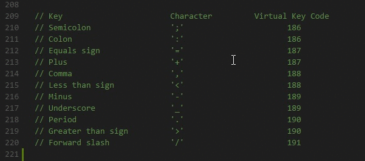
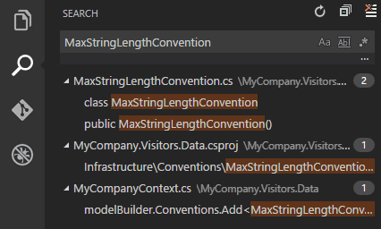
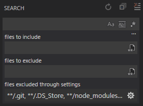
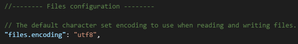

# Basic Editing

Visual Studio Code is an editor first and foremost, and includes the features you need for highly productive source code editing. This topic takes you through the basics of the editor and helps you get moving with your code.

## Keyboard shortcuts

Being able to keep your hands on the keyboard when writing code is crucial for high productivity. VS Code has a rich set of default keyboard shortcuts as well as allowing you to customize them.

* [Keyboard Shortcuts Reference](/docs/getstarted/keybindings.md#keyboard-shortcuts-reference) - Learn the most commonly used and popular keyboard shortcuts by downloading the reference sheet.
* [Install a Keymap extension](/docs/getstarted/keybindings.md#keymap-extensions) - Use the keyboard shortcuts of your old editor (such as Sublime Text, Atom, and Vim) in VS Code by installing a Keymap extension.
* [Customize Keyboard Shortcuts](/docs/getstarted/keybindings.md#customizing-shortcuts) - Change the default keyboard shortcuts to fit your style.

## Multiple selections (multi-cursor)

VS Code supports multiple cursors for fast simultaneous edits. You can add secondary cursors (rendered thinner) with `kbstyle(Alt+Click)`. Each cursor operates independently based on the context it sits in. A common way to add more cursors is with `kb(editor.action.insertCursorBelow)` or `kb(editor.action.insertCursorAbove)` that insert cursors below or above.

> **Note:** Your graphics card driver (for example NVIDIA) might overwrite these default shortcuts.


`kb(editor.action.addSelectionToNextFindMatch)` selects the word at the cursor, or the next occurrence of the current selection.


> **Tip:** You can also add more cursors with `kb(editor.action.selectHighlights)`, which will add a selection at each occurrence of the current selected text.

### Multi-cursor modifier

If you'd like to change the modifier key for applying multiple cursors to `kbstyle(Cmd+Click)` on macOS and `kbstyle(Ctrl+Click)` on Windows and Linux, you can do so with the `editor.multiCursorModifier` [setting](/docs/getstarted/settings.md). This lets users coming from other editors such as Sublime Text or Atom continue to use the keyboard modifier they are familiar with.

The setting can be set to:

* `ctrlCmd` - Maps to `kbstyle(Ctrl)` on Windows and `kbstyle(Cmd)` on macOS.
* `alt` - The existing default `kbstyle(Alt)`.

There's also a menu item **Use Ctrl+Click for Multi-Cursor** in the **Selection** menu to quickly toggle this setting.

The **Go To Definition** and **Open Link** gestures will also respect this setting and adapt such that they do not conflict. For example, when the setting is `ctrlCmd`, multiple cursors can be added with `kbstyle(Ctrl/Cmd+Click)`, and opening links or going to definition can be invoked with `kbstyle(Alt+Click)`.

### Shrink/expand selection

Quickly shrink or expand the current selection. Trigger it with `kb(editor.action.smartSelect.shrink)` and `kb(editor.action.smartSelect.expand)`.

Here's an example of expanding the selection with `kb(editor.action.smartSelect.expand)`:


## Column (box) selection

Place the cursor in one corner and then hold `kbstyle(Shift+Alt)` while dragging to the opposite corner:



Note: This changes to `kbstyle(Shift+Ctrl/Cmd)` when using `kbstyle(Ctrl/Cmd)` as [multi-cursor modifier](#multi-cursor-modifier).

There are also default key bindings for column selection on macOS and Windows, but not on Linux.

Key|Command|Command ID
---|-------|----------
`kb(cursorColumnSelectDown)`|Column Select Down|`cursorColumnSelectDown`
`kb(cursorColumnSelectUp)`|Column Select Up|`cursorColumnSelectUp`
`kb(cursorColumnSelectLeft)`|Column Select Left|`cursorColumnSelectLeft`
`kb(cursorColumnSelectRight)`|Column Select Right|`cursorColumnSelectRight`
`kb(cursorColumnSelectPageDown)`|Column Select Page Down|`cursorColumnSelectPageDown`
`kb(cursorColumnSelectPageUp)`|Column Select Page Up|`cursorColumnSelectPageUp`

You can [edit](/docs/getstarted/keybindings.md) your `keybindings.json` to bind them to something more familiar if you wish.

### Column Selection mode

The user setting **Editor: Column Selection** controls this feature. Once this mode is entered, as indicated in the Status bar, the mouse gestures and the arrow keys will create a column selection by default. This global toggle is also accessible via the **Selection** > **Column Selection Mode** menu item. In addition, one can also disable Column Selection mode from the Status bar.

## Save / Auto Save

By default, VS Code requires an explicit action to save your changes to disk, `kb(workbench.action.files.save)`.

However, it's easy to turn on `Auto Save`, which will save your changes after a configured delay or when focus leaves the editor. With this option turned on, there is no need to explicitly save the file. The easiest way to turn on `Auto Save` is with the **File** > **Auto Save** toggle that turns on and off save after a delay.

For more control over `Auto Save`, open User or Workspace [settings](/docs/getstarted/settings.md) and find the associated settings:

* `files.autoSave`: Can have the values:
  * `off` - to disable auto save.
  * `afterDelay` - to save files after a configured delay (default 1000 ms).
  * `onFocusChange` - to save files when focus moves out of the editor of the dirty file.
  * `onWindowChange` - to save files when the focus moves out of the VS Code window.
* `files.autoSaveDelay`: Configures the delay in milliseconds when `files.autoSave` is configured to `afterDelay`. The default is 1000 ms.

## Hot Exit

VS Code will remember unsaved changes to files when you exit by default. Hot exit is triggered when the application is closed via **File** > **Exit** (**Code** > **Quit** on macOS) or when the last window is closed.

You can configure hot exit by setting `files.hotExit` to the following values:

* `"off"`: Disable hot exit.
* `"onExit"`: Hot exit will be triggered when the application is closed, that is when the last window is closed on Windows/Linux or when the `workbench.action.quit` command is triggered (from the **Command Palette**, keyboard shortcut or menu). All windows without folders opened will be restored upon next launch.
* `"onExitAndWindowClose"`: Hot exit will be triggered when the application is closed, that is when the last window is closed on Windows/Linux or when the `workbench.action.quit` command is triggered (from the **Command Palette**, keyboard shortcut or menu), and also for any window with a folder opened regardless of whether it is the last window. All windows without folders opened will be restored upon next launch. To restore folder windows as they were before shutdown, set `window.restoreWindows` to `all`.

If something happens to go wrong with hot exit, all backups are stored in the following folders for standard install locations:

* **Windows** `%APPDATA%\Code\Backups`
* **macOS** `$HOME/Library/Application Support/Code/Backups`
* **Linux** `$HOME/.config/Code/Backups`

## Find and Replace

VS Code allows you to quickly find text and replace in the currently opened file. Press `kb(actions.find)` to open the Find Widget in the editor, search results will be highlighted in the editor, overview ruler and minimap.

If there are more than one matched result in the current opened file, you can press `kb(editor.action.nextMatchFindAction)` and `kb(editor.action.previousMatchFindAction)` to navigate to next or previous result when the find input box is focused.

### Seed Search String From Selection

When the Find Widget is opened, it will automatically populate the selected text in the editor into the find input box. If the selection is empty, the word under the cursor will be inserted into the input box instead.


This feature can be turned off by setting `editor.find.seedSearchStringFromSelection` to `false`.

### Find In Selection

By default, the find operations are run on the entire file in the editor. It can also be run on selected text. You can turn this feature on by clicking the hamburger icon on the Find Widget.


If you want it to be the default behavior of the Find Widget, you can set `editor.find.autoFindInSelection` to `always`, or to `multiline`, if you want it to be run on selected text only when multiple lines of content are selected.

### Advanced find and replace options

In addition to find and replace with plain text, the Find Widget also has three advanced search options:

* Match Case
* Match Whole Word
* Regular Expression

The replace input box support case preserving, you can turn it on by clicking the Preserve Case (**AB**) button.

### Multiline support and Find Widget resizing

You can search multiple line text by pasting the text into the Find input box and Replace input box. Pressing `Ctrl+Enter` inserts a new line in the input box.


While searching long text, the default size of Find Widget might be too small. You can drag the left sash to enlarge the Find Widget or double click the left sash to maximize it or shrink it to its default size.


## Search across files

VS Code allows you to quickly search over all files in the currently opened folder.  Press `kb(workbench.view.search)` and enter your search term. Search results are grouped into files containing the search term, with an indication of the hits in each file and its location. Expand a file to see a preview of all of the hits within that file. Then single-click on one of the hits to view it in the editor.



>**Tip:** We support regular expression searching in the search box, too.

You can configure advanced search options by clicking the ellipsis (**Toggle Search Details**) below the search box on the right (or press `kb(workbench.action.search.toggleQueryDetails)`). This will show additional fields to configure the search.

### Advanced search options



In the two input boxes below the search box, you can enter patterns to include or exclude from the search. If you enter `example`, that will match every folder and file named `example` in the workspace. If you enter `./example`, that will match the folder `example/` at the top level of your workspace. Use `,` to separate multiple patterns. Paths must use forward slashes. You can also use glob syntax:

* `*` to match one or more characters in a path segment
* `?` to match on one character in a path segment
* `**` to match any number of path segments, including none
* `{}` to group conditions (for example `{**/*.html,**/*.txt}` matches all HTML and text files)
* `[]` to **declare** a range of characters to match (`example.[0-9]` to match on `example.0`, `example.1`, …)

VS Code excludes some folders by default to reduce the number of search results that you are not interested in (for example: `node_modules`). Open [settings](/docs/getstarted/settings.md) to change these rules under the `files.exclude` and `search.exclude` section.

Note that glob patterns in the search view work differently than in settings such as `files.exclude` and `search.exclude`. In the settings, you must use `**/example` to match a folder named `example` in subfolder `folder1/example` in your workspace. In the search view, the `**` prefix is assumed.

Also note the **Use Exclude Settings and Ignore Files** toggle button in the **files to exclude** box. The toggle determines whether to exclude files that are ignored by your `.gitignore` files and/or matched by your `files.exclude` and `search.exclude` settings.

>**Tip:** From the Explorer, you can right-click on a folder and select **Find in Folder** to search inside a folder only.

### Search and replace

You can also Search and Replace across files. Expand the Search widget to display the Replace text box.


When you type text into the Replace text box, you will see a diff display of the pending changes. You can replace across all files from the Replace text box, replace all in one file or replace a single change.


>**Tip:** You can quickly reuse a previous search term by using `kb(history.showNext)` and `kb(history.showPrevious)` to navigate through your search term history.

## IntelliSense

We'll always offer word completion, but for the rich [languages](/docs/languages/overview.md), such as JavaScript, JSON, HTML, CSS, SCSS, Less, C# and TypeScript, we offer a true IntelliSense experience. If a language service knows possible completions, the IntelliSense suggestions will pop up as you type. You can always manually trigger it with `kb(editor.action.triggerSuggest)`.  By default, `kbstyle(Tab)` or `kbstyle(Enter)` are the accept keyboard triggers but you can also [customize these key bindings](/docs/getstarted/keybindings.md).

> **Tip:** The suggestions filtering supports CamelCase so you can type the letters which are upper cased in a method name to limit the suggestions. For example, "cra" will quickly bring up "createApplication".

> **Tip:** IntelliSense suggestions can be configured via the `editor.quickSuggestions` and `editor.suggestOnTriggerCharacters` [settings](/docs/getstarted/settings.md).

JavaScript and TypeScript developers can take advantage of the [npmjs](https://www.npmjs.com) type declaration (typings) file repository to get IntelliSense for common JavaScript libraries (Node.js, React, Angular). You can find a good explanation on using type declaration files in the [JavaScript language](/docs/languages/javascript.md#intellisense) topic and the [Node.js](/docs/nodejs/nodejs-tutorial.md) tutorial.

Learn more in the [IntelliSense document](/docs/editor/intellisense.md).

## Formatting

VS Code has great support for source code formatting. The editor has two explicit format actions:

* **Format Document** (`kb(editor.action.formatDocument)`) - Format the entire active file.
* **Format Selection** (`kb(editor.action.formatSelection)`) - Format the selected text.

You can invoke these from the **Command Palette** (`kb(workbench.action.showCommands)`) or the editor context menu.

VS Code has default formatters for JavaScript, TypeScript, JSON, and HTML. Each language has specific formatting options (for example, `html.format.indentInnerHtml`) which you can tune to your preference in your user or workspace [settings](/docs/getstarted/settings.md). You can also disable the default language formatter if you have another extension installed that provides formatting for the same language.

```json
"html.format.enable": false
```

Along with manually invoking code formatting, you can also trigger formatting based on user gestures such as typing, saving or pasting. These are off by default but you can enable these behaviors through the following [settings](/docs/getstarted/settings.md):

* `editor.formatOnType` - Format the line after typing.
* `editor.formatOnSave` - Format a file on save.
* `editor.formatOnPaste` - Format the pasted content.

>Note: Not all formatters support format on paste as to do so they must support formatting a selection or range of text.

In addition to the default formatters, you can find extensions on the Marketplace to support other languages or formatting tools. There is a `Formatters` category so you can easily search and find [formatting extensions](https://marketplace.visualstudio.com/search?target=VSCode&category=Formatters&sortBy=Downloads). In the **Extensions** view search box, type 'formatters' or 'category:formatters' to see a filtered list of extensions within VS Code.

## Folding

You can fold regions of source code using the folding icons on the gutter between line numbers and line start. Move the mouse over the gutter and click to fold and unfold regions. Use `kbstyle(Shift + Click)` on the folding icon to fold or unfold the region and all regions inside.


You can also use the following actions:

* Fold (`kb(editor.fold)`) folds the innermost uncollapsed region at the cursor.
* Unfold (`kb(editor.unfold)`) unfolds the collapsed region at the cursor.
* Toggle Fold (`kb(editor.toggleFold)`) folds or unfolds the region at the cursor.
* Fold Recursively (`kb(editor.foldRecursively)`) folds the innermost uncollapsed region at the cursor and all regions inside that region.
* Unfold Recursively (`kb(editor.unfoldRecursively)`) unfolds the region at the cursor and all regions inside that region.
* Fold All (`kb(editor.foldAll)`) folds all regions in the editor.
* Unfold All (`kb(editor.unfoldAll)`) unfolds all regions in the editor.
* Fold Level X (`kb(editor.foldLevel2)` for level 2) folds all regions of level X, except the region at the current cursor position.
* Fold All Block Comments (`kb(editor.foldAllBlockComments)`) folds all regions that start with a block comment token.

Folding regions are by default evaluated based on the indentation of lines. A folding region starts when a line has a smaller indent than one or more following lines, and ends when there is a line with the same or smaller indent.

Since the 1.22 release, folding regions can also be computed based on syntax tokens of the editor's configured language. The following languages already provide syntax aware folding: Markdown, HTML, CSS, LESS, SCSS, and JSON.

If you prefer to switch back to indentation-based folding for one (or all) of the languages above, use:

```json
  "[html]": {
    "editor.foldingStrategy": "indentation"
  },
```

Regions can also be defined by markers defined by each language. The following languages currently have markers defined:

Language|Start region|End region
--------|------------|----------
Bat|`::#region` or `REM #region`|`::#endregion` or `REM #endregion`
C#|`#region`|`#endregion`
C/C++|`#pragma region`|`#pragma endregion`
CSS/Less/SCSS|`/*#region*/`|`/*#endregion*/`
Coffeescript|`#region`|`#endregion`
F#|`//#region` or `(#region)`|`//#endregion` or `(#endregion)`
Java|`//#region` or `//<editor-fold>`|`// #endregion` or `//</editor-fold>`
Markdown|`<!-- #region -->`|`<!-- #endregion -->`
Perl5|`#region` or `=pod`|`#endregion` or `=cut`
PHP|`#region`|`#endregion`
PowerShell|`#region`|`#endregion`
Python|`#region` or `# region`|`#endregion` or `# endregion`
TypeScript/JavaScript|`//#region` |`//#endregion`
Visual Basic|`#Region`|`#End Region`

To fold and unfold only the regions defined by markers use:

* Fold Marker Regions (`kb(editor.foldAllMarkerRegions)`) folds all marker regions.
* Unfold Marker Regions (`kb(editor.unfoldAllMarkerRegions)`) unfolds all marker regions.

## Indentation

VS Code lets you control text indentation and whether you'd like to use spaces or tab stops. By default, VS Code inserts spaces and uses 4 spaces per `kbstyle(Tab)` key. If you'd like to use another default, you can modify the `editor.insertSpaces` and `editor.tabSize` [settings](/docs/getstarted/settings.md).

```json
    "editor.insertSpaces": true,
    "editor.tabSize": 4,
```

### Auto-detection

VS Code analyzes your open file and determines the indentation used in the document. The auto-detected indentation overrides your default indentation settings. The detected setting is displayed on the right side of the Status Bar:


You can click on the Status Bar indentation display to bring up a dropdown with indentation commands allowing you to change the default settings for the open file or convert between tab stops and spaces.


>**Note:** VS Code auto-detection checks for indentations of 2, 4, 6 or 8 spaces. If your file uses a different number of spaces, the indentation may not be correctly detected. For example, if your convention is to indent with 3 spaces, you may want to turn off `editor.detectIndentation` and explicitly set the tab size to 3.

```json
    "editor.detectIndentation": false,
    "editor.tabSize": 3,
```

## File encoding support

Set the file encoding globally or per workspace by using the `files.encoding` setting in **User Settings** or **Workspace Settings**.



You can view the file encoding in the status bar.


Click on the encoding button in the status bar to reopen or save the active file with a different encoding.


Then choose an encoding.


## Next steps

You've covered the basic user interface - there is a lot more to VS Code.  Read on to find out about:

* [Intro Video - Setup and Basics](/docs/introvideos/basics.md) - Watch a tutorial on the basics of VS Code.
* [User/Workspace Settings](/docs/getstarted/settings.md) - Learn how to configure VS Code to your preferences through user and workspace settings.
* [Code Navigation](/docs/editor/editingevolved.md) - Peek and Goto Definition, and more.
* [Integrated Terminal](/docs/editor/integrated-terminal.md) - Learn about the integrated terminal for quickly performing command-line tasks from within VS Code.
* [IntelliSense](/docs/editor/intellisense.md) - VS Code brings smart code completions.
* [Debugging](/docs/editor/debugging.md) - This is where VS Code really shines.

## Common questions

### Is it possible to globally search and replace?

Yes, expand the Search view text box to include a replace text field. You can search and replace across all the files in your workspace. Note that if you did not open VS Code on a folder, the search will only run on the currently open files.


### How do I turn on word wrap?

You can control word wrap through the `editor.wordWrap` [setting](/docs/getstarted/settings.md). By default, `editor.wordWrap` is `off` but if you set to it to `on`, text will wrap on the editor's viewport width.

```json
    "editor.wordWrap": "on"
```

You can toggle word wrap for the VS Code session with `kb(editor.action.toggleWordWrap)`.

You can also add vertical column rulers to the editor with the `editor.rulers` setting, which takes an array of column character positions where you'd like vertical rulers.
