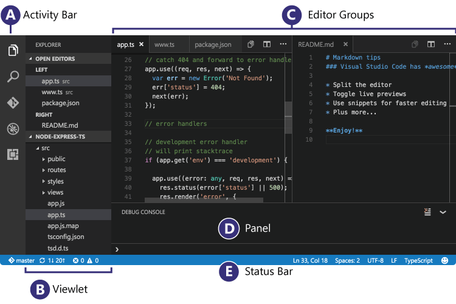
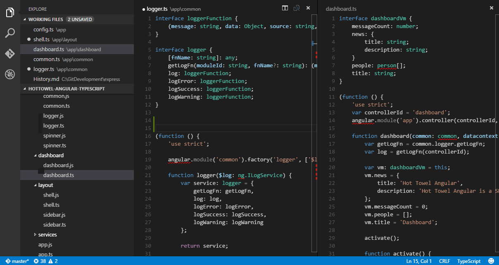
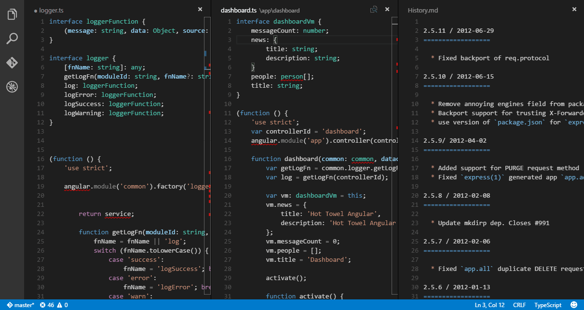
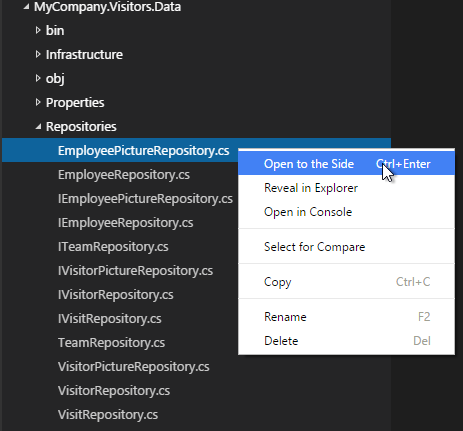
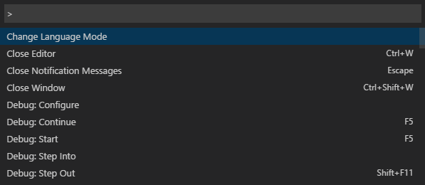
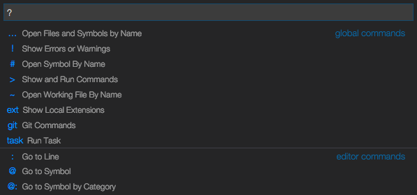
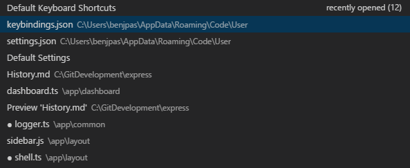
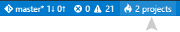

# The Basics of Visual Studio Code

At its heart, Visual Studio Code is a code editor. Like many other code editors, VS Code adopts a common user interface and layout of an explorer on the left, showing all of the files and folders you have access to, and an editor on the right, showing the content of the files you have opened.



## Files, Folders & Projects

VS Code is file and folder based - you can get started immediately by opening a file or folder in VS Code.

On top of this, VS Code can read and take advantage of a variety of project files defined by different frameworks and platforms. For example, if the folder you opened in VS Code contains one or more `package.json`, `project.json`, `tsconfig.json`, or .NET Core Visual Studio solution and project files, VS Code will read these files and use them to provide additional functionality, such as rich IntelliSense in the editor.

## Basic Layout

VS Code comes with a simple and intuitive layout that maximizes the space provided for the editor while leaving ample room to browse and access the full context of your folder or project. The UI is divided into five areas:

* **Editor** The main area to edit your files. You can open up to three editors side by side.
* **Side Bar** Contains different views like the Explorer to assist you while working on your project.
* **Status Bar** Information about the opened project and the files you edit.
* **View Bar** Located on the far left-hand side, this lets you switch between views and gives you additional context-specific indicators, like the number of outgoing changes when Git is enabled.
* **Panels** You can display different panels below the editor region for output or debug information, errors and warnings, or an integrated terminal.

Each time you start VS Code, it opens up in the same state it was in when you last closed it. The folder, layout, and opened files are preserved.



VS Code allows up to three visible editors at any one time, allowing you to edit or view up to three files together side by side. The open files in each editor are displayed with tabbed headers (Tabs) at the top of the editor region. To learn more about tabbed headers, see the [Tabs](/docs/editor/tabs.md) topic.

>**Tip:** You can move the Side Bar to the right hand side (**View** > **Move Sidebar**) or toggle its visibility (`kb(workbench.action.toggleSidebarVisibility)`).

## Side by Side Editing

You can have up to three editors open side by side.

If you already have one editor open, there are multiple ways of opening another editor to the side of the existing one:

* `kbstyle(Ctrl)` (Mac: `kbstyle('Cmd')`) click on a file in the Explorer.
* `kb(workbench.action.splitEditor)` to split the active editor into two.
* **Open to the Side** from the Explorer context menu on a file.
* Click the **Split Editor** button in the upper right of an editor.
* Drag and drop a file to the either side of the editor region.



Whenever you open another file, the editor that is active will display the content of that file. So if you have two editors side by side and you want to open file 'foo.cs' into the right hand editor, make sure that editor is active (by clicking inside it) before opening file 'foo.cs'.

When you have more than one editor open you can switch between them quickly by holding the `kbstyle(Ctrl)` (Mac: `kbstyle('Cmd')`) key and pressing `kbstyle(1)`, `kbstyle(2)`, or `kbstyle(3)`.

>**Tip:** You can resize editors and reorder them. Drag and drop the editor title area to reposition or resize the editor.

## Explorer

The Explorer is used to browse, open, and manage all of the files and folders in your project.

After opening a folder in VS Code, the contents of the folder are shown in the Explorer. You can do many things from here:

* Create, delete, and rename files and folders.
* Move files and folders with drag and drop.
* Use the context menu to explore all options.

>**Tip:** You can drag and drop files into the Explorer from outside VS Code to copy them.



VS Code works very well with other tools that you might use, especially command-line tools. If you want to run a command-line tool in the context of the folder you currently have open in VS Code, right-click the folder and select **Open in Command Prompt** (or **Open in Terminal** on OS X or Linux).

You can also navigate to the location of a file or folder in the native Explorer by right-clicking on a file or folder and selecting **Reveal in Explorer** (or **Reveal in Finder** on the Mac or **Open Containing Folder** on Linux).

>**Tip:** Type `kb(workbench.action.quickOpen)` (**Quick Open**) to quickly search and open a file by its name.

By default, VS Code excludes some folders from the explorer (for example. `.git`). Use the `files.exclude` [setting](/docs/customization/userandworkspace.md) to configure rules for hiding files and folders from the explorer.

**Tip:** This is really useful to hide derived resources files, like `\*.meta` in Unity, or `\*.js` in a TypeScript project. For Unity to exclude the `\*.cs.meta` files, the pattern to choose would be: `"**/*.cs.meta": true`. For TypeScript, you can exclude generated JavaScript for TypeScript files with: `"**/*.js": {"when": "$(basename).ts"}`.

## Open Editors

At the top of the Explorer is a section labeled **OPEN EDITORS**. This is a list of active files or previews. These are files you previously opened in VS Code that you're working on. For example, a file will be listed in the **OPEN EDITORS** section if you:

* Make a change to a file.
* Double-click a file in the Explorer.
* Open a file that is not part of the current folder.

Just click an item in the **OPEN EDITORS** section, and it becomes active in VS Code.

Once you are done with your task, you can remove files individually from the **OPEN EDITORS** section, or you can remove all files by using the **View: Close All Editors** or **View: Close All Editors in Group** actions.

## Configuring the Editor

VS Code gives you many options to configure the editor. You can set options globally through user settings or per project/folder through workspace settings. Settings values are kept in a `settings.json` [file](/docs/customization/userandworkspace.md#settings-file-locations).
 
* Select **File** > **Preferences** > **User Settings** (or press `kb(workbench.action.showCommands)`, type `user` and press `Enter`) to edit the user settings.json file.
 
* Select **File** > **Preferences** > **Workspace Settings** (or press `kb(workbench.action.showCommands)`, type `worksp` and press `Enter`) to edit the workspace settings.json file.

>**Note for Mac users:** The **Preferences** menu is under **Code** not **File**. For example, **Code** > **Preferences** > **User Settings**.

You will see the VS Code [Default Settings](/docs/customization/userandworkspace.md#default-settings) in the left window and your editable `settings.json` on the right. You can easily review and copy settings from `Default Settings`.

After editing your settings, type `kb(workbench.action.files.save)` to save your changes. The changes will take effect immediately.

## Save / Auto Save

By default, VS Code requires an explicit action to save your changes to disk, `kb(workbench.action.files.save)`.

However, it's easy to turn on `Auto Save`, which will save your changes after a configured delay or when focus leaves the editor. With this option turned on, there is no need to explicitly save the file.

To configure `Auto Save`, open **User Settings** or **Workspace Settings** and find the associated settings:

* `files.autoSave`: Can have the values `off` to disable auto save, `afterDelay` to save files after a configured delay and `onFocusChange` to save files when focus moves out of the editor of the dirty file.
* `files.autoSaveDelay`: Configures the delay in milliseconds when `files.autoSave` is configured to `afterDelay`.

## Search Across Files

VS Code allows you to quickly search over all files in the currently-opened folder.  Simply type `kb(workbench.view.search)` and type in your search. Search results are grouped into files containing the search term, with an indication of the hits in each file and its location. Expand a file to see a preview of all of the hits within that file. Then single-click on one of the hits to view it in the editor.


>**Tip:** We support regular expression searching in the search box, too.

You can configure advanced search options by typing `kb(workbench.action.search.toggleQueryDetails)`. This will show additional fields to configure the search.


In the two input boxes below the search box, you can include and exclude files. Click on the toggle to the right to enable the glob pattern syntax:

* `*` to match one or more characters in a path segment
* `?` to match on one character in a path segment
* `**` to match any number of path segments, including none
* `{}` to group conditions (e.g. `{**/*.html,**/*.txt}` matches all HTML and text files)
* `[]` to declare a range of characters to match (e.g., `example.[0-9]` to match on `example.0`, `example.1`, …)

VS Code excludes some folders by default to reduce the number of search results that you are not interested in (for example: `node_modules`). Open settings to change these rules under the `files.exclude` and `search.exclude` section.

>**Tip:** From the Explorer you can right-click on a folder and select **Find in Folder** to search inside a folder only.

You can also Search and Replace across files. Expand the Search widget to display the Replace text box.


When you type text into the Replace text box, you will see a diff display of the pending changes. You can replace across all files from the Replace text box, replace all in one file or replace a single change.


## Command Palette

VS Code is equally accessible from the keyboard. The most important key combination to know is `kb(workbench.action.showCommands)`, which brings up the **Command Palette**. From here, you have access to all of the functionality of VS Code, including keyboard shortcuts for the most common operations.



The Command Palette provides access to many commands. You can execute editor commands, open files, search for symbols, and see a quick outline of a file, all using the same interactive window. Here are a few tips:

* `kb(workbench.action.quickOpen)` will let you navigate to any file or symbol by simply typing its name
* `kb(workbench.action.openPreviousRecentlyUsedEditorInGroup)` will cycle you through the last set of files opened
* `kb(workbench.action.showCommands)` will bring you directly to the editor commands
* `kb(workbench.action.gotoSymbol)` will let you navigate to a specific symbol in a file
* `kb(workbench.action.gotoLine)` will let you navigate to a specific line in a file

Type `?` into the input field to get a list of available commands you can execute from here:



## Quick File Navigation

The Explorer is great for navigating between files when you are exploring a project. However, when you are working on a task, you will find yourself quickly jumping between the same set of files. VS Code provides two powerful commands to navigate in and across files with easy-to-use key bindings.

Hold `kbstyle(Ctrl)` and press `kbstyle(Tab)` to view a list of all files open in an editor group. To open one of these files, use `kbstyle(Tab)` again to pick the file you want to navigate to, then release `kbstyle(Ctrl)` to open it.



Alternatively, you can use `kb(workbench.action.navigateBack)` and `kb(workbench.action.navigateForward)` to navigate between files and edit locations. If you are jumping around between different lines of the same file, these shortcuts allow you to navigate between those locations easily.

>**Tip:** You can open any file by its name when you type `kb(workbench.action.quickOpen)` (**Quick Open**).

## File Encoding Support

Set the file encoding globally or per workspace by using the `files.encoding` setting in **User Settings** or **Workspace Settings**.


You can view the file encoding in the status bar.


Click on the encoding button in the status bar to reopen or save the active file with a different encoding.


Then choose an encoding.


## Launching from the Command Line

You can launch VS Code from the command line to quickly open a file, folder, or project. Typically, you open VS Code within the context of a folder. We find the best way to do this is to simply type:

```
code .
```

>**Tip:** We have instructions for Mac users in our [Setup](/docs/setup/osx.md) topic that enable you to start VS Code from within a terminal.  We add the VS Code executable to the `PATH` environment variable on Windows and Linux automatically during installation.

Sometimes you will want to open or create a file. If the specified files does not exist, VS Code will create them for you:

```
code index.html style.css readme.md
```

>**Tip:** You can have as many file names as you want separated by spaces.

## Additional Command line arguments

Here are optional command line arguments you can use when starting VS Code at the command line via `code`:

Argument|Description
------------------|-----------
`-h` or `--help` | Print usage
`-v` or `--version` | Print VS Code version (e.g. 0.10.10)
`-n` or `--new-window`| Opens a new session of VS Code instead of restoring the previous session (default).
`-r` or `--reuse-window` | Forces opening a file or folder in the last active window.
`-g` or `--goto` | When used with *file:line:column?*, opens a file at a specific line and optional column position. This argument is provided since some operating systems permit `:` in a file name.
*file* | Name of a file to open. If the file doesn't exist, it will be created and marked as edited. You can specify multiple files by separating each file name with a space.
*file:line:column?* | Name of a file to open at the specified line and optional column position. You can specify multiple files in this manner, but you must use the `-g` argument (once) before using the *file:line:column?* specifier.
*folder* | Name of a folder to open. You can specify multiple folders.
`-d` or `--diff` | Open a file difference editor. Requires two file paths as arguments.
`--locale` | Set the display language (locale) for the VS Code session.  Supported locales are: `en-US`, `zh-TW`, `zh-CN`, `fr`, `de`, `it`, `ja`, `ko`, `ru`, `es` 
`--disable-extensions` | Disable all installed extensions. Extensions will still be visible in the `Extensions: Show Installed Extensions` dropdown but they will never be activated.
`--list-extensions` | List the installed extensions.
`--install-extension` | Install an extension. Provide the full extension name `publisher.extension` as an argument.
`--uninstall-extension` | Uninstall an extension. Provide the full extension name `publisher.extension` as an argument.
`-w` or `--wait` | Wait for the window to be closed before returning

For both files and folders, you can use absolute or relative paths. Relative paths are relative to the current directory of the command prompt where you run `code`.

If you specify more than one file or folder at the command line, VS Code will open only a single instance.

## Opening a Project

VS Code does not distinguish between opening a folder and opening a project. If VS Code detects a project in the folder you opened (for example, a C# project), that project context will be displayed on the Status Bar. If more than one project is found, you can switch projects from there as well.

To open a project contained in the folder `C:\src\WebApp`, you would start VS Code like this:

````
code C:\src\webapp
````

After VS Code opens, just open source files and use the Status Bar to switch the active project as needed.



## Window Management

VS Code has some options to control how windows should be opened or restored between sessions.

The `window.openFilesInNewWindow` setting controls if files should open in a new window instead of reusing an existing VS Code instance. By default, VS Code will open a new window when you double-click on a file outside VS Code or open a file from the command line. Set this to `false` to reuse the last active instance of VS Code and open files in there.

The `window.reopenFolders` setting tells VS Code how to restore the opened windows of your previous session. By default, VS Code will
reopen the last opened folder you worked on (setting: `one`). Change this setting to `none` to never reopen any folders and always start with an empty VS Code instance. Change it to `all` to restore all folders you worked on during your previous session.

## Next Steps

You've covered the basic user interface - there is a lot more to VS Code.  Read on to find out about:

* [User/Workspace Settings](/docs/customization/userandworkspace.md) - Learn how to configure VS Code to your preferences through user and workspace settings.
* [Editing Evolved](/docs/editor/editingevolved.md) - Lint, IntelliSense, Lightbulbs, Peek and Goto Definition, and more
* [Integrated Terminal](/docs/editor/integrated-terminal.md) - Learn about the integrated terminal for quickly performing command line tasks from within VS Code.
* [Debugging](/docs/editor/debugging.md) - This is where VS Code really shines
* [Customization](/docs/customization/overview.md) - Themes, settings, and keyboard bindings

## Common Questions

**Q: Is it possible to globally search and replace?**

**A:** Yes, expand the Search view text box to include a replace text field. You can search and replace across all the files in your workspace.


**Q: How do I turn on word wrap?**

**A:** You can control word wrap through the `editor.wrappingColumn` [setting](/docs/customization/userandworkspace.md). By default `editor.wrapperingColumn` is set to 300 characters.  You can adjust the column width or set the value to zero to wrap on the editor viewport width:

```json
    "editor.wrappingColumn": 0
```

You can toggle word wrap for the VS Code session with `kb(editor.action.toggleWordWrap)`.  Restarting VS Code will pick up the persisted `editor.wrappingColumn` value.

You can also add vertical column rulers to the editor with the `editor.rulers` setting which takes an array of column character positions where you'd like vertical rulers.

**Q: How can I show more files in the OPEN EDITORS section?**

**A:** You can configure the appearance of **OPEN EDITORS** through your [settings](/docs/customization/userandworkspace.md). For example, you can set the maximum number of visible files before a scroll bar appears via the `explorer.openEditors.visible` setting and whether the **OPEN EDITORS** section should dynamically set its height via `explorer.openEditors.dynamicHeight`.
