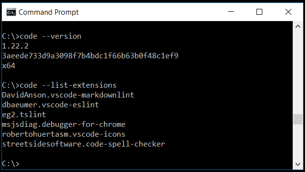
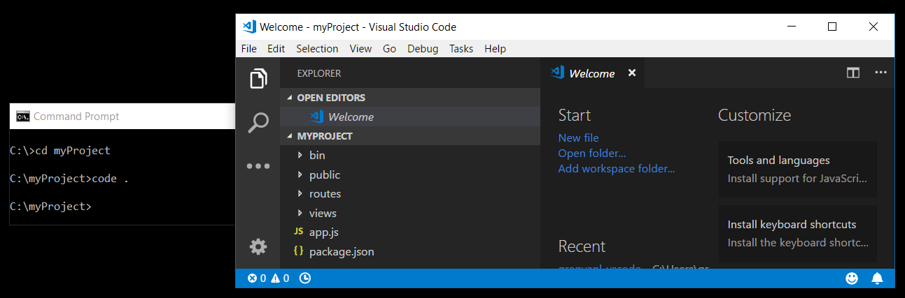
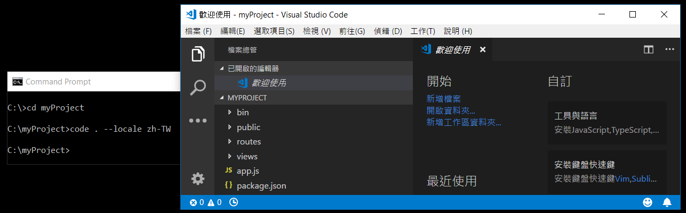
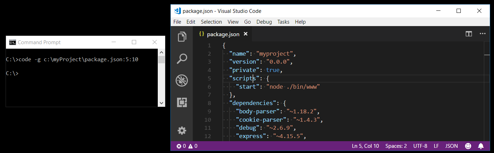
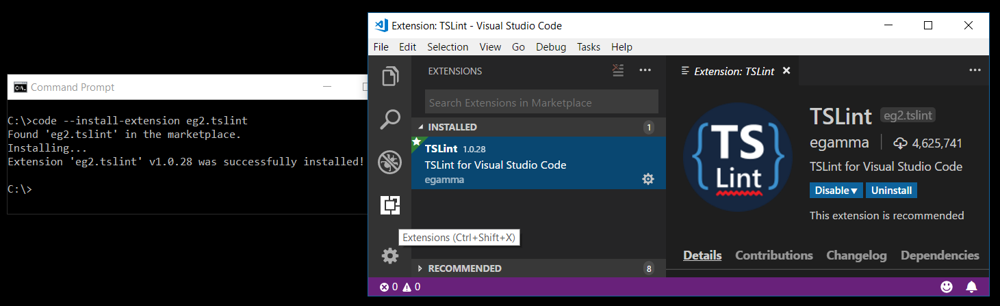
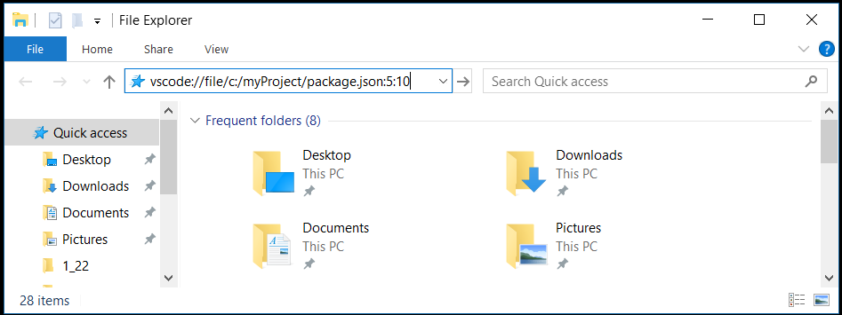

# Command Line Interface (CLI)

Visual Studio Code has a powerful command line interface built-in that lets you control how you launch the editor. You can open files, install extensions, change the display language, and output diagnostics through command-line options (switches).



If you are looking for how to run command-line tools inside VS Code, see the [Integrated Terminal](/docs/editor/integrated-terminal.md).

## Command line help

To get an overview of the VS Code command line interface, open a terminal or command prompt and type `code --help`. You will see the version, usage example, and list of command line options.


## Launching from command line

You can launch VS Code from the command line to quickly open a file, folder, or project. Typically, you open VS Code within the context of a folder. To do this, from an open terminal or command prompt, navigate to your project folder and type `code .`:



**Note:** Users on macOS must first run a command (**Shell Command: Install 'code' command in PATH**) to add VS Code executable to the `PATH` environment variable. Read the [macOS setup guide](/docs/setup/mac.md) for help.

Windows and Linux installations should add the VS Code binaries location to your system path. If this isn't the case, you can manually add the location to the `Path` environment variable (`$PATH` on Linux). For example, on Windows, VS Code is installed under `AppData\Local\Programs\Microsoft VS Code\bin`. To review platform specific setup instructions, see [Setup](/docs/setup/setup-overview.md).

> **Insiders:** If you are using the VS Code [Insiders](/insiders) preview, you launch your Insiders build with `code-insiders`.

## Core CLI options

Here are optional arguments you can use when starting VS Code at the command line via `code`:

Argument|Description
------------------|-----------
`-h` or `--help` | Print usage
`-v` or `--version` | Print VS Code version (for example, 1.22.2), GitHub commit id, and architecture (for example, x64).
`-n` or `--new-window`| Opens a new session of VS Code instead of restoring the previous session (default).
`-r` or `--reuse-window` | Forces opening a file or folder in the last active window.
`-g` or `--goto` | When used with *file:line[:character]*, opens a file at a specific line and optional character position. This argument is provided since some operating systems permit `:` in a file name.
`-d` or `--diff` | Open a file difference editor. Requires two file paths as arguments.
`-w` or `--wait` | Wait for the files to be closed before returning.
`--locale <locale>` | Set the [display language](/docs/getstarted/locales.md) (locale) for the VS Code session. (for example, `en-US` or `zh-TW`)



## Opening Files and Folders

Sometimes you will want to open or create a file. If the specified file does not exist, VS Code will create them for you along with any new intermediate folders:

```bash
code index.html style.css documentation\readme.md
```

For both files and folders, you can use absolute or relative paths. Relative paths are relative to the current directory of the command prompt where you run `code`.

If you specify more than one file at the command line, VS Code will open only a single instance.

If you specify more than one folder at the command line, VS Code will create a [Multi-root Workspace](/docs/editor/multi-root-workspaces.md) including each folder.

Argument|Description
------------------|-----------
`file` | Name of a file to open. If the file doesn't exist, it will be created and marked as edited. You can specify multiple files by separating each file name with a space.
`file:line[:character]` | Used with the `-g` argument. Name of a file to open at the specified line and optional character position. You can specify multiple files in this manner, but you must use the `-g` argument (once) before using the `file:line[:character]` specifier.
`folder` | Name of a folder to open. You can specify multiple folders and a new [Multi-root Workspace](/docs/editor/multi-root-workspaces.md) is created.



## Working with extensions

You can install and manage VS Code [extensions](/docs/editor/extension-marketplace.md) from the command line.

Argument|Description
------------------|-----------
`--install-extension <ext>` | Install an extension. Provide the full extension name `publisher.extension` as an argument. Use `--force` argument to avoid prompts.
`--uninstall-extension <ext>` | Uninstall an extension. Provide the full extension name `publisher.extension` as an argument.
`--disable-extensions` | Disable all installed extensions. Extensions will still be visible in the **Disabled** section of the Extensions view but they will never be activated.
`--list-extensions` | List the installed extensions.
`--show-versions` | Show versions of installed extensions, when using `--list-extensions`
`--enable-proposed-api <ext>` | Enables proposed api features for an extension. Provide the full extension name `publisher.extension` as an argument.



## Advanced CLI options

There are several CLI options that help with reproducing errors and advanced setup.

Argument|Description
------------------|-----------
`--extensions-dir <dir>` | Set the root path for extensions. Has no effect in [Portable Mode](/docs/editor/portable.md).
`--user-data-dir <dir>` | Specifies the directory that user data is kept in, useful when running as root. Has no effect in [Portable Mode](/docs/editor/portable.md).
`-s, --status` | Print process usage and diagnostics information.
`-p, --performance` | Start with the **Developer: Startup Performance** command enabled.
`--disable-gpu` | Disable GPU hardware acceleration.
`--verbose` | Print verbose output (implies `--wait`).
`--prof-startup` | Run CPU profiler during startup.
`--upload-logs` | Uploads logs from current session to a secure endpoint.
**Multi-root**|
`--add <dir>` | Add folder(s) to the last active window for a multi-root workspace.

## Opening VS Code with URLs

You can also open projects and files using the platform's URL handling mechanism. Use the following URL formats to:

Open a project

```bash
vscode://file/{full path to project}/

vscode://file/c:/myProject/
```

Open a file

```bash
vscode://file/{full path to file}

vscode://file/c:/myProject/package.json
```

Open a file to line and column

```bash
vscode://file/{full path to file}:line:column

vscode://file/c:/myProject/package.json:5:10
```

You can use the URL in applications such as browsers or file explorers that can parse and redirect the URL. For example, on Windows, you could pass a `vscode://` URL directly to the Windows Explorer or to the command line as `start vscode://{full path to file}`.



> **Note**: If you are using VS Code [Insiders](/insiders) builds, the URL prefix is `vscode-insiders://`.

## Next steps

Read on to find out about:

* [Integrated Terminal](/docs/editor/integrated-terminal.md) - Run command-line tools from inside VS Code.
* [Basic Editing](/docs/editor/codebasics.md) - Learn the basics of the VS Code editor.
* [Code Navigation](/docs/editor/editingevolved.md) - VS Code lets you quickly understand and move through your source code.

## Common questions

### 'code' is not recognized as an internal or external command

Your OS cannot find the VS Code binary `code` on its path. The VS Code Windows and Linux installations should have installed VS Code on your path. Try uninstalling and reinstalling VS Code. If `code` is still not found, consult the platform specific setup topics for [Windows](/docs/setup/windows.md) and [Linux](/docs/setup/linux.md).

On macOS, you need to manually run the **Shell Command: Install 'code' command in PATH** command (available through the **Command Palette** `kb(workbench.action.showCommands)`). Consult the [macOS](/docs/setup/mac.md) specific setup topic for details.

### How do I get access to a command line (terminal) from within VS Code?

VS Code has an [Integrated Terminal](/docs/editor/integrated-terminal.md) where you can run command-line tools from within VS Code.

### Can I specify the settings location for VS Code in order to have a portable version?

Not directly through the command line, but VS Code has a [Portable Mode](/docs/editor/portable.md) which lets you keep settings and data in the same location as your installation, for example, on a USB drive.
