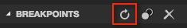
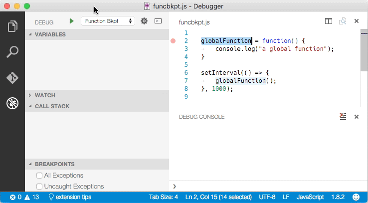

# Debugging

One of the key features of Visual Studio Code is its great debugging support. VS Code's built-in debugger helps accelerate your edit, compile and debug loop.


## Debugger Extensions

VS Code has built-in debugging support for the [Node.js](https://nodejs.org/) runtime and can debug JavaScript, TypeScript, and any other language that gets transpiled to JavaScript. 

For debugging other languages and runtimes (including [PHP](https://marketplace.visualstudio.com/items?itemName=felixfbecker.php-debug), [Ruby](https://marketplace.visualstudio.com/items?itemName=rebornix.Ruby), [Go](https://marketplace.visualstudio.com/items?itemName=lukehoban.Go), [C#](https://marketplace.visualstudio.com/items?itemName=ms-vscode.csharp), [Python](https://marketplace.visualstudio.com/items?itemName=donjayamanne.python) and many others), please look for `Debuggers` [extensions](/docs/editor/extension-gallery.md) in our VS Code [Marketplace](https://marketplace.visualstudio.com/vscode/Debuggers).

Below are several popular extension which include debugging support:

<div class="marketplace-extensions-debuggers"></div>

> Tip: The extensions shown above are dynamically queried. Click on an extension tile above to read the description and reviews to decide which extension is best for you. 

## Start Debugging

The following documentation is based on the built-in [Node.js](https://nodejs.org/) debugger, but most of the concepts and features are applicable to other debuggers as well.

It is helpful to first create a sample Node.js application before reading about debugging. You can follow the [Node.js walkthrough](/docs/runtimes/nodejs.md) to install Node.js and create a simple "Hello World" JavaScript application (`app.js`). Once you have a simple application all set up, this page will take you through VS Code debugging features.

## Debug View

To bring up the Debug view, click on the Debugging icon in the View Bar on the side of VS Code.


The Debug view displays all information related to debugging and has a top bar with debugging commands and configuration settings.

## Launch Configurations

To debug your app in VS Code, you'll first need to set up your launch configuration file - `launch.json`. Click on the Configure gear icon on the Debug view top bar, choose your debug environment and VS Code will generate a `launch.json` file under your workspace's `.vscode` folder.

Here is the one generated for Node.js debugging:

```json
{
	"version": "0.2.0",
	"configurations": [
		{
			"name": "Launch",
			"type": "node",
			"request": "launch",
			"program": "${workspaceRoot}/app.js",
			"stopOnEntry": false,
			"args": [],
			"cwd": "${workspaceRoot}",
			"preLaunchTask": null,
			"runtimeExecutable": null,
			"runtimeArgs": [
				"--nolazy"
			],
			"env": {
				"NODE_ENV": "development"
			},
			"externalConsole": false,
			"sourceMaps": false,
			"outDir": null
		},
		{
			"name": "Attach",
			"type": "node",
			"request": "attach",
			"port": 5858,
			"address": "localhost",
			"restart": false,
			"sourceMaps": false,
			"outDir": null,
			"localRoot": "${workspaceRoot}",
			"remoteRoot": null
		}
	]
}
```

Please note that the attributes available in these launch configurations vary from debugger to debugger. You can use IntelliSense to find out which attributes exist for a specific debugger. In addition, hover help is available for all attributes. If you see green squigglies in your launch configuration, hover over them to learn what the problem is and try to fix them before launching a debug session.

In VS Code, we support launching your app in debug mode or attaching to an already running app. Depending on the request (`attach` or `launch`) different attributes are required and our `launch.json` validation and suggestions should help with that.

Review the generated values and make sure that they make sense for your project and debugging environment. You can add additional configurations to the `launch.json` (use hover and IntelliSense to help).

Select the configuration named `Launch` using the **Configuration dropdown** in the Debug view. Once you have your launch configuration set, start your debug session with `kb(workbench.action.debug.start)`.

To launch a task before the start of each debug session, set the `preLaunchTask` to the name of one of the tasks specified in [tasks.json](/docs/editor/tasks.md) (located under the workspace's `.vscode` folder).

VS Code supports variable substitution inside strings in `launch.json` the same way as for [tasks.json](/docs/editor/tasks.md#variables-in-tasksjson).

## Run mode

In addition to debugging a program, VS Code supports running the program. The **Run** action is triggered with `kb(workbench.action.debug.run)` and uses the currently selected launch configuration. Many of the launch configuration attributes are supported in 'Run' mode. VS Code maintains a debug session while the program is running and pressing the **Stop** button terminates the program.

Please note: The **Run** action is always available, but a debugger extension has to 'opt-in' in order to support 'Run'. If a debugger extension has not been updated, 'Run' will fall back to 'Debug' (the built-in Node.js Debug and [Mono Debug](https://marketplace.visualstudio.com/items?itemName=ms-vscode.mono-debug) already support 'Run').

## Breakpoints

Breakpoints can be toggled by clicking on the **editor margin**. Finer breakpoint control (enable/disable/reapply) can be done in the Debug view's **BREAKPOINTS** section.

* Breakpoints in the editor margin are normally shown as red filled circles.
* Disabled breakpoints have a filled gray circle.
* When a debugging sessions starts, breakpoints that cannot be registered with the debugger change to a gray hollow circle.


The `Reapply All Breakpoints` command sets all breakpoints again to their original location. This is helpful if your debug environment is "lazy" and "misplaces" breakpoints in source code that has not yet been executed. (For details see below under __Node Debugging: Breakpoint Validation__)

## Data inspection

Variables can be inspected in the **VARIABLES** section of the Debug view or by hovering over their source in the editor. Variables and expression evaluation is relative to the selected stack frame in the **CALL STACK** section.


Variables and expressions can also be evaluated and watched in the Debug view **WATCH** section.


## Debug Console

Expressions can be evaluated in the **Debug Console**. To open the Debug Console, use the **Open Console** action at the top of the Debug pane or using the **Command Palette** (`kb(workbench.action.showCommands)`).


## Debug actions

Once a debug session starts, the **Debug actions pane** will appear on the top of the editor.


* Continue / Pause `kb(workbench.action.debug.continue)`
* Step Over `kb(workbench.action.debug.stepOver)`
* Step Into `kb(workbench.action.debug.stepInto)`
* Step Out `kb(workbench.action.debug.stepOut)`
* Restart `kb(workbench.action.debug.restart)`
* Stop `kb(workbench.action.debug.stop)`

## Node Debugging

The following sections are specific to the Node.js debugger.

### Node Console

By default, Node.js debug sessions launch the target in the internal VS Code Debug Console. Since the Debug Console does not support programs that need to read input from the console, you can enable an external, native console by setting the attribute `externalConsole` to `true` in your launch configuration.

### Breakpoint Validation

For performance reasons, Node.js parses the functions inside JavaScript files lazily on first access. As a consequence, breakpoints don't work in source code areas that haven't been seen (parsed) by Node.js.

Since this behavior is not ideal for debugging, VS Code passes the `--nolazy` option to Node.js automatically. This prevents the delayed parsing and ensures that breakpoints can be validated before running the code (so they no longer "jump").

Since the `--nolazy` option might increase the start-up time of the debug target significantly, you can easily opt out by passing a `--lazy` as a `runtimeArgs` attribute.

When doing so you will find that some of your breakpoints don't "stick" to the line requested but instead "jump" for the next possible line in already-parsed code. To avoid confusion, VS Code always shows breakpoints at the location where Node.js thinks the breakpoint is. In the **BREAKPOINTS** section, these breakpoints are shown with an arrow between requested and actual line number:


This breakpoint validation occurs when a session starts and the breakpoints are registered with Node.js, or when a session is already running and a new breakpoint is set. In this case, the breakpoint may "jump" to a different location. After Node.js has parsed all the code (e.g. by running through it), breakpoints can be easily re-applied to the requested locations with the **Reapply** button in the **BREAKPOINTS** section header. This should make the breakpoints "jump back" to the requested location.



### Function Breakpoints

Instead of placing breakpoints directly in source code, the Node.js debugger now supports creating breakpoints by specifying a function name. This is useful in situations where source is not available but a function name is known.

A 'function breakpoint' is created by pressing the **+** button in the **BREAKPOINTS** section header:



**Please note**: Node.js support for function breakpoints is limited because:

- function breakpoints only work for global, non-native functions and
- function breakpoints can only be created if the function has been defined (seen by Node.js).

### JavaScript Source Maps

The Node.js debugger of VS Code supports JavaScript Source Maps which help debugging of transpiled languages, e.g. TypeScript or minified/uglified JavaScript. With source maps, it is possible to single step through or set breakpoints in the original source. If no source map exists for the original source or if the source map is broken and cannot successfully map between the source and the generated JavaScript, the breakpoints are shown as gray hollow circles.

The source map feature is enabled by setting the `sourceMaps` attribute to `true` in the launch configuration. With that you can now specify a source file (e.g. app.ts) with the `program` attribute. If the generated (transpiled) JavaScript files do not live next to their source but in a separate directory, you can help the VS Code debugger locate them by setting the `outDir` attribute. Whenever you set a breakpoint in the original source, VS Code tries to find the generated source, and the associated source map, in the `outDir` directory.

Since source maps are not automatically created, you must configure the TypeScript compiler to create them:

```
tsc --sourceMap --outDir bin app.ts
```

This is the corresponding launch configuration for a TypeScript program:

```json
{
	"version": "0.2.0",
	"configurations": [
		{
			"name": "Launch TypeScript",
			"type": "node",
			"request": "launch",
			"program": "app.ts",
			"sourceMaps": true,
			"outDir": "bin"
		}
	]
}
```

Source maps can be generated with two kinds of inlining:

* **Inlined source maps**: the generated JavaScript file contains the source map as a data URI at the end (instead of referencing the source map through a file URI).
* **Inlined source**: the source map contains the original source (instead of referencing the source through a path).

VS Code supports both the **inlined source maps** and the **inlined source**.

### Attaching VS Code to Node.js

If you want to attach the VS Code debugger to a Node.js program, launch Node.js as follows:

```
node --debug program.js
node --debug-brk program.js
```

With the `--debug-brk` option Node.js stops on the first line of the program.

The corresponding launch configuration looks like this:

```json
{
	"version": "0.2.0",
	"configurations": [
		{
			"name": "Attach to Node",
			"type": "node",
			"request": "attach",
			"address": "localhost",
			"port": 5858,
			"restart": false
		}
	]
}
```

The `restart` attribute controls whether the Node.js debugger automatically restarts after the debug session has ended. This feature is useful if you use [nodemon](http://nodemon.io) to restart Node.js on file changes. Setting the launch configuration attribute `restart` to `true` makes node-debug automatically try to re-attach to Node.js after Node.js has terminated.

On the command line, start your Node.js program `server.js` with **nodemon**:

```bash
nodemon --debug server.js
```

In VS Code, set the `restart` attribute to `true` in the 'attach' launch configuration.

>**Tip:** Pressing the **Stop** button stops the debug session and disconnects from Node.js, but **nodemon** (and Node.js) will continue to run. To stop **nodemon**, you will have to kill it from the command line.

>**Tip:** In case of syntax errors, **nodemon** will not be able to start Node.js successfully until the error has been fixed. In this case, VS Code will continue trying to attach to Node.js but eventually give up (after 10 seconds). To avoid this, you can increase the timeout by adding a `timeout` attribute with a larger value (in milliseconds).

### Remote Debugging Node.js

The Node.js debugger supports remote debugging for recent versions of Node.js (>= 4.x). Specify a remote host via the `address` attribute.

By default, VS Code will stream the debugged source from the remote Node.js folder to the local VS Code and show it in a read-only editor. You can step through this code, but cannot modify it. If you want VS Code to open the editable source from your workspace instead, you can setup a mapping between the remote and local locations. The `attach` launch configuration supports a `localRoot` and a `remoteRoot` attribute that can be used to map paths between a local VS Code project and a (remote) Node.js folder. This works even locally on the same system or across different operating systems. Whenever a code path needs to be converted from the remote Node.js folder to a local VS Code path, the `remoteRoot` path is stripped off the path and replaced by `localRoot`. For the reverse conversion, the `localRoot` path is replaced by the `remoteRoot`.


## Mono Debugging

On Linux or OS X, the Mono debugging support of VS Code requires [Mono](http://www.mono-project.com/) version 3.12 or later. If you intend to build .NET Core applications with Visual Studio Code, we recommend you first follow the steps in [.NET Core and Visual Studio](/docs/runtimes/dotnet.md).

If you just want to try VS Code Mono debugging, you can either download the latest Mono version for Linux or OS X at [Mono project](http://www.mono-project.com/download/) or you can use your package manager.

* On OS X: `brew install mono`
* On Linux: `sudo apt-get install mono-complete`

### Installing the Mono Debug Extension

VS Code Mono debugging integration comes from the ['Mono Debug'](https://marketplace.visualstudio.com/items?itemName=ms-vscode.mono-debug) extension on the Visual Studio Marketplace.

You can either install the **Mono Debug** extension with the VS Code **Extensions: Install Extension** command or if you already have a Mono based project with a `mono` launch configuration, simply by starting a debug session. VS Code will then prompt you to download and install **Mono Debug**.

### Enable Mono debugging

To enable debugging of Mono based C# (and F#) programs, you have to pass the `-debug` option to the compiler:

```
mcs -debug Program.cs
```

If you want to attach the VS Code debugger to a Mono program, pass these additional arguments to the Mono runtime:

```
mono --debug --debugger-agent=transport=dt_socket,server=y,address=127.0.0.1:55555 Program.exe
```

The corresponding launch configuration looks like this:

```json
{
	"version": "0.2.0",
	"configurations": [
		{
			"name": "Attach to Mono",
			"request": "attach",
			"type": "mono",
			"address": "localhost",
			"port": 55555
		}
	]
}
```

## Debugging Other Languages

Debugging many other languages is supported by [VS Code extensions](https://marketplace.visualstudio.com/vscode/Debuggers?sortBy=Downloads). These include Go, PowerShell, Python, PHP, ...

## Next Steps

In case you didn't already read the Node.js section, take a look at:

* [Node.js](/docs/runtimes/nodejs.md) - End to end Node scenario with a sample application

To learn about VS Code's task running support, go to:

* [Tasks](/docs/editor/tasks.md) - Running tasks with Gulp, Grunt and Jake.  Showing Errors and Warnings

To write your own debugger extension, visit:

* [Debuggers](/docs/extensions/example-debuggers.md) - Steps to create a VS Code debug extension starting from a mock sample


## Common Questions

**Q: What are the supported debugging scenarios?**

**A:** Debugging of Node.js based applications is supported on Linux, OS X, and Windows. Debugging of C# applications running on Mono is supported on Linux and OS X. .NET Core applications are compiled using the [Roslyn](https://github.com/dotnet/roslyn) compiler, not the Mono compiler. .NET Core debugging will be available through a VS Code extension. Many other scenarios are supported by [VS Code extensions](https://marketplace.visualstudio.com/vscode/Debuggers?sortBy=Downloads).

**Q: I do not see any launch configurations in the debug view drop down, what is wrong?**

**A:** The most common problem is that you did not set up `launch.json` yet or there is a syntax error in the `launch.json` file.

**Q: What Node.js version is required for Node.js debugging?**

**A:** The latest LTS version of [Node.js](https://nodejs.org/) is recommended.

**Q: Is Mono debugging supported on Windows?**

**A:** No. Currently Mono debugging is only supported on Mac and Linux.
