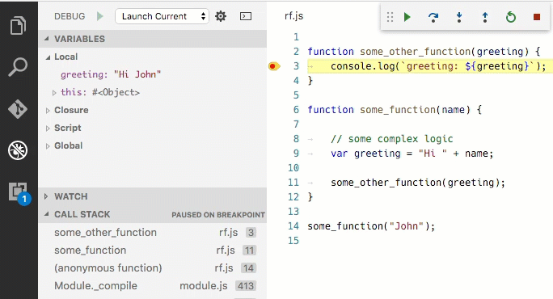

# Debugging

One of the key features of Visual Studio Code is its great debugging support. VS Code's built-in debugger helps accelerate your edit, compile and debug loop.


## Debugger Extensions

VS Code has built-in debugging support for the [Node.js](https://nodejs.org/) runtime and can debug JavaScript, TypeScript, and any other language that gets transpiled to JavaScript.

For debugging other languages and runtimes (including [PHP](https://marketplace.visualstudio.com/items?itemName=felixfbecker.php-debug), [Ruby](https://marketplace.visualstudio.com/items?itemName=rebornix.Ruby), [Go](https://marketplace.visualstudio.com/items?itemName=lukehoban.Go), [C#](https://marketplace.visualstudio.com/items?itemName=ms-vscode.csharp), [Python](https://marketplace.visualstudio.com/items?itemName=donjayamanne.python) and many others), please look for `Debuggers` [extensions](/docs/editor/extension-gallery.md) in our VS Code [Marketplace](https://marketplace.visualstudio.com/vscode/Debuggers).

Below are several popular extension which include debugging support:

<div class="marketplace-extensions-debuggers"></div>

> Tip: The extensions shown above are dynamically queried. Click on an extension tile above to read the description and reviews to decide which extension is best for you.

## Start Debugging

The following documentation is based on the built-in [Node.js](https://nodejs.org/) debugger, but most of the concepts and features are applicable to other debuggers as well.

It is helpful to first create a sample Node.js application before reading about debugging. You can follow the [Node.js walkthrough](/docs/runtimes/nodejs.md) to install Node.js and create a simple "Hello World" JavaScript application (`app.js`). Once you have a simple application all set up, this page will take you through VS Code debugging features.

## Debug View

To bring up the Debug view, click on the Debugging icon in the View Bar on the side of VS Code.


The Debug view displays all information related to debugging and has a top bar with debugging commands and configuration settings.

## Launch Configurations

To debug your app in VS Code, you'll first need to set up your launch configuration file - `launch.json`. Click on the Configure gear icon on the Debug view top bar, choose your debug environment and VS Code will generate a `launch.json` file under your workspace's `.vscode` folder.

Here is the one generated for Node.js debugging:

```json
{
    "version": "0.2.0",
    "configurations": [
        {
            "type": "node",
            "request": "launch",
            "name": "Launch Program",
            "program": "${workspaceRoot}/app.js",
            "cwd": "${workspaceRoot}"
        },
        {
            "type": "node",
            "request": "attach",
            "name": "Attach to Process",
            "port": 5858
        }
    ]
}
```

Please note that the attributes available in these launch configurations vary from debugger to debugger. You can use IntelliSense to find out which attributes exist for a specific debugger. In addition, hover help is available for all attributes. If you see green squigglies in your launch configuration, hover over them to learn what the problem is and try to fix them before launching a debug session.

VS Code debuggers typically support launching a program in debug mode or attaching to an already running program. Depending on the request (`attach` or `launch`) different attributes are required and our `launch.json` validation and suggestions should help with that.

Review the generated values and make sure that they make sense for your project and debugging environment.

To add a new configuration to an existing `launch.json` use IntelliSense if your cursor is located inside the configurations array. Or just press the **Add Configuration** button to invoke snippet IntelliSense at the start of the array.


Select the configuration named `Launch` using the **Configuration dropdown** in the Debug view. Once you have your launch configuration set, start your debug session with `kb(workbench.action.debug.start)`.

## Debug actions

Once a debug session starts, the **Debug actions pane** will appear on the top of the editor.


* Continue / Pause `kb(workbench.action.debug.continue)`
* Step Over `kb(workbench.action.debug.stepOver)`
* Step Into `kb(workbench.action.debug.stepInto)`
* Step Out `kb(workbench.action.debug.stepOut)`
* Restart `kb(workbench.action.debug.restart)`
* Stop `kb(workbench.action.debug.stop)`

## Launch.json attributes

There are many `launch.json` attributes to help support different debuggers and debugging scenarios. As mentioned above, you can use IntelliSense (`kb(editor.action.triggerSuggest)`) to see the list of available attributes once you have specified a value for the `type` attribute.


The following attributes are mandatory for every launch configuration:

* `type` - the type of debugger to use for this launch configuration. Every installed debug extension introduces a type, e.g. `node` and `node2` for the built-in node debuggers, or `php` and `go` for the php and go extensions.
* `request` - the request type of this launch configuration. Currently supported are `launch` and `attach`
* `name` - friendly name which appears in the Debug launch configuration dropdown

Here are some optional attributes available to all launch configurations:

* `preLaunchTask` - to launch a task before the start of a debug session, set this attribute to the name of a task specified in [tasks.json](/docs/editor/tasks.md) (located under the workspace's `.vscode` folder).
* `internalConsoleOptions` - control visibility of the Debug Console panel during a debugging session
* `debugServer` - **for debug extension authors only**: connect to the specified port instead of launching the debug adapter

Many debuggers support some of the following attributes:

* `program` - executable or file to run when launching the debugger
* `cwd` - current working directory for finding dependencies and other files
* `port` - port when attaching to a running process
* `stopOnEntry` - break immediately when the program launches
* `console` - what kind of console to use, e.g. `internalConsole`, `integratedTerminal`, `externalTerminal`.

## Variable substitution

VS Code supports variable substitution inside strings in `launch.json` and has the following predefined variables:

- **${workspaceRoot}** the path of the folder opened in VS Code
- **${workspaceRootFolderName}** the name of the folder opened in VS Code without any solidus (/)
- **${file}** the current opened file
- **${relativeFile}** the current opened file relative to `workspaceRoot`
- **${fileBasename}** the current opened file's basename
- **${fileBasenameNoExtension}** the current opened file's basename with no file extension
- **${fileDirname}** the current opened file's dirname
- **${fileExtname}** the current opened file's extension
- **${cwd}** the task runner's current working directory on startup


You can also reference environment variables through **${env.Name}** syntax (e.g. ${env.PATH}). Be sure to match the environment variable name's casing, for example `${env.Path}` on Windows.

```json
{
    "type": "node",
    "request": "launch",
    "type": "node",
    "name": "Launch Program",
    "program": "${workspaceRoot}/app.js",
    "cwd": "${workspaceRoot}",
    "args": [ "${env.USERNAME}" ]
}
```

You can also reference VS Code settings using **${config.NAME}** syntax (for example: `${config.editor.fontSize}`).
Some debug extensions even introduce additional command variables that can be referenced as **${command.NAME}**.

## Run mode

In addition to debugging a program, VS Code supports running the program. The **Run** action is triggered with `kb(workbench.action.debug.run)` and uses the currently selected launch configuration. Many of the launch configuration attributes are supported in 'Run' mode. VS Code maintains a debug session while the program is running and pressing the **Stop** button terminates the program.

Please note: The **Run** action is always available, but not all debugger extensions support 'Run'. In this case 'Run' will be the same as 'Debug'.

## Multi-target debugging

For debugging complex scenarios involving more than one process (e.g. a client and a server), VS Code supports multi-target debugging.

Using multi-target debugging is simple: after you've started a first debug session, you can just launch another session. As soon as a second session is up and running, the VS Code UI switches to _multi-target mode_:

- The individual sessions now show up as top level elements in the CALL STACK view.<BR>
- The floating debug widget shows the currently _active session_ (and all other sessions are available in a dropdown menu).<BR>
- Debug actions (e.g. all actions in the floating debug widget) are performed on the active session. The active session can be changed either by using the drop down menu in the floating debug widget or by selecting a different element in the CALL STACK view.

An alternative way to start multiple debug session is by using a so-called _compound_ launch configuration. A compound launch configuration lists the names of two or more launch configurations that should be launched in parallel. Compound launch configurations show up in the launch configuration drop down menu.

```json
{
    "version": "0.2.0",
    "configurations": [
        {
            "type": "node",
            "request": "launch",
            "name": "Server",
            "program": "${workspaceRoot}/server.js",
            "cwd": "${workspaceRoot}"
        },
        {
            "type": "node",
            "request": "launch",
            "name": "Client",
            "program": "${workspaceRoot}/client.js",
            "cwd": "${workspaceRoot}"
        }
    ],
    "compounds": [
        {
            "name": "Server/Client",
            "configurations": ["Server", "Client"]
        }
    ]
}
```

## Breakpoints

Breakpoints can be toggled by clicking on the **editor margin**. Finer breakpoint control (enable/disable/reapply) can be done in the Debug view's **BREAKPOINTS** section.

* Breakpoints in the editor margin are normally shown as red filled circles.
* Disabled breakpoints have a filled gray circle.
* When a debugging sessions starts, breakpoints that cannot be registered with the debugger change to a gray hollow circle. The same might happen if the source is edited while a debug session without live-edit support is running.

The **Reapply All Breakpoints** command sets all breakpoints again to their original location. This is helpful if your debug environment is "lazy" and "misplaces" breakpoints in source code that has not yet been executed.

A powerful VS Code debugging feature is the ability to set conditions either based on expressions or hit counts.

- **Expression condition**: The breakpoint will be hit whenever the expression evaluates to `true`.
- **Hit count**: The 'hit count' controls how many times a breakpoint needs to be hit before it will 'break' execution. Whether a 'hit count' is respected and how the exact syntax of the expression looks like depends on the debugger extension used.

You can add a condition and/or hit count either when creating the breakpoint with the **Add Conditional Breakpoint** action or with the **Edit Breakpoint...** action for existing breakpoints. In both cases an inline text box with a drop down menu opens where the expressions can be entered:


If a debugger does not support conditional breakpoints the **Add Conditional Breakpoint** action will be missing.

## Function breakpoints

Instead of placing breakpoints directly in source code, a debugger can support creating breakpoints by specifying a function name. This is useful in situations where source is not available but a function name is known.

A 'function breakpoint' is created by pressing the **+** button in the **BREAKPOINTS** section header and entering the function name:


## Data inspection

Variables can be inspected in the **VARIABLES** section of the Debug view or by hovering over their source in the editor. Variables and expression evaluation is relative to the selected stack frame in the **CALL STACK** section.


Variables and expressions can also be evaluated and watched in the Debug view's **WATCH** section.


Variable values can be modified with the **Set Value** action from the variable's context menu.

## Debug Console

Expressions can be evaluated in the **Debug Console**. To open the Debug Console, use the **Open Console** action at the top of the Debug pane or using the **Command Palette** (`kb(workbench.action.showCommands)`). The Debug Console shows suggestions while typing. If you need to enter multiple lines, use Shift + Enter between the lines and then send all lines for evaluation with Enter.


>>>> Greg, please move the "Node Debugging" section into a separate document.


# Node Debugging

VS Code has built-in debugging support for the [Node.js](https://nodejs.org/) runtime and can debug JavaScript, TypeScript, and any other language that gets transpiled to JavaScript.

This document explains only the fine points of node debugging. The general debugging feature are described **here**.

## Experimental Node Debugger (`node2`)

VS Code includes an experimental Node debug extension with debug type `node2` that uses the [V8 Inspector Protocol](https://chromedevtools.github.io/debugger-protocol-viewer/v8/), which Node.js now exposes via the `--inspect` flag, only in Node.js versions 6.3+. This is the same protocol exposed by [Chrome and other targets](https://developer.chrome.com/devtools/docs/debugger-protocol). This extension runs on the [vscode-chrome-debug-core](https://github.com/Microsoft/vscode-chrome-debug-core) library which also powers the [Debugger for Chrome](https://marketplace.visualstudio.com/items?itemName=msjsdiag.debugger-for-chrome) extension, and several others.

We recommend to use the new experimental debugger `node2` for node.js versions >= 6.3. When debugging Node.js versions < 6.3 you have to use the 'old' debugger `node`.

>**Note**: especially on Windows we recommend Node.js v6.9 with `node2` because earlier versions are not stable enough.

Here are a few additional reasons why to use `node2` over `node`:

* It can be more stable when debugging near very large JavaScript objects. The older debug protocol can become painfully slow when sending large values over the wire.
* If you are using an ES6 Proxy in your app, a Node v7+ runtime might crash when being debugged by the old debugger. This does not happen with `node2`. This issue is tracked in [Microsoft/vscode#12749](https://github.com/Microsoft/vscode/issues/12749).
* `node2` can handle some trickier source map setups. If you have trouble setting breakpoints in sourcemapped files, trying `node2` is worth a shot.

>**Note**: See more tips in the `node2` extension [README](https://marketplace.visualstudio.com/items?itemName=ms-vscode.node-debug2).

We try to keep feature parity between both node debuggers but this becomes more and more difficult because the technology underlying node (V8 Debugger Protocol) is deprected (frozen) whereas the new technology (Chrome Debugger Protocol) evolves quickly. For this reason, we mention the supported debugger type if a features is not supported by both `node` and `node2`.


## Launch Configuration attributes

The following attributes are supported in launch configurations of type `launch` and `attach`:

* `port` - debug port to use. See sections 'Attaching to Node.js' and 'Remote Debugging Node.js'.
* `address` - TCP/IP address of the debug port. See sections 'Attaching to Node.js' and 'Remote Debugging Node.js'.
* `restart` - restart session on termination. See section 'Attaching to Node.js'.
* `timeout` - when restarting a session give up after this number of milliseconds. See section 'Attaching to Node.js'.
* `stopOnEntry` - break immediately when the program launches.
* `sourceMaps` - enable source maps by setting this to `true`. See section 'Source Maps'.
* `outFiles` - array of glob patterns where to look for JavaScript files. See section 'Source Maps'.
* `smartStep`- try to automatically step over code that doesn map to source. See section 'Smart Stepping'.
* `skipFiles` - automatically skip files covered by these glob patterns. See section 'Skipping Uninteresting Code'.
* `trace` - enable diagnostic output. Set to `"all"` for verbose output.

These attributes are only available for launch configurations of type `launch`:

* `program` - an absolute path to the node program to debug.
* `args` - arguments passed to the program to debug.
* `cwd` - launch the program to debug in this directory.
* `runtimeExecutable` - absolute path to the runtime executable to be used. Default is `node`. See section 'Launch configuration support for 'npm' and other tools'.
* `runtimeArgs` - optional arguments passed to the runtime executable.
* `env` - optional environment variables.
* `envFile` - optional path to a file containing environment variable definitions.
* `console` - kind of console to launch the program, e.g. `internalConsole`, `integratedTerminal`, `externalTerminal`. See section 'Node Console' below.

These attributes are only available for launch configurations of type `attach`:

* `localRoot` - VS Code's root directory. See sections 'Remote Debugging Node.js' below.
* `remoteRoot` - Node's root directory. See sections 'Remote Debugging Node.js' below.
* `processId` - debugger tries to attach to this process after having sent a USR1 signal. With this the debugger can attach to an already running process that was not started in debug mode.

## Node Console

By default, Node.js debug sessions launch the target in the internal VS Code _Debug Console_. Since the Debug Console does not support programs that need to read input from the console, you can enable either an _External Terminal_ or use the VS Code _Integrated Terminal_ by setting the `console` attribute in your launch configuration to `externalTerminal` or `integratedTerminal` respectively. The default is `internalConsole`.

If the _External Terminal_ is used, you can configure which terminal program to use via the `terminal.external.windowsExec`, `terminal.external.osxExec`, and `terminal.external.linuxExec` settings.

## Launch configuration support for 'npm' and other tools

Instead of launching the node program directly with node, you can use 'npm' scripts or other task runner tools directly from a launch configuration:

- Any program available on the PATH (for example 'npm', 'mocha', 'gulp', etc.) can be used for the `runtimeExecutable` attribute and arguments can be passed via `runtimeArgs`.
- You do not have to set the `program` attribute if your npm script or other tool implicitly specifies the program to launch.
- If you specify a debug port via the `port` attribute, VS Code will not automatically add the `--debug-brk=nnnn` attribute because the debug port is typically specified by the npm script or other tool as well.

Let's look at an 'npm' example. If your `package.json` has a 'debug' script, for example:

```json
  "scripts": {
    "debug": "node --nolazy --debug-brk=5858 myProgram.js"
  },
```

the corresponding launch configuration would look like this:

```json
{
    "name": "Launch via NPM",
    "type": "node",
    "request": "launch",
    "cwd": "${workspaceRoot}",
    "runtimeExecutable": "npm",
    "windows": {
        "runtimeExecutable": "npm.cmd"
    },
    "runtimeArgs": [
        "run-script", "debug"
    ],
    "port": 5858
}
```

>**Note:** On Windows, make sure to specify the executable with the correct extension, for example use `npm.cmd` instead of just `npm` which exists but is the shell script for Linux and macOS.

## Load environment variables from external file (`node`)

The VS Code Node debugger supports to load environment variables from a file and passes them to the node runtime. To use this feature add an attribute `envFile` to your launch config and specify the absolute path to the file containing the environment variables:

```json
   //...
   "envFile": "${workspaceRoot}/.env",
   "env": { "USER": "john doe" }
   //...
````

Any environment variable specified in the `env` dictionary will override variables loaded from the file.

Here is an example for an `.env` file:

```
USER=doe
PASSWORD=abc123

# a comment

# an empty value:
empty=

# new lines expanded in quoted strings:
lines="foo\nbar"
```

## Command variable `PickProcess` (`node`)

Node debug supports a command variable `PickProcess` that binds to a process picker.

For example the 'Attach to Process' launch configuration below uses this variable to let the user pick a Node.js process when running the launch configuration.

```json
{
    "name": "Attach to Process",
    "type": "node",
    "request": "attach",
    "processId": "${command.PickProcess}",
    "port": 5858
}
```

## Attaching to Node.js

If you want to attach the VS Code debugger to a Node.js program, launch Node.js as follows:

```
node --debug program.js
or
node --debug-brk program.js
```

With the `--debug-brk` option, Node.js stops on the first line of the program.

The corresponding launch configuration looks like this:

```json
{
    "version": "0.2.0",
    "configurations": [
        {
            "name": "Attach to Node",
            "type": "node",
            "request": "attach",
            "port": 5858,
            "restart": false
        }
    ]
}
```

The `restart` attribute controls whether the Node.js debugger automatically restarts after the debug session has ended. This feature is useful if you use [nodemon](http://nodemon.io) to restart Node.js on file changes. Setting the launch configuration attribute `restart` to `true` makes node-debug automatically try to re-attach to Node.js after Node.js has terminated.

On the command line, start your Node.js program `server.js` with **nodemon**:

```bash
nodemon --debug server.js
```

In VS Code, set the `restart` attribute to `true` in the 'attach' launch configuration.

>**Tip:** Pressing the **Stop** button stops the debug session and disconnects from Node.js, but **nodemon** (and Node.js) will continue to run. To stop **nodemon**, you will have to kill it from the command line.

>**Tip:** In case of syntax errors, **nodemon** will not be able to start Node.js successfully until the error has been fixed. In this case, VS Code will continue trying to attach to Node.js but eventually give up (after 10 seconds). To avoid this, you can increase the timeout by adding a `timeout` attribute with a larger value (in milliseconds).

## Remote Debugging Node.js

The Node.js debugger supports remote debugging for versions of Node.js >= 4.x. Specify a remote host via the `address` attribute.

By default, VS Code will stream the debugged source from the remote Node.js folder to the local VS Code and show it in a read-only editor. You can step through this code, but cannot modify it. If you want VS Code to open the editable source from your workspace instead, you can setup a mapping between the remote and local locations. The `attach` launch configuration supports a `localRoot` and a `remoteRoot` attribute that can be used to map paths between a local VS Code project and a (remote) Node.js folder. This works even locally on the same system or across different operating systems. Whenever a code path needs to be converted from the remote Node.js folder to a local VS Code path, the `remoteRoot` path is stripped off the path and replaced by `localRoot`. For the reverse conversion, the `localRoot` path is replaced by the `remoteRoot`.

## Restart Frame (`node`)

The Node debugger supports restarting execution at a stack frame. This can be useful in situations where you have found a problem in your source code and you want to rerun a small portion of the code with modified input values. Stopping and then restarting the full debug session can be very time-consuming. The **Restart Frame** action allows you to re-enter the current function after you have changed variables with the **Set Value** action:



Note that **Restart Frame** won't unroll any state changes, so it may not always work as expected.

Make sure to use a Node.js version >= 5.11 since earlier versions do not work in all situations.

## Breakpoints

## Function breakpoints

Node debug supports function breakpoints but their usefulness is limited because:

- Function breakpoints only work for global, non-native functions.
- Function breakpoints can only be created if the function has been defined (and has been seen by the debugger).

## Breakpoint Hit Counts

The 'hit count condition' controls how many times a breakpoint needs to be hit before it will 'break' execution.
The hit count syntax supported by the Node.js debugger is either an integer or one of the operators `<`, `<=`, `==`, `>`, `>=`, `%` followed by an integer.

Some examples:

- `>10` break always after 10 hits
- `<3` break on the first two hits only
- `10` same as `>=10`
- `%2` break on every other hit

## Breakpoint Validation

For performance reasons, Node.js parses the functions inside JavaScript files lazily on first access. As a consequence, breakpoints don't work in source code areas that haven't been seen (parsed) by Node.js.

Since this behavior is not ideal for debugging, VS Code passes the `--nolazy` option to Node.js automatically. This prevents the delayed parsing and ensures that breakpoints can be validated before running the code (so they no longer "jump").

Since the `--nolazy` option might increase the start-up time of the debug target significantly, you can easily opt out by passing a `--lazy` as a `runtimeArgs` attribute.

When doing so you will find that some of your breakpoints don't "stick" to the line requested but instead "jump" for the next possible line in already-parsed code. To avoid confusion, VS Code always shows breakpoints at the location where Node.js thinks the breakpoint is. In the **BREAKPOINTS** section, these breakpoints are shown with an arrow between requested and actual line number:


This breakpoint validation occurs when a session starts and the breakpoints are registered with Node.js, or when a session is already running and a new breakpoint is set. In this case, the breakpoint may "jump" to a different location. After Node.js has parsed all the code (e.g. by running through it), breakpoints can be easily re-applied to the requested locations with the **Reapply** button in the **BREAKPOINTS** section header. This should make the breakpoints "jump back" to the requested location.


## Skipping Uninteresting Code

VS Code node debugging has a feature to avoid code that you don't want to step through (aka 'Just my Code'). This feature can be enabled with the `skipFiles` attribute in your launch configuration. `skipFiles` is an array of glob patterns for script paths to skip.

For example using:

```typescript
  "skipFiles": [
    "node_modules/**/*.js",
    "lib/**/*.js"
  ]
```

all code in the `node_modules` and `lib` folders will be skipped.

The exact rules are as follows:

* If you step into a skipped file, you won't stop there - you will stop on the next executed line that is not in a skipped file.
* If you have set the option to break on thrown exceptions, then you won't break on exceptions thrown from skipped files.
* If you set a breakpoint in a skipped file, you will stop at that breakpoint, and you will be able to step through it until you step out of it, at which point normal skipping behavior will resume.

This feature is available in the `node`, `node2`, and [Chrome](https://marketplace.visualstudio.com/items?itemName=msjsdiag.debugger-for-chrome) debuggers.

>**Note:** The old debugger (`node`) supports negative glob patterns, but they must **follow** a positive pattern: positive patterns add to the set of skipped files, while negative patterns subtract from that set.

In the following (`node`-only) example all but a 'math' module is skipped:

```typescript
"skipFiles": [
    "node_modules/**/*.js",
    "!node_modules/math/**/*.js"
]
```

>**Note:** The old debugger (`node`) has to emulate the `skipFiles` feature because the _V8 Debugger Protocol_ does not support it natively. This might result in slow stepping performance.


## Source Maps

The Node.js debugger of VS Code supports JavaScript Source Maps which help debugging of transpiled languages, e.g. TypeScript or minified/uglified JavaScript. With source maps, it is possible to single step through or set breakpoints in the original source. If no source map exists for the original source or if the source map is broken and cannot successfully map between the source and the generated JavaScript, then breakpoints show up as unverified (gray hollow circles).

Source maps can be generated with two kinds of inlining:

* _Inlined source maps_: the generated JavaScript file contains the source map as a data URI at the end (instead of referencing the source map through a file URI).
* _Inlined source_: the source map contains the original source (instead of referencing the source through a path).

VS Code supports both the _inlined source maps_ and the _inlined source_.

The source map feature is enabled by setting the `sourceMaps` attribute to `true` in the launch configuration. With that you can now specify a source file (e.g. app.ts) with the `program` attribute. If the generated (transpiled) JavaScript files do not live next to their source but in a separate directory, you must help the VS Code debugger locating them by setting the `outFiles` attribute. This attribute takes multiple glob patterns for including and excluding files from the set of generated JavaScript files. Whenever you set a breakpoint in the original source, VS Code tries to find the generated JavaScript code in the files specified by `outFiles`.

Since source maps are not automatically created, you must configure the transpiler you are using to create them. For TypeScript this can be done in the follwoing way:

```
tsc --sourceMap --outDir bin app.ts
```

This is the corresponding launch configuration for a TypeScript program:

```json
{
    "version": "0.2.0",
    "configurations": [
        {
            "name": "Launch TypeScript",
            "type": "node",
            "request": "launch",
            "program": "app.ts",
            "sourceMaps": true,
            "outFiles": [ "bin/**/*.js" ]
        }
    ]
}
```

### Smart Stepping

With the `smartStep` attribute set to `true` in a launch configuration, VS Code will automatically skip 'uninteresting code' when stepping through code in the debugger. 'Uninteresting code' is code that is generated by a transpiling process but is not covered by a source map so it does not map back to the original source. This code gets in your way when stepping through source code in the debugger because it makes the debugger switch between the original source code and generated code that you are not really interested in. `smartStep` will automatically step through code not covered by a source map until it reaches a location that is covered by a source map again.

This is especially useful for cases like async/await downcompilation in TypeScript, where the compiler injects helper code that is not covered by a source map.

### JavaScript Source Map Tips

A common issue when debugging with source maps is that you'll set a breakpoint, and it will turn gray. If you hover the cursor over it, you'll see the message, `"Breakpoint ignored because generated code not found (source map problem?)"`. What now? There are a range of issues that can lead to this. First, a quick explanation of how the Node debug adapter handles source maps.

When you set a breakpoint in `app.ts`, the debug adapter has to figure out the path to `app.js`, the transpiled version of your TypeScript file, which is what is actually running in Node. But, there is not a straightforward way to figure this out starting from the `.ts` file. Instead, the debug adapter uses the `outFiles` attribute in the `launch.json` to find all the transpiled `.js` files, and parses them for a source map, which contains the locations of its associated `.ts` files.

When you build your `app.ts` file in TypeScript with source maps enabled, it either produces an `app.js.map` file, or a source map inlined as a base64-encoded string in a comment at the bottom of the `app.js` file. To find the `.ts` files associated with this map, the debug adapter looks at two properties in the source map, `sources`, and `sourceRoot`. `sourceRoot` is optional - if present, it is prepended to each path in `sources`, which is an array of paths. The result is an array of absolute or relative paths to `.ts` files. Relative paths are resolved relative to the source map.

Finally, the debug adapter searches for the full path of `app.ts` in this resulting list of `.ts` files. If there's a match, it has found the source map file to use when mapping `app.ts` to `app.js`. If there is no match, then it can't bind the breakpoint, and it will turn gray.

Here are some things to try when your breakpoints turn gray.
* Do you have `"sourceMaps": true` in your `launch.json`?
* Did you build with source maps enabled? Are there `.js.map` files, or inlined source maps in your `.js` files?
* Did you set the `outFiles` property in your `launch.json`? It should be a glob pattern for an absolute path that matches your `.js` files.
* Try the new experimental `node2` debug adapter. It can handle some more of the more complex source map cases.
* Are the `sourceRoot` and `sources` properties in your source map correct? Can they be combined to get the correct path to the `.ts` file?
* Are you using Webpack? By default, it outputs paths with a `webpack:///` prefix, which the debug adapter can't resolve. You can change this in your Webpack config with the `devtoolModuleFilenameTemplate` option, or try using `node2`, which provides some extra options for resolving these paths.
* Have you opened the folder in VS Code with the incorrect case? It's possible to open folder `foo/` from the command line like `code FOO` in which case source maps may not be resolved correctly.
* Try searching for help with your particular setup on Stack Overflow or by filing an issue on Github.
* Try adding a `debugger` statement. If it breaks into the `.ts` file there, but breakpoints at that spot don't bind, that is useful information to include with a Github issue.

## Next Steps

In case you didn't already read the Node.js section, take a look at:

* [Node.js](/docs/runtimes/nodejs.md) - End to end Node scenario with a sample application

To see a tutorial on the basics of Node.js debugging, check out:

* [Intro Video - Debugging](/docs/introvideos/debugging.md) - Introductory video showcasing the basics of debugging.

To learn about VS Code's task running support, go to:

* [Tasks](/docs/editor/tasks.md) - Running tasks with Gulp, Grunt and Jake.  Showing Errors and Warnings

To write your own debugger extension, visit:

* [Debuggers](/docs/extensions/example-debuggers.md) - Steps to create a VS Code debug extension starting from a mock sample


## Common Questions

**Q: What are the supported debugging scenarios?**

**A:** Debugging of Node.js based applications is supported on Linux, Mac, and Windows out of the box with VS Code. Many other scenarios are supported by [VS Code extensions](https://marketplace.visualstudio.com/vscode/Debuggers?sortBy=Downloads) available on the Marketplace.

**Q: I do not see any launch configurations in the debug view drop down, what is wrong?**

**A:** The most common problem is that you did not set up `launch.json` yet or there is a syntax error in the `launch.json` file.

**Q: What Node.js version is required for Node.js debugging?**

**A:** The latest LTS version of [Node.js](https://nodejs.org/) is recommended.
