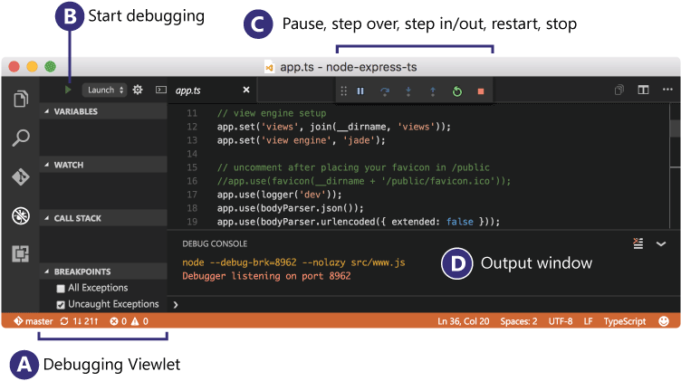
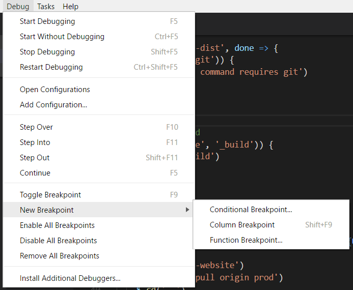
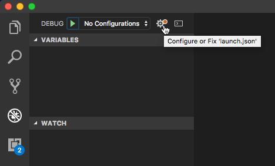
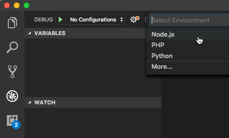
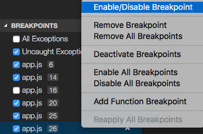
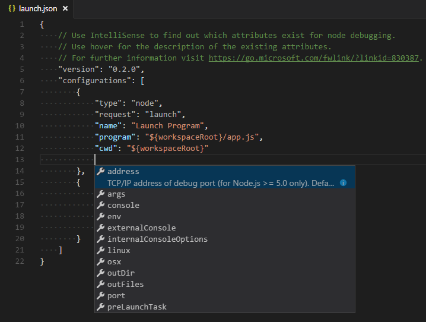
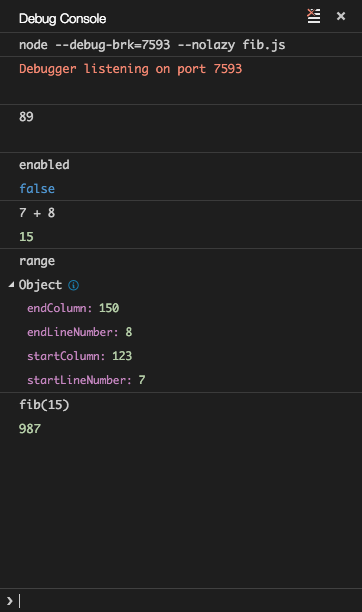

# Debugging

One of the key features of Visual Studio Code is its great debugging support. VS Code's built-in debugger helps accelerate your edit, compile, and debug loop.



## Debugger extensions

VS Code has built-in debugging support for the [Node.js](https://nodejs.org/) runtime and can debug JavaScript, TypeScript, or any other language that gets transpiled to JavaScript.

For debugging other languages and runtimes (including [PHP](https://marketplace.visualstudio.com/items?itemName=xdebug.php-debug), [Ruby](https://marketplace.visualstudio.com/items?itemName=rebornix.Ruby), [Go](https://marketplace.visualstudio.com/items?itemName=golang.go), [C#](https://marketplace.visualstudio.com/items?itemName=ms-dotnettools.csharp), [Python](https://marketplace.visualstudio.com/items?itemName=ms-python.python), [C++](https://marketplace.visualstudio.com/items?itemName=ms-vscode.cpptools), [PowerShell](https://marketplace.visualstudio.com/items?itemName=ms-vscode.PowerShell) and [many others](https://marketplace.visualstudio.com/search?term=debug&target=VSCode&category=Debuggers&sortBy=Relevance)), look for `Debuggers` [extensions](/docs/editor/extension-marketplace.md) in the VS Code [Marketplace](https://marketplace.visualstudio.com/vscode/Debuggers) or select **Install Additional Debuggers** in the top-level Run menu.

Below are several popular extensions which include debugging support:

<div class="marketplace-extensions-debuggers"></div>

> Tip: The extensions shown above are dynamically queried. Select an extension tile above to read the description and reviews to decide which extension is best for you.

## Start debugging

The following documentation is based on the built-in [Node.js](https://nodejs.org/) debugger, but most of the concepts and features are applicable to other debuggers as well.

It is helpful to first create a sample Node.js application before reading about debugging. You can follow the [Node.js walkthrough](/docs/nodejs/nodejs-tutorial.md) to install Node.js and create a simple "Hello World" JavaScript application (`app.js`). Once you have a simple application set up, this page will take you through VS Code debugging features.

## Run and Debug view

To bring up the **Run and Debug** view, select the **Run and Debug** icon in the **Activity Bar** on the side of VS Code. You can also use the keyboard shortcut `kb(workbench.view.debug)`.


The **Run and Debug** view displays all information related to running and debugging and has a top bar with debugging commands and configuration settings.

If running and debugging is not yet configured (no `launch.json` has been created), VS Code shows the Run start view.


## Run menu

The top-level **Run** menu has the most common run and debug commands:



## Launch configurations

To run or debug a simple app in VS Code, select **Run and Debug** on the Debug start view or press `kb(workbench.action.debug.start)` and VS Code will try to run your currently active file.

However, for most debugging scenarios, creating a launch configuration file is beneficial because it allows you to configure and save debugging setup details. VS Code keeps debugging configuration information in a `launch.json` file located in a `.vscode` folder in your workspace (project root folder) or in your [user settings](/docs/editor/debugging.md#global-launch-configuration) or [workspace settings](/docs/editor/multi-root-workspaces.md#workspace-launch-configurations).

To create a `launch.json` file, click the **create a launch.json file** link in the Run start view.



VS Code will try to automatically detect your debug environment, but if this fails, you will have to choose it manually:



Here is the launch configuration generated for Node.js debugging:

```json
{
    "version": "0.2.0",
    "configurations": [
        {
            "type": "node",
            "request": "launch",
            "name": "Launch Program",
            "skipFiles": [
                "<node_internals>/**"
            ],
            "program": "${workspaceFolder}\\app.js"
        }
    ]
}
```

If you go back to the File Explorer view (`kb(workbench.view.explorer)`), you'll see that VS Code has created a `.vscode` folder and added the `launch.json` file to your workspace.


>**Note**: You can debug a simple application even if you don't have a folder open in VS Code, but it is not possible to manage launch configurations and set up advanced debugging. The VS Code Status Bar is purple if you do not have a folder open.

Note that the attributes available in launch configurations vary from debugger to debugger. You can use IntelliSense suggestions (`kb(editor.action.triggerSuggest)`) to find out which attributes exist for a specific debugger. Hover help is also available for all attributes.

Do not assume that an attribute that is available for one debugger automatically works for other debuggers too. If you see green squiggles in your launch configuration, hover over them to learn what the problem is and try to fix them before launching a debug session.


Review all automatically generated values and make sure that they make sense for your project and debugging environment.

### Launch versus attach configurations

In VS Code, there are two core debugging modes, **Launch** and **Attach**, which handle two different workflows and segments of developers. Depending on your workflow, it can be confusing to know what type of configuration is appropriate for your project.

If you come from a browser Developer Tools background, you might not be used to "launching from your tool," since your browser instance is already open. When you open DevTools, you are simply **attaching** DevTools to your open browser tab. On the other hand, if you come from a server or desktop background, it's quite normal to have your editor **launch** your process for you, and your editor automatically attaches its debugger to the newly launched process.

The best way to explain the difference between **launch** and **attach** is to think of a **launch** configuration as a recipe for how to start your app in debug mode **before** VS Code attaches to it, while an **attach** configuration is a recipe for how to connect VS Code's debugger to an app or process that's **already** running.

VS Code debuggers typically support launching a program in debug mode or attaching to an already running program in debug mode. Depending on the request (`attach` or `launch`), different attributes are required, and VS Code's `launch.json` validation and suggestions should help with that.

### Add a new configuration

To add a new configuration to an existing `launch.json`, use one of the following techniques:

* Use IntelliSense if your cursor is located inside the configurations array.
* Press the **Add Configuration** button to invoke snippet IntelliSense at the start of the array.
* Choose **Add Configuration** option in the Run menu.


VS Code also supports compound launch configurations for starting multiple configurations at the same time; for more details, please read this [section](#compound-launch-configurations).

In order to start a debug session, first select the configuration named **Launch Program** using the **Configuration dropdown** in the **Run and Debug** view. Once you have your launch configuration set, start your debug session with `kb(workbench.action.debug.start)`.

Alternatively, you can run your configuration through the **Command Palette** (`kb(workbench.action.showCommands)`) by filtering on **Debug: Select and Start Debugging** or typing `'debug '` and selecting the configuration you want to debug.

As soon as a debugging session starts, the **DEBUG CONSOLE** panel is displayed and shows debugging output, and the Status Bar changes color (orange for default color themes):


In addition, the **debug status** appears in the Status Bar showing the active debug configuration. By selecting the debug status, a user can change the active launch configuration and start debugging without needing to open the **Run and Debug** view.


## Debug actions

Once a debug session starts, the **Debug toolbar** will appear on the top of the editor.


| Action                                                 | Explanation                                                                                                                                                            |
|--------------------------------------------------------|--------------------------------------------------------------------------------------------------------------------------------------------------------------------|
| Continue / Pause <br> `kb(workbench.action.debug.continue)` | **Continue**: Resume normal program/script execution (up to the next breakpoint). <br> **Pause**: Inspect code executing at the current line and debug line-by-line.     |
| Step Over <br> `kb(workbench.action.debug.stepOver)`        | Execute the next method as a single command without inspecting or following its component steps.                                                                    |
| Step Into <br> `kb(workbench.action.debug.stepInto)`        | Enter the next method to follow its execution line-by-line.                                                                                                         |
| Step Out <br> `kb(workbench.action.debug.stepOut)`          | When inside a method or subroutine, return to the earlier execution context by completing remaining lines of the current method as though it were a single command. |
| Restart <br> `kb(workbench.action.debug.restart)`           | Terminate the current program execution and start debugging again using the current run configuration.                                                             |
| Stop <br> `kb(workbench.action.debug.stop)`                 | Terminate the current program execution.                                                                                                                            |

>**Tip**: Use the setting `debug.toolBarLocation` to control the location of the debug toolbar. It can be the default `floating`, `docked` to the **Run and Debug** view, or `hidden`. A `floating` debug toolbar can be dragged horizontally and also down to the editor area.

### Run mode

In addition to debugging a program, VS Code supports **running** the program. The **Debug: Run (Start Without Debugging)** action is triggered with `kb(workbench.action.debug.run)` and uses the currently selected launch configuration. Many of the launch configuration attributes are supported in 'Run' mode. VS Code maintains a debug session while the program is running, and pressing the **Stop** button terminates the program.

>**Tip**: The **Run** action is always available, but not all debugger extensions support 'Run'. In this case, 'Run' will be the same as 'Debug'.

## Breakpoints

Breakpoints can be toggled by clicking on the **editor margin** or using `kb(editor.debug.action.toggleBreakpoint)` on the current line. Finer breakpoint control (enable/disable/reapply) can be done in the **Run and Debug** view's **BREAKPOINTS** section.

* Breakpoints in the editor margin are normally shown as red filled circles.
* Disabled breakpoints have a filled gray circle.
* When a debugging session starts, breakpoints that cannot be registered with the debugger change to a gray hollow circle. The same might happen if the source is edited while a debug session without live-edit support is running.

If the debugger supports breaking on different kinds of errors or exceptions, those will also be available in the **BREAKPOINTS** view.

The **Reapply All Breakpoints** command sets all breakpoints again to their original location. This is helpful if your debug environment is "lazy" and "misplaces" breakpoints in source code that has not yet been executed.



Optionally, breakpoints can be shown in the editor's overview ruler by enabling the setting `debug.showBreakpointsInOverviewRuler`:


## Logpoints

A Logpoint is a variant of a breakpoint that does not "break" into the debugger but instead logs a message to the console. Logpoints are especially useful for injecting logging while debugging production servers that cannot be paused or stopped.

A Logpoint is represented by a "diamond" shaped icon. Log messages are plain text but can include expressions to be evaluated within curly braces ('{}').


Just like regular breakpoints, Logpoints can be enabled or disabled and can also be controlled by a condition and/or hit count.

**Note**: Logpoints are supported by VS Code's built-in Node.js debugger, but can be implemented by other debug extensions. The [Python](/docs/python/python-tutorial.md) and [Java](/docs/java/java-tutorial.md) extensions, for example, support Logpoints.

## Data inspection

Variables can be inspected in the **VARIABLES** section of the **Run and Debug** view or by hovering over their source in the editor. Variable values and expression evaluation are relative to the selected stack frame in the **CALL STACK** section.


Variable values can be modified with the **Set Value** action from the variable's context menu. Additionally, you can use the **Copy Value** action to copy the variable's value, or **Copy as Expression** action to copy an expression to access the variable.

Variables and expressions can also be evaluated and watched in the **Run and Debug** view's **WATCH** section.


Variable names and values can be filtered by typing while the focus is on the **VARIABLES** section.


## Launch.json attributes

There are many `launch.json` attributes to help support different debuggers and debugging scenarios. As mentioned above, you can use IntelliSense (`kb(editor.action.triggerSuggest)`) to see the list of available attributes once you have specified a value for the `type` attribute.



The following attributes are mandatory for every launch configuration:

* `type` - the type of debugger to use for this launch configuration. Every installed debug extension introduces a type: `node` for the built-in Node debugger, for example, or `php` and `go` for the PHP and Go extensions.
* `request` - the request type of this launch configuration. Currently, `launch` and `attach` are supported.
* `name` - the reader-friendly name to appear in the Debug launch configuration dropdown.

Here are some optional attributes available to all launch configurations:

* `presentation` - using the `order`, `group`, and `hidden` attributes in the `presentation` object, you can sort, group, and hide configurations and compounds in the Debug configuration dropdown and in the Debug quick pick.
* `preLaunchTask` - to launch a task before the start of a debug session, set this attribute to the label of a task specified in [tasks.json](/docs/editor/tasks.md) (in the workspace's `.vscode` folder). Or, this can be set to `${defaultBuildTask}` to use your default build task.
* `postDebugTask` - to launch a task at the very end of a debug session, set this attribute to the name of a task specified in [tasks.json](/docs/editor/tasks.md) (in the workspace's `.vscode` folder).
* `internalConsoleOptions` - this attribute controls the visibility of the Debug Console panel during a debugging session.
* `debugServer` - **for debug extension authors only**: this attribute allows you to connect to a specified port instead of launching the debug adapter.
* `serverReadyAction` - if you want to open a URL in a web browser whenever the program under debugging outputs a specific message to the debug console or integrated terminal. For details see section [Automatically open a URI when debugging a server program](#automatically-open-a-uri-when-debugging-a-server-program) below.

Many debuggers support some of the following attributes:

* `program` - executable or file to run when launching the debugger
* `args` - arguments passed to the program to debug
* `env` - environment variables (the value `null` can be used to "undefine" a variable)
* `envFile` - path to dotenv file with environment variables
* `cwd` - current working directory for finding dependencies and other files
* `port` - port when attaching to a running process
* `stopOnEntry` - break immediately when the program launches
* `console` - what kind of console to use, for example, `internalConsole`, `integratedTerminal`, or `externalTerminal`

## Variable substitution

VS Code makes commonly used paths and other values available as variables and supports variable substitution inside strings in `launch.json`. This means that you do not have to use absolute paths in debug configurations. For example, `${workspaceFolder}` gives the root path of a workspace folder, `${file}` the file open in the active editor, and `${env:Name}` the environment variable 'Name'. You can see a full list of predefined variables in the [Variables Reference](/docs/editor/variables-reference.md) or by invoking IntelliSense inside the `launch.json` string attributes.

```json
{
    "type": "node",
    "request": "launch",
    "name": "Launch Program",
    "program": "${workspaceFolder}/app.js",
    "cwd": "${workspaceFolder}",
    "args": [ "${env:USERNAME}" ]
}
```

## Platform-specific properties

`Launch.json` supports defining values (for example, arguments to be passed to the program) that depend on the operating system where the debugger is running. To do so, put a platform-specific literal into the `launch.json` file and specify the corresponding properties inside that literal.

Below is an example that passes `"args"` to the program differently on Windows:

```json
{
    "version": "0.2.0",
    "configurations": [
        {
            "type": "node",
            "request": "launch",
            "name": "Launch Program",
            "program": "${workspaceFolder}/node_modules/gulp/bin/gulpfile.js",
            "args": ["myFolder/path/app.js"],
            "windows": {
                "args": ["myFolder\\path\\app.js"]
            }
        }
    ]
}
```

Valid operating properties are `"windows"` for Windows, `"linux"` for Linux, and `"osx"` for macOS. Properties defined in an operating system specific scope override properties defined in the global scope.

Please note that the `type` property cannot be placed inside a platform-specific section, because `type` indirectly determines the platform in remote debugging scenarios, and that would result in a cyclic dependency.

In the example below, debugging the program always **stops on entry** except on macOS:

```json
{
    "version": "0.2.0",
    "configurations": [
        {
            "type": "node",
            "request": "launch",
            "name": "Launch Program",
            "program": "${workspaceFolder}/node_modules/gulp/bin/gulpfile.js",
            "stopOnEntry": true,
            "osx": {
                "stopOnEntry": false
            }
        }
    ]
}
```

## Global launch configuration

VS Code supports adding a `"launch"` object inside your User [settings](/docs/getstarted/settings.md). This `"launch"` configuration will then be shared across your workspaces. For example:

```json
"launch": {
    "version": "0.2.0",
    "configurations": [{
        "type": "node",
        "request": "launch",
        "name": "Launch Program",
        "program": "${file}"
    }]
}
```

## Advanced breakpoint topics

### Conditional breakpoints

A powerful VS Code debugging feature is the ability to set conditions based on expressions, hit counts, or a combination of both.

* **Expression condition**: The breakpoint will be hit whenever the expression evaluates to `true`.
* **Hit count**: The 'hit count' controls how many times a breakpoint needs to be hit before it will 'break' execution. Whether a 'hit count' is respected and the exact syntax of the expression vary among debugger extensions.

You can add a condition and/or hit count when creating a source breakpoint (with the **Add Conditional Breakpoint** action) or when modifying an existing one (with the **Edit Condition** action). In both cases, an inline text box with a dropdown menu opens where you can enter expressions:


Condition and hit count editing support is also supported for **function** and **exception** breakpoints.
You can initiate condition editing from the context menu or the new inline **Edit Condition** action.

An example of condition editing in the **BREAKPOINTS** view:


If a debugger does not support conditional breakpoints, the **Add Conditional Breakpoint** and **Edit Condition** actions will be missing.

### Inline breakpoints

Inline breakpoints will only be hit when the execution reaches the column associated with the inline breakpoint. This is particularly useful when debugging minified code which contains multiple statements in a single line.

An inline breakpoint can be set using `kb(editor.debug.action.toggleInlineBreakpoint)` or through the context menu during a debug session. Inline breakpoints are shown inline in the editor.

Inline breakpoints can also have conditions. Editing multiple breakpoints on a line is possible through the context menu in the editor's left margin.

### Function breakpoints

Instead of placing breakpoints directly in source code, a debugger can support creating breakpoints by specifying a function name. This is useful in situations where source is not available but a function name is known.

A function breakpoint is created by pressing the **+** button in the **BREAKPOINTS** section header and entering the function name. Function breakpoints are shown with a red triangle in the **BREAKPOINTS** section.

### Data breakpoints

If a debugger supports data breakpoints, they can be set from the context menu in the **VARIABLES** view. The **Break on Value Change/Read/Access** commands will add a data breakpoint that is hit when the value of the underlying variable changes/is read/is accessed. Data breakpoints are shown with a red hexagon in the **BREAKPOINTS** section.

## Debug Console REPL

Expressions can be evaluated with the **Debug Console** REPL ([Read-Eval-Print Loop](https://en.wikipedia.org/wiki/Read–eval–print_loop)) feature. To open the Debug Console, use the **Debug Console** action at the top of the Debug pane or use the **View: Debug Console** command (`kb(workbench.debug.action.toggleRepl)`). Expressions are evaluated after you press `kbstyle(Enter)` and the Debug Console REPL shows suggestions as you type. If you need to enter multiple lines, use `kbstyle(Shift+Enter)` between the lines and then send all lines for evaluation with `kbstyle(Enter)`.
Debug Console input uses the mode of the active editor, which means that the Debug Console input supports syntax coloring, indentation, auto closing of quotes, and other language features.



**Note**: You must be in a running debug session to use the Debug Console REPL.

## Redirect input/output to/from the debug target

Redirecting input/output is debugger/runtime specific, so VS Code does not have a built-in solution that works for all debuggers.

Here are two approaches you might want to consider:

1. Launch the program to debug ("debug target") manually in a terminal or command prompt and redirect input/output as needed. Make sure to pass the appropriate command line options to the debug target so that a debugger can attach to it. Create and run an "attach" debug configuration that attaches to the debug target.

2. If the debugger extension you are using can run the debug target in VS Code's Integrated Terminal (or an external terminal), you can try to pass the shell redirect syntax (for example, "<" or ">") as arguments.

Here's an example `launch.json` configuration:

```json
{
    "name": "launch program that reads a file from stdin",
    "type": "node",
    "request": "launch",
    "program": "program.js",
    "console": "integratedTerminal",
    "args": [
        "<",
        "in.txt"
    ]
}
```

This approach requires that the "<" syntax is passed through the debugger extension and ends up unmodified in the Integrated Terminal.

## Multi-target debugging

For complex scenarios involving more than one process (for example, a client and a server), VS Code supports multi-target debugging.

Using multi-target debugging is simple: after you've started a first debug session, you can just launch another session. As soon as a second session is up and running, the VS Code UI switches to _multi-target mode_:

* The individual sessions now show up as top-level elements in the **CALL STACK** view.<BR>
* The debug toolbar shows the currently **active session** (and all other sessions are available in a dropdown menu).<BR>
* Debug actions (for example, all actions in the debug toolbar) are performed on the active session. The active session can be changed either by using the dropdown menu in the debug toolbar or by selecting a different element in the **CALL STACK** view.

### Compound launch configurations

An alternative way to start multiple debug sessions is by using a **compound** launch configuration. A compound launch configuration lists the names of two or more launch configurations that should be launched in parallel. Optionally a `preLaunchTask` can be specified that is run before the individual debug sessions are started. The boolean flag `stopAll` controls whether manually terminating one session will stop all of the compound sessions.

```json
{
    "version": "0.2.0",
    "configurations": [
        {
            "type": "node",
            "request": "launch",
            "name": "Server",
            "program": "${workspaceFolder}/server.js"
        },
        {
            "type": "node",
            "request": "launch",
            "name": "Client",
            "program": "${workspaceFolder}/client.js"
        }
    ],
    "compounds": [
        {
            "name": "Server/Client",
            "configurations": ["Server", "Client"],
            "preLaunchTask": "${defaultBuildTask}",
            "stopAll": true
        }
    ]
}
```

Compound launch configurations are displayed in the launch configuration dropdown menu.

## Remote debugging

VS Code does not itself support remote debugging: this is a feature of the debug extension you are using, and you should consult the extension's page in the [Marketplace](https://marketplace.visualstudio.com/search?target=VSCode&category=Debuggers&sortBy=Installs) for support and details.

There is, however, one exception: the Node.js debugger included in VS Code supports remote debugging. See the [Node.js Debugging](/docs/nodejs/nodejs-debugging.md#remote-debugging) topic to learn how to configure this.

## Automatically open a URI when debugging a server program

Developing a web program typically requires opening a specific URL in a web browser in order to hit the server code in the debugger. VS Code has a built-in feature "**serverReadyAction**" to automate this task.

Here is an example of a simple [Node.js Express](https://expressjs.com) application:

```javascript
var express = require('express');
var app = express();

app.get('/', function (req, res) {
  res.send('Hello World!')
});

app.listen(3000, function () {
  console.log('Example app listening on port 3000!')
});
```

This application first installs a "Hello World" handler for the "/" URL and then starts to listen for HTTP connections on port 3000. The port is announced in the Debug Console, and typically, the developer would now type `http://localhost:3000` into their browser application.

The **serverReadyAction** feature makes it possible to add a structured property `serverReadyAction` to any launch config and select an "action" to be performed:

```json
{
  "type": "node",
  "request": "launch",
  "name": "Launch Program",
  "program": "${workspaceFolder}/app.js",

  "serverReadyAction": {
    "pattern": "listening on port ([0-9]+)",
    "uriFormat": "http://localhost:%s",
    "action": "openExternally"
  }
}
```

Here the `pattern` property describes the regular expression for matching the program's output string that announces the port. The pattern for the port number is put into parenthesis so that it is available as a regular expression capture group. In this example, we are extracting only the port number, but it is also possible to extract a full URI.

The `uriFormat` property describes how the port number is turned into a URI. The first `%s` is substituted by the first capture group of the matching pattern.

The resulting URI is then opened outside of VS Code ("externally") with the standard application configured for the URI's scheme.

### Trigger Debugging via Edge or Chrome

Alternatively, the `action` can be set to `debugWithEdge` or `debugWithChrome`. In this mode, a `webRoot` property can be added that is passed to the Chrome or Edge debug session.

To simplify things a bit, most properties are optional and we use the following fallback values:

* **pattern**: `"listening on.* (https?://\\S+|[0-9]+)"` which matches the commonly used messages "listening on port 3000" or "Now listening on: https://localhost:5001".
* **uriFormat**: `"http://localhost:%s"`
* **webRoot**: `"${workspaceFolder}"`

### Triggering an Arbitrary Launch Config

In some cases, you may need to configure additional options for the browser debug session--or use a different debugger entirely. You can do this by setting `action` to `startDebugging` with a `name` property set to the name of the launch configuration to start when the `pattern` is matched.

The named launch configuration must be in the same file or folder as the one with the `serverReadyAction`.

Here the **serverReadyAction** feature in action:


## Next steps

To learn about VS Code's Node.js debugging support, take a look at:

* [Node.js](/docs/nodejs/nodejs-debugging.md) - Describes the Node.js debugger, which is included in VS Code.
* [TypeScript](/docs/typescript/typescript-debugging.md) - The Node.js debugger also supports TypeScript debugging.

To see tutorials on the basics of Node.js debugging, check out these videos:

* [Intro Video - Debugging](/docs/introvideos/debugging.md) - Showcases the basics of debugging.
* [Getting started with Node.js debugging](https://www.youtube.com/watch?v=2oFKNL7vYV8) - Shows how to attach a debugger to a running Node.js process.

To learn about debugging support for other programming languages via VS Code extensions:

* [C++](/docs/cpp/cpp-debug.md)
* [Python](/docs/python/debugging.md)
* [Java](/docs/java/java-debugging.md)

To learn about VS Code's task running support, go to:

* [Tasks](/docs/editor/tasks.md) - Describes how to run tasks with Gulp, Grunt, and Jake and how to show errors and warnings.

To write your own debugger extension, visit:

* [Debugger Extension](/api/extension-guides/debugger-extension.md) - Uses a mock sample to illustrate the steps required to create a VS Code debug extension.

## Common questions

### What are the supported debugging scenarios?

Debugging of Node.js-based applications is supported on Linux, macOS, and Windows out of the box with VS Code. Many other scenarios are supported by [VS Code extensions](https://marketplace.visualstudio.com/vscode/Debuggers?sortBy=Installs) available in the Marketplace.

### I do not see any launch configurations in the Run and Debug view dropdown. What is wrong?

The most common problem is that you did not set up `launch.json` or there is a syntax error in that file. Alternatively, you might need to open a folder, since no-folder debugging does not support launch configurations.
