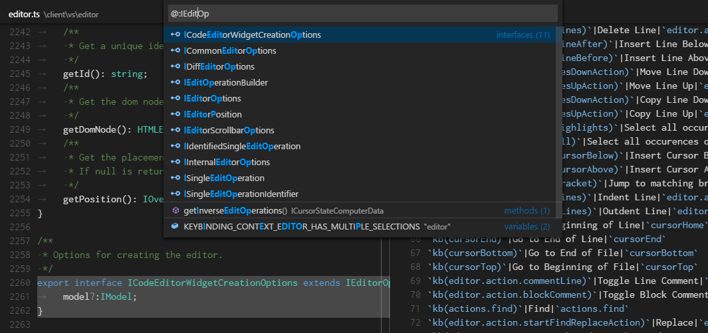
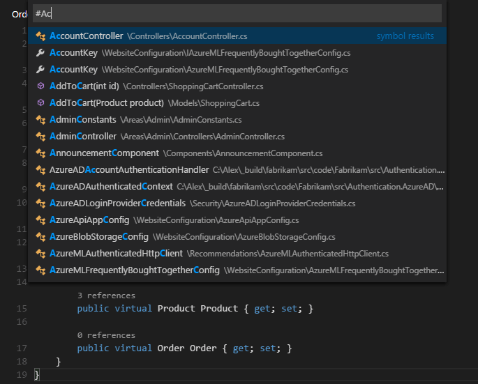
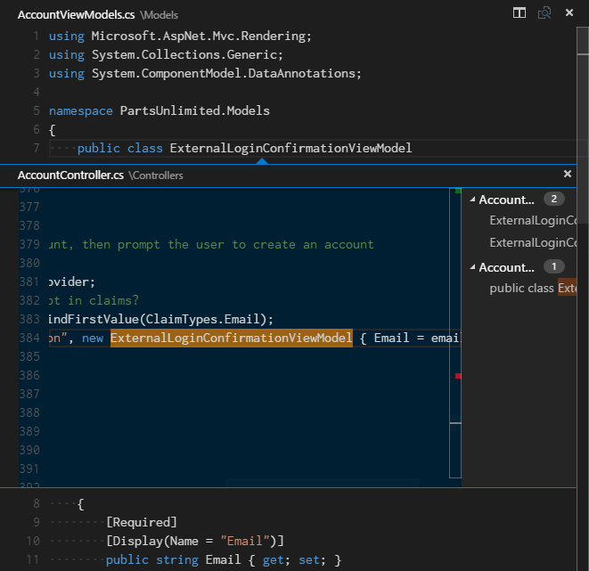
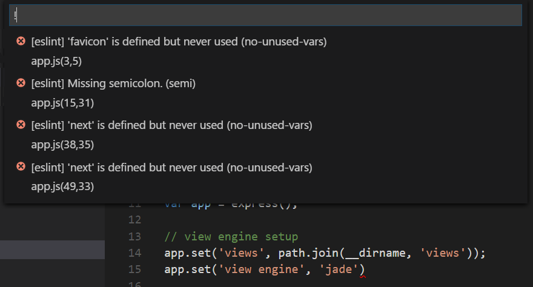
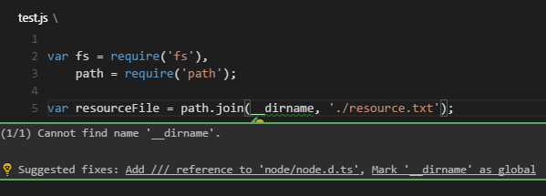

# Code Navigation

Visual Studio Code has a high productivity code editor which, when combined with programming language services, gives you the power of an IDE and the speed of a text editor. In this topic, we'll first describe VS Code's language intelligence features (suggestions, parameter hints, smart code navigation) and then show the power of the core text editor.

## Quick file navigation

>**Tip:** You can open any file by its name when you type `kb(workbench.action.quickOpen)` (**Quick Open**).

The Explorer is great for navigating between files when you are exploring a project. However, when you are working on a task, you will find yourself quickly jumping between the same set of files. VS Code provides two powerful commands to navigate in and across files with easy-to-use key bindings.

Hold `kbstyle(Ctrl)` and press `kbstyle(Tab)` to view a list of all files open in an editor group. To open one of these files, use `kbstyle(Tab)` again to pick the file you want to navigate to, then release `kbstyle(Ctrl)` to open it.


Alternatively, you can use `kb(workbench.action.navigateBack)` and `kb(workbench.action.navigateForward)` to navigate between files and edit locations. If you are jumping around between different lines of the same file, these shortcuts allow you to navigate between those locations easily.

## Breadcrumbs

The editor has a navigation bar above its contents called [Breadcrumbs](https://en.wikipedia.org/wiki/Breadcrumb_(navigation)). It shows the current location and allows you to quickly navigate between folders, files, and symbols.


Breadcrumbs always show the file path and, with the help of language extensions, the symbol path up to the cursor position. The symbols shown are the same as in Outline view and Go to Symbol.

Selecting a breadcrumb in the path displays a dropdown with that level's siblings so you can quickly navigate to other folders and files.


If the current file type has language support for symbols, you will see the current symbol path and a dropdown of other symbols at the same level and below.


You can turn off breadcrumbs with the **View** > **Show Breadcrumbs** toggle or with the `breadcrumbs.enabled` [setting](/docs/getstarted/settings.md).

### Breadcrumb customization

The appearance of breadcrumbs can be customized. If you have very long paths or are only interested in either file paths or symbols paths, you can use the `breadcrumbs.filePath` and `breadcrumbs.symbolPath` settings. Both support `on`, `off`, and `last` and they define if or what part of the path you see. By default, breadcrumbs show file and symbol icons to the left of the breadcrumb but you can remove the icons by setting `breadcrumbs.icons` to false.

### Symbol order in Breadcrumbs

You can control how symbols are ordered in the Breadcrumbs dropdown with the `breadcrumbs.symbolSortOrder` settings.

Allowed values are:

* `position` - position in the file (default)
* `name` - alphabetical order
* `type` - symbol type order

### Breadcrumb keyboard navigation

To interact with breadcrumbs, use the **Focus Breadcrumbs** command or press `kb(breadcrumbs.focusAndSelect)`. It will select that last element and open a dropdown that allows you to navigate to a sibling file or symbol. Use the `kb(breadcrumbs.focusPrevious)` and `kb(breadcrumbs.focusNext)` keyboard shortcuts to go to elements before or after the current element. When the dropdown appears, start typing - all matching elements will be highlighted and the best match will be selected for quick navigation.

You can also interact with breadcrumbs without the dropdown. Press `kb(breadcrumbs.focus)` to focus the last element, use `kb(breadcrumbs.focusPrevious)` and `kb(breadcrumbs.focusNext)` to navigate, and use `kb(breadcrumbs.revealFocused)` to reveal the element in the editor.

## Go to Definition

If a [language](/docs/languages/overview.md) supports it, you can go to the definition of a symbol by pressing `kb(editor.action.revealDefinition)`.

If you press `kbstyle(Ctrl)` and hover over a symbol, a preview of the declaration will appear:


> **Tip:** You can jump to the definition with `kbstyle(Ctrl+Click)` or open the definition to the side with `kbstyle(Ctrl+Alt+Click)`.

## Go to Type Definition

Some [languages](/docs/languages/overview.md) also support jumping to the type definition of a symbol by running the **Go to Type Definition** command from either the editor context menu or the **Command Palette**. This will take you to the definition of the type of a symbol. The command `editor.action.goToTypeDefinition` is not bound to a keyboard shortcut by default but you can add your own custom [keybinding](/docs/getstarted/keybindings.md).

## Go to Implementation

[Languages](/docs/languages/overview.md) can also support jumping to the implementation of a symbol by pressing `kb(editor.action.goToImplementation)`. For an interface, this shows all the implementors of that interface and for abstract methods, this shows all concrete implementations of that method.

## Go to Symbol

You can navigate symbols inside a file with `kb(workbench.action.gotoSymbol)`. By typing `kbstyle(:)` the symbols will be grouped by category. Press `kbstyle(Up)` or `kbstyle(Down)` and navigate to the place you want.



## Open symbol by name

Some languages support jumping to a symbol across files with `kb(workbench.action.showAllSymbols)`. Type the first letter of a type you want to navigate to, regardless of which file contains it, and press `kbstyle(Enter)`.



## Peek

We think there's nothing worse than a big context switch when all you want is to quickly check something. That's why we support peeked editors. When you execute a **Go to References** search (via `kb(editor.action.goToReferences)`), or a **Peek Definition** (via `kb(editor.action.peekDefinition)`), we embed the result inline:



You can navigate between different references in the peeked editor and make quick edits right there. Clicking on the peeked editor filename or double-clicking in the result list will open the reference in the outer editor.

> **Tip:** Additionally, the peek window is closed if you press `kbstyle(Escape)` or double-click in the peek editor region. You can disable this behavior with the `editor.stablePeek` [setting](/docs/getstarted/settings.md).

## Bracket matching

Matching brackets will be highlighted as soon as the cursor is near one of them.


> **Tip:** You can jump to the matching bracket with `kb(editor.action.jumpToBracket)`

## Reference information

Some languages like C# support inline reference information, that is updated live. This allows you to quickly analyze the impact of your edit or the popularity of your specific method or property throughout your project:


> **Tip:** Directly invoke the **Peek References** action by clicking on these annotations.

> **Tip:** Reference information shown in CodeLens can be turned on or off through the `editor.codeLens` [setting](/docs/getstarted/settings.md).

## Rename symbol

Some languages support rename symbol across files. Press `kb(editor.action.rename)` and then type the new desired name and press `kbstyle(Enter)`. All usages of the symbol will be renamed, across files.


## Errors & warnings

Warnings or Errors can be generated either via [configured tasks](/docs/editor/tasks.md), by rich language services, or by linters, that constantly analyze your code in the background. Since we love bug-free code, warnings and errors show up in multiple places:

* In the Status Bar, there is a summary of all errors and warnings counts.
* You can click on the summary or press `kb(workbench.actions.view.problems)` to display the **PROBLEMS** panel with a list of all current errors.
* If you open a file that has errors or warnings, they will be rendered inline with the text and in the overview ruler.



> **Tip:** To loop through errors or warnings in the current file, you can press `kb(editor.action.marker.nextInFiles)` or `kb(editor.action.marker.prevInFiles)` which will show an inline zone detailing the problem and possible Code Actions (if available):



## Code Action

Warnings and Errors can provide Code Actions (also known as Quick Fixes) to help fix issues. These will be displayed in the editor in the left margin as a lightbulb. Clicking on the lightbulb will either display the Code Action options or perform the action.

## Outgoing link protection

For your protection, VS Code displays a prompt before opening an outgoing website link from the editor.


You can proceed to the external website in your browser or have the options to copy the link or cancel the request. If you choose **Configure Trusted Domains**, a dropdown lets you trust the exact URL, trust the URL domain and subdomains, or trust all domains to disable outgoing link protection.


The option to **Manage Trusted Domains**, also available at any time from the Command Palette, brings up the **Trusted Domains** JSON file, where you can add, remove, or modify trusted domains.

```jsonc
// You can use the "Manage Trusted Domains" command to open this file.
// Save this file to apply the trusted domains rules.
[
  "*.twitter.com"
]
```

The **Trusted Domains** JSON file also has comments with examples of the supported domain formats and a list of the domains trusted by default, such as `https://*.visualstudio.com` and `https://*.microsoft.com`.

## Next steps

Now that you know how the editor works, time to try a few other things...

* [Intro Video - Code Editing](/docs/introvideos/codeediting.md) - Watch an introductory video on code editing features.
* [User Interface](/docs/getstarted/userinterface.md) - In case you missed a basic orientation around VS Code.
* [Key Bindings](/docs/getstarted/keybindings.md) - Learn how to modify key bindings to your preference.
* [Debugging](/docs/editor/debugging.md) - This is where VS Code really shines.

## Common questions

### How can I automatically select the second entry in Quick Open instead of the first?

With the command `workbench.action.quickOpenPreviousEditor`, you can have the second entry automatically selected in Quick Open. This can be useful if you want to select the previous entry from the list without having to invoke another keybinding:

```json
[
    {
        "key": "ctrl+p",
        "command": "workbench.action.quickOpenPreviousEditor"
    },
    {
        "key": "ctrl+p",
        "command": "-workbench.action.quickOpen"
    }
]
```

### How can I configure Ctrl+Tab to navigate across all editors of all groups

By default, `kbstyle(Ctrl+Tab)` navigates between editors of the same editor group. If you want to navigate across all opened editors in all groups, you can create keyboard shortcuts for the `workbench.action.quickOpenPreviousRecentlyUsedEditor` and `workbench.action.quickOpenLeastRecentlyUsedEditor` commands:

```json
[
    {
        "key": "ctrl+tab",
        "command": "workbench.action.quickOpenPreviousRecentlyUsedEditor",
        "when": "!inEditorsPicker"
    },
    {
        "key": "ctrl+shift+tab",
        "command": "workbench.action.quickOpenLeastRecentlyUsedEditor",
        "when": "!inEditorsPicker"
    }
]
```

### How can I navigate between recently used editors without a picker

Here is a list of commands you can use to navigate in editors without opening a picker:

Key|Command|Command ID
---|-------|----------
`kb(workbench.action.openNextRecentlyUsedEditor)`|Open Next Recently Used Editor|`workbench.action.openNextRecentlyUsedEditor`
`kb(workbench.action.openPreviousRecentlyUsedEditor)`|Open Previously Used Editor|`workbench.action.openPreviousRecentlyUsedEditor`
`kb(workbench.action.openNextRecentlyUsedEditorInGroup)`|Open Next Recently Used Editor in Group|`workbench.action.openNextRecentlyUsedEditorInGroup`
`kb(workbench.action.openPreviousRecentlyUsedEditorInGroup)`|Open Previously Used Editor in Group|`workbench.action.openPreviousRecentlyUsedEditorInGroup`
