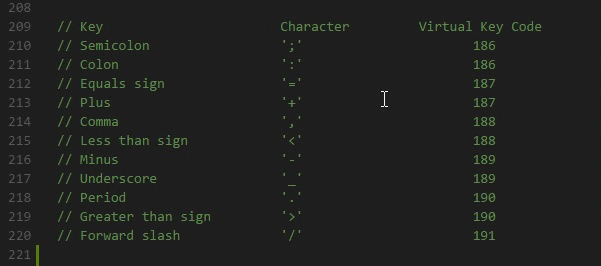
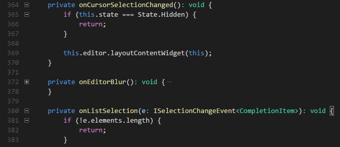

# Editing Evolved

Visual Studio Code has a high productivity code editor which, when combined with programming language services, gives you the power of an IDE and the speed of a text editor. In this topic, we'll first describe VS Code's language intelligence features (suggestions, parameter hints, smart code navigation) and then show the power of the core text editor.

## Editing - Smart

VS Code comes with a built-in JavaScript/TypeScript language service so you get JavaScript and TypeScript code intelligence out-of-the-box. For other languages, like Go, Python, and C#, you will need to install an extension for deep language service integration. Language services provide the code understanding necessary for features like IntelliSense (suggestions) and smart code navigation (Go to Definition, Find All References, Rename Symbol).  Different language extensions provide different levels of support for VS Code's language features but rest assured the community is very active adding new languages and great functionality. Learn more about installing VS Code extensions in our [Extensions Marketplace](/docs/editor/extension-gallery.md) topic and visit the [Marketplace](https://marketplace.visualstudio.com/VSCode) to see what's available for your favorite programming languages.


## IntelliSense

We'll always offer word completion, but for the rich [languages](/docs/languages/overview.md), such as JavaScript, JSON, HTML, CSS, Less, Sass, C# and TypeScript, we offer a true IntelliSense experience. If a language service knows possible completions, the IntelliSense suggestions will pop up as you type. You can always manually trigger it with `kb(editor.action.triggerSuggest)`.  By default, `kbstyle(.)`, `kbstyle(Tab)` or `kbstyle(Enter)` are the accept keyboard triggers but you can also [customize these key bindings](/docs/customization/keybindings.md).

> **Tip:** The suggestions filtering supports CamelCase so you can type the upper case letters of a method name to limit the suggestions. For example, "cra" will quickly bring up "createApplication".

> **Tip:** IntelliSense suggestions can be configured via the `editor.quickSuggestions` and `editor.suggestOnTriggerCharacters` [settings](/docs/customization/userandworkspace.md).

JavaScript and TypeScript developers can take advantage of the [DefinitelyTyped](https://github.com/DefinitelyTyped/DefinitelyTyped) type definition (typings) file repository to get IntelliSense for common JavaScript libraries (Node.js, React, Angular). You can find a good explanation on using `typings` files in the [JavaScript language](/docs/languages/javascript#_intellisense) topic and the [Node.js](/docs/runtimes/nodejs#_intellisense-and-typings) walkthrough.

## Parameter Hints

In JavaScript, TypeScript or C#, parameter hints will pop up as you're typing a method invocation. You can navigate between different overloads with `kbstyle(Up)` and `kbstyle(Down)` and the best overload will be presented based on the arguments you pass in.


## Hover

For languages that support it, the hover will show useful information, such as types of symbols, or, in the case of CSS below, the shape of the HTML that would match a certain CSS rule:


## Go to Definition

If a [language](/docs/languages/overview.md) supports it, you can go to the definition of a symbol by pressing `kb(editor.action.goToDeclaration)`.

If you press `kbstyle(Ctrl)` and hover over a symbol, a preview of the declaration will appear:


> **Tip:** You can jump to the definition with `kbstyle(Ctrl+Click)` or open the definition to the side with `kbstyle(Ctrl+Alt+Click)`. If you opened a new editor window, you can go back to the previous editor with `kb(workbench.action.focusLeftEditor)`.

## Goto Symbol

You can navigate symbols inside a file with `kb(workbench.action.gotoSymbol)`. By typing `kbstyle(:)` the symbols will be grouped by category. Just press `kbstyle(Up)` or `kbstyle(Down)` and navigate to the place you want.


## Open symbol by name

Some languages support jumping to a symbol across files with `kb(workbench.action.showAllSymbols)`. Just type the first letter of a type you want to navigate to, regardless of which file contains it, and press `kbstyle(Enter)`.


## Peek

We think there's nothing worse than a big context switch when all you want is to quickly check something. That's why we support peeked editors. When you execute a **Find All References** search (via `kb(editor.action.referenceSearch.trigger)`), or a **Peek Definition** (via `kb(editor.action.previewDeclaration)`), we embed the result inline:


You can navigate between different references in the peeked editor and make quick edits right there. Clicking on the peeked editor filename or double-clicking in the result list will open the reference in the outer editor.

> **Tip:** Additionally, the peek window is closed if you press `kbstyle(Escape)` or double-click in the peek editor region. You can disable this behavior with the `editor.stablePeek` [setting](/docs/customization/userandworkspace.md).

## Bracket matching

Matching brackets will be highlighted as soon as the cursor is near one of them.


> **Tip:** You can jump to the matching bracket with `kb(editor.action.jumpToBracket)`

## Reference information

Some languages like C# supports inline reference information, that is updated live. This allows you to quickly analyze the impact of your edit or the popularity of your specific method or property throughout your project:


> **Tip:** Directly invoke the **Find All References** action by clicking on these annotations.

> **Tip:** Reference information can be turned on or off through the `editor.referenceInfos` setting.

## Rename symbol

Some languages support rename symbol across files. Simply press `kb(editor.action.rename)` and then type the new desired name and press `kbstyle(Enter)`. All usages of the symbol will be renamed, across files.


## Errors & Warnings

Warnings or Errors can be generated either via [configured tasks](/docs/editor/tasks.md), by rich language services, or by linters, that constantly analyze your code in the background. Since we love bug-free code, warnings and errors show up in multiple places:

* In the status bar, there is a summary of all errors and warnings counts.
* You can click on the summary or press `kb(workbench.actions.view.problems)` to display the **PROBLEMS** panel with a list of all current errors.
* If you open a file that has errors or warnings, they will be rendered inline with the text and in the overview ruler.


> **Tip:** To loop through errors or warnings in the current file, you can press `kb(editor.action.marker.next)` or `kb(editor.action.marker.prev)` which will show an inline zone detailing the problem and possible code actions (if available):


## Editing - Fast

The Visual Studio Code editor has many features you need for high productivity when working with text. Besides the features discussed below, you can learn about other editor commands and their keyboard shortcuts by looking in the **Command Palette** (`kb(workbench.action.showCommands)`) and the `Default Keyboard Shortcuts` (**Files** > **Preferences** > **Keyboard Shortcuts**).

## Multiple Selections

VS Code supports for multiple cursors for fast simultaneous edits. You can add secondary cursors (rendered thinner) with `kbstyle(Alt+Click)`. Each cursor operates independently based on the context it sits in. A common way to add more cursors is with `kb(editor.action.insertCursorBelow)` or `kb(editor.action.insertCursorAbove)` that insert cursors below or above.

> **Note:** Your graphics card driver (for example NVIDIA) might overwrite these default shortcuts.


`kb(editor.action.addSelectionToNextFindMatch)` selects the word at the cursor, or the next occurrence of the current selection.  `kb(editor.action.moveSelectionToNextFindMatch)` moves the last added cursor to next occurrence of the current selection.


> **Tip:** You can add more cursors also with `kb(editor.action.selectHighlights)`, which will add a selection at each occurrence of the current selected text or with `kb(editor.action.changeAll)`, which will add a selection at each occurrence of the current word.

## Shrink/expand selection

Quickly shrink or expand the current selection (applies to all languages). Trigger it with `kb(editor.action.smartSelect.shrink)` and `kb(editor.action.smartSelect.grow)`

Here's an example of expanding the selection with `kb(editor.action.smartSelect.grow)`:


## Column (box) text selection

Hold `kbstyle(Shift)` and `kbstyle(Alt)` while dragging to do column text selection:



There are also default key bindings for column selection on OS X and Windows, but not on Linux. You can [edit](/docs/customization/keybindings.md) your `keybindings.json` to bind them to something more familiar if you wish.

For example:

```json
{ "key": "shift+alt+down",     "command": "cursorColumnSelectDown",
                                  "when": "editorTextFocus" },
{ "key": "shift+alt+left",     "command": "cursorColumnSelectLeft",
                                  "when": "editorTextFocus" },
{ "key": "shift+alt+pagedown", "command": "cursorColumnSelectPageDown",
                                  "when": "editorTextFocus" },
{ "key": "shift+alt+pageup",   "command": "cursorColumnSelectPageUp",
                                  "when": "editorTextFocus" },
{ "key": "shift+alt+right",    "command": "cursorColumnSelectRight",
                                  "when": "editorTextFocus" },
{ "key": "shift+alt+up",       "command": "cursorColumnSelectUp",
                                  "when": "editorTextFocus" }
```

## Folding

You can fold regions of source code using the folding icons on the gutter between line numbers and line start. Move the mouse over the gutter to fold and unfold regions. The folding regions are evaluated based on the indentation of lines. A folding region starts when a line has a smaller indent than one or more following lines, and ends when there is a line with the same or smaller indent.

You can also use the following actions:

 * Fold (`kb(editor.fold)`) folds the innermost uncollapsed region at the cursor
 * Unfold (`kb(editor.unfold)`) unfolds the collapsed region at the cursor
 * Fold All (`kb(editor.foldAll)`) folds all region in the editor
 * Unfold All (`kb(editor.unfoldAll)`) unfolds all regions in the editor
 * Fold Level X (`kb(editor.foldLevel2)` for level 2) folds all regions of level X, except the region at the current cursor position



## Next Steps

Now that you know how the editor works, time to try a few other things...

* [The Basics](/docs/editor/codebasics.md) - In case you missed a basic orientation around VS Code.
* [Customization](/docs/customization/overview.md) - Configure VS Code the way you want - Themes, Settings, Display Language
* [Key Bindings](/docs/customization/keybindings.md) - Learn how to modify key bindings to your preference.
* [Debugging](/docs/editor/debugging.md) - This is where VS Code really shines.

