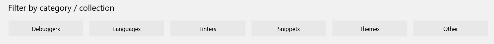

# VS Code Extension Marketplace

## Increase the power of VS Code through Extensions

The features that VS Code includes out-of-the-box are just the start. VS Code extensions let you add languages, debuggers, and tools to your installation to support your development workflow. VS Code's rich extensibility model lets extension authors plug directly into the VS Code UI and contribute functionality through the same APIs used by VS Code.  This topic explains how to find, install, and manage VS Code extensions.

## Browse and Install Extensions in VS Code

You can browse and install extensions from within VS Code. Bring up the Extension view by clicking on the Extensions icon in the View Bar on the side of VS Code.


This will show you a list of the most popular VS Code extensions on the [VS Code Marketplace](https://marketplace.visualstudio.com/VSCode).


Each extension in the list includes a brief description, the publisher, the download count and a five star rating. You can click on the extension item to display the extension's [VS Code Marketplace](https://marketplace.visualstudio.com/VSCode) page where you can learn more.

>**Note:** If your computer's Internet access goes through a proxy server, you will need to configure the proxy server. See [Proxy Server Support](/docs/setup/setup-overview.md#proxy-server-support) for details.

By clicking on the view's `...` **More** button, it is possible to show:

* The list of currently installed extensions
* The list of outdated extensions that can be updated
* The list of recommended extensions based on your workspace
* The list of globally popular extensions

## Install an Extension

Simply click the **Install** button and after a successful install, you'll see an **Enable** button which will prompt you to restart VS Code to enable the new extension.

## Search for an Extension

You can clear the Search box at the top of the Extensions View and type in the name of the extension, tool or programming language you're looking for. 

For example, typing 'python' will bring up a list of Python language extensions:


You can see a list of recommended extensions (based on your workspace file types), using **Show Recommended Extensions** which sets the '@recommended' filter.

## List Installed Extensions

**Show Installed Extensions** will clear the search box and shows the list of installed extensions.

## Uninstall an Extension

To uninstall an extension, click the **Uninstall** button. This will uninstall the extension and prompt you to restart VS Code.

## Update an Extension

You can quickly look for extension updates by using the **Show Outdated Extensions** command which uses the '@outdated' filter.  This will display any available updates for your currently installed extensions. Simply click the **Update** button for the outdated extension and the update will be installed and you'll be prompted to restart VS Code.

## Browse Extensions

Additionally, you can browse and search for VS Code extensions through the [VS Code Marketplace](https://marketplace.visualstudio.com/VSCode) site. Below is a sampling of the most popular extensions. 

<div class="marketplace-extensions-top"></div>

You can review our handy **Featured**, **Most Popular**, and **Recently Added** extension lists and filter by **Category** (Debuggers, Languages, Linters, etc).



## Command Line Extension Management

To make it easier to automate and configure VS Code, it is possible to list, install, and uninstall extensions from the command line. When identifying an extension, provide the full name of the form `publisher.extension`, for example `donjayamanne.python`.

Example:

```
code --list-extensions
code --install-extension ms-vscode.cpptools
code --uninstall-extension ms-vscode.csharp
```

## Next Steps

Here are a few topics you may find interesting...

* [Publishing to the Marketplace](/docs/tools/vscecli.md) - Publish your own customization or extension to the VS Code Marketplace
* [Customization](/docs/customization/overview.md) - Learn how to integrate TextMate themes, colorizers and snippets into Visual Studio Code.
* [Yo Code](/docs/tools/yocode.md) - Learn how the Yo Code extension generator can scaffold out new extensions and package existing TextMate files.
* [Extending Visual Studio Code](/docs/extensions/overview.md) - Start learning about VS Code extensibility
* [Your First Extension](/docs/extensions/example-hello-world.md) - Try creating a simple Hello World extension

## Common Questions

**Q: Can I download an extension directly from the Marketplace?**

**A:** Some users prefer to download an extension once from the Marketplace and then install it multiple times from a local share. This is useful when there are connectivity concerns or if your development team wants to use a fixed set of extensions.

An extension's direct download URL is in the form: 

```
https://${publisher}.gallery.vsassets.io/_apis/public/gallery/publisher/${publisher}/extension/${extension name}/${version}/assetbyname/Microsoft.VisualStudio.Services.VSIXPackage
```

For example, the [ESLint extension](https://marketplace.visualstudio.com/items?itemName=dbaeumer.vscode-eslint) version `0.10.18` would be:

```
https://dbaeumer.gallery.vsassets.io/_apis/public/gallery/publisher/dbaeumer/extension/vscode-eslint/0.10.18/assetbyname/Microsoft.VisualStudio.Services.VSIXPackage
```

Once you've downloaded an extension, you can side load it by renaming the `.zip` filename extension to `.vsix` and then opening the `.vsix` file directly in VS Code (**File** > **Open File...**).  See [Installing Extensions](/docs/extensions/install-extension.md#install-a-packaged-extension-vsix) for more details.

**Q: Can VS Code read TextMate bundles directly?**

**A**: No, VS Code can read some TextMate files such as .tmTheme and .tmLanguage but can not install full TextMate bundles. Also in order to use TextMate theme and syntax files, VS Code needs extra metadata for integration.  The [Yo Code](/docs/tools/yocode.md) extension generator makes it easy to package these files for use in VS Code.

**Q: Can I install Visual Studio Community extensions (shipped in .vsix) in Visual Studio Code?**

**A:** No, Visual Studio Code's extensibility points are different from Visual Studio Community.

**Q: Whenever I try to install any extension, I get a connect ETIMEDOUT error.**

**A:** You may see this error if your machine is going through a proxy server to access the Internet.  See the [Proxy Server Support](/docs/setup/setup-overview.md#proxy-server-support) section in SETUP topic for details.