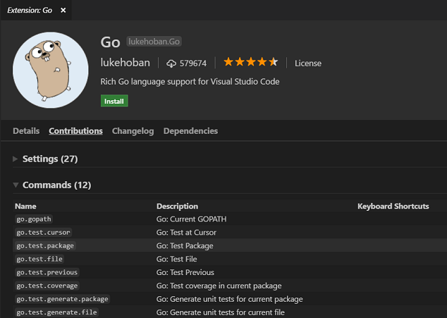
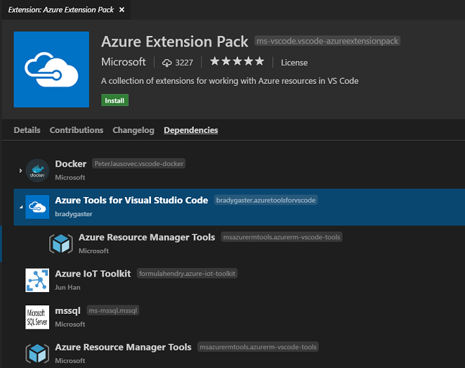
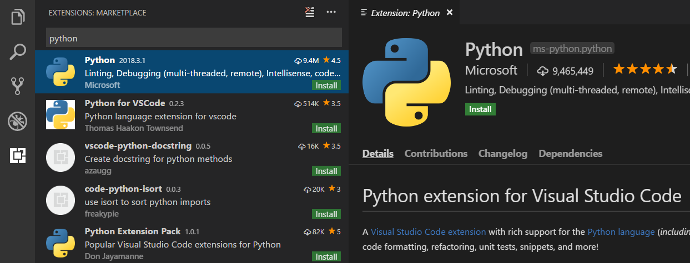
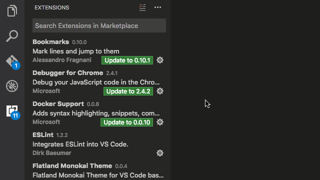
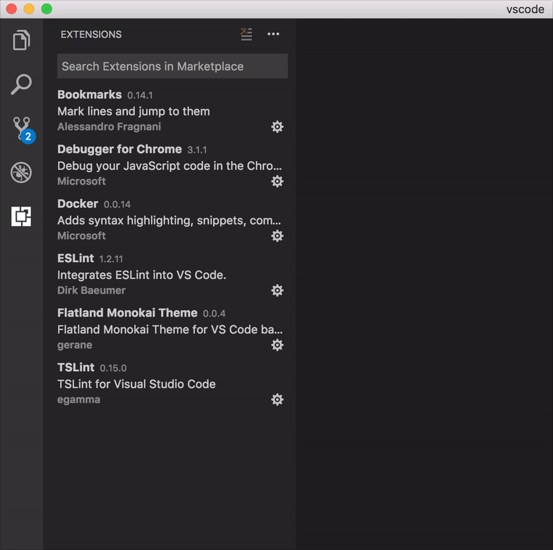
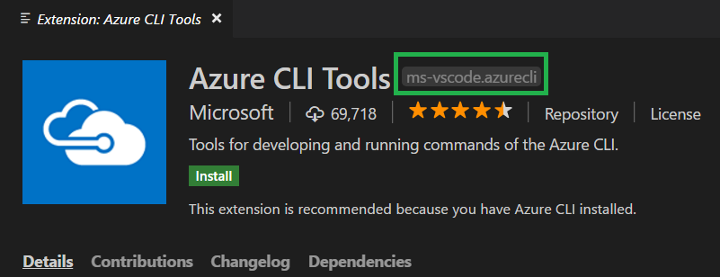
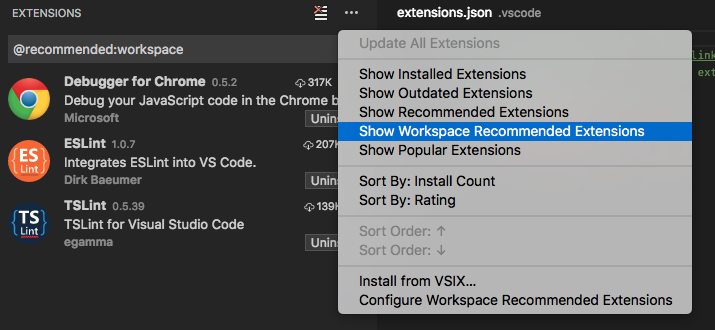

# VS Code Extension Marketplace

**Increase the power of Visual Studio Code through Extensions**

The features that Visual Studio Code includes out-of-the-box are just the start. VS Code extensions let you add languages, debuggers, and tools to your installation to support your development workflow. VS Code's rich extensibility model lets extension authors plug directly into the VS Code UI and contribute functionality through the same APIs used by VS Code.  This topic explains how to find, install, and manage VS Code extensions.

## Browse and install extensions

You can browse and install extensions from within VS Code. Bring up the Extensions view by clicking on the Extensions icon in the **Activity Bar** on the side of VS Code or the **View: Extensions** command (`kb(workbench.view.extensions)`).


This will show you a list of the most popular VS Code extensions on the [VS Code Marketplace](https://marketplace.visualstudio.com/VSCode).


Each extension in the list includes a brief description, the publisher, the download count and a five star rating. You can click on the extension item to display the extension's [VS Code Marketplace](https://marketplace.visualstudio.com/VSCode) page where you can learn more.

In addition, you can also review an extension's:

* **Contributions** - The extension's additions to VS Code such as settings, commands and keyboard shortcuts, language grammars, debugger, etc.
* **Changelog** - The extension repository CHANGELOG if available.
* **Dependencies** - Lists if the extension depends on any other extensions.



If an extension is an Extension Pack, the **Dependencies** section will display which extensions will be installed. [Extension Packs](/docs/extensionAPI/extension-manifest.md#extension-packs) bundle separate extensions together so they can be easily installed at one time.



**Note:** If your computer's Internet access goes through a proxy server, you will need to configure the proxy server. See [Proxy server support](/docs/setup/network.md#proxy-server-support) for details.

By clicking on the Extensions view's `...` **More** button, it is possible to show:

* The list of currently installed extensions
* The list of outdated extensions that can be updated
* The list of recommended extensions based on your workspace
* The list of globally popular extensions

You can sort the extension list by **Install Count** or **Rating** in either ascending or descending order.

## Install an extension

Click the **Install** button and after a successful install, you'll see an **Reload** button which will prompt you to restart VS Code to enable the new extension.

## Search for an extension

You can clear the Search box at the top of the Extensions View and type in the name of the extension, tool or programming language you're looking for.

For example, typing 'python' will bring up a list of Python language extensions:



You can see a list of recommended extensions (based on your workspace file types), using **Show Recommended Extensions** which sets the '@recommended' filter.

## Manage extensions

VS Code makes it very easy to manage your extensions. You can install, disable, update, and uninstall extensions through the Extensions view, **Command Prompt** (**Extensions"** scope) or command line.

### List installed extensions

**Show Installed Extensions** will clear the search box and shows the list of installed extensions.

### Uninstall an extension

To uninstall an extension, click the **Uninstall** button. This will uninstall the extension and prompt you to restart VS Code.

### Update an extension

You can quickly look for extension updates by using the **Show Outdated Extensions** command which uses the '@outdated' filter.  This will display any available updates for your currently installed extensions. Click the **Update** button for the outdated extension and the update will be installed and you'll be prompted to restart VS Code. You can also update all your outdated extensions at one time with the **Update All Extensions** command.

### Auto Update extensions

If you would like your installed extensions to be updated automatically, you can use the `extensions.autoUpdate` [setting](/docs/getstarted/settings.md). When set to `true`, VS Code will download new versions of outdated extensions automatically and you will just need to restart VS Code when you see the blue **Reload** button in the Installed Extensions list.

### Disable an extension

Disable an extension by clicking the settings icon next to the extension, as shown in the animation below.



Alternatively, you can disable all extensions as shown in the animation below



## Command line extension management

To make it easier to automate and configure VS Code, it is possible to list, install, and uninstall extensions from the [command line](/docs/editor/command-line.md). When identifying an extension, provide the full name of the form `publisher.extension`, for example `ms-python.python`.

Example:

```
code --list-extensions
code --install-extension ms-vscode.cpptools
code --uninstall-extension ms-vscode.csharp
code --disable-extensions
```

## Install from a VSIX

You can manually install a VS Code extension packaged in a `.vsix` file. Using the **Install from VSIX...** command in the Extensions View command drop-down, or the **Extensions: Install from VSIX...** command in the **Command Palette**, point to the `.vsix` file.

You can also install using the VS Code `--install-extension` command line switch providing the path to the `.vsix` file.

```
code --install-extension myextension.vsix
```

You may provide the `--install-extension` multiple times on the command line to install multiple extensions at once.

If you'd like to learn more about packaging and publishing extensions, see our [Publishing Extensions](/docs/extensions/publish-extension.md) topic in the Extension Authoring section.

## Workspace Recommended Extensions

A good set of extensions can make working with a particular workspace or programming language more productive and you'd often like to share this list with your team or colleagues. You can create a recommended list of extensions for a workspace with the **Extensions: Configure Recommended Extensions (Workspace)** command.

In a single folder workspace, the command creates an `extensions.json` file located in the workspace `.vscode` folder where you can add a list of extensions identifiers ({publisherName}.{extensionName}).

In a [multi-root workspace](/docs/editor/multi-root-workspaces.md), the command will open your `.code-workspace` file where you can list extensions under `extensions.recommendations`. You can still add extension recommendations to individual folders in a multi-root workspace by using the **Extensions: Configure Recommended Extensions (Workspace Folder)** command.

An example `extensions.json` could be:

```json
{
    "recommendations": [
        "eg2.tslint",
        "dbaeumer.vscode-eslint",
        "msjsdiag.debugger-for-chrome"
    ]
}
```

which recommends two linter extensions, TSLint and ESLint, as well as the Chrome debugger extension.

An extension is identified using its publisher name and extension identifier `publisher.extension`. You can see the name on the extension's detail page.

.

VS Code prompts a user to install the recommended extensions when a workspace is opened for the first time. The user can also review the list with the **Extensions: Show Recommended Extensions** command.



## Next Steps

Here are a few topics you may find interesting...

* [Publishing to the Marketplace](/docs/extensions/publish-extension.md) - Publish your own customization or extension to the VS Code Marketplace
* [Extension Generator](/docs/extensions/yocode.md) - Learn how the Yo Code extension generator can scaffold out new extensions and package existing TextMate files.
* [Extending Visual Studio Code](/docs/extensions/overview.md) - Start learning about VS Code extensibility
* [Your First Extension](/docs/extensions/example-hello-world.md) - Try creating a simple Hello World extension

## Common Questions

**Q: Can I download an extension directly from the Marketplace?**

**A:** Some users prefer to download an extension once from the Marketplace and then install it multiple times from a local share. This is useful when there are connectivity concerns or if your development team wants to use a fixed set of extensions.

An extension's direct download URL is in the form:

```
http://${publisher}.gallery.vsassets.io/_apis/public/gallery/publisher/${publisher}/extension/${extension name}/${version}/assetbyname/Microsoft.VisualStudio.Services.VSIXPackage
```

For example, the [ESLint extension](https://marketplace.visualstudio.com/items?itemName=dbaeumer.vscode-eslint) version `0.10.18` would be:

```
http://dbaeumer.gallery.vsassets.io/_apis/public/gallery/publisher/dbaeumer/extension/vscode-eslint/0.10.18/assetbyname/Microsoft.VisualStudio.Services.VSIXPackage
```

Once you've downloaded an extension, you can side load it by renaming the `.zip` filename extension to `.vsix` and then using the **Install from VSIX...** command in the Extensions View command drop-down.

**Q: Where are extensions installed?**

**A**: Extensions are installed in your extensions folders. Depending on your platform, the global location is in the following folders:

* **Windows** `%USERPROFILE%\.vscode\extensions`
* **Mac** `~/.vscode/extensions`
* **Linux** `~/.vscode/extensions`

**Q: Can VS Code read TextMate bundles directly?**

**A**: No, VS Code can read some TextMate files such as .tmTheme and .tmLanguage but can not install full TextMate bundles. Also in order to use TextMate theme and syntax files, VS Code needs extra metadata for integration. The [Yo Code](/docs/extensions/yocode.md) extension generator makes it easy to package these files for use in VS Code. See the [Themes, Snippets, and Colorizers](/docs/extensions/themes-snippets-colorizers.md) topic in the Extension Authoring section for details.

**Q: Can I install Visual Studio Community extensions (shipped in .vsix) in Visual Studio Code?**

**A:** No, Visual Studio Code's extensibility points are different from Visual Studio Community.

**Q: Whenever I try to install any extension, I get a connect ETIMEDOUT error.**

**A:** You may see this error if your machine is going through a proxy server to access the Internet.  See the [Proxy server support](/docs/setup/network.md#proxy-server-support) section in SETUP topic for details.
