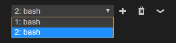
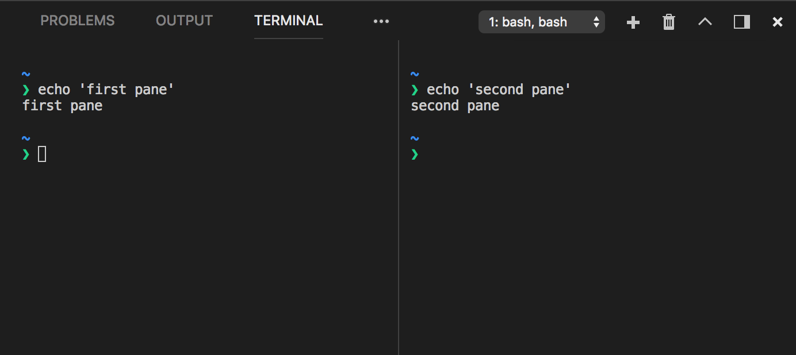

# Integrated Terminal

In Visual Studio Code, you can open an integrated terminal, initially starting at the root of your workspace. This can be convenient as you don't have to switch windows or alter the state of an existing terminal to perform a quick command-line task.

To open the terminal:

* Use the `kb(workbench.action.terminal.toggleTerminal)` keyboard shortcut with the backtick character.
* Use the **View** > **Terminal** menu command.
* From the **Command Palette** (`kb(workbench.action.showCommands)`), use the **View: Toggle Integrated Terminal** command.


> **Note:** You can still open an external shell with the `kb(workbench.action.terminal.openNativeConsole)` keyboard shortcut if you prefer to work outside VS Code.

## Managing multiple terminals

You can create multiple terminals open to different locations and easily navigate between them. Terminal instances can be added by clicking the plus icon on the top-right of the **TERMINAL** panel or by triggering the `kb(workbench.action.terminal.new)` command. This action creates another entry in the drop-down list that can be used to switch between them.



Remove terminal instances by pressing the trash can button.

>**Tip:** If you use multiple terminals extensively, you can add key bindings for the `focusNext`, `focusPrevious` and `kill` commands outlined in the [Key Bindings section](/docs/editor/integrated-terminal.md#terminal-key-bindings) to allow navigation between them using only the keyboard.

### Terminal Splitting

You can also split the terminal by triggering the `kb(workbench.action.terminal.split)` command or via the right click context menu.



When focusing a split terminal pane, you can move focus and resize using one of the following commands:

Key|Command
---|---
`kb(workbench.action.terminal.focusPreviousPane)` | Focus Previous Pane
`kb(workbench.action.terminal.focusNextPane)` | Focus Next Pane
`kb(workbench.action.terminal.resizePaneLeft)` | Resize Pane Left
`kb(workbench.action.terminal.resizePaneRight)` | Resize Pane Right
`kb(workbench.action.terminal.resizePaneUp)` | Resize Pane Up
`kb(workbench.action.terminal.resizePaneDown)` | Resize Pane Down

## Configuration

The shell used defaults to `$SHELL` on Linux and macOS, PowerShell on Windows 10 and cmd.exe on earlier versions of Windows. These can be overridden manually by setting `terminal.integrated.shell.*` in user [settings](/docs/getstarted/settings.md). Arguments can be passed to the terminal shell using the `terminal.integrated.shellArgs.*` user settings.

>**Note:** For [enhanced security](/docs/getstarted/settings.md#settings-and-security), such settings can only be defined in user settings and not at workspace scope.

### Windows

For Windows there is a convenient shell selector located inside the terminal dropdown that lets you choose between several detected shells including Command Prompt, PowerShell, PowerShell Core, Git Bash and WSL Bash. The **Terminal: Select Default Shell** command is also available through the command palette if you prefer to access it there.

Just like on other platforms you can fine tune the exact executable used in your settings file, for example:

```json
// Command Prompt
"terminal.integrated.shell.windows": "C:\\Windows\\System32\\cmd.exe"
// PowerShell
"terminal.integrated.shell.windows": "C:\\Windows\\System32\\WindowsPowerShell\\v1.0\\powershell.exe"
// Git Bash
"terminal.integrated.shell.windows": "C:\\Program Files\\Git\\bin\\bash.exe"
// Bash on Ubuntu (on Windows)
"terminal.integrated.shell.windows": "C:\\Windows\\System32\\bash.exe"
```

>**Note:** To be used as an integrated terminal, the shell executable must be a console application so that `stdin/stdout/stderr` can be redirected.

>**Tip:** The integrated terminal shell is running with the permissions of VS Code. If you need to run a shell command with elevated (administrator) or different permissions, you can use platform utilities such as `runas.exe` within a terminal.

### Shell arguments

You can pass arguments to the shell when it is launched.

For example, to enable running bash as a login shell (which runs `.bash_profile`), pass in the `-l` argument (with double quotes):

```json
// Linux
"terminal.integrated.shellArgs.linux": ["-l"]
```

## Terminal display settings

You can customize the integrated terminal font and line height with the following settings:

* `terminal.integrated.fontFamily`
* `terminal.integrated.fontSize`
* `terminal.integrated.fontWeight`
* `terminal.integrated.fontWeightBold`
* `terminal.integrated.lineHeight`

## Terminal keybindings

The **View: Toggle Integrated Terminal** command is bound to `kb(workbench.action.terminal.toggleTerminal)` to quickly toggle the integrated terminal panel in and out of view.

Below are the keyboard shortcuts to quickly navigate within the integrated terminal:

Key|Command
---|---
`kb(workbench.action.terminal.toggleTerminal)`|Show integrated terminal
`kb(workbench.action.terminal.new)`|Create new terminal
`kb(workbench.action.terminal.scrollUp)`|Scroll up
`kb(workbench.action.terminal.scrollDown)`|Scroll down
`kb(workbench.action.terminal.scrollUpPage)`|Scroll page up
`kb(workbench.action.terminal.scrollDownPage)`|Scroll page down
`kb(workbench.action.terminal.scrollToTop)`|Scroll to top
`kb(workbench.action.terminal.scrollToBottom)`|Scroll to bottom
`kb(workbench.action.terminal.clear)`|Clear the terminal

Other terminal commands are available and can be bound to your preferred keyboard shortcuts.

They are:

* `workbench.action.terminal.focus`: Focus the terminal. This is like toggle but focuses the terminal instead of hiding it, if it is visible.
* `workbench.action.terminal.focusNext`: Focuses the next terminal instance.
* `workbench.action.terminal.focusPrevious`: Focuses the previous terminal instance.
* `workbench.action.terminal.focusAtIndexN`: Focuses the terminal at index N (N=1-9)
* `workbench.action.terminal.kill`: Remove the current terminal instance.
* `workbench.action.terminal.runSelectedText`: Run the selected text in the terminal instance.
* `workbench.action.terminal.runActiveFile`: Run the active file in the terminal instance.

### Copy & Paste

The keybindings for copy and paste follow platform standards:

* Linux: `kbstyle(Ctrl+Shift+C)` and `kbstyle(Ctrl+Shift+V)`
* macOS: `kbstyle(Cmd+C)` and `kbstyle(Cmd+V)`
* Windows: `kbstyle(Ctrl+C)` and `kbstyle(Ctrl+V)`

### Right click behavior

The right click behavior differs based on the platform:

* Linux: Show the context menu.
* macOS: Select the word under the cursor and show the context menu.
* Windows: Copy and drop selection if there is a selection, otherwise paste.

This can be configured using the `terminal.integrated.rightClickBehavior` setting.

### Forcing key bindings to pass through the terminal

While focus is in the integrated terminal, many key bindings will not work as the keystrokes are passed to and consumed by the terminal itself. There is a hardcoded list of commands, which skip being processed by the shell and instead get sent to the VS Code keybinding system. You can customize this list with the `terminal.integrated.commandsToSkipShell` setting. Commands can be added to this list by adding the command name to the list, and removed by adding the command name to the list prefixed with a `-`.

```js
{
  "terminal.integrated.commandsToSkipShell": [
    // Ensure the toggle sidebar visibility keybinding skips the shell
    "workbench.action.toggleSidebarVisibility",
    // Send quick open's keybinding to the shell
    "-workbench.action.quickOpen",
  ]
}
```

Look at the setting details to see the complete list of default commands.

### Find

The Integrated Terminal has basic find functionality which can be triggered with `kb(workbench.action.terminal.focusFindWidget)`.

If you want `kbstyle(Ctrl+F)` to go to the shell instead of launching the Find widget on Linux and Windows, you will need to remove the keybinding like so:

```js
// Windows/Linux
{ "key": "ctrl+f", "command": "-workbench.action.terminal.focusFindWidget",
                      "when": "terminalFocus" },
// macOS
{ "key": "cmd+f",  "command": "-workbench.action.terminal.focusFindWidget",
                      "when": "terminalFocus" },
```

## Run Selected Text

To use the `runSelectedText` command, select text in an editor and run the command **Terminal: Run Selected Text in Active Terminal** via the **Command Palette** (`kb(workbench.action.showCommands)`):


The terminal will attempt to run the selected text.


If no text is selected in the active editor, the line that the cursor is on is run in the terminal.

## Send text from a keybinding

The `workbench.action.terminal.sendSequence` command can be used to send a specific sequence of text to the terminal, including escape sequences. This enables things like sending arrow keys, enter, cursor moves, etc. The example below shows the sorts of things you can achieve with this feature, it jumps over the word to the left of the cursor (Ctrl+Left arrow) and presses backspace:

```json
{
  "key": "ctrl+u",
  "command": "workbench.action.terminal.sendSequence",
  "args": { "text": "\u001b[1;5D\u007f" }
}
```

This feature supports [variable substitution](/docs/editor/variables-reference.md).

Note that the command only works with the `\u0000` format for using characters via their character code (not `\x00`). You can read more about these hex code and the sequences terminals work with on the following resources:

- [XTerm Control Sequences](http://invisible-island.net/xterm/ctlseqs/ctlseqs.html)
- [List of C0 and C1 control codes](https://github.com/xtermjs/xterm.js/blob/0e45909c7e79c83452493d2cd46d99c0a0bb585f/src/common/data/EscapeSequences.ts)

## Rename terminal sessions

Integrated Terminal sessions can now be renamed using the **Terminal: Rename** (`workbench.action.terminal.rename`) command. The new name will be displayed in the terminal selection drop-down.

## Open at a specific folder

By default, the terminal will open at the folder that is opened in the Explorer. The `terminal.integrated.cwd` setting allows specifying a custom path to open instead:

```json
{
    "terminal.integrated.cwd": "/home/user"
}
```

Split terminals on Windows will start in the directory that the parent terminal started with. On MacOS and Linux, split terminals will inherit the current working directory of the parent terminal. This behavior can be changed using the `terminal.integrated.splitCwd` setting:

```json
{
    "terminal.integrated.splitCwd": "workspaceRoot"
}
```

There are also extensions available that give more options such as [Terminal Here](https://marketplace.visualstudio.com/items?itemName=Tyriar.vscode-terminal-here).

## Changing how the terminal is rendered

By default, the integrated terminal will render using multiple `<canvas>` elements which are better tuned than the DOM for rendering interactive text that changes often. However, Electron/Chromium are slower at rendering to canvas on some environments so VS Code also provides a fallback DOM-renderer experience. VS Code will try to detect slow performance and give you the option to change via a notification. You can also change the rendering directly by setting `terminal.integrated.rendererType` in your user or workspace [settings](/docs/getstarted/settings.md).

```js
{
    "terminal.integrated.rendererType": "dom"
}
```

Something else that might improve performance is to ignore Chromium's GPU disallow list by launching VS Code with `code --ignore-gpu-blacklist`.

## Next steps

The basics of the terminal have been covered in this document, read on to find out more about:

* [Tasks](/docs/editor/tasks.md) - Tasks let you integrate with external tools and leverage the terminal heavily.
* [Mastering VS Code's Terminal](https://www.growingwiththeweb.com/2017/03/mastering-vscodes-terminal.html) - An external blog with plenty of power user tips for the terminal.
* Explore the rest of the terminal commands by browsing your keybindings.json file within VS Code.

## Common questions

### Why is VS Code shortcut X not working when the terminal has focus?

Currently the terminal consumes many key bindings, preventing Visual Studio Code from reacting to them. Some examples are `kbstyle(F1)` to open the **Command Palette** and `kbstyle(Ctrl+P)` for **Quick Open** on Linux and Windows. This is necessary as various terminal programs and/or shells may respond to these key bindings themselves. You can use the `terminal.integrated.commandsToSkipShell` setting to prevent specific key bindings from being handled by the terminal.

### Integrated terminal exited with code 1 on Windows 10

This can happen if you run VS Code in compatibility mode which may be turned on automatically if you have upgraded Windows. You can change this by right-clicking the executable and selecting properties, then uncheck "Run this program in compatibility mode" in the compatibility tab.

### Can I use Cmder's shell with the terminal on Windows?

Yes, to use the [Cmder](http://cmder.net/) shell in VS Code, you need to add the following settings to your `settings.json` file:

```json
"terminal.integrated.shell.windows": "C:\\WINDOWS\\System32\\cmd.exe",
"terminal.integrated.shellArgs.windows": ["/K", "C:\\cmder\\vendor\\init.bat"]
```

You may refer to [Cmder's wiki](https://github.com/cmderdev/cmder/wiki/Seamless-VS-Code-Integration) for more information.

### Can I use Cygwin's shell with the terminal on Windows?

Yes, you can use the [Cygwin](http://cygwin.com/) shell. If you installed Cygwin to the default location, you should be able to switch to it via the **Select Default Shell** command. If not, configure the path manually in your `settings.json` file:

```json
"terminal.integrated.shell.windows": "C:\\cygwin64\\bin\\bash.exe"
```

### Powershell on macOS is complaining about a "-l" argument, how do I fix it?

When configuring the integrated terminal to use Powershell on macOS you may hit [this error](https://github.com/Microsoft/vscode/issues/33022) complaining about a `"-l"` argument. To fix this you will need to override the shell args setting as it defaults to `["-l"]` to run login shells by default (for bash/zsh/etc.).

```js
"terminal.integrated.shellArgs.osx": []
```

### How can I change my default Windows terminal back to PowerShell?

If you want to put the default Integrated Terminal shell back to the default (PowerShell on Windows), you can remove the shell override from your User [Settings](/docs/getstarted/settings.md) (`kb(workbench.action.openSettings)`).

For example, if you have set your default terminal to bash, you will find `terminal.integrated.shell.windows` in your `settings.json` pointing to your bash location.

```json
"terminal.integrated.shell.windows": "C:\\WINDOWS\\System32\\bash.exe",
```

Remove the entry to use the built-in VS Code default or set it to another shell executable path.

### Why is the terminal not working when running the 32-bit Windows client on 64-bit Windows?

The easy fix for this is to use the 64-bit version. If you must use the 32-bit version you need to use the `sysnative` path when configuring your paths instead of `System32`:

```json
"terminal.integrated.shell.windows": "C:\\WINDOWS\\sysnative\\cmd.exe",
```

### Why is Cmd+k/Ctrl+k not clearing the terminal?

Normally `kbstyle(Cmd+k)`/`kbstyle(Ctrl+k)` clears the terminal on macOS/Windows, but this can stop working when chord keybindings are added either by the user or extensions. The `kbstyle(Cmd+k)`/`kbstyle(Ctrl+k)` keybindings rely on the VS Code keybinding priority system which defines which keybinding is active at any given time (user > extension > default). In order to fix this, you need to redefine your user keybinding which will have priority, preferably at the bottom of your user `keybindings.json` file:

macOS:

```json
{ "key": "cmd+k",                 "command": "workbench.action.terminal.clear",
                                     "when": "terminalFocus" },
```

Windows:

```json
{ "key": "ctrl+k",                "command": "workbench.action.terminal.clear",
                                     "when": "terminalFocus" },
```

### Why is nvm complaining about a prefix option when the Integrated Terminal is launched?

nvm (Node Version Manager) users often see this error for the first time inside VS Code's Integrated Terminal:

```bash
nvm is not compatible with the npm config "prefix" option: currently set to "/usr/local"
Run `npm config delete prefix` or `nvm use --delete-prefix v8.9.1 --silent` to unset it
```

This is mostly a macOS problem and does not happen in external terminals. The typical reasons for this are the following:

* `npm` was globally installed using another instance of `node` which is somewhere in your path (such as `/usr/local/bin/npm`).
* In order to get the development tools on the `$PATH`, VS Code will launch a bash login shell on start up. This means that your `~/.bash_profile` has already run and when an Integrated Terminal launches, it will run **another** login shell, reordering the `$PATH` potentially in unexpected ways.

To resolve this issue, you need to track down where the old `npm` is installed and remove both it and its out of date node_modules. You can do this by finding the `nvm` initialization script and running `which npm` before it runs, which should print the path when you launch a new terminal.

Once you have the path to npm, you can find the old node_modules by resolving the symlink by running a command something like this:

```bash
ls -la /usr/local/bin | grep "np[mx]"
```

This will give you the resolved path at the end:

```bash
... npm -> ../lib/node_modules/npm/bin/npm-cli.js
... npx -> ../lib/node_modules/npm/bin/npx-cli.js
```

From there, removing the files and relaunching VS Code should fix the issue:

```bash
rm -R /usr/local/bin/npm /usr/local/lib/node_modules/npm/bin/npm-cli.js
rm -R /usr/local/bin/npx /usr/local/lib/node_modules/npm/bin/npx-cli.js
```

### Can I use Powerline fonts in the Integrated Terminal?

Yes, you can specify [Powerline](https://powerline.readthedocs.io) fonts with the `terminal.integrated.fontFamily` [setting](/docs/getstarted/settings.md).

```json
"terminal.integrated.fontFamily": "Meslo LG M DZ for Powerline"
```

Note that you want to specify the font family, not an individual font like **Meslo LG M DZ Regular for Powerline** where **Regular** is the specific font name.

### How do I configure zsh on macOS to jump words with Ctrl+Left/Right arrow?

By default, `kbstyle(Ctrl+Left/Right)` arrow will jump words in bash. You can configure the same for zsh by adding these keybindings:

```json
{
  "key": "ctrl+left",
  "command": "workbench.action.terminal.sendSequence",
  "args": { "text": "\u001bb" }
},
{
  "key": "ctrl+right",
  "command": "workbench.action.terminal.sendSequence",
  "args": { "text": "\u001bf" }
}
```

### How do I fix the error "ConnectNamedPipe failed: Windows error 232"

This error can occur due to anti-virus software intercepting winpty from creating a pty. To workaround this error, you can exclude the following file from your anti-virus scanning:

```bash
<install_path>\resources\app\node_modules.asar.unpacked\node-pty\build\Release\winpty-agent.exe
```

### Why is my terminal showing a multi-colored triangle or a completely black rectangle?

The terminal can have problems rendering in some environments, for example you might see a big multi-colored triangle instead of text. This is typically caused by driver/VM graphics issues and the same also happens in Chromium. You can work around these issues by launching `code` with the `--disable-gpu` flag or by using the setting `"terminal.integrated.rendererType": "dom"` to avoid using the canvas in the terminal.
