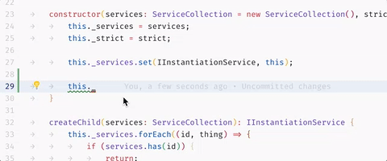
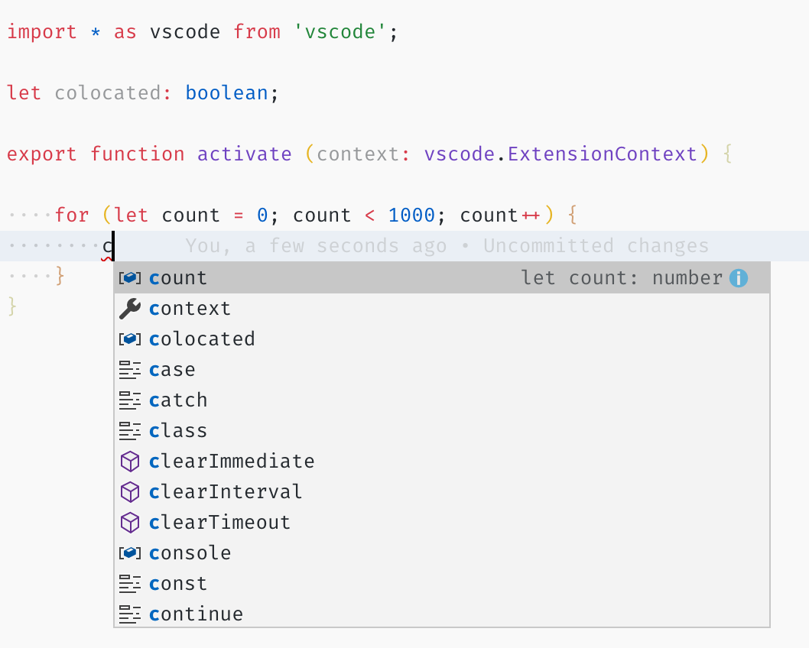

# IntelliSense

IntelliSense is a general term for a variety of code editing features including: code completion, parameter info, quick info, and member lists. IntelliSense features are sometimes called by other names such as "code completion", "content assist", and "code hinting."


## IntelliSense for your programming language

Visual Studio Code IntelliSense is provided for JavaScript, TypeScript, JSON, HTML, CSS, SCSS, and Less out of the box. VS Code supports word based completions for any programming language but can also be configured to have richer IntelliSense by installing a language extension.

Below are the most popular language extensions in the [Marketplace](https://marketplace.visualstudio.com/vscode). Click on an extension tile below to read the description and reviews to decide which extension is best for you.

<div class="marketplace-extensions-languages-curated"></div>

## IntelliSense features

VS Code IntelliSense features are powered by a language service. A language service provides intelligent code completions based on language semantics and an analysis of your source code. If a language service knows possible completions, the IntelliSense suggestions will pop up as you type. If you continue typing characters, the list of members (variables, methods, etc.) is filtered to include only members containing your typed characters. Pressing `kbstyle(Tab)` or `kbstyle(Enter)` will insert the selected member.

You can trigger IntelliSense in any editor window by typing `kb(editor.action.triggerSuggest)` or by typing a trigger character (such as the dot character (`kbstyle(.)`) in JavaScript).


> **Tip:** The suggestions widget supports CamelCase filtering meaning you can type the letters which are upper cased in a method name to limit the suggestions. For example, "cra" will quickly bring up "createApplication".

If you prefer, you can turn off IntelliSense while you type. See [Customizing IntelliSense](/docs/editor/intellisense.md#customizing-intellisense) below to learn how to disable or customize VS Code's IntelliSense features.

As provided by the language service, you can see **quick info** for each method by either pressing `kb(toggleSuggestionDetails)` or clicking the info icon. The accompanying documentation for the method will now expand to the side. The expanded documentation will stay so and will update as you navigate the list. You can close this by pressing `kb(toggleSuggestionDetails)` again or by clicking on the close icon.


After choosing a method you are provided with **parameter info**.


When applicable, a language service will surface the underlying types in the quick info and method signatures. In the image above, you can see several `any` types. Because JavaScript is dynamic and doesn't need or enforce types, `any` suggests that the variable can be of any type.

## Types of completions

The JavaScript code below illustrates IntelliSense completions. IntelliSense gives both inferred proposals and the global identifiers of the project. The inferred symbols are presented first, followed by the global identifiers (shown by the document icon).


VS Code IntelliSense offers different types of completions, including language server suggestions, snippets, and simple word based textual completions.

|       |         |       |
| ----- | ------- | ----- |
|  | Methods and Functions | `method`, `function`  |
|  | Variables and Fields | `variable`, `field` |
|  | Classes | `class` |
|  | Interfaces | `interface` |
|  | Modules | `module` |
|  | Properties and Attributes | `property` |
|  | Values and Enumerations | `value`, `enum` |
|  | References | `reference` |
|  | Keywords | `keyword` |
|  | Colors | `color` |
|  | Unit | `unit` |
|  | Snippet Prefixes | `snippet` |
|  | Words | `text` |

## Customizing IntelliSense

You can customize your IntelliSense experience in settings and key bindings.

### Settings

The settings shown below are the default settings. You can change these settings in your `settings.json` file as described in [User and Workspace Settings](/docs/getstarted/settings.md).

```javascript
{
    // Controls if quick suggestions should show up while typing
    "editor.quickSuggestions": {
        "other": true,
        "comments": false,
        "strings": false
    },

    // Controls if suggestions should be accepted on 'Enter' - in addition to 'Tab'. Helps to avoid ambiguity between inserting new lines or accepting suggestions. The value 'smart' means only accept a suggestion with Enter when it makes a textual change
    "editor.acceptSuggestionOnEnter": "on",

    // Controls the delay in ms after which quick suggestions will show up.
    "editor.quickSuggestionsDelay": 10,

    // Controls if suggestions should automatically show up when typing trigger characters
    "editor.suggestOnTriggerCharacters": true,

    // Controls if pressing tab inserts the best suggestion and if tab cycles through other suggestions
    "editor.tabCompletion": "on",

    // Controls whether sorting favours words that appear close to the cursor
    "editor.suggest.localityBonus": true,

    // Controls how suggestions are pre-selected when showing the suggest list
    "editor.suggestSelection": "recentlyUsed",

    // Enable word based suggestions
    "editor.wordBasedSuggestions": true,

    // Enable parameter hints
    "editor.parameterHints.enabled": true,
}
```

### Tab Completion

The editor supports "tab completion" which inserts the best matching completion when pressing `kb(insertBestCompletion)`. This works regardless of the suggest widget showing or not. Also, pressing `kb(insertNextSuggestion)` after inserting a suggestions will insert the next best suggestion.



By default, tab completion is disabled. Use the `editor.tabCompletion` setting to enable it. These values exist:

* `off` - (default) Tab completion is disabled.
* `on` - Tab completion is enabled for all suggestions and repeated invocations insert the next best suggestion.
* `onlySnippets` - Tab completion only inserts static snippets which prefix match the current line prefix.

### Locality Bonus

Sorting of suggestions depends on extension information and on how well they match the current word you are typing. In addition, you can ask the editor to boost suggestions that appear closer to the cursor position, using the `editor.suggest.localityBonus` setting.



In above images you can see that `count`, `context`, and `colocated` are sorted based on the scopes in which they appear (loop, function, file).

### Suggestion selection

By default, VS Code pre-selects the previously used suggestion in the suggestion list. This is very useful as you can quickly insert the same completion multiple times. If you'd like different behavior, for example, always select the top item in the suggestion list, you can use the `editor.suggestSelection` setting.

The available `editor.suggestSelection` values are:

* `first` - Always select the top list item.
* `recentlyUsed` - (default) The previously used item is selected unless a prefix (type to select) selects a different item.
* `recentlyUsedByPrefix` - Select items based on previous prefixes that have completed those suggestions.

"Type to select" means that the current prefix (roughly the text left of the cursor) is used to filter and sort suggestions. When this happens and when its result differs from the result of `recentlyUsed` it will be given precedence.

When using the last option, `recentlyUsedByPrefix`, VS Code remembers which item was selected for a specific prefix (partial text). For example, if you typed `co` and then selected `console`, the next time you typed `co`, the suggestion `console` would be pre-selected. This lets you quickly map various prefixes to different suggestions, for example `co` -> `console` and `con` -> `const`.

### Snippets in suggestions

By default, VS Code shows snippets and completion proposals in one widget. You can control the behavior with the `editor.snippetSuggestions` setting. To remove snippets from the suggestions widget, set the value to `"none"`. If you'd like to see snippets, you can specify the order relative to suggestions; at the top (`"top"`), at the bottom (`"bottom"`), or inline ordered alphabetically (`"inline"`). The default is `"inline"`.


### Key bindings

The key bindings shown below are the default key bindings. You can change these in your `keybindings.json` file as described in [Key Bindings](/docs/getstarted/keybindings.md).

> **Note:** There are many more key bindings relating to IntelliSense. Open the **Default Keyboard Shortcuts** (**File** > **Preferences** > **Keyboard Shortcuts**) and search for "suggest".

```json
[
    {
        "key": "ctrl+space",
        "command": "editor.action.triggerSuggest",
        "when": "editorHasCompletionItemProvider && editorTextFocus && !editorReadonly"
    },
    {
        "key": "ctrl+space",
        "command": "toggleSuggestionDetails",
        "when": "editorTextFocus && suggestWidgetVisible"
    },
    {
        "key": "ctrl+alt+space",
        "command": "toggleSuggestionFocus",
        "when": "editorTextFocus && suggestWidgetVisible"
    }
]
```

## Troubleshooting

If you find IntelliSense has stopped working, the language service may not be running. Try restarting VS Code and this should solve the issue. If you are still missing IntelliSense features after installing a language extension, open an issue in the repository of the language extension.

> **Tip:** For configuring and troubleshooting JavaScript IntelliSense, see the [JavaScript documentation](/docs/languages/javascript.md#intellisense).

A particular language extension may not support all the VS Code IntelliSense features. Review the extension's README to find out what is supported. If you think there are issues with a language extension, you can usually find the issue repository for an extension through the [VS Code Marketplace](https://marketplace.visualstudio.com/vscode). Navigate to the extension's detail page and click the `Support` link.

## Next steps

IntelliSense is just one of VS Code's powerful features. Read on to learn more:

* [JavaScript](/docs/languages/javascript.md) - Get the most out of your JavaScript development, including configuring IntelliSense.
* [Node.js](/docs/nodejs/nodejs-tutorial.md) - See an example of IntelliSense in action in the Node.js walkthrough.
* [Debugging](/docs/editor/debugging.md) - Learn how to set up debugging for your application.

## Common questions

### Why am I not getting any suggestions?


This can be caused by a variety of reasons. First, try restarting VS Code. If the problem persists, consult the language extension's documentation. For JavaScript specific troubleshooting, please see the [JavaScript language topic](/docs/languages/javascript.md#intellisense).

### Why am I not seeing method and variable suggestions?


This issue is caused by missing type declaration (typings) files in JavaScript. You can check if a type declaration file package is available for a specific library by using the [TypeSearch](https://microsoft.github.io/TypeSearch) site. There is more information about this issue in the [JavaScript language topic](/docs/languages/javascript.md#intellisense). For other languages, please consult the extension's documentation.

