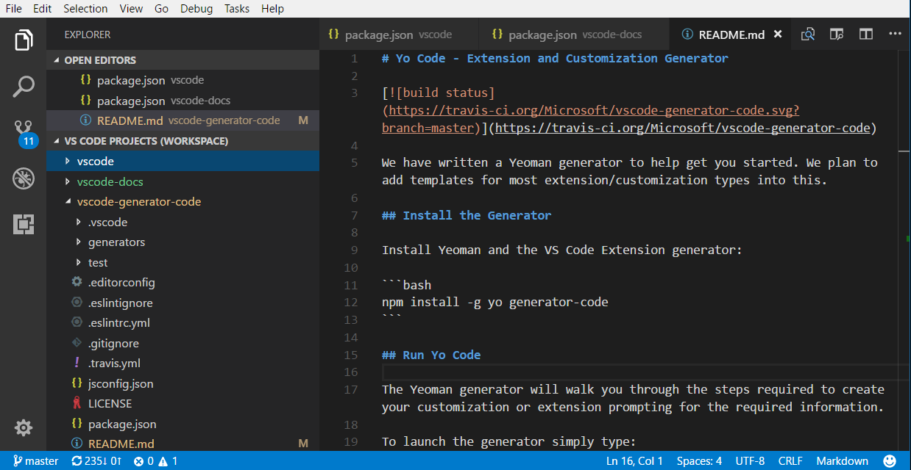
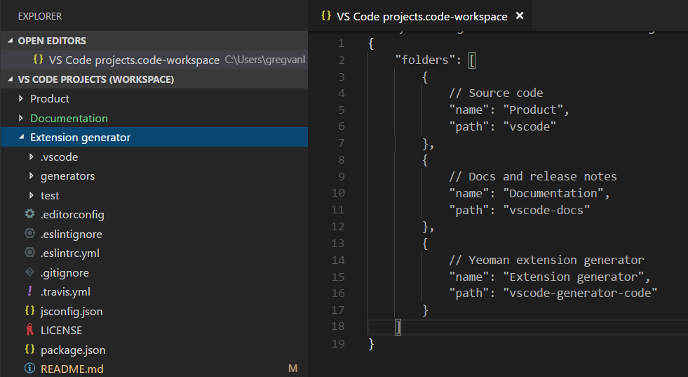
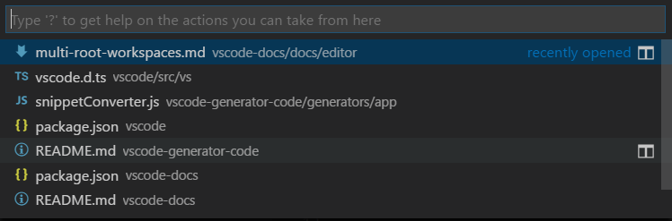
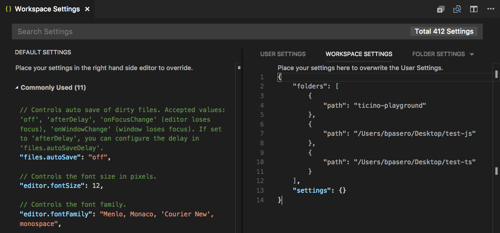
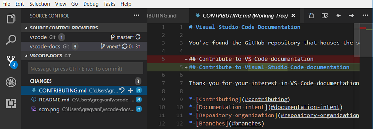

# Multi-root Workspaces

You can work with multiple project folders in Visual Studio Code with multi-root workspaces. This can be helpful when you are working on several related projects at one time. For example, you might have a repository with a product's documentation that you like to keep current when you update the product source code.



>**Note**: If you'd like to learn more about the VS Code "workspace" concept, you can review [What is a VS Code "workspace"?](/docs/editor/workspaces.md) Unless you are explicitly creating a multi-root workspace, a "workspace" is just your project's single root folder.

## Adding folders

It is easy to add another folder to your existing workspace. There are several gestures for adding folders:

### Add Folder to Workspace

The **File** > **Add Folder to Workspace** command brings up an Open Folder dialog to select the new folder.


Once a root folder is added, the Explorer will show the new folder as a root in the File Explorer. You can right-click on any of the root folders and use the context menu to add or remove folders.


The File Explorer should work and behave as before. You can move files between root folders and use any of the typical file operation actions provided in the context menu and the Explorer view.

Settings like `files.exclude` are supported for each root folder if configured, and across all folders if configured as global user setting.

### Drag and drop

You can use drag and drop to add folders to a workspace. Drag a folder to the File Explorer to add it to the current workspace. You can even select and drag multiple folders.

>**Note**: Dropping a single folder into the editor region of VS Code will still open the folder in single folder mode. If you drag and drop multiple folders into the editor region, a new multi-root workspace will be created.

You can also use drag and drop to reorder folders in the workspace.

### Multiple selection native file open dialogs

Opening multiple folders with your platform's native file open dialog will create a multi-root workspace.

### command line --add

Add a folder or multiple folders to the last active VS Code instance for a multi-root workspace.

```bash
  code --add vscode vscode-docs
```

### Removing folders

You can remove a folder from a Workspace with the **Remove Folder from Workspace** context menu command.

## Workspace file

When you add multiple folders, they are initially placed in a Workspace titled **UNTITLED WORKSPACE** and that name will remain until you save the workspace. You do not need to save a Workspace until you want to have it in a permanent location, for example, on your Desktop. Untitled Workspaces are present as long as the VS Code instance they are using is open. Once you completely close an instance with an untitled workspace, you will be asked to save it if you plan to open it again in the future:


When you save your workspace, it will create a `.code-workspace` file and the file name will be displayed in the File Explorer.

### Save Workspace As...

If you want to move your Workspace file to a new location, you can use the **File** > **Save Workspace As** command, which will automatically set the correct folder paths relative to the new Workspace file location.

### Opening workspace files

To reopen a Workspace, you can:

* Double-click the `.code-workspace` file in your platform's Explorer.
* Use the **File** > **Open Workspace** command and select the Workspace file.
* Select the Workspace from the **File** > **Open Recent** (`kb(workbench.action.openRecent)`) list.
  * Workspaces have a **(Workspace)** suffix to differentiate them from folders.


Just like **Close Folder** when a single folder is open in VS Code, there is a **Close Workspace** (`kb(workbench.action.closeFolder)`) command to close the active Workspace.

### Workspace file schema

The schema of `.code-workspace` is fairly straightforward. You have an array of folders with either absolute or relative paths. Relative paths are better when you want to share Workspace files.

You can override the display name of your folders with the `name` attribute, to give more meaningful names to folders in the Explorer. For example, you could name your project folders such as 'Product' and 'Documentation' to easily identify the content by folder name:

```json
{
    "folders": [
        {
            // Source code
            "name": "Product",
            "path": "vscode"
        },
        {
            // Docs and release notes
            "name": "Documentation",
            "path": "vscode-docs"
        },
        {
            // Yeoman extension generator
            "name": "Extension generator",
            "path": "vscode-generator-code"
        }
    ]
}
```

which will result in the following Explorer display:



As you can see from the example above, you can add comments to your Workspace files.

The Workspace file can also contain Workspace [global settings](#settings) under `settings` and [extension recommendations](#extensions) under `extensions`, which we will discuss below.


## General UI

### Editor

There are only a few changes to the VS Code UI when you are using multi-root workspaces, primarily to disambiguate files between folders. For example, if there is a name collision between files in multiple folders, VS Code will include the folder name in tabbed headers.


If you'd always like to see the folder displayed in the tabbed header, you can use the `workbench.editor.labelFormat` [setting](/docs/getstarted/settings.md) "medium" or "long" values to show the folder or full paths.

```json
"workbench.editor.labelFormat": "medium"
```

VS Code UI such as the **OPEN EDITORS** and **Quick Open** (`kb(workbench.action.quickOpen)`) lists include the folder name.



If you are using an [File Icon Theme](/docs/getstarted/themes.md#file-icon-themes) and the active theme supports it, you will see a special Workspace icon.

Below you can see the Workspace icons from the built-in **Minimal (Visual Studio Code)** file icon theme:


### Search

VS Code features like global search work across all folders and group the search results by folder.


When you have a multi-root workspace open, you can choose to search in a single root folder by using the `./` syntax in the **files to include** box. For example, if you enter `./project1/**/*.txt`, that will search for all `.txt` files under the `project1/` root folder.

## Settings

With multiple root folders in one workspace, it is possible to have a `.vscode` folder in each root folder defining the settings that should apply for that folder. To avoid setting collisions, only resource (file, folder) settings are applied when using a multi-root workspace. Settings that affect the entire editor (for example, UI layout) are ignored. For example, two projects cannot both set the zoom level.

User settings are supported as with single folder projects and you can also set global Workspace settings that will apply to all folders in your multi-root Workspace. Global Workspace settings will be stored in your `.code-workspace` file.

```json
{
    "folders": [
        {
            "path": "vscode"
        },
        {
            "path": "vscode-docs"
        },
        {
            "path": "vscode-generator-code"
        }
    ],
    "settings": {
        "window.zoomLevel": 1,
        "files.autoSave": "afterDelay"
    }
}
```

When you go from a single folder instance to multiple folders, VS Code will add the appropriate editor-wide settings from the first folder to the new global Workspace settings.

You can easily review and modify the different settings files through the Settings editor. The Settings editor tabs let you select your User settings, global Workspace settings, and individual folder settings.



You can also open specific settings files with the commands:

* **Preferences: Open User Settings** - Open your global User settings
* **Preferences: Open Workspace Settings** - Open the settings section of your Workspace file.
* **Preferences: Open Folder Settings** - Open the settings for the active folder.

Global Workspace settings override User settings and folder settings can override Workspace or User settings.

### Unsupported folder settings

Unsupported editor-wide folder settings will be shown as grayed out in your folder settings and are filtered out of the **DEFAULT FOLDER SETTINGS** list. You will also see an information icon in front of the setting.


## Debugging

With multi-root workspaces, VS Code searches across all folders for `launch.json` debug configuration files and displays them with the folder name as a suffix. Additionally VS Code will also display launch configurations defined in the workspace configuration file.


The example above shows the debugging configurations for the [TSLint extension](https://marketplace.visualstudio.com/items?itemName=eg2.tslint). There is a `launch` configuration from the `tslint` extension folder to start the extension running in the VS Code Extension Host and also an `attach` configuration from the `tslint-server` folder to attach the debugger to a running TSLint server.

You can also see the three **Add Config** commands for the folders, `tslint`, `tslint-server`, and `tslint-tests`, in the vscode-tslint [Workspace](https://github.com/microsoft/vscode-tslint/blob/main/vscode-tslint.code-workspace). The **Add Config** command will either open an existing `launch.json` file in the folder's `.vscode` subfolder or create a new one and display the debugging configuration template dropdown.


[Variables](/docs/editor/variables-reference.md) used in a configuration (for example `${workspaceFolder}` or the now deprecated `${workspaceRoot}`) are resolved relative to the folder they belong to. It is possible to scope a variable per workspace folder by appending the root folder's name to a variable (separated by a colon).

### Workspace launch configurations

Workspace scoped launch configurations live in the `"launch"` section of the workspace configuration file (**Workspaces: Open Workspace Configuration File** in the Command Palette):


Alternatively, new launch configurations can be added via the "Add Config (workspace)" entry of the Launch Configuration dropdown menu:


A compound launch configuration can reference the individual launch configurations by name as long as the names are unique within the workspace, for example:

```json
  "compounds": [{
      "name": "Launch Server & Client",
      "configurations": [
        "Launch Server",
        "Launch Client"
      ]
  }]
```

If the individual launch configuration names are not unique, the qualifying folder can be specified with a more verbose "folder" syntax:

```json
  "compounds": [{
      "name": "Launch Server & Client",
      "configurations": [
        "Launch Server",
        {
          "folder": "Web Client",
          "name": "Launch Client"
        },
        {
          "folder": "Desktop Client",
          "name": "Launch Client"
        }
      ]
  }]
```

In addition to `compounds`, the `launch` section of the workspace configuration file can contain regular launch configurations too. Make sure that all used variables are explicitly scoped to a specific folder because otherwise they are not valid for the workspace. You can find more details about explicitly scoped variables in the [Variables Reference](/docs/editor/variables-reference.md#variables-scoped-per-workspace-folder).

Here is an example for a launch configuration where the program lives in a folder "Program" and where all files from a folder "Library" should be skipped when stepping:

```json
"launch": {
  "configurations": [{
      "type": "node",
      "request": "launch",
      "name": "Launch test",
      "program": "${workspaceFolder:Program}/test.js",
      "skipFiles": [
        "${workspaceFolder:Library}/out/**/*.js"
      ]
  }]
}
```

## Tasks

Similar to how VS Code searches for debugging configurations, VS Code will also try to autodetect tasks from gulp, grunt, npm, and TypeScript project files across all folders in a workspace as well as search for tasks defined in `tasks.json` files. The location of tasks is indicated by a folder name suffix. Note that tasks defined in `tasks.json` must be version 2.0.0.


From the TSLint extension [Workspace](https://github.com/microsoft/vscode-tslint/blob/main/vscode-tslint.code-workspace) example above, you can see that there are two **configured tasks** from `tasks.json` files in the `tslint` and `tslint-tests` folders and numerous autodetected npm and TypeScript compiler **detected tasks**.

### Workspace task configuration

Workspace scoped tasks live in the `"tasks"` section of the workspace configuration file (**Workspaces: Open Workspace Configuration File** in the Command Palette). Only `"shell"` and `"process"` type tasks can be defined in the workspace configuration file.

## Source Control

With multi-root workspaces, there is a **SOURCE CONTROL PROVIDERS** section that gives you an overview when you have multiple active repositories. These can be contributed by several SCM providers; for example, you can have Git repositories side-by-side with Azure DevOps Server workspaces. As you select repositories in this view, you can see the source control details below.



You can use `kbstyle(Ctrl+Click)` or `kbstyle(Shift+Click)` to select multiple repositories. Their details will appear as separate regions underneath.

## Extensions

Multi-root workspaces have been available as a preview on Insiders build since the June 2017 [1.14 release](/updates/v1_14.md#preview-multi-root-workspaces) and we've been working with extension authors to help them get ready for the release to Stable. If you are an extension author, you can review our [Adopting Multi Root Workspace APIs](https://github.com/microsoft/vscode/wiki/Adopting-Multi-Root-Workspace-APIs) guide to learn about VS Code API changes and how to make your extension work well across multiple folders.

Below are some of the popular extensions that have already adopted the multi-root workspace APIs.

<div class="marketplace-extensions-multi-root-ready"></div>

**Note**: If an extension doesn't yet support multiple folders, it will still work in the first folder of your multi-root workspace.

### Extension recommendations

VS Code supports folder level extension recommendations through the `extensions.json` files under the folder's `.vscode` subfolder. You can also provide global Workspace extension recommendations by adding them to your `.code-workspace` file. You can use the **Extensions: Configure Recommended Extensions (Workspace Folder)** command to open your Workspace file and add extension identifiers ({publisherName}.{extensionName}) to the `extensions.recommendations` array.

```json
{
    "folders": [
        {
            "path": "vscode"
        },
        {
            "path": "vscode-docs"
        }
    ],
    "extensions": {
        "recommendations": [
            "eg2.tslint",
            "dbaeumer.vscode-eslint",
            "msjsdiag.debugger-for-chrome"
        ]
    }
}
```

## Next steps

* [What is a VS Code "workspace"?](/docs/editor/workspaces.md) - More about single-folder and multi-root workspaces.
* [Debugging](/docs/editor/debugging.md) - Learn how to set up debugging for your application.
* [Tasks](/docs/editor/tasks.md) - Tasks let you run external tools like compilers within VS Code.

## Common questions

### How can I go back to working with a single project folder?

You can either close the Workspace and open the folder directly or remove the folder from Workspace.

### As an extension author what do I need to do?

See our [Adopting Multi Root Workspace APIs](https://github.com/microsoft/vscode/wiki/Adopting-Multi-Root-Workspace-APIs) guide. Most extensions can easily support multi-root workspaces.
