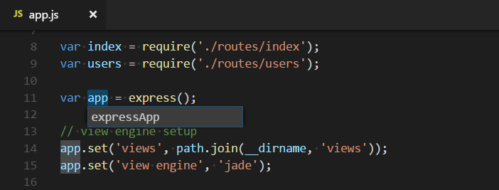

# Refactoring

[Source code refactoring](https://en.wikipedia.org/wiki/Code_refactoring) can improve the quality and maintainability of your project by restructuring your code, while not modifying the runtime behavior. Visual Studio Code supports refactoring operations (*refactorings*) such as [Extract Method](https://refactoring.com/catalog/extractMethod.html) and [Extract Variable](https://refactoring.com/catalog/extractVariable.html) to improve your codebase from within the editor.


For example, a common refactoring used to avoid duplicating code (a maintenance headache) is the [Extract Method](https://refactoring.com/catalog/extractMethod.html) refactoring, where you select source code and pull it out into its own shared method, so that can reuse the code elsewhere.

Refactorings are provided by a language service. VS Code has built-in support for TypeScript and JavaScript refactoring through the [TypeScript](https://www.typescriptlang.org/) language service. Refactoring support for other programming languages is enabled through VS Code [extensions](/docs/editor/extension-marketplace.md) that contribute language services.

The UI elements and VS Code commands for refactoring are the same across the different languages. This article demonstrates refactoring support in VS Code with the TypeScript language service.

## Code Actions = Quick Fixes and refactorings

In VS Code, Code Actions can provide both refactorings and Quick Fixes for detected issues (highlighted with red squiggles). When the cursor is on a squiggle or on a selected text region, VS Code shows a light bulb icon in the editor to indicate that a Code Action is available. If you select the Code Action light bulb or use the **Quick Fix** command `kb(editor.action.quickFix)`, the Quick Fixes and refactorings control is presented.

If you prefer to only see refactorings without Quick Fixes, then you can use the **Refactor** command (`kb(editor.action.refactor)`).

>**Note:** You can completely disable Code Action lightbulbs in the editor with the `editor.lightbulb.enable` [setting](/docs/getstarted/settings.md). You can still open Quick Fixes through **Quick Fix** command and `kb(editor.action.quickFix)` keyboard shortcut.

## Refactoring actions

### Extract Method

Select the source code you'd like to extract and then select the light bulb in the gutter or press (`kb(editor.action.quickFix)`) to see available refactorings. Source code fragments can be extracted into a new method, or into a new function at various different scopes. During the extract refactoring, you are prompted to provide a meaningful name.

### Extract Variable

The TypeScript language service provides **Extract to const** refactoring to create a new local variable for the currently selected expression:


When working with classes, you can also extract a value to a new property.

### Rename symbol

Renaming is a common operation related to refactoring source code, and VS Code has a separate **Rename Symbol** command (`kb(editor.action.rename)`). Some languages support renaming a symbol across files. Press `kb(editor.action.rename)`, type the new desired name, and press `kbstyle(Enter)`. All instances of the symbol across all files will be renamed.



## Refactor Preview

When you apply a refactoring, the changes are directly implemented to your code. In the **Refactor Preview** panel, you can preview the changes that will be applied by a refactoring operation.

To open the **Refactor Preview** panel, open the Code Actions control, hover over a refactoring, and then press `kb(previewSelectedCodeAction)`.


You can select any of the changes in the **Refactor Preview** panel to get a diff view of the changes that are a result of the refactoring operation.


Use the **Accept** or **Discard** controls to apply or cancel the proposed refactoring changes.

Optionally, you can partially apply the refactoring changes by deselecting some of the proposed changes in the Refactor Preview panel.


## Keybindings for Code Actions

The `editor.action.codeAction` command lets you configure keybindings for specific Code Actions. This keybinding, for example, triggers the **Extract function** refactoring Code Actions:

```json
{
  "key": "ctrl+shift+r ctrl+e",
  "command": "editor.action.codeAction",
  "args": {
    "kind": "refactor.extract.function"
  }
}
```

Code Action kinds are specified by extensions using the enhanced `CodeActionProvider` API. Kinds are hierarchical, so `"kind": "refactor"` shows all refactoring Code Actions, whereas `"kind": "refactor.extract.function"` only shows **Extract function** refactorings.

Using the above keybinding, if only a single `"refactor.extract.function"` Code Action is available, it is automatically applied. If multiple **Extract function** Code Actions are available, VS Code brings up a context menu to select them:


You can also control how and when Code Actions are automatically applied by using the `apply` argument:

```json
{
  "key": "ctrl+shift+r ctrl+e",
  "command": "editor.action.codeAction",
  "args": {
    "kind": "refactor.extract.function",
    "apply": "first"
  }
}
```

Valid values for `apply`:

* `first` - Always automatically apply the first available Code Action.
* `ifSingle` - (Default) Automatically apply the Code Action if only one is available. Otherwise, show the context menu.
* `never` - Always show the Code Action context menu, even if only a single Code Action is available.

When a Code Action keybinding is configured with `"preferred": true`, only preferred Quick Fixes and refactorings are shown. A preferred Quick Fix addresses the underlying error, while a preferred refactoring is the most common refactoring choice. For example, while multiple `refactor.extract.constant` refactorings might exist, each extracting to a different scope in the file, the preferred `refactor.extract.constant` refactoring is the one that extracts to a local variable.

This keybinding uses `"preferred": true` to create a refactoring that always tries to extract the selected source code to a constant in the local scope:

```json
{
  "key": "shift+ctrl+e",
  "command": "editor.action.codeAction",
  "args": {
    "kind": "refactor.extract.constant",
    "preferred": true,
    "apply": "ifSingle"
  }
}
```

## Extensions with refactorings

You can find extensions that support refactoring by looking in the VS Code [Marketplace](https://marketplace.visualstudio.com/vscode). You can go to the Extensions view (`kb(workbench.view.extensions)`) and type 'refactor' in the search box. You can then sort by install count or ratings to see which extensions are popular.

<div class="marketplace-extensions-refactor"></div>

> **Tip**: The extensions shown above are dynamically queried. Select an extension tile above to read the description and reviews to decide which extension is best for you.

## Next steps

* [Intro Video - Code Editing](/docs/introvideos/codeediting.md) - Watch an introductory video on code editing features.
* [Code Navigation](/docs/editor/editingevolved) - VS Code lets you move quickly through your source code.
* [Debugging](/docs/editor/debugging.md) - Learn about debugging with VS Code.

## Common questions

### Why don't I see any light bulbs when there are errors in my code?

Light bulbs (Code Actions) are only shown when the cursor is over the text showing the error. Hovering over the text shows the error description, but you need to move the cursor or select text to see light bulbs for Quick Fixes and refactorings.
