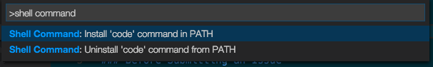

# Setting up Visual Studio Code

Getting up and running with VS Code is quick and easy.  Follow the platform specific guides below.

VS Code is lightweight and should run on most available hardware and platform versions. You can review the [System Requirements](/docs/supporting/requirements.md) to check if your computer configuration is supported.

>**Note:** VS Code is an editor first and foremost and prides itself on a small footprint. Unlike traditional IDEs with everything but the kitchen sink, you can tune your installation to the development technologies you care about. Be sure to read the [Additional Components](/docs/editor/setup.md#additional-components) section after the platform guides to learn about customizing your VS Code installation.

## Mac OS X

1. [Download Visual Studio Code](https://go.microsoft.com/fwlink/?LinkID=534106) for Mac OS X.
2. Double-click on the downloaded archive to expand the contents.
3. Drag `Visual Studio Code.app` to the `Applications` folder, making it available in the `Launchpad`.
4. Add VS Code to your Dock by right-clicking on the icon and choosing `Options`, `Keep in Dock`.

>**Tip:** If you want to run VS Code from the terminal by simply typing 'code', VS Code has a command, **Shell Command: Install 'code' command in PATH**, to add 'code' to your `$PATH` variable list.
>
>After installation, launch VS Code. Now open the **Command Palette** (`kb(workbench.action.showCommands)`) and type `shell command` to find the **Shell Command: Install 'code' command in PATH** command.
>
>
>
>After executing the command, restart the terminal for the new `$PATH` value to take effect. You'll be able to simply type 'code .' in any folder to start editing files in that folder.

## Linux

1. Download Visual Studio Code for your distribution, [.deb](http://go.microsoft.com/fwlink/?LinkID=760868) for Debian-based distributions such as Ubuntu or [.rpm](http://go.microsoft.com/fwlink/?LinkID=760867) for Red Hat-based distributions such as Fedora or CentOS. Note that 32-bit binaries are also available on the [download page](/Download).
2. Install the package through a GUI package manager by double clicking on the package file, or through the command line:

 ```bash
 # For .deb
 sudo dpkg -i <file>.deb

 # For .rpm (Fedora 21 and below)
 sudo yum install <file>.rpm
 
 # For .rpm (Fedora 22 and above)
 sudo dnf install <file>.rpm
 ```

3. VS Code should now be available to run through the launcher or the command line by running `code`.

>**Tip:** Run `code .` in any folder to start editing files in that folder.

## Windows

1. [Download Visual Studio Code](https://go.microsoft.com/fwlink/?LinkID=534107) for Windows.
2. Double-click on `VSCodeSetup.exe` to launch the setup process. This will only take a minute.
3. By default, VS Code is installed under `C:\Program Files (x86)\Microsoft VS Code` for a 64-bit machine.

>**Note:** .NET Framework 4.5 is required for VS Code.  If you are using Windows 7, please make sure [.NET Framework 4.5](https://www.microsoft.com/en-us/download/details.aspx?id=30653) is installed.

>**Note:** You can download the zip archive [here](/Docs/?dv=winzip).

>**Tip:** The Setup will optionally add Visual Studio Code to your `%PATH%`, so from the console you can simply type `code .` to open VS Code on that folder.

>**Tip:** You might need to log off after the installation for the change to the `%PATH%` environmental variable to take effect.

## Additional Components

VS Code is a small download by design and only includes the minimum number of components shared across most development workflows. Basic functionality like the editor, file management, window management, and preference settings are included. A JavaScript/TypeScript language service and Node.js debugger are also part of the base install.

If you are used to working with larger, monolithic development tools (IDEs), you may be surprised that your scenarios aren't completely supported out of the box.  For example, there isn't a **File** > **New Project** dialog with pre-installed project templates.  Most VS Code users will need to install additional components depending on their specific needs.

Here are a few commonly installed components:

- [Git](http://git-scm.com/download) - VS Code has built-in support for source code control using Git but requires Git to be installed separately.
- [Node.js (includes NPM)](https://nodejs.org/) - A platform and runtime for easily building and running JavaScript applications
- [TypeScript](http://typescriptlang.org) - The TypeScript compiler, `tsc`, for transpiling structured and strongly typed TypeScript to JavaScript.
- [Typings](https://github.com/typings/typings) - A TypeScript type definition manager so that VS Code can provide IntelliSense for popular JavaScript frameworks.

You'll find the components above mentioned often in our documentation and walk-throughs.

## VS Code Extensions

VS Code [extensions](/docs/editor/extension-gallery.md) let third parties add support for additional:

* Languages - [C++](/docs/languages/cpp.md), [C#](/docs/languages/csharp.md), [Go](https://marketplace.visualstudio.com/items/lukehoban.Go), [Python](https://marketplace.visualstudio.com/items?itemName=donjayamanne.python)
* Tools - [ESLint](https://marketplace.visualstudio.com/items/dbaeumer.vscode-eslint), [JSHint](https://marketplace.visualstudio.com/items/dbaeumer.jshint) , [PowerShell](https://marketplace.visualstudio.com/items?itemName=ms-vscode.PowerShell), [Visual Studio Team Services](https://marketplace.visualstudio.com/items?itemName=ms-vsts.team)
* Debuggers - [Chrome](https://marketplace.visualstudio.com/items?itemName=msjsdiag.debugger-for-chrome), [PHP XDebug](https://marketplace.visualstudio.com/items?itemName=felixfbecker.php-debug).

Extensions integrate into VS Code's UI, commands, and task running systems so you'll find it easy to work with different technologies through VS Code's shared interface. Check out the VS Code extension [Marketplace](https://marketplace.visualstudio.com/vscode) to see what's available.

## Additional Tools

Visual Studio Code integrates with existing tool chains.  We think the following tools will enhance your development experiences.

- [Yeoman](http://yeoman.io/) - An application scaffolding tool, think of it as a command line version of **File** > **New Project**.
- [generator-aspnet](https://www.npmjs.com/package/generator-aspnet) - A Yeoman generator for scaffolding **ASP.NET Core** applications.
- [hottowel](https://github.com/johnpapa/generator-hottowel) - A Yeoman generator for quickly creating **AngularJS** applications.
- [Express](http://expressjs.com/) - An application framework for Node.js applications using the **Jade** template engine.
- [gulp](http://gulpjs.com/) - A streaming task runner system which integrates easily with VS Code tasks.
- [mocha](http://mochajs.org/) - A JavaScript test framework that runs on Node.js.
- [bower](http://bower.io/) - A client side package manager.

## Next Steps

Now you have installed and set up VS Code.

For more documentation, try:

* [The Basics](/docs/editor/codebasics.md) - Basic orientation around VS Code
* [Editing Evolved](/docs/editor/editingevolved.md) - Lint, IntelliSense, Lightbulbs, Peek and Goto Definition and more
* [Debugging](/docs/editor/debugging.md) - This is where VS Code really shines

If you'd like to getting something running quickly, try the [Node.js runtime](/docs/runtimes/nodejs.md) walkthrough which will have you debugging a Node.js web application with VS Code in minutes.

## Common Questions

**Q: What are the system requirements for VS Code?**

**A:** We have a list of [System Requirements](/docs/supporting/requirements.md).

**Q: How do I create and run a new project?**

**A:** VS Code doesn't include a traditional **File** > **New Project** dialog or pre-installed project templates. You'll need to add [additional components](/docs/editor/setup.md#additional-components) and scaffolders depending on your development interests. With scaffolding tools like [Yeoman](http://yeoman.io/) and the multitude of modules available through the [NPM](https://www.npmjs.com/) package manager, you're sure to find appropriate templates and tools to create your projects.
