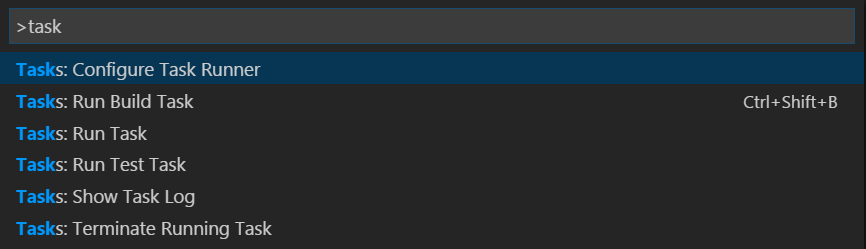
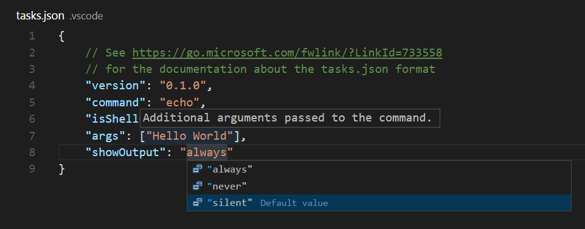
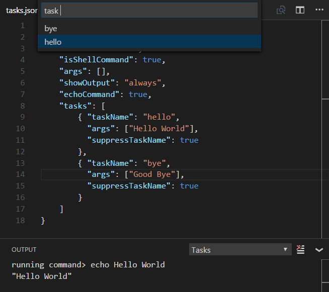
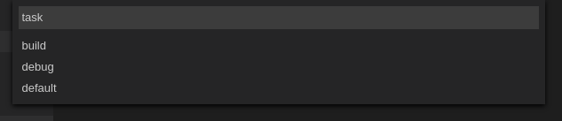

---
Order:
Area: editor
TOCTitle: Tasks
ContentId: 8cdc7d99-6339-49ac-9a31-55f6563fab5c
PageTitle: Visual Studio Code Tasks (legacy version)
DateApproved: 3/31/2021
MetaDescription: Expand your development workflow with task integration in Visual Studio Code (Gulp, Grunt, Jake and more).
---
# Tasks (legacy version)

---

This documentation describes the legacy Tasks system in Visual Studio Code version 1.13 and earlier. If you want to learn about the latest Tasks 2.0, please refer to the [Tasks](/docs/editor/tasks.md) topic.

---

Developers use lots of tools, mostly run from the command line, to automate jobs outside the inner software development loop (edit, compile, test and debug).  Given their importance in the development life-cycle, it is very helpful to be able to run them and analyze their results from within Visual Studio Code.

>**Note:** Task support is only available when working on a workspace folder. It is not available when editing single files.

## Hello World

Let's start with a simple "Hello World" task which will display text to the **OUTPUT** panel when run.

Create an empty folder "mytask" and start VS Code from that folder.

```bash
mkdir mytask
cd mytask
code .
```

Tasks are defined in a workspace `tasks.json` file and VS Code has templates for common task runners. In the **Command Palette** (`kb(workbench.action.showCommands)`), you can filter on 'task' and can see the various Task related commands.



Select the **Tasks: Configure Task Runner** command and you will see a list of task runner templates. Select **Others** to create a task which runs an external command.

>**Note:** If you don't see the list of task runner templates, you may already have a `tasks.json` file in your folder and its contents will be open in the editor. Close the file and either delete or rename it for this example.

You should now see a `tasks.json` file in your workspace `.vscode` folder with the following content:

```json
{
    "version": "0.1.0",
    "command": "echo",
    "isShellCommand": true,
    "args": ["Hello World"],
    "showOutput": "always"
}
```

In this example, we are just running the `echo` shell command with "Hello World" as an argument.

Test the `echo` task by running **Tasks: Run Task** and selecting `echo` from the dropdown list. The **OUTPUT** panel will open and you'll see the text "Hello World".

You can get IntelliSense on `tasks.json` variables and their values with hover and trigger smart completions with `kb(editor.action.triggerSuggest)`.



>**Tip:** You can run your task through **Quick Open** (`kb(workbench.action.quickOpen)`) by typing 'task', `kbstyle(Space)` and the command name. In this case, 'task echo'.

## Output Window Behavior

Sometimes you will want to control how the output window behaves when running tasks. For instance, you may want to maximize editor space and only look at task output if you think there is a problem. The property `showOutput` controls this and the valid values are:

- **always** - The output window is always brought to front. This is the default.
- **never** - The user must explicitly bring the output window to the front using the **View** > **Output** command (`kb(workbench.action.output.toggleOutput)`).
- **silent** - The output window is brought to front only if no [problem matchers](/docs/editor/tasks.md#processing-task-output-with-problem-matchers) are set for the task.

### echoCommand

To see the exact command VS Code is running, you can enable the `echoCommand` setting in `tasks.json`:


>**Note:** VS Code ships with predefined `tasks.json` templates to run npm, MSBuild, Maven and other command-line tools. A great way to learn about tasks is to review these templates and see which tools or task runners are similar to other tools you may be using.

## command and tasks[]

`tasks.json` takes a single `command` value which can be a task runner like gulp or grunt or any command-line tool like a compiler or linter. By default, the `command` will show up in the **Tasks: Run Task** dropdown list.

You can also define multiple tasks in a `tasks` array in order to pass different arguments or use different settings when the `command` is run.

Here's a simple example passing different arguments to the `echo` command:

```json
{
    "version": "0.1.0",
    "command": "echo",
    "isShellCommand": true,
    "args": [],
    "showOutput": "always",
    "echoCommand": true,
    "suppressTaskName": true,
    "tasks": [
        {
            "taskName": "hello",
            "args": ["Hello World"]
        },
        {
            "taskName": "bye",
            "args": ["Good Bye"]
        }
    ]
}
```

Now when you run **Tasks: Run Task**, you will now see two tasks in the dropdown list, `hello` and `bye`. We set `suppressTaskName` to true as by default the task name is also passed to the command which would result in "echo hello Hello World".



Some `tasks.json` properties such as `showOutput` and `suppressTaskName` can be set both globally and then overridden in specific tasks. The `tasks` `args` property values are appended to the global arguments. The final command line is constructed as follows:

* If `suppressTaskName` is `true`, the command line is `command 'global args' 'task args'`.
* If `suppressTaskName` is `false`, it is `command 'global args' taskName 'task args'`.

There are also `tasks` specific properties. One useful property is `isBuildCommand`, which if set to true, will run the task with the **Tasks: Run Build Task** (`kb(workbench.action.tasks.build)`) command.

## Running multiple commands

If you want to run multiple different commands you can specify different commands per task. A `tasks.json` file using commands per task looks like this:

```json
{
    "version": "0.1.0",
    "tasks": [
        {
            "taskName": "tsc",
            "command": "tsc",
            "args": ["-w"],
            "isShellCommand": true,
            "isBackground": true,
            "problemMatcher": "$tsc-watch"
        },
        {
            "taskName": "build",
            "command": "gulp",
            "args": ["build"],
            "isShellCommand": true
        }
    ]
}
```

The first task starts the TypeScript compiler in watch mode, the second one starts the gulp build. If a task specifies a local command to run, the task name is not included into the command line (`suppressTaskName` is `true` by default for these tasks). Since a local command can specify local arguments, there is no need for adding it by default. If a `tasks.json` file specifies both global and task local commands, the task local commands win over the global command. There is no merging between a global and a task local command.

## Binding keyboard shortcuts to tasks

If you need to run a task frequently, you can also define a keyboard shortcut for the task.

For example, to bind `kbstyle(Ctrl+H)` to the `build` task from above, add the following to your `keybindings.json` file:

```json
{
    "key": "ctrl+h",
    "command": "workbench.action.tasks.runTask",
    "args": "build"
}
```

## Variable substitution

When authoring tasks configurations, it is useful to have a set of predefined common variables such as the active file (`${file}`) or workspace root folder (`${workspaceFolder}`). VS Code supports variable substitution inside strings in the `tasks.json` file and you can see a full list of predefined variables in the [Variables Reference](/docs/editor/variables-reference.md).

Below is an example of a configuration that passes the current opened file to the TypeScript compiler.

```json
{
    "command": "tsc",
    "args": ["${file}"]
}
```

## Operating System Specific Properties

The task system supports defining values (for example, the command to be executed) specific to an operating system. To do so, put an operating system specific literal into the `tasks.json` file and specify the corresponding properties inside that literal.

Below is an example that uses the Node.js executable as a command and is treated differently on Windows and Linux:

```json
{
    "version": "0.1.0",
    "windows": {
        "command": "C:\\Program Files\\nodejs\\node.exe"
    },
    "linux": {
        "command": "/usr/bin/node"
    }
}
```

Valid operating properties are `windows` for Windows, `linux` for Linux and `osx` for macOS. Properties defined in an operating system specific scope override properties defined in the global scope.

In the example below:

```json
{
    "version": "0.1.0",
    "showOutput": "never",
    "windows": {
        "showOutput": "always"
    }
}
```

Output from the executed task is never brought to front except for Windows where it is always shown.

Tasks local commands can be made operating specific as well. The syntax is the same as for global commands. Here an example that adds an OS specific argument to a command:

```json
{
    "version": "0.1.0",
    "tasks": [
        {
            "taskName": "build",
            "command": "gulp",
            "isShellCommand": true,
            "windows": {
                "args": ["build", "win32"]
            },
            "linux": {
                "args": ["build", "linux"]
            },
            "osx": {
                "args": ["build", "osx"]
            }
        }
    ]
}
```

## Examples of Tasks in Action

To highlight the power of Tasks, here are a few examples of how VS Code can use Tasks to integrate external tools like linters and compilers.

### Transpiling TypeScript to JavaScript

The [TypeScript topic](/docs/languages/typescript.md#transpiling-typescript-into-javascript) includes an example that creates a task to transpile TypeScript to JavaScript and observe any related errors from within VS Code.

### Compiling Markdown to HTML

The Markdown topic provides two examples for compiling Markdown to HTML:

1. [Manually compiling with a Build task](/docs/languages/markdown.md#compiling-markdown-into-html)
2. [Automation of the compile step with a file watcher](/docs/languages/markdown.md#automating-markdown-compilation)

### Transpiling Less and SCSS into CSS

The CSS topic provides examples of how to use Tasks to generate CSS files.

1. [Manually transpiling with a Build task](/docs/languages/css.md#transpiling-sass-and-less-into-css)
2. [Automation of the compile step with a file watcher](/docs/languages/css.md#automating-sassless-compilation)

## Autodetecting Gulp, Grunt and Jake Tasks

VS Code can autodetect tasks from within Gulp, Grunt and Jake files.  This adds their tasks to the task list without requiring additional configuration (unless you need to use a problem matcher, more on that in a moment).

To help make this example more concrete, let's use this simple Gulp file.  This defines two tasks: build and debug. The first compiles C# code using [Mono](https://www.mono-project.com/)'s compiler. The second starts the MyApp under the Mono debugger.

```javascript
var gulp = require("gulp");

var program = "MyApp";
var port = 55555;

gulp.task('default', ['debug']);

gulp.task('build', function() {
    return gulp
        .src('./**/*.cs')
        .pipe(msc(['-fullpaths', '-debug', '-target:exe', '-out:' + program]));
});

gulp.task('debug', ['build'], function(done) {
    return mono.debug({ port: port, program: program}, done);
});
```

Pressing `kb(workbench.action.showCommands)` and then typing `Run Task` followed by `kbstyle(Enter)` will list all available tasks. Selecting one and pressing `kbstyle(Enter)` will execute the task.



>**Note:** Gulp, Grunt and Jake are autodetected only if the corresponding files (for example `gulpfile.js`) are present in the root of the opened folder.

## Processing Task Output with Problem Matchers

VS Code can process the output from a task with a problem matcher and we ship with a number of them 'in the box':

- **TypeScript**: `$tsc` assumes that file names in the output are relative to the opened folder.
- **TypeScript Watch**: `$tsc-watch` matches problems reported from the `tsc` compiler when executed in watch mode.
- **JSHint**: `$jshint` assumes that file names are reported as an absolute path.
- **JSHint Stylish**: `$jshint-stylish` assumes that file names are reported as an absolute path.
- **ESLint Compact**: `$eslint-compact` assumes that file names in the output are relative to the opened folder.
- **ESLint Stylish**: `$eslint-stylish` assumes that file names in the output are relative to the opened folder.
- **Go**: `$go` matches problems reported from the `go` compiler. Assumes that file names are relative to the opened folder.
- **CSharp and VB Compiler**: `$mscompile` assumes that file names are reported as an absolute path.
- **Less**: `$lessCompile` assumes that file names are reported as absolute path.

Problem matchers scan the task output text for known warning or error strings and report these inline in the editor and in the Problems panel. Problem matchers can be set globally or in a specific task entry.

You can also create your own problem matcher which we'll talk about soon.

## Mapping Gulp, Grunt and Jake Output to Problem Matchers

You need to configure the tasks in a `tasks.json` file (located under your workspace `.vscode` folder) if you want to do more than just run the task.  For example, you might want to match reported problems and highlight them within VS Code, or to trigger a build task using the **Tasks: Run Build Task** command (`kb(workbench.action.tasks.build)`).

If you don't already have a `tasks.json` under your workspace `.vscode` folder, running the **Tasks: Configure Task Runner** action from the **Command Palette** (`kb(workbench.action.showCommands)`) will offer you a set of templates to pick from.

For this example, select `Gulp` from the list. Given a `gulpfile.js` like the example above, this will generate a `tasks.json` file like this:

```json
{
    // See https://go.microsoft.com/fwlink/?LinkId=733558
    // for the documentation about the tasks.json format
    "version": "0.1.0",
    "command": "gulp",
    "isShellCommand": true,
    "args": [
        "--no-color"
    ],
    "tasks": [
        {
            "taskName": "build",
            "args": [],
            "isBuildCommand": true,
            "problemMatcher": [
                "$lessCompile",
                "$tsc",
                "$jshint"
            ]
        }
    ]
}
```

Since we execute the Mono compiler to compile C# files, we should use the `$msCompile` problem matcher to detect any problems reported by the compiler.

The `problemMatcher` property will then be:

```json
            "problemMatcher": [
                "$msCompile"
            ]
```

Several things to note about this `tasks.json`:

1. We want to run the gulp command in a shell (VS Code directly executing it) so we used **isShellCommand**.
2. We added an explicit **tasks** property which allowed us to *optionally* augment a task that was in the `gulpfile.js`.
3. We defined a problem matcher **$msCompile** to process the output - since we are compiling C# using the Mono compiler, the built-in one works as *msc* adheres to the Microsoft compiler pattern.

## Defining a Problem Matcher

VS Code ships some of the most common problem matchers out of the box.  However, there are lots of compilers and linting tools out there, all of which produce their own style of errors and warnings.  So let's talk about how to make your own problem matcher.

We have a `helloWorld.c` program in which the developer mistyped **printf** as **prinft**. Compiling it with [gcc](https://gcc.gnu.org/) will produce the following warning:

```bash
helloWorld.c:5:3: warning: implicit declaration of function ‘prinft’
```

We want to produce a problem matcher that can capture the message in the output and show a corresponding problem in VS Code.  Problem matchers heavily rely on [regular expressions](https://en.wikipedia.org/wiki/Regular_expression). The section below assumes you are familiar with regular expressions.

>**Tip:** We have found the [RegEx101 playground](https://regex101.com/) a really good way to develop and test regular expressions.

A matcher that captures the above warning (and errors) looks like:

```json
{
    // The problem is owned by the cpp language service.
    "owner": "cpp",
    // The file name for reported problems is relative to the opened folder.
    "fileLocation": ["relative", "${workspaceFolder}"],
    // The actual pattern to match problems in the output.
    "pattern": {
        // The regular expression. Example to match: helloWorld.c:5:3: warning: implicit declaration of function ‘printf’ [-Wimplicit-function-declaration]
        "regexp": "^(.*):(\\d+):(\\d+):\\s+(warning|error):\\s+(.*)$",
        // The first match group matches the file name which is relative.
        "file": 1,
        // The second match group matches the line on which the problem occurred.
        "line": 2,
        // The third match group matches the column at which the problem occurred.
        "column": 3,
        // The fourth match group matches the problem's severity. Can be ignored. Then all problems are captured as errors.
        "severity": 4,
        // The fifth match group matches the message.
        "message": 5
    }
}
```

Please note that the file, line and message properties are mandatory.

Here is a finished `tasks.json` file with the code above (comments removed) wrapped with the actual task details:

```json
{
    "version": "0.1.0",
    "command": "gcc",
    "args": ["-Wall", "helloWorld.c", "-o", "helloWorld"],
    "problemMatcher": {
        "owner": "cpp",
        "fileLocation": ["relative", "${workspaceFolder}"],
        "pattern": {
            "regexp": "^(.*):(\\d+):(\\d+):\\s+(warning|error):\\s+(.*)$",
            "file": 1,
            "line": 2,
            "column": 3,
            "severity": 4,
            "message": 5
        }
    }
}
```

Running it inside VS Code and pressing `kb(workbench.actions.view.problems)` to get the list of problems gives you the following output:


There are a couple more properties that can be used inside a pattern. These are:

- **location** if the problem location is line or line,column or startLine,startColumn,endLine,endColumn then our generic location match group can be used.
- **endLine** the match group index for the problem's end line. Can be omitted if no end line value is provided by the compiler.
- **endColumn** the match group index for the problem's end column. Can be omitted if no end column value is provided by the compiler.
- **code** the match group index for the problem's code. Can be omitted if no code value is provided by the compiler.

>**Note:** A functional pattern must at least provide a match group for file, message and line or location.

## Defining a Multiline Problem Matcher

Some tools spread problems found in a source file over several lines, especially if stylish reporters are used. An example is [ESLint](https://eslint.org/); in stylish mode it produces output like this:

```bash
test.js
  1:0   error  Missing "use strict" statement                 strict
✖ 1 problems (1 errors, 0 warnings)
```

Our problem matcher is line-based so we need to capture the file name (test.js) with a different regular expression than the actual problem location and message (1:0   error  Missing "use strict" statement).

To do this we use an array of problem patterns for the `pattern` property. This way you define a pattern per each line you want to match.

The following problem pattern matches the output from ESLint in stylish mode - but still has one small issue which we will resolve next.  The code below has a first regular expression to capture the file name and the second to capture the line, column, severity, message and error code:

```json
{
    "owner": "javascript",
    "fileLocation": ["relative", "${workspaceFolder}"],
    "pattern": [
        {
            "regexp": "^([^\\s].*)$",
            "file": 1
        },
        {
            "regexp": "^\\s+(\\d+):(\\d+)\\s+(error|warning|info)\\s+(.*)\\s\\s+(.*)$",
            "line": 1,
            "column": 2,
            "severity": 3,
            "message": 4,
            "code": 5
        }
    ]
}
```

Of course it's never quite that simple, and this pattern will not work if there is more than one problem on a resource. For instance, imagine the following output from ESLint:

```bash
test.js
  1:0   error  Missing "use strict" statement                 strict
  1:9   error  foo is defined but never used                  no-unused-vars
  2:5   error  x is defined but never used                    no-unused-vars
  2:11  error  Missing semicolon                              semi
  3:1   error  "bar" is not defined                           no-undef
  4:1   error  Newline required at end of file but not found  eol-last
✖ 6 problems (6 errors, 0 warnings)
```

The pattern's first regular expression will match "test.js", the second "1:0  error ...". The next line "1:9  error ..." is processed but not matched by the first regular expression and so no problem is captured.

To make this work, the last regular expression of a multiline pattern can specify the `loop` property. If set to true, it instructs the task system to apply the last pattern of a multiline matcher to the lines in the output as long as the regular expression matches.

The information captured by all previous patterns is combined with the information captured by the last pattern and turned into a problem inside VS Code.

Here is a problem matcher to fully capture ESLint stylish problems:

```json
{
    "owner": "javascript",
    "fileLocation": ["relative", "${workspaceFolder}"],
    "pattern": [
        {
            "regexp": "^([^\\s].*)$",
            "file": 1
        },
        {
            "regexp": "^\\s+(\\d+):(\\d+)\\s+(error|warning|info)\\s+(.*)\\s\\s+(.*)$",
            "line": 1,
            "column": 2,
            "severity": 3,
            "message": 4,
            "code": 5,
            "loop": true
        }
    ]
}
```

## Background / Watching tasks

Some tools support running in the background while watching the file system for changes and then triggering an action when a file changes on disk. With `Gulp` such functionality is provided through the npm module [gulp-watch](https://www.npmjs.com/package/gulp-watch). The TypeScript compiler `tsc` has built in support for this via the `--watch command` line option.

To provide feedback that a background task is active in VS Code and producing problem results, a problem matcher has to use additional information to detect these `state` changes in the output. Let's take the `tsc` compiler as an example. When the compiler is started in watch mode, it prints the following additional information to the console:

```
> tsc --watch
12:30:36 PM - Compilation complete. Watching for file changes.
```

When a file changes on disk which contains a problem, the following output appears:

```
12:32:35 PM - File change detected. Starting incremental compilation...
src/messages.ts(276,9): error TS2304: Cannot find name 'candidate'.
12:32:35 PM - Compilation complete. Watching for file changes.
```

Looking at the output shows the following pattern:

- The compiler runs when `File change detected. Starting incremental compilation...` is printed to the console.
- The compiler stops when `Compilation complete. Watching for file changes.` is printed to the console.
- Between those two strings problems are reported.
- The compiler also runs once the initial start (without printing `File change detected. Starting incremental compilation...` to the console).

To capture this information, a problem matcher can provide a `watching` property.

For the tsc compiler, this looks like follows:

```json
"watching": {
    "activeOnStart": true,
    "beginsPattern": "^\\s*\\d{1,2}:\\d{1,2}:\\d{1,2}(?: AM| PM)? - File change detected\\. Starting incremental compilation\\.\\.\\.",
    "endsPattern": "^\\s*\\d{1,2}:\\d{1,2}:\\d{1,2}(?: AM| PM)? - Compilation complete\\. Watching for file changes\\."
}
```

In addition to the `watching` property on the problem matcher, the task itself has to be marked as `isBackground` so that the task keeps running in the background.

A full handcrafted `tasks.json` for a tsc task running in watch mode looks like this:

```json
{
    "version": "0.1.0",
    "command": "tsc",
    "suppressTaskName": true,
    "tasks": [
        {
            "taskName": "watch",
            "args": ["--watch"],
            "isBackground": true,
            "problemMatcher": {
                "owner": "typescript",
                "fileLocation": "relative",
                "pattern": {
                    "regexp": "^([^\\s].*)\\((\\d+|\\,\\d+|\\d+,\\d+,\\d+,\\d+)\\):\\s+(error|warning|info)\\s+(TS\\d+)\\s*:\\s*(.*)$",
                    "file": 1,
                    "location": 2,
                    "severity": 3,
                    "code": 4,
                    "message": 5
                },
                "watching": {
                    "activeOnStart": true,
                    "beginsPattern": "^\\s*\\d{1,2}:\\d{1,2}:\\d{1,2}(?: AM| PM)? - File change detected\\. Starting incremental compilation\\.\\.\\.",
                    "endsPattern": "^\\s*\\d{1,2}:\\d{1,2}:\\d{1,2}(?: AM| PM)? - Compilation complete\\. Watching for file changes\\."
                }
            }
        }
    ]
}
```

## Next steps

That was tasks - let's keep going...

* [Basic Editing](/docs/editor/codebasics.md) - Learn about the powerful VS Code editor.
* [Code Navigation](/docs/editor/editingevolved.md) - Move quickly through your source code.* [Language Support](/docs/languages/overview.md) - Learn about our supported programming languages, both shipped with VS Code and through community extensions.
* [Debugging](/docs/editor/debugging.md) - Debug your source code directly in the VS Code editor.
