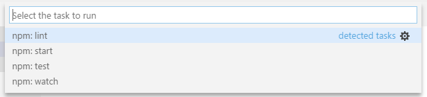
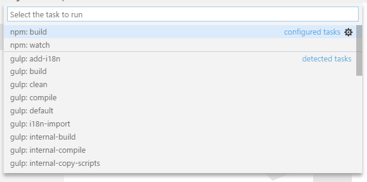
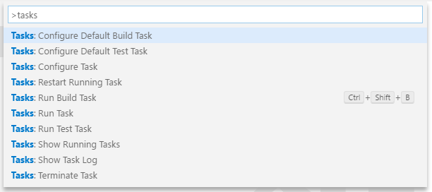
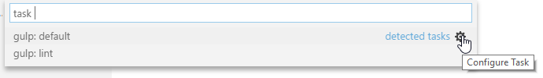
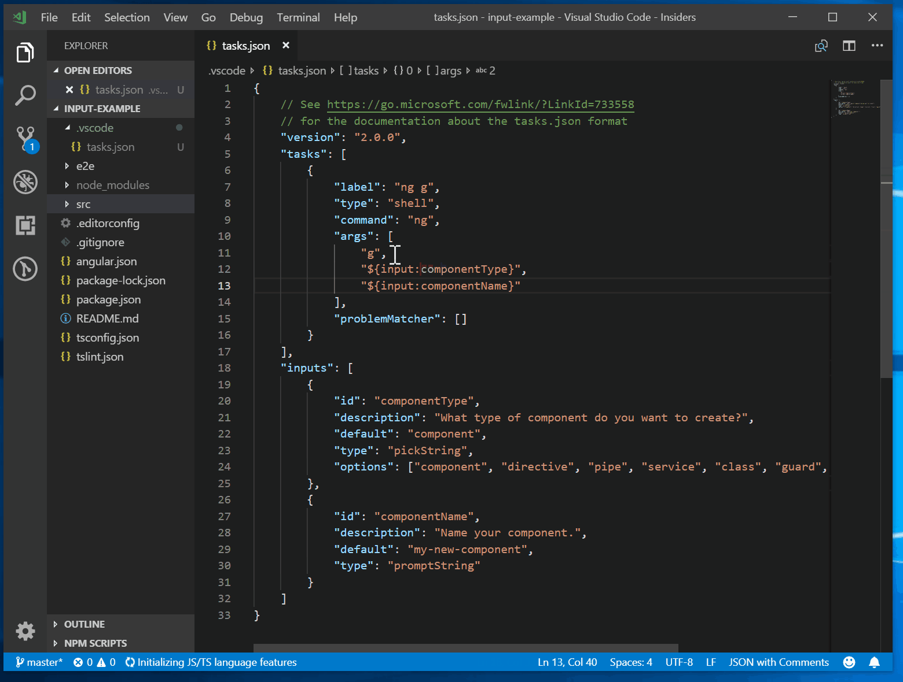
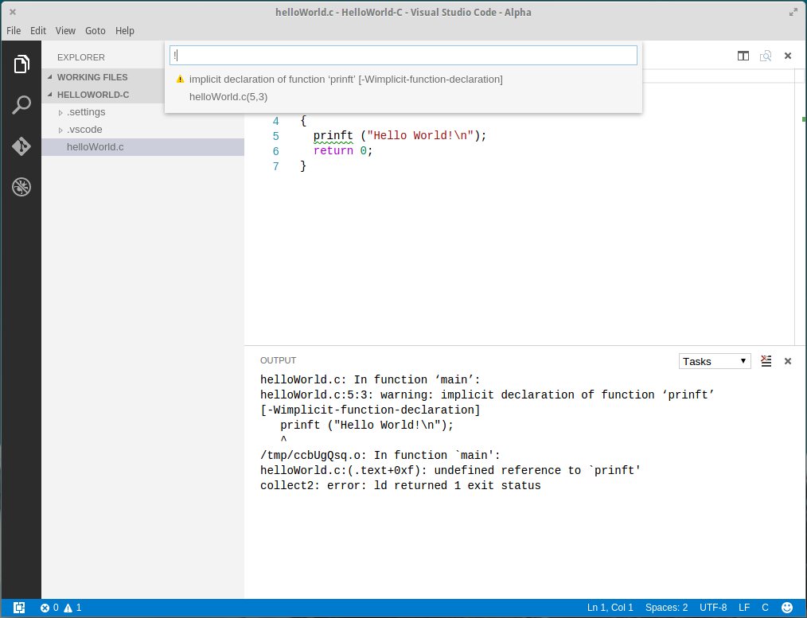

# Integrate with External Tools via Tasks

---

If you are using Visual Studio Code version 1.13 or earlier, please refer to the previous version of the Tasks [documentation](/docs/editor/tasks-v1.md).

---

Lots of tools exist to automate tasks like linting, building, packaging, testing or deploying software systems. Examples include the [TypeScript Compiler](https://www.typescriptlang.org/), linters like [ESLint](https://eslint.org/) and [TSLint](https://palantir.github.io/tslint/) as well as build systems like [Make](https://en.wikipedia.org/wiki/Make_software), [Ant](https://ant.apache.org/), [Gulp](https://gulpjs.com/), [Jake](http://jakejs.com/), [Rake](https://ruby.github.io/rake/) and [MSBuild](https://github.com/Microsoft/msbuild).


These tools are mostly run from the command line and automate jobs inside and outside the inner software development loop (edit, compile, test, and debug). Given their importance in the development life-cycle, it is very helpful to be able to run tools and analyze their results from within VS Code. Tasks in VS Code can be configured to run scripts and start processes so that many of these existing tools can be used from within VS Code without having to enter a command line or write new code. Workspace or folder specific tasks are configured from the `tasks.json` file in the `.vscode` folder for a workspace.

Extensions can also contribute tasks using a [Task Provider](/api/extension-guides/task-provider.md), and these contributed tasks can add workspace-specific configurations defined in the `tasks.json` file.

>**Note:** Task support is only available when working on a workspace folder. It is not available when editing single files.

## TypeScript Hello World

Let's start with a simple "Hello World" TypeScript program that we want to compile to JavaScript.

Create an empty folder "mytask", generate a `tsconfig.json` file and start VS Code from that folder.

```bash
mkdir mytask
cd mytask
tsc --init
code .
```

Now create a `HelloWorld.ts` file with the following content

```ts
function sayHello(name: string): void {
    console.log(`Hello ${name}!`);
}

sayHello('Dave');
```

Pressing `kb(workbench.action.tasks.build)` or running **Run Build Task** from the global **Terminal** menu show the following picker:


The first entry executes the TypeScript compiler and translates the TypeScript file to a JavaScript file. When the compiler has finished, there should be a `HelloWorld.js` file. The second entry starts the TypeScript compiler in watch mode. Every save to the `HelloWorld.ts` file will regenerate the `HelloWorld.js` file.

You can also define the TypeScript build or watch task as the default build task so that it is executed directly when triggering **Run Build Task** (`kb(workbench.action.tasks.build)`). To do so, select **Configure Default Build Task** from the global **Terminal** menu. This shows you a picker with the available build tasks. Select **tsc: build** or **tsc: watch** and VS Code will generate a `tasks.json` file. The one shown below make the **tsc: build** task the default build task:

```json
{
    // See https://go.microsoft.com/fwlink/?LinkId=733558
    // for the documentation about the tasks.json format
    "version": "2.0.0",
    "tasks": [
        {
            "type": "typescript",
            "tsconfig": "tsconfig.json",
            "problemMatcher": [
                "$tsc"
            ],
            "group": {
                "kind": "build",
                "isDefault": true
            }
        }
    ]
}
```

Unlike the previous `0.1.0` version of the `tasks.json` file, this does not define a new task. It annotates the **tsc: build** tasks contributed by VS Code's TypeScript extension to be the default build task. You can now execute the TypeScript compiler by pressing `kb(workbench.action.tasks.build)`.

## Task auto-detection

VS Code currently auto-detects tasks for the following systems: Gulp, Grunt, Jake and npm. We are working with the corresponding extension authors to add support for Maven and the C# `dotnet` command as well. If you develop a JavaScript application using Node.js as the runtime, you usually have a `package.json` file describing your dependencies and the scripts to run. If you have cloned the [eslint-starter](https://github.com/spicydonuts/eslint-starter) example, then executing **Run Tasks** from the global menu shows the following list:



If not done so install the necessary npm modules by running npm install. Now open the `server.js` file and add a semicolon to the end of a statement (note the ESLint starter assumes statements without a semicolon) and execute the **Run Tasks** again. This time select the **npm: lint** task. When prompted for the problem matcher to use, select **ESLint stylish**


Executing the task produces one error shown in the **Problems** view:


In addition, VS Code created a `tasks.json` file with the following content:

```json
{
    // See https://go.microsoft.com/fwlink/?LinkId=733558
    // for the documentation about the tasks.json format
    "version": "2.0.0",
    "tasks": [
        {
            "type": "npm",
            "script": "lint",
            "problemMatcher": [
                "$eslint-stylish"
            ]
        }
    ]
}
```

This instructs VS Code to scan the output of the **npm lint** script for problems using the ESLint stylish format.

For Gulp, Grunt, and Jake, the task auto-detection works the same. Below is an example of the tasks detected for the [vscode-node-debug](https://github.com/Microsoft/vscode-node-debug) extension.



>**Tip:** You can run your task through **Quick Open** (`kb(workbench.action.quickOpen)`) by typing 'task', `kbstyle(Space)` and the command name. In this case, 'task lint'.

Task auto detection can be disabled using the following settings:

```json
{
    "typescript.tsc.autoDetect": "off",
    "grunt.autoDetect": "off",
    "jake.autoDetect": "off",
    "gulp.autoDetect": "off",
    "npm.autoDetect": "off"
}
```

## Custom tasks

Not all tasks or scripts can be auto-detected in your workspace. Sometimes it is necessary to define your own custom tasks. Assume you have a script to run your tests since it is necessary to setup some environment correctly. The script is stored in a script folder inside your workspace and named `test.sh` for Linux and macOS and `test.cmd` for Windows. Run **Configure Tasks** from the global **Terminal** menu and select the **Create tasks.json file from template** entry. This opens the following picker:


>**Note:** If you don't see the list of task runner templates, you may already have a `tasks.json` file in your folder and its contents will be open in the editor. Close the file and either delete or rename it for this example.

We are working on more auto-detection support, so this list will get smaller and smaller in the future. Since we want to write our own custom task, select **Others** from the list. This opens the `tasks.json` file with a task skeleton. Replace the contents with the following:

```json
{
    // See https://go.microsoft.com/fwlink/?LinkId=733558
    // for the documentation about the tasks.json format
    "version": "2.0.0",
    "tasks": [
        {
            "label": "Run tests",
            "type": "shell",
            "command": "./scripts/test.sh",
            "windows": {
                "command": ".\\scripts\\test.cmd"
            },
            "group": "test",
            "presentation": {
                "reveal": "always",
                "panel": "new"
            }
        }
    ]
}
```

The task's properties have the following semantic:

- **label**: The task's label used in the user interface.
- **type**: The task's type. For a custom task, this can either be `shell` or `process`. If `shell` is specified, the command is interpreted as a shell command (for example: bash, cmd, or PowerShell). If `process` is specified, the command is interpreted as a process to execute.
- **command**: The actual command to execute.
- **windows**: Any Windows specific properties. Will be used instead of the default properties when the command is executed on the Windows operating system.
- **group**: Defines to which group the task belongs. In the example, it belongs to the `test` group. Tasks that belong to the test group can be executed by running **Run Test Task** from the **Command Palette**.
- **presentation**: Defines how the task output is handled in the user interface. In this example, the Integrated Terminal showing the output is `always` revealed and a `new` terminal is created on every task run.
- **options**: Override the defaults for `cwd` (current working directory), `env` (environment variables), or `shell` (default shell). Options can be set per task but also globally or per platform. Environment variables configured here can only be referenced from within your task script or process and will not be resolved if they are part of your args, command, or other task attributes.
- **runOptions**: Defines when and how a task is run.

To see the full set of task properties and values, you can review the [tasks.json schema](/docs/editor/tasks-appendix.md).

Shell commands need special treatment when it comes to commands and arguments that contains spaces or other special characters like `$`. By default the task system support the following behavior:

* if a single command is provided the task system passes the command as is to the underlying shell. If the command needs quoting or escaping to function properly the command need to contain the proper quotes or escape characters. For example to list the directory of a folder containing spaces in its name the command executed in bash should look like this: `ls 'folder with spaces'`.
```json
{
  "label": "dir",
  "type": "shell",
  "command": "dir 'folder with spaces'"
}
```
* if a command and arguments are provided the task system will use single quotes if the command or arguments contain spaces. For `cmd.exe` double quotes are used. So a shell command like below is executed in PowerShell as `dir 'folder with spaces'`.
```json
{
  "label": "dir",
  "type": "shell",
  "command": "dir",
  "args": [
    "folder with spaces"
  ]
}
```
* if you want to control how the argument is quoted, the argument can be a literal specifying the value and a quoting style. Below an example that uses escaping instead of quoting for an argument with spaces.
```json
{
  "label": "dir",
  "type": "shell",
  "command": "dir",
  "args": [
    {
      "value": "folder with spaces",
      "quoting": "escape"
    }
  ]
}
```

Besides escaping the following values are supported:

* **strong**: Uses the shell's strong quoting mechanism which suppresses all evaluations inside the string. Under PowerShell and for shells under Linux and macOS, single quotes are used (`'`). For cmd.exe, `"` is used.
* **weak**: Uses the shell's weak quoting mechanism which still evaluates expression inside the string (e.g. for example environment variables). Under PowerShell and for shells under Linux and macOS, double quotes are used (`"`). cmd.exe doesn't support weak quoting so VS Code uses `"` as well.

If the command itself contains spaces, VS Code will by default strong quote the command as well. As with arguments, the user can control the quoting of the command using the same literal style.

There are more task properties to configure your workflow. You can use IntelliSense with `kb(editor.action.triggerSuggest)` to get an overview of the valid properties.


In addition to the global menu bar, task commands can be accessed using the **Command Palette** (`kb(workbench.action.showCommands)`). You can filter on 'task' and can see the various task related commands.



### Compound tasks

You can also compose tasks out of simpler tasks with the `dependsOn` property. For example, if you have a workspace with a client and server folder and both contain a build script, you can create a task that starts both build scripts in separate terminals. If you list more than one task in the `dependsOn` property, they are executed in parallel by default.

The `tasks.json` file looks like this:

```json
{
    "version": "2.0.0",
    "tasks": [
        {
            "label": "Client Build",
            "command": "gulp",
            "args": ["build"],
            "options": {
                "cwd": "${workspaceRoot}/client"
            }
        },
        {
            "label": "Server Build",
            "command": "gulp",
            "args": ["build"],
            "options": {
                "cwd": "${workspaceRoot}/server"
            }
        },
        {
            "label": "Build",
            "dependsOn": ["Client Build", "Server Build"]
        }
    ]
}
```

If you specify `"dependsOrder": "sequence"` then your task dependencies are executed in the order they are listed in `dependsOn`. Any background/watch tasks used in `dependsOn` with `"dependsOrder": "sequence"` must have a problem matcher that tracks when they are "done". The following task runs task Two, task Three, and then task One.

```json
{
    "label": "One",
	"type": "shell",
	"command": "echo Hello ",
	"dependsOrder": "sequence",
	"dependsOn":[
		"Two",
		"Three"
	]
}
```

## Output behavior

Sometimes you want to control how the Integrated Terminal panel behaves when running tasks. For instance, you may want to maximize editor space and only look at task output if you think there is a problem. The behavior of the terminal can be controlled using the `presentation` property of a task. It offers the following properties:

- **reveal**: Controls whether the Integrated Terminal panel is brought to front. Valid values are:
  - *always* - The panel is always brought to front. This is the default.
  - *never* - The user must explicitly bring the terminal panel to the front using the  **View** > **Terminal** command (`kb(workbench.action.terminal.toggleTerminal)`).
  - *silent* - The terminal panel is brought to front only if the output is not scanned for errors and warnings.
- **focus**: Controls whether the terminal is taking input focus or not. Default is `false`.
- **echo**: Controls whether the executed command is echoed in the terminal. Default is `true`.
- **showReuseMessage**: Controls whether to show the "Terminal will be reused by tasks, press any key to close it" message.
- **panel**: Controls whether the terminal instance is shared between task runs. Possible values are:
  - *shared*: The terminal is shared and the output of other task runs are added to the same terminal.
  - *dedicated*: The terminal is dedicated to a specific task. If that task is executed again, the terminal is reused. However, the output of a different task is presented in a different terminal.
  - *new*: Every execution of that task is using a new clean terminal.
- **clear**: Controls whether the terminal is cleared before this task is run. Default is `false`.
- **group**: Controls whether the task is executed in a specific terminal group using split panes. Tasks in the same group (specified by a string value) will use split terminals to present instead of a new terminal panel.

You can modify the terminal panel behavior for auto-detected tasks as well. For example, if you want to change the output behavior for the **npm: run lint** from the ESLint example from above, add the `presentation` property to it:

```json
{
    // See https://go.microsoft.com/fwlink/?LinkId=733558
    // for the documentation about the tasks.json format
    "version": "2.0.0",
    "tasks": [
        {
            "type": "npm",
            "script": "lint",
            "problemMatcher": [
                "$eslint-stylish"
            ],
            "presentation": {
                "reveal": "never"
            }
        }
    ]
}

```

You can also mix custom tasks with configurations for detected tasks. A `tasks.json` that configures the **npm: run lint** task and adds a custom **Run Test** tasks looks like this:

```json
{
    // See https://go.microsoft.com/fwlink/?LinkId=733558
    // for the documentation about the tasks.json format
    "version": "2.0.0",
    "tasks": [
        {
            "type": "npm",
            "script": "lint",
            "problemMatcher": [
                "$eslint-stylish"
            ],
            "presentation": {
                "reveal": "never"
            }
        },
        {
            "label": "Run tests",
            "type": "shell",
            "command": "./scripts/test.sh",
            "windows": {
                "command": ".\\scripts\\test.cmd"
            },
            "group": "test",
            "presentation": {
                "reveal": "always",
                "panel": "new"
            }
        }
    ]
}

```

## Run behavior

You can specify a tasks run behaviors using the `runOptions` property:

- **reevaluateOnRerun**: Controls how variables are evaluated whan a task is executed through the **Rerun Last Task** command. The default is `true`, meaning that variables will be re-evaluated when a task is rerun. When set to `false` the resolved variable values from the previous run of the task will be used.
- **runOn**: Specifies when a task is run.
  - *default*: The task will only be run when executed through the **Run Task** command.
  - *folderOpen*: The task will be run when the folder it is in is opened. The first time you open a folder that contains a task with *folderOpen* you will be asked if you allow tasks to run automatically in that folder. You can change you decision later using the **Allow Automatic Tasks in Folder** and **Disallow Automatic Tasks in Folder** commands.

## Customizing auto-detected tasks

As mentioned above, you can customize auto-detected tasks in the `tasks.json` file. You usually do so to modify presentation properties or to attach a problem matcher to scan the task's output for errors and warnings. You can customize a task directly from the **Run Task** list by pressing the gear icon to the right to insert the corresponding task reference into the `tasks.json` file. Assume you have the following Gulp file to lint JavaScript files using ESLint (the file is taken from https://github.com/adametry/gulp-eslint):

```js
const gulp = require('gulp');
const eslint = require('gulp-eslint');

gulp.task('lint', () => {
    // ESLint ignores files with "node_modules" paths.
    // So, it's best to have gulp ignore the directory as well.
    // Also, Be sure to return the stream from the task;
    // Otherwise, the task may end before the stream has finished.
    return gulp.src(['**/*.js','!node_modules/**'])
        // eslint() attaches the lint output to the "eslint" property
        // of the file object so it can be used by other modules.
        .pipe(eslint())
        // eslint.format() outputs the lint results to the console.
        // Alternatively use eslint.formatEach() (see Docs).
        .pipe(eslint.format())
        // To have the process exit with an error code (1) on
        // lint error, return the stream and pipe to failAfterError last.
        .pipe(eslint.failAfterError());
});

gulp.task('default', ['lint'], function () {
    // This will only run if the lint task is successful...
});
```

Executing **Run Task** from the global **Terminal** menu will show the following picker:



Press the gear icon. This will create the following `tasks.json` file:

```json
{
    // See https://go.microsoft.com/fwlink/?LinkId=733558
    // for the documentation about the tasks.json format
    "version": "2.0.0",
    "tasks": [
        {
            "type": "gulp",
            "task": "default",
            "problemMatcher": []
        }
    ]
}
```

Usually you would now add a problem matcher (in this case `$eslint-stylish`) or modify the presentation settings.

## Processing task output with problem matchers

VS Code can process the output from a task with a problem matcher and ships with several problem matchers 'in-the-box':

- **TypeScript**: `$tsc` assumes that file names in the output are relative to the opened folder.
- **TypeScript Watch**: `$tsc-watch` matches problems reported from the `tsc` compiler when executed in watch mode.
- **JSHint**: `$jshint` assumes that file names are reported as an absolute path.
- **JSHint Stylish**: `$jshint-stylish` assumes that file names are reported as an absolute path.
- **ESLint Compact**: `$eslint-compact` assumes that file names in the output are relative to the opened folder.
- **ESLint Stylish**: `$eslint-stylish` assumes that file names in the output are relative to the opened folder.
- **Go**: `$go` matches problems reported from the `go` compiler. Assumes that file names are relative to the opened folder.
- **CSharp and VB Compiler**: `$mscompile` assumes that file names are reported as an absolute path.
- **Lessc compiler**: `$lessc` assumes that file names are reported as absolute path.
- **Node Sass compiler**: `$node-sass` assumes that file names are reported as an absolute path.

Problem matchers scan the task output text for known warning or error strings and report these inline in the editor and in the Problems panel.

You can also create your own problem matcher which we'll discuss [in a later section](/docs/editor/tasks.md#defining-a-problem-matcher).

## Binding keyboard shortcuts to tasks

If you need to run a task frequently, you can define a keyboard shortcut for the task.

For example, to bind `Ctrl+H` to the **Run tests** task from above, add the following to your `keybindings.json` file:

```json
{
    "key": "ctrl+h",
    "command": "workbench.action.tasks.runTask",
    "args": "Run tests"
}
```

## Variable substitution

When authoring tasks configurations, it is useful to have a set of predefined common variables such as the active file (`${file}`) or workspace root folder (`${workspaceFolder}`). VS Code supports variable substitution inside strings in the `tasks.json` file and you can see a full list of predefined variables in the [Variables Reference](/docs/editor/variables-reference.md).

Below is an example of a custom task configuration that passes the current opened file to the TypeScript compiler.

```json
{
    "label": "TypeScript compile",
    "type": "shell",
    "command": "tsc ${file}",
    "problemMatcher": [
        "$tsc"
    ]
}
```

Similarly, you can reference your project's configuration settings by prefixing the name with **${config:**. For example, `${config:python.pythonPath}` returns the Python extension setting `pythonPath`.

Below is an example of a custom task configuration which executes autopep8 on the current file using your project's selected Python executable:

```json
{
    "label": "autopep8 current file",
    "type": "process",
    "command": "${config:python.pythonPath}",
    "args": [
        "-m",
        "autopep8",
        "-i",
        "${file}"
    ]
}
```

If simple variable substitution isn't enough, you can also get input from the user of your task by adding an `inputs` section to your `tasks.json` file.



For more information about `inputs` see the [Variables Reference](/docs/editor/variables-reference.md).

## Operating system specific properties

The task system supports defining values (for example, the command to be executed) specific to an operating system. To do so, put an operating system specific literal into the `tasks.json` file and specify the corresponding properties inside that literal.

Below is an example that uses the Node.js executable as a command and is treated differently on Windows and Linux:

```json
{
    "label": "Run Node",
    "type": "process",
    "windows": {
        "command": "C:\\Program Files\\nodejs\\node.exe"
    },
    "linux": {
        "command": "/usr/bin/node"
    }
}
```

Valid operating properties are `windows` for Windows, `linux` for Linux, and `osx` for macOS. Properties defined in an operating system specific scope override properties defined in the task or global scope.

Task properties can also be defined in the global scope. If present, they will be used for specific tasks unless they define the same property with a different value. In the example below, there is a global `presentation` property that defines that all tasks should be executed in a new panel:

```json
{
    // See https://go.microsoft.com/fwlink/?LinkId=733558
    // for the documentation about the tasks.json format
    "version": "2.0.0",
    "presentation": {
        "panel": "new"
    },
    "tasks": [
        {
            "label": "TS - Compile current file",
            "type": "shell",
            "command": "tsc ${file}",
            "problemMatcher": [
                "$tsc"
            ]
        }
    ]
}
```

### Character escaping in PowerShell

When the default shell is PowerShell, or when a task is configured to use PowerShell, you might see unexpected space and quote escaping. The unexpected escaping only occurs with cmdlets because VS Code doesn’t know if your command contains cmdlets. Example 1 below shows a case where you’ll get escaping that doesn’t work with PowerShell. Example 2 shows the best, cross-platform, way to get good escaping. In some cases, you might not be able to follow example 2 and you’ll need to do the manual escaping show in example 3.

```json
{
	"label": "PowerShell example 1 (unexpected escaping)",
	"type": "shell",
	"command": "Get-ChildItem \"Folder With Spaces\""
},
{
	"label": "PowerShell example 2 (expected escaping)",
	"type": "shell",
	"command": "Get-ChildItem",
	"args": ["Folder With Spaces"]
},
{
	"label": "PowerShell example 3 (manual escaping)",
	"type": "shell",
	"command": "& Get-ChildItem \\\"Folder With Spaces\\\""
}
```

## Changing the encoding for a task output

Tasks frequently act with files on disk. If these files are stored on disk with an encoding different than the system encoding you need to let the command executed as a task know which encoding to use. Since this depends on the operating system and the shell used there is no general solution to control this. Below some advice and examples on how to make it work.

If you need to tweak the encoding you should check whether it makes sense to change the default encoding used by our operating system or at least changing it for the shell you use by tweaking the shell's profile file.

If you only need to tweak it for a specific task then add the OS specific command necessary to change the encoding to the tasks command line. The following example is for Windows using code page of 437 as its default. The task shows the output of a file containing Cyrillic characters and therefore needs code page 866. The task to list the file looks like this assuming that the default shell is set to `cmd.exe`:

```json
{
    // See https://go.microsoft.com/fwlink/?LinkId=733558
    // for the documentation about the tasks.json format
    "version": "2.0.0",
    "tasks": [
        {
            "label": "more",
            "type": "shell",
            "command": "chcp 866 && more russian.txt",
            "problemMatcher": []
        }
    ]
}
```

If the task is execute in `PowerShell`, the command needs to read like this `chcp 866; more russian.txt`. On Linux and macOS, the `locale` command can be used to inspect the locale and tweak the necessary environment variables.

## Examples of tasks in action

To highlight the power of tasks, here are a few examples of how VS Code can use tasks to integrate external tools like linters and compilers.

### Transpiling TypeScript to JavaScript

The [TypeScript topic](/docs/languages/typescript.md#transpiling-typescript-into-javascript) includes an example that creates a task to transpile TypeScript to JavaScript and observe any related errors from within VS Code.

### Compiling Markdown to HTML

The Markdown topic provides two examples for compiling Markdown to HTML:

1. [Manually compiling with a Build task](/docs/languages/markdown.md#compiling-markdown-into-html)
2. [Automating the compile step with a file watcher](/docs/languages/markdown.md#automating-markdown-compilation)

### Transpiling Less and SCSS into CSS

The CSS topic provides examples of how to use Tasks to generate CSS files.

1. [Manually transpiling with a Build task](/docs/languages/css.md#transpiling-sass-and-less-into-css)
2. [Automation of the compile step with a file watcher](/docs/languages/css.md#automating-sassless-compilation)

## Defining a problem matcher

VS Code ships some of the most common problem matchers 'in-the-box'.  However, there are lots of compilers and linting tools out there, all of which produce their own style of errors and warnings so you may want to create your own problem matcher.

We have a `helloWorld.c` program in which the developer mistyped **printf** as **prinft**. Compiling it with [gcc](https://gcc.gnu.org/) will produce the following warning:

```bash
helloWorld.c:5:3: warning: implicit declaration of function ‘prinft’
```

We want to produce a problem matcher that can capture the message in the output and show a corresponding problem in VS Code.  Problem matchers heavily rely on [regular expressions](https://en.wikipedia.org/wiki/Regular_expression). The section below assumes you are familiar with regular expressions.

>**Tip:** We have found the [RegEx101 playground](https://regex101.com/) to be a great way to develop and test regular expressions.

A matcher that captures the above warning (and errors) looks like this:

```json
{
    // The problem is owned by the cpp language service.
    "owner": "cpp",
    // The file name for reported problems is relative to the opened folder.
    "fileLocation": ["relative", "${workspaceFolder}"],
    // The actual pattern to match problems in the output.
    "pattern": {
        // The regular expression. Example to match: helloWorld.c:5:3: warning: implicit declaration of function ‘printf’ [-Wimplicit-function-declaration]
        "regexp": "^(.*):(\\d+):(\\d+):\\s+(warning|error):\\s+(.*)$",
        // The first match group matches the file name which is relative.
        "file": 1,
        // The second match group matches the line on which the problem occurred.
        "line": 2,
        // The third match group matches the column at which the problem occurred.
        "column": 3,
        // The fourth match group matches the problem's severity. Can be ignored. Then all problems are captured as errors.
        "severity": 4,
        // The fifth match group matches the message.
        "message": 5
    }
}
```

Please note that the file, line and message properties are mandatory. The `fileLocation` specifies whether the file paths in the problem are `absolute` or `relative`. If the task produces both absolute and relative paths, you can use the `autoDetect` file location. With `autoDetect`, paths are first tested as absolute paths, and if the file doesn't exist then the path is assumed to be relative.

Here is a finished `tasks.json` file with the code above (comments removed) wrapped with the actual task details:

```json
{
    "version": "2.0.0",
    "tasks": [
        {
            "label": "build",
            "command": "gcc",
            "args": ["-Wall", "helloWorld.c", "-o", "helloWorld"],
            "problemMatcher": {
                "owner": "cpp",
                "fileLocation": ["relative", "${workspaceFolder}"],
                "pattern": {
                    "regexp": "^(.*):(\\d+):(\\d+):\\s+(warning|error):\\s+(.*)$",
                    "file": 1,
                    "line": 2,
                    "column": 3,
                    "severity": 4,
                    "message": 5
                }
            }
        }
    ]
}
```

Running it inside VS Code and pressing `kb(workbench.actions.view.problems)` to get the list of problems gives you the following output:



>**Note:** The [C/C++ extension](https://marketplace.visualstudio.com/items?itemName=ms-vscode.cpptools) includes problem matchers for GCC so there is no need to define our own.

There are a couple more properties that can be used inside a pattern. These are:

- **location** if the problem location is line or line,column or startLine,startColumn,endLine,endColumn then our generic location match group can be used.
- **endLine** the match group index for the problem's end line. Can be omitted if no end line value is provided by the compiler.
- **endColumn** the match group index for the problem's end column. Can be omitted if no end column value is provided by the compiler.
- **code** the match group index for the problem's code. Can be omitted if no code value is provided by the compiler.

You can also define a problem matcher that captures only a file. To do so, define a `pattern` with the optional `kind` attribute set to `file`. In this case, there is no need to provide a `line` or `location` property.

>**Note:** A functional pattern must at least provide a match group for `file` and `message` if the `kind` property is set to `file`. If no `kind` property is provided or the `kind` property is set to `location`, a function pattern must provide a `line` or `location` property as well.

## Defining a multiline problem matcher

Some tools spread problems found in a source file over several lines, especially if stylish reporters are used. An example is [ESLint](https://eslint.org/); in stylish mode it produces output like this:

```bash
test.js
  1:0   error  Missing "use strict" statement                 strict
✖ 1 problems (1 errors, 0 warnings)
```

Our problem matcher is line-based so we need to capture the file name (test.js) with a different regular expression than the actual problem location and message (1:0   error  Missing "use strict" statement).

To do this we use an array of problem patterns for the `pattern` property. This way you define a pattern per each line you want to match.

The following problem pattern matches the output from ESLint in stylish mode - but still has one small issue which we will resolve next.  The code below has a first regular expression to capture the file name and the second to capture the line, column, severity, message and error code:

```json
{
    "owner": "javascript",
    "fileLocation": ["relative", "${workspaceFolder}"],
    "pattern": [
        {
            "regexp": "^([^\\s].*)$",
            "file": 1
        },
        {
            "regexp": "^\\s+(\\d+):(\\d+)\\s+(error|warning|info)\\s+(.*)\\s\\s+(.*)$",
            "line": 1,
            "column": 2,
            "severity": 3,
            "message": 4,
            "code": 5
        }
    ]
}
```

However, this pattern will not work if there is more than one problem on a resource. For instance, imagine the following output from ESLint:

```bash
test.js
  1:0   error  Missing "use strict" statement                 strict
  1:9   error  foo is defined but never used                  no-unused-vars
  2:5   error  x is defined but never used                    no-unused-vars
  2:11  error  Missing semicolon                              semi
  3:1   error  "bar" is not defined                           no-undef
  4:1   error  Newline required at end of file but not found  eol-last
✖ 6 problems (6 errors, 0 warnings)
```

The pattern's first regular expression will match "test.js", the second "1:0  error ...". The next line "1:9  error ..." is processed but not matched by the first regular expression and so no problem is captured.

To make this work, the last regular expression of a multiline pattern can specify the `loop` property. If set to true, it instructs the task system to apply the last pattern of a multiline matcher to the lines in the output as long as the regular expression matches.

The information captured by the first pattern, which in this case matches `test.js`, will be combined with each of the subsequent lines that match the `loop` pattern to create multiple problems. In this example, six problems would be created.

Here is a problem matcher to fully capture ESLint stylish problems:

```json
{
    "owner": "javascript",
    "fileLocation": ["relative", "${workspaceFolder}"],
    "pattern": [
        {
            "regexp": "^([^\\s].*)$",
            "file": 1
        },
        {
            "regexp": "^\\s+(\\d+):(\\d+)\\s+(error|warning|info)\\s+(.*)\\s\\s+(.*)$",
            "line": 1,
            "column": 2,
            "severity": 3,
            "message": 4,
            "code": 5,
            "loop": true
        }
    ]
}
```

## Background / watching tasks

Some tools support running in the background while watching the file system for changes and then triggering an action when a file changes on disk. With `Gulp` such functionality is provided through the npm module [gulp-watch](https://www.npmjs.com/package/gulp-watch). The TypeScript compiler `tsc` has built in support for this via the `--watch command` line option.

To provide feedback that a background task is active in VS Code and producing problem results, a problem matcher has to use additional information to detect these `state` changes in the output. Let's take the `tsc` compiler as an example. When the compiler is started in watch mode, it prints the following additional information to the console:

```
> tsc --watch
12:30:36 PM - Compilation complete. Watching for file changes.
```

When a file changes on disk which contains a problem, the following output appears:

```
12:32:35 PM - File change detected. Starting incremental compilation...
src/messages.ts(276,9): error TS2304: Cannot find name 'candidate'.
12:32:35 PM - Compilation complete. Watching for file changes.
```

Looking at the output shows the following pattern:

- The compiler runs when `File change detected. Starting incremental compilation...` is printed to the console.
- The compiler stops when `Compilation complete. Watching for file changes.` is printed to the console.
- Between those two strings problems are reported.
- The compiler also runs once the initial start (without printing `File change detected. Starting incremental compilation...` to the console).

To capture this information, a problem matcher can provide a `background` property.

For the `tsc` compiler, an appropriate `background` property looks like this:

```json
"background": {
    "activeOnStart": true,
    "beginsPattern": "^\\s*\\d{1,2}:\\d{1,2}:\\d{1,2}(?: AM| PM)? - File change detected\\. Starting incremental compilation\\.\\.\\.",
    "endsPattern": "^\\s*\\d{1,2}:\\d{1,2}:\\d{1,2}(?: AM| PM)? - Compilation complete\\. Watching for file changes\\."
}
```

In addition to the `background` property on the problem matcher, the task itself has to be marked as `isBackground` so that the task keeps running in the background.

A full handcrafted `tasks.json` for a `tsc` task running in watch mode looks like this:

```json
{
    "version": "2.0.0",
    "tasks": [
        {
            "label": "watch",
            "command": "tsc",
            "args": ["--watch"],
            "isBackground": true,
            "problemMatcher": {
                "owner": "typescript",
                "fileLocation": "relative",
                "pattern": {
                    "regexp": "^([^\\s].*)\\((\\d+|\\d+,\\d+|\\d+,\\d+,\\d+,\\d+)\\):\\s+(error|warning|info)\\s+(TS\\d+)\\s*:\\s*(.*)$",
                    "file": 1,
                    "location": 2,
                    "severity": 3,
                    "code": 4,
                    "message": 5
                },
                "background": {
                    "activeOnStart": true,
                    "beginsPattern": "^\\s*\\d{1,2}:\\d{1,2}:\\d{1,2}(?: AM| PM)? - File change detected\\. Starting incremental compilation\\.\\.\\.",
                    "endsPattern": "^\\s*\\d{1,2}:\\d{1,2}:\\d{1,2}(?: AM| PM)? - Compilation complete\\. Watching for file changes\\."
                }
            }
        }
    ]
}
```

## Convert from "0.1.0" to "2.0.0"

**Note**: If you have created a workspace that consists of multiple folders ([Multi-root Workspace](/docs/editor/multi-root-workspaces.md)), only version `2.0.0` tasks are detected and shown in the **Terminal** > **Run Task** picker.

### Try running without tasks.json

Tasks `2.0.0` version comes with lots of new auto-detection features so you can try removing an existing `tasks.json` file to see which tasks still work. One way is to rename the existing `tasks.json` to `tasks.json.off`.

### Migrating to Tasks 2.0.0

If you have lots of task customizations then you can switch by changing the version attribute to `"2.0.0"`. After doing so, you might encounter warnings (green squiggles) because some properties are now deprecated.

Here is a migration guide:

- **taskName**: Use the `label` property instead.
- **isShellCommand**: Use the `"type": "shell"` property instead.
- **isBuildCommand**: Use the `"group": "build"` property instead.
- **isTestCommand**: Use the `"group": "test"` property instead.
- **echoCommand**: Use the `"presentation" : { "echo": "..." }` property instead.
- **showOutput**: Use the `"presentation" : { "reveal": "..." }` property instead.
- **suppressTaskName**: By default, the task name gets appended to the list of arguments when running a task version `0.1.0`. Since version `2.0.0` supports commands per task, you can inline the command into the task and specify the arguments accordingly.

Consider the following `0.1.0` configuration:

```json
{
    "version": "0.1.0",
    "isShellCommand": true,
    "command": "script",
    "tasks": [
        {
            "taskName": "Run tests",
            "suppressTaskName": true,
            "args": [
                "test"
            ]
        }
    ]
}
```

The corresponding `2.0.0` configuration would look like this:

```json
{
    "version": "2.0.0",
    "tasks": [
        {
            "label": "Run tests",
            "type": "shell",
            "command": "script test"
        }
    ]
}
```

- **taskSelector**: Move the command into the task and specify the task selector inside the command.

```json
{
    "version": "0.1.0",
    "command": "msbuild",
    "args": [
        "/property:GenerateFullPaths=true"
    ],
    "taskSelector": "/t:",
    "tasks": [
        {
            "label": "build"
        }
    ]
}
```

A corresponding `2.0.0` configuration would look like this:

```json
{
    "version": "2.0.0",
    "tasks": [
        {
            "label": "build",
            "command": "msbuild",
            "args": [
                "/property:GenerateFullPaths=true",
                "/t:build"
            ]
        }
    ]
}
```

If you want to use a `0.1.0` version of the `tasks.json` file with the new terminal runner, you can add the `runner` property to the `tasks.json` file: `"runner": "terminal"`.

## Next steps

That was tasks - let's keep going...

* [tasks.json Schema](/docs/editor/tasks-appendix.md) - You can review the full `tasks.json` schema and descriptions.
* [Basic Editing](/docs/editor/codebasics.md) - Learn about the powerful VS Code editor.
* [Code Navigation](/docs/editor/editingevolved.md) - Move quickly through your source code.
* [Language Support](/docs/languages/overview.md) - Learn about our supported programming languages, both shipped with VS Code and through community extensions.
* [Debugging](/docs/editor/debugging.md) - Debug your source code directly in the VS Code editor.

## Common questions

### Can a task use a different shell than the one specified for the Integrated Terminal?

You can override a task's shell with the `options.shell` property. You can set this per task, globally, or per platform. For example, to use cmd.exe on Windows, your `tasks.json` would include:

```json
{
    "version": "2.0.0",
    "windows": {
        "options": {
            "shell": {
                "executable": "cmd.exe",
                "args": [
                    "/d", "/c"
                ]
            }
        }
    },
    ...
```
