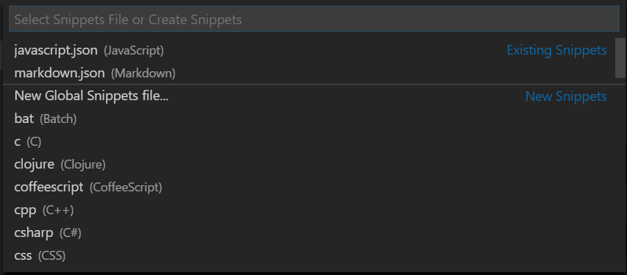

# Creating your own snippets

Code snippets are templates that make it easier to enter repeating code patterns, such as loops or conditional-statements.

In Visual Studio Code, snippets show in IntelliSense (`kb(editor.action.triggerSuggest)`) mixed with other suggestions as well as in a dedicated snippet picker (**Insert Snippet** in the Command Palette). There is also support for tab-completion: Enable it with `"editor.tabCompletion": true`, type a *snippet prefix*, and press `kb(insertSnippet)` to insert a snippet.

The snippet syntax follows the [TextMate snippet syntax](https://manual.macromates.com/en/snippets) with the exceptions of 'interpolated shell code' and the use of `\u`; both are not supported.


## Add snippets from the Marketplace

Many [extensions](/docs/editor/extension-gallery.md) on the VS Code [Marketplace](https://marketplace.visualstudio.com/vscode) include snippets.  If you find one you want to use, install it and restart VS Code and the new snippet will be available (see [here](/docs/editor/extension-gallery.md#browse-and-install-extensions) for more instructions on installing an extension).

Below are some popular extensions which include snippets in their language support:

<div class="marketplace-extensions-snippets"></div>

> **Tip**: The extensions shown above are dynamically queried. Click on an extension tile above to read the description and reviews to decide which extension is best for you. See more in the [Marketplace](https://marketplace.visualstudio.com/vscode).

## Creating your own snippets

You can define your own snippets, either global snippets or snippets for a specific language. To open up a snippet file for editing, select **User Snippets** under **File** > **Preferences** (**Code** > **Preferences** on macOS) and select the language (by [language identifier](/docs/languages/identifiers.md)) for which the snippets should appear or create a new global snippet (**New Global Snippets file...**).



Snippets are defined in a JSON format. The example below is a `For Loop` snippet you would use for JavaScript:

```json
{
    "For_Loop": {
        "prefix": "for",
        "body": [
          "for (const ${2:element} of ${1:array}) {",
          "\t$0",
          "}"
        ],
        "description": "For Loop"
    }
}
```

In the example above:

* `For Loop` is the snippet name.
* `prefix` defines how this snippet is selected from IntelliSense and tab completion. In this case `for`.
* `body` is the content and either a single string or an array of strings of which each element will be inserted as separate line.
* `description` is the description used in the IntelliSense drop down.

The example above has two placeholders, `${1:array}` and `${2:element}`. You can quickly traverse them in the order of their number. The string after the number and colon is used as an initial default.

### Snippet filenames

The file type and name define if a snippet is global or specific to a language. Snippets stored in a JSON file that is named after a [language identifier](/docs/languages/identifiers.md) (`<languageId>.json`) are language specific. For example, JavaScript-only snippets go in a `javascript.json` file.

### Global snippets

Global snippets that are applicable whenever you are editing and are stored in `<name>.code-snippets` files, for example `MyGlobal.code-snippets`. The JSON schema of global snippets allows you to define a `scope` property which can filter the languages (based on [language identifier](/docs/languages/identifiers.md)) for which a snippet is applicable.

The sample below is the `For Loop` again but this time it is scoped to JavaScript *and* TypeScript.

```json
{
    "For_Loop": {
        "prefix": "for",
        "scope": "javascript,typescript",
        "body": [
          "for (const ${2:element} of ${1:array}) {",
          "\t$0",
          "}"
        ],
        "description": "For Loop"
    }
}
```

Once you have added a new snippet, you can try it out right away, no restart needed.

## Snippet syntax

The `body` of a snippet can use special constructs to control cursors and the text being inserted. The following are supported features and their syntaxes:

### Tabstops

With tabstops, you can make the editor cursor move inside a snippet. Use `$1`, `$2` to specify cursor locations. The number is the order in which tabstops will be visited, whereas `$0` denotes the final cursor position. Multiple occurrences of the same tabstop are linked and updated in sync.

### Placeholders

Placeholders are tabstops with values, like `${1:foo}`. The placeholder text will be inserted and selected such that it can be easily changed. Placeholders can be nested, like `${1:another ${2:placeholder}}`.

### Choice

Placeholders can have choices as values. The syntax is a comma separated enumeration of values, enclosed with the pipe-character, for example `${1|one,two,three|}`. When the snippet is inserted and the placeholder selected, choices will prompt the user to pick one of the values.

### Variables

With `$name` or `${name:default}` you can insert the value of a variable. When a variable isn’t set, its *default* or the empty string is inserted. When a variable is unknown (that is, its name isn’t defined) the name of the variable is inserted and it is transformed into a placeholder.

The following variables can be used:

* `TM_SELECTED_TEXT` The currently selected text or the empty string
* `TM_CURRENT_LINE` The contents of the current line
* `TM_CURRENT_WORD` The contents of the word under cursor or the empty string
* `TM_LINE_INDEX` The zero-index based line number
* `TM_LINE_NUMBER` The one-index based line number
* `TM_FILENAME` The filename of the current document
* `TM_FILENAME_BASE` The filename of the current document without its extensions
* `TM_DIRECTORY` The directory of the current document
* `TM_FILEPATH` The full file path of the current document
* `CLIPBOARD` The contents of your clipboard

For inserting the current date and time:

* `CURRENT_YEAR` The current year
* `CURRENT_YEAR_SHORT` The current year's last two digits
* `CURRENT_MONTH` The month as two digits (example '02')
* `CURRENT_MONTH_NAME` The full name of the month (example 'July')
* `CURRENT_MONTH_NAME_SHORT` The short name of the month (example 'Jul')
* `CURRENT_DATE` The day of the month
* `CURRENT_DAY_NAME` The name of day (example 'Monday')
* `CURRENT_DAY_NAME_SHORT` The short name of the day (example 'Mon')
* `CURRENT_HOUR` The current hour in 24-hour clock format
* `CURRENT_MINUTE` The current minute
* `CURRENT_SECOND` The current second


### Variable transforms

Transformations allow you to modify the value of a variable before it is inserted. The definition of a transformation consists of three parts:

1. A regular expression that is matched against the value of a variable, or the empty string when the variable cannot be resolved.
2. A "format string" that allows to reference matching groups from the regular expression. The format string allows for conditional inserts and simple modifications.
3. Options that are passed to the regular expression.

The following example inserts the name of the current file without its ending, so from `foo.txt` it makes `foo`.

```
${TM_FILENAME/(.*)\\..+$/$1/}
  |           |         |  |
  |           |         |  |-> no options
  |           |         |
  |           |         |-> references the contents of the first
  |           |             capture group
  |           |
  |           |-> regex to capture everything before
  |               the final `.suffix`
  |
  |-> resolves to the filename
```

### Placeholder-Transform

Like a Variable-Transform, a transformation of a placeholder allows changing the inserted text for the placeholder when moving to the next tab stop.
The inserted text is matched with the regular expression and the match or matches - depending on the options - are replaced with the specified replacement format text.
Every occurrence of a placeholder can define its own transformation independently using the value of the first placeholder.
The format for Placeholder-Transforms is the same as for Variable-Transforms.

### Transform Examples

The examples are shown within double quotes, as they would appear inside a snippet body, to illustrate the need to double escape certain characters. Sample transformations and the resulting output for the filename `example-123.456-TEST.js`.

Example | Output | Explanation
-------------|--------|------------
`"${TM_FILENAME/[\\.]/_/}"` | `example-123_456-TEST.js` | Replace the first `.` with `_`
`"${TM_FILENAME/[\\.-]/_/g}"` | `example_123_456_TEST_js` | Replace each `.` or `-` with `_`
`"${TM_FILENAME/(.*)/${1:/upcase}/}"` | `EXAMPLE-123.456-TEST.JS` | Change to all uppercase
`"${TM_FILENAME/[^0-9^a-z]//gi}"` | `example123456TESTjs` | Remove non-alphanumeric characters

### Grammar

Below is the EBNF ([extended Backus-Naur form](https://en.wikipedia.org/wiki/Extended_Backus-Naur_form)) for snippets. With `\` (backslash), you can escape `$`, `}` and `\`. Within choice elements, the backslash also escapes comma and pipe characters.

```
any         ::= tabstop | placeholder | choice | variable | text
tabstop     ::= '$' int
                | '${' int '}'
                | '${' int  transform '}'
placeholder ::= '${' int ':' any '}'
choice      ::= '${' int '|' text (',' text)* '|}'
variable    ::= '$' var | '${' var '}'
                | '${' var ':' any '}'
                | '${' var transform '}'
transform   ::= '/' regex '/' (format | text)+ '/' options
format      ::= '$' int | '${' int '}'
                | '${' int ':' '/upcase' | '/downcase' | '/capitalize' '}'
                | '${' int ':+' if '}'
                | '${' int ':?' if ':' else '}'
                | '${' int ':-' else '}' | '${' int ':' else '}'
regex       ::= JavaScript Regular Expression value (ctor-string)
options     ::= JavaScript Regular Expression option (ctor-options)
var         ::= [_a-zA-Z] [_a-zA-Z0-9]*
int         ::= [0-9]+
text        ::= .*
```

## Using TextMate snippets

You can also use existing TextMate snippets (.tmSnippets) with VS Code. See the [Using TextMate Snippets](/docs/extensions/themes-snippets-colorizers.md#using-textmate-snippets) topic in our Extension Authoring section to learn more.

## Assign keybindings to snippets

You can create custom [keybindings](/docs/getstarted/keybindings.md) to insert specific snippets. Open `keybindings.json` (**Preferences: Open Keyboard Shortcuts File**), which defines all your keybindings, and add a keybinding passing `"snippet"` as an extra argument:

```json
{
  "key": "cmd+k 1",
  "command": "editor.action.insertSnippet",
  "when": "editorTextFocus",
  "args": {
    "snippet": "console.log($1)$0"
  }
}
```

The keybinding will invoke the **Insert Snippet** command but instead of prompting you to select a snippet, it will insert the provided snippet. You define the custom [keybinding](/docs/getstarted/keybindings.md) as usual with a keyboard shortcut, command id, and optional [when clause context](/docs/getstarted/keybindings.md#when-clause-contexts) for when the keyboard shortcut is enabled.

Also, instead of using the `snippet` argument value to define your snippet inline, you can reference an existing snippet by using the `langId` and `name` arguments :

```json
{
  "key": "cmd+k 1",
  "command": "editor.action.insertSnippet",
  "when": "editorTextFocus",
  "args": {
    "langId": "csharp",
    "name": "myFavSnippet"
  }
}
```

## Next Steps

* [Command Line](/docs/editor/command-line.md) - VS Code has a rich command line interface to open or diff files and install extensions.
* [Extending Visual Studio Code](/docs/extensions/overview.md) - Learn about other ways to extend VS Code.
* [Themes, Snippets, and Colorizers](/docs/extensions/themes-snippets-colorizers.md) - You can package themes, snippets and language colorizers for use in VS Code.

## Common Questions

### What if I want to use existing TextMate snippets from a .tmSnippet file?

You can easily package TextMate snippets files for use in VS Code. See [Using TextMate Snippets](/docs/extensions/themes-snippets-colorizers.md#using-textmate-snippets) in our Extension Authoring documentation.
