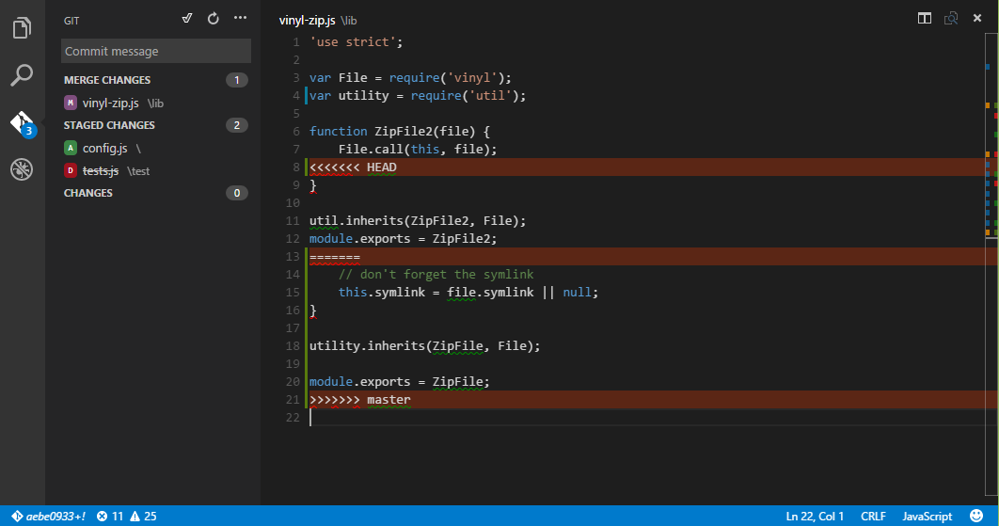

# Version Control
Visual Studio Code has integrated [git](http://git-scm.com/) support for the most common commands.
This makes it an excellent choice to manage your code commits while you develop.
And don't forget that the command prompt is still your friend.

>**Note:** VS Code will leverage your machine's git installation, but you need
to [install git](http://git-scm.com/download) first before you get these features.

>**Tip:** VS Code will work with any git repo - local or remote.  If you don't already have a private hosted git provider, [Visual Studio Online](https://www.visualstudio.com/products/what-is-visual-studio-online-vs) is a great free option. [Click here to sign-up](http://go.microsoft.com/fwlink/?LinkID=307137&campaign=o~msft~code~vc).

## Overview


The git icon on the left will always indicate
an **overview of how many changes** you currently have in your repository.
Clicking it will show you the detail of your current repository changes: **unstaged**,
**staged** and **unresolved merge** changes.

Clicking each item will show you in detail
**the textual changes within each file**. Note that for unstaged changes, the editor
on the right still let's you edit the file: feel free to use it!

>**Tip:** Read on for a little more on diffs in Visual Studio Code.

You can also find indicators of the **status of your repository** in the bottom left corner
of VS Code: the **current branch**, **dirty indicators** and the number of
**incoming and outgoing commits** of the current branch.
You can **checkout** to any branch in your repository by clicking that status indicator
and selecting the git reference from the list.


## Commit
**Staging** and **unstaging** can be done via contextual actions in the files or by drag-and-drop.

You can type a commit message above the changes and press `Ctrl-Enter` (`⌘-Enter`) to commit them.
If there are any staged changes, only those will be committed, otherwise all changes will be committed.

We've found this to be a great workflow. For example, in the previous screenshot, only the `config.js` file will be included in the commit.
A consecutive commit action would commit both `vinyl-zip.js` and `tests.js` in a
separate commit.

More specific **commit actions** can be found in the `...` menu on the top of the
git view.

## Branches and Tags

You can create and checkout branches directly within VS code through the Command Palette. Press `kb(workbench.action.quickOpen)`, type `git` and then press `Space`. You should see the following:


If you type `checkout` and press `Space` again, you will see a dropdown containing all of the branches or tags in the current repository.


The `git branch` command lets you quickly create a new branch.  Just provide the name of your new branch and VS Code will create the branch and switch to it.

## Remotes
Given that your repository is connected to some remote and that your checked out branch
has an [upstream link](http://git-scm.com/book/ch3-5.html) to a branch in that remote,
VS Code offers you useful actions to **push**, **pull** and **sync** that branch (the
latter will run a **pull** command followed by a **push** command). You can find these
actions in the `...` menu.

>**Tip:** You should
[set up a credential helper](https://help.github.com/articles/caching-your-github-password-in-git/)
to avoid getting asked for credentials every time VS Code talks to your git remotes.  If you don't do this, you may want to consider `Disabling Autofetch` in the `...` menu to reduce the number of prompts you get.


## Merge Conflicts


Merge conflicts are recognized by VS Code; we try to provide useful
coloring markers to help you with resolving them. Once resolved, stage the conflicting file
so you can commit.

## Viewing Diffs
Our Git tooling supports viewing of Diffs within VS Code.


>**Tip:** You can diff any two files by first right clicking on a file in the *Working Files* list and selecting `Set file to compare` and then right-click on the file to compare with and select `Compare with 'file_name_you_chose'`.   Alternatively from the keyboard hit `kb(workbench.action.quickOpen)` and select *File: Compare Active File With...* and you will be presented with a list of recent files.

## Git Output Window

You can always peek under the hood to see the commands we are using.  This is helpful if something strange is happening or if you simply get curious :)

To open the window follow the `View`, `Toggle Output` menu and select `Git` from the dropdown.

## Next Steps

* [Editing Evolved](editingevolved) - Lint, IntelliSense, Lightbulbs, Peek and Goto Definition and more
* [Debugging](debugging) - This is where VS Code really shines
* [Tasks](tasks) - Running tasks with Gulp, Grunt and Jake.  Showing Errors and Warnings
* [Customization](customization) - Themes, settings and keyboard bindings

## Common Questions

**Q: Hey, I initialized my repo but the actions in the `...` menu are all grayed out. What gives?**

**A:** To **push, pull and sync** you need to have a git origin set up.  You can get the required URL from the repo host.  Once you have that URL, you simply need to add it to the git settings by running a couple of command line actions. For example for Visual Studio Online:
```
> git remote add origin https://<AccountName>.visualstudio.com/DefaultCollection/_git/<RepoName>
> git push -u origin master
```

**Q: My team is using Team Foundation version control (TFVC) instead of git. What should I do?**

**A:** Use the Team Foundation command line tools.

* For cross-platform use: [Cross-Platform Command-Line Client Beginner's Guide](https://msdn.microsoft.com/en-us/library/hh873092.aspx)
* For Windows: [Use Team Foundation version control commands](https://msdn.microsoft.com/en-us/library/vstudio/cc31bk2e.aspx)

**Q: Why do the Pull, Push and Sync actions never finish?**

This usually means there is no credential management configured in git and you're not getting credential prompts.

To get credential prompts any time VS Code needs to talk to your remotes, upgrade to VS Code 0.5.0. Even better, you should set up a [credential helper](https://help.github.com/articles/caching-your-github-password-in-git/)
in order to pull and push from a remote server without having VS Code prompt for your credentials each time.

**Q: Using Visual Studio Code, I accidentally initialized a git repo on a folder with a massive number of files, like my entire hard drive. Now VS Code is too slow to use or hangs. What do I do?**

**A:** First, to get VS Code running again, exit VS Code, then open a command prompt and run

`code -n`

(That command opens VS Code in a new window.)

Next, assuming you want to remove the unintended repo initialization, look for the `.git` sub-folder in the large folder where you unintentionally initialized the repo, and then delete it. Note that `.git` is a hidden folder, so you might need to show hidden folders to see it. For example, at a command prompt in Windows you can run `dir .git /ah` to see hidden folders named `.git` in a specific folder. If you are not sure where you created the initial folder, run `dir .git /ah /s` at the root folder to see hidden `.git` folders, including sub-folders.


