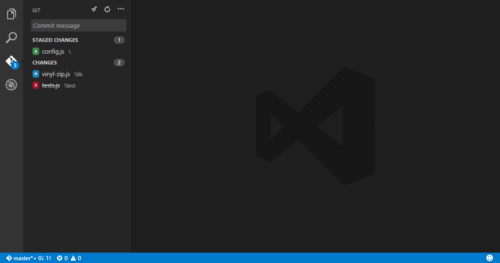
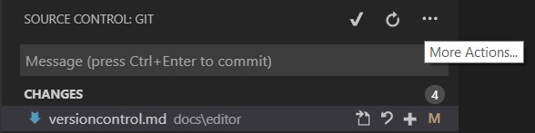
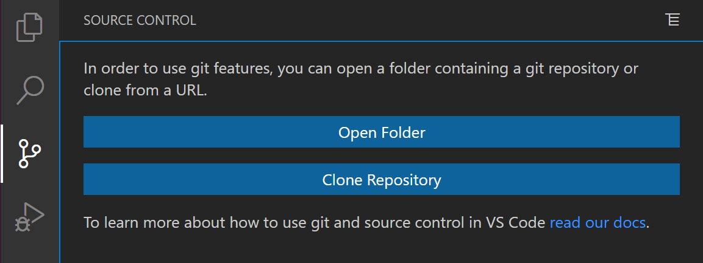
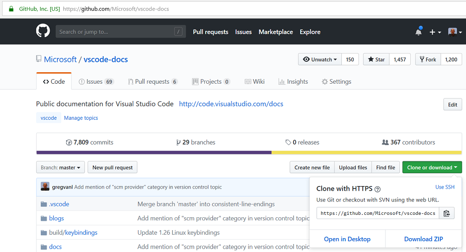
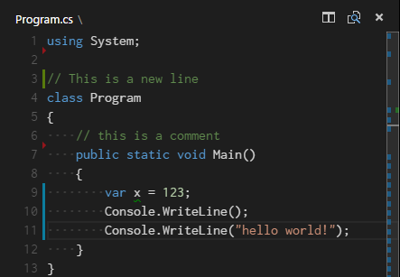
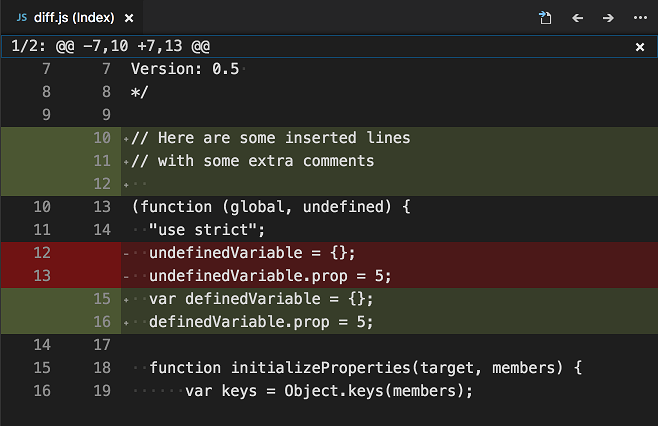

# Using Version Control in VS Code

Visual Studio Code has integrated source control management (SCM) and includes [Git](https://git-scm.com/) support in-the-box. Many other source control providers are available through [extensions](/docs/editor/extension-marketplace.md) on the VS Code Marketplace.

<div class="marketplace-extensions-scm-curated"></div>

> **Tip:** Click on an extension tile to read the description and reviews in the Marketplace.

## SCM Providers

VS Code has support for handling multiple Source Control providers simultaneously. For example, you can open multiple Git repositories alongside your Azure DevOps Server local workspace and seamlessly work across your projects. To turn on the **Source Control Providers** view, select the overflow menu in the **Source Control** view (`kb(workbench.view.scm)`), hover over **Views**, and make sure that **Source Control Repositories** is marked with a check. The **Source Control Providers** view shows the detected providers and repositories, and you can scope the display of your changes by selecting a specific provider.


### SCM Provider extensions

If you would like to install another SCM provider, you can search on the **scm providers** extension category in the **Extensions** view (`kb(workbench.view.extensions)`). Start typing '@ca' and you will see suggestions for extension categories like debuggers and linters. Select `@category:"scm providers"` to see available SCM providers.


## Git support

VS Code ships with a Git source control manager (SCM) extension. Most of the source control UI and work flows are common across other SCM extensions, so reading about the general Git support in VS Code will help you understand how to use another provider.

>**Note:** If you are new to Git, the [git-scm](https://git-scm.com/documentation) website is a good place to start, with a popular online [book](https://git-scm.com/book), Getting Started [videos](https://git-scm.com/video/what-is-git) and [cheat sheets](https://github.github.com/training-kit/downloads/github-git-cheat-sheet.pdf). The VS Code documentation assumes you are already familiar with Git.



>**Note:** VS Code will leverage your machine's Git installation, so you need to [install Git](https://git-scm.com/download) first before you get these features. Make sure you install at least version `2.0.0`.

>**👉** When you commit, be aware that if your username and/or email is not set in your Git configuration, Git will fall back to using information from your local machine. You can find the details in [Git commit information](https://git-scm.com/docs/git-commit#_commit_information).

The Source Control icon in the Activity Bar on the left will always indicate an **overview of how many changes** you currently have in your repository. Selecting the icon will show you the details of your current repository changes: **CHANGES**, **STAGED CHANGES** and **MERGE CHANGES**.

Clicking each item will show you in detail **the textual changes within each file**. Note that for unstaged changes, the editor on the right still lets you edit the file: feel free to use it!

You can also find indicators of the **status of your repository** in the bottom-left corner of VS Code: the **current branch**, **dirty indicators**, and the number of **incoming and outgoing commits** of the current branch. You can **checkout** any branch in your repository by clicking that status indicator and selecting the Git reference from the list.

> **Tip:** You can open VS Code in a sub-directory of a Git repository. VS Code's Git services will still work as usual, showing all changes within the repository, but file changes outside of the scoped directory are shaded with a tool tip indicating they are located outside the current workspace.

## Commit

**Staging** (git add) and **unstaging** (git reset) can be done via contextual actions in the files or by drag-and-drop.


You can type a commit message above the changes and press `kbstyle(Ctrl+Enter)` (macOS: `kbstyle(⌘+Enter)`) to commit them. If there are any staged changes, only changes will be committed. Otherwise, you'll get a prompt asking you to select what changes you'd like to commit and get the option to change your commit settings.

We've found this to be a great workflow. For example, in the earlier screenshot, only the staged changes to `gulpfile.js` will be included in the commit. A consecutive commit action could commit later changes to `gulpfile.js`, the deletion of `yarn.lock`,  and changes to `tests.js` in a separate commit.

More specific **Commit** actions can be found in the **Views and More Actions** `...` menu on the top of the Source Control view.



> **Tip:** If you commit your change to the wrong branch, undo your commit using the **Git: Undo Last Commit** command in the **Command Palette** (`kb(workbench.action.showCommands)`).

## Cloning a repository

If you haven't opened a folder yet, the Source Control view will give you the options to **Open Folder** from your local machine or **Clone Repository**.



If you select **Clone Repository**, you will be asked for the URL of the remote repository (for example on [GitHub](https://github.com/)) and the parent directory under which to put the local repository.

For a GitHub repository, you would find the URL from the GitHub **Code** dialog.



You would then paste that URL into the **Git: Clone** prompt.


You'll also see the option to **Clone from GitHub**. Once you authenticate with your GitHub account in VS Code, you'll be able to search through repositories by name, and select any repo to clone it. You can also start the flow to clone a Git repository with the **Git: Clone** command in the **Command Palette** (`kb(workbench.action.showCommands)`). To see a step-by-step walkthrough, check out our [Clone repos from VS Code](https://www.youtube.com/watch?v=bz1KauFlbQI) video.

## Branches and Tags

You can create and checkout branches directly within VS code through the **Git: Create Branch** and **Git: Checkout to** commands in the **Command Palette** (`kb(workbench.action.showCommands)`).

If you run **Git: Checkout to**, you will see a dropdown list containing all of the branches or tags in the current repository. It will also give you the option to create a new branch if you decide that's a better option, or checkout a branch in detached mode.


The **Git: Create Branch** command lets you quickly create a new branch. Just provide the name of your new branch and VS Code will create the branch and switch to it. If you choose to **Create new branch from...**, you'll get an extra prompt that allows you to specify which commit the new branch should be pointing to.

## Remotes

Given that your repository is connected to some remote and that your checked out branch has an [upstream link](https://git-scm.com/book/ch3-5.html) to a branch in that remote, VS Code offers you useful actions to **push**, **pull**, and **sync** that branch (the latter will run a **pull** command followed by a **push** command). You can find these actions in the **Views and More Actions** `...` menu, along with the option to **add or remove a remote**.

VS Code is able to periodically fetch changes from your remotes. This enables VS Code to show how many changes your local repository is ahead or behind the remote. Starting with VS Code 1.19, this feature is disabled by default and you can use the `git.autofetch` [setting](/docs/getstarted/settings.md) to enable it.

>**Tip:** You should [set up a credential helper](https://help.github.com/articles/caching-your-github-password-in-git/) to avoid getting asked for credentials every time VS Code talks to your Git remotes.  If you don't do this, you may want to consider disabling automatic fetching via the `git.autofetch` [setting](/docs/getstarted/settings.md) to reduce the number of prompts you get.

## Git Status Bar actions

There is a **Synchronize Changes** action in the Status Bar, next to the branch indicator, when the current checked out branch has an upstream branch configured. **Synchronize Changes** will pull remote changes down to your local repository and then push local commits to the upstream branch.


If there is no upstream branch configured and the Git repository has remotes set up, the **Publish** action is enabled. This will let you publish the current branch to a remote.


## Gutter indicators

If you open a folder that is a Git repository and begin making changes, VS Code will add useful annotations to the gutter and to the overview ruler.

* A red triangle indicates where lines have been deleted
* A green bar indicates new added lines
* A blue bar indicates modified lines



## Merge conflicts


Merge conflicts are recognized by VS Code. Differences are highlighted and there are inline actions to accept either one or both changes. Once the conflicts are resolved, stage the conflicting file so you can commit those changes.

## Viewing diffs

Our Git tooling supports viewing of diffs within VS Code.


>**Tip:** You can diff any two files by first right clicking on a file in the Explorer or **OPEN EDITORS** list and selecting **Select for Compare** and then right-click on the second file to compare with and select **Compare with 'file_name_you_chose'**.   Alternatively from the keyboard hit `kb(workbench.action.showCommands)` and select **File: Compare Active File With** and you will be presented with a list of recent files.

### Diff editor review pane

There is a review pane in the Diff editor that presents changes in a unified patch format. You can navigate between changes with **Go to Next Difference** (`kb(editor.action.diffReview.next)`) and **Go to Previous Difference** (`kb(editor.action.diffReview.prev)`). Lines can be navigated with arrow keys and pressing `kbstyle(Enter)` will jump back in the Diff editor and the selected line.



**Note:** This experience is especially helpful for screen reader users.

## Timeline view

The Timeline view, accessible at the bottom of the File Explorer by default, is a unified view for visualizing time-series events (for example, Git commits) for a file.


VS Code's built-in Git support provides the Git commit history of the specified file. Selecting a commit will open a diff view of the changes introduced by that commit. When you right-click on a commit, you'll get options to **Copy Commit ID** and **Copy Commit Message**.

Visual Studio Code supports more Git history workflows through [extensions](/docs/editor/extension-marketplace.md) available on the VS Code Marketplace.

<div class="marketplace-extensions-scm-history-curated"></div>

> **Tip:** Click on an extension tile to read the description and reviews in the Marketplace.

## Git output window

You can always peek under the hood to see the Git commands we are using.  This is helpful if something strange is happening or if you are just curious. :)

To open the Git output window, run **View** > **Output** and select **Git** from the dropdown list.

## Initialize a repository

If your workspace is on your local machine, you can enable Git source control by creating a Git repository with the **Initialize Repository** command. When VS Code doesn't detect an existing Git repository, the Source Control view will give you the options to **Initialize Repository** or **Publish to GitHub**.


You can also run the **Git: Initialize Repository** and **Publish to GitHub** commands from the **Command Palette** (`kb(workbench.action.showCommands)`). Running **Initialize Repository** will create the necessary Git repository metadata files and show your workspace files as untracked changes ready to be staged. **Publish to GitHub** will directly publish your workspace folder to a GitHub repository, allowing you to choose between a private and public repositories. Check out our [publishing repos](https://www.youtube.com/watch?v=3BBvBwDW4CY) video for more information about publishing to GitHub.

## VS Code as Git editor

When you launch VS Code from the command line, you can pass the `--wait` argument to make the launch command wait until you have closed the new VS Code instance. This can be useful when you configure VS Code as your Git external editor so Git will wait until you close the launched VS Code instance.

Here are the steps to do so:

1. Make sure you can run `code --help` from the command line and you get help.
    * if you do not see help, please follow these steps:
        * macOS: Select **Shell Command: Install 'Code' command in path** from the **Command Palette**.
        * Windows: Make sure you selected **Add to PATH** during the installation.
        * Linux: Make sure you installed Code via our new .deb or .rpm packages.
2. From the command line, run `git config --global core.editor "code --wait"`

Now you can run `git config --global -e` and use VS Code as editor for configuring Git.

### VS Code as Git diff tool

Add the following to your Git configurations to use VS Code as the diff tool:

```bash
[diff]
    tool = default-difftool
[difftool "default-difftool"]
    cmd = code --wait --diff $LOCAL $REMOTE
```

This leverages the `--diff` option you can pass to VS Code to compare two files side by side.

To summarize, here are some examples of where you can use VS Code as the editor:

* `git rebase HEAD~3 -i` do interactive rebase using VS Code
* `git commit` use VS Code for the commit message
* `git add -p` followed by `kbstyle(e)` for interactive add
* `git difftool <commit>^ <commit>` use VS Code as the diff editor for changes

## Working with pull requests

Visual Studio Code also supports pull request workflows through the [GitHub Pull Requests and Issues extension](https://marketplace.visualstudio.com/items?itemName=GitHub.vscode-pull-request-github) available on the VS Code Marketplace. Pull request extensions let you review, comment, and verify source code contributions directly within VS Code.

## Next steps

* [Intro Video - Git Version Control](/docs/introvideos/versioncontrol.md) - An introductory video providing an overview of VS Code Git support.
* [Basic Editing](/docs/editor/codebasics.md) - Learn about the powerful VS Code editor.
* [Code Navigation](/docs/editor/editingevolved.md) - Move quickly through your source code.
* [Debugging](/docs/editor/debugging.md) - This is where VS Code really shines
* [Tasks](/docs/editor/tasks.md) - Running tasks with Gulp, Grunt, and Jake.  Showing Errors and Warnings
* [Source Control API](/api/extension-guides/scm-provider.md) - If you want to integrate another Source Control provider into VS Code, see our Source Control API.

## Common questions

### I initialized my repo but the actions in the `...` menu are all grayed out

To **push, pull, and sync** you need to have a Git origin set up.  You can get the required URL from the repository host.  Once you have that URL, you need to add it to the Git settings by running a couple of command-line actions. For example:

```bash
> git remote add origin https://github.com/<repo owner>/<repo name>.git
> git push -u origin main
```

### My team is using Team Foundation Version Control (TFVC) instead of Git. What should I do?

Use the [Azure Repos](https://marketplace.visualstudio.com/items?itemName=ms-vsts.team) extension and this will light up TFVC support.

### Why do the Pull, Push and Sync actions never finish?

This usually means there is no credential management configured in Git and you're not getting credential prompts for some reason.

You can always set up a [credential helper](https://help.github.com/articles/caching-your-github-password-in-git/) in order to pull and push from a remote server without having VS Code prompt for your credentials each time.

### How can I sign in to Git with my Azure DevOps organization that requires multi-factor authentication?

There are now [Git credential helpers](https://devblogs.microsoft.com/devops/git-credential-manager-for-mac-and-linux) that assist with multi-factor authentication. You can download these from [Git Credential Manager for Mac and Linux](https://github.com/microsoft/Git-Credential-Manager-for-Mac-and-Linux) and [Git Credential Manager for Windows](https://github.com/microsoft/Git-Credential-Manager-for-Windows).

### I have GitHub Desktop installed on my computer but VS Code ignores it

VS Code only supports the [official Git distribution](https://git-scm.com/) for its Git integration.

### I keep getting Git authentication dialogs whenever VS Code is running

VS Code automatically fetches changes from the server in order to present you with a summary of incoming changes. The Git authentication dialog is independent from VS Code itself and is a part of your current Git credential helper.

One way to avoid these prompts is to set up a [credential helper](https://help.github.com/articles/caching-your-github-password-in-git/) that remembers your credentials.

Another option is to disable the auto fetch feature by changing the following setting: `"git.autofetch": false`.

### Can I use SSH Git authentication with VS Code?

Yes, though VS Code works most easily with SSH keys without a passphrase. If you have an SSH key with a passphrase, you'll need to launch VS Code from a Git Bash prompt to inherit its SSH environment.
